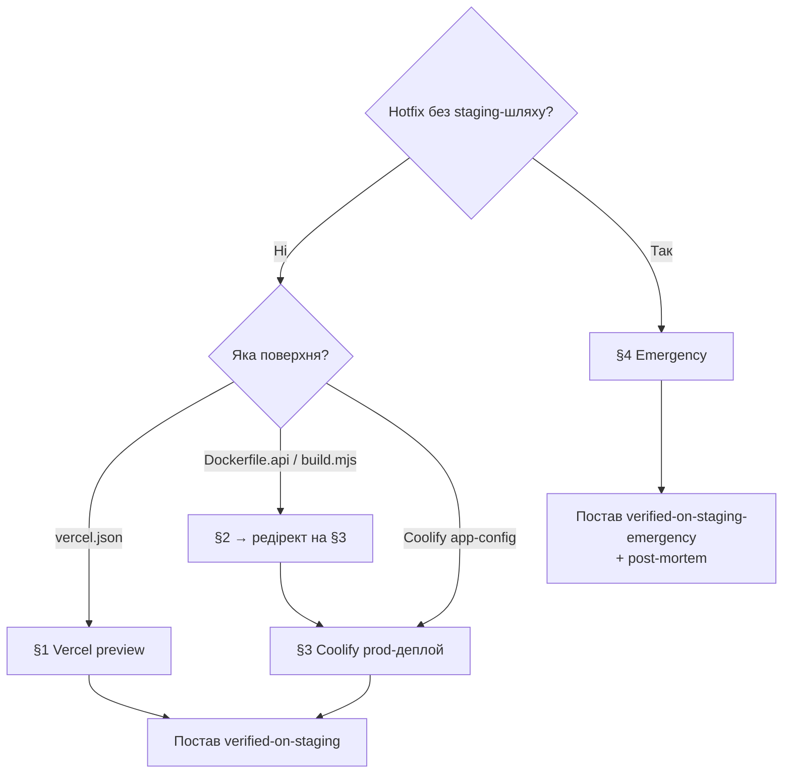

# Playbook: Зміна deploy-конфігу (vercel / Dockerfile / Coolify)

> **Last touched:** 2026-08-08 by @github-actions[bot]. **Next review:** 2026-11-06.
> **Status:** Active

**Trigger:** PR має non-comment зміни у deploy-config файлах (`vercel.json`, `Dockerfile*`, `apps/server/build.mjs`) — CI-job `Deploy-config staging gate` падає без verification-лейбла.

> `railway.toml` більше не трекається гейтом — Railway декомісовано, файл видалено з репо ([ADR-0074](../../04-governance/adr/0074-hosting-hetzner-coolify.md)). `fly.toml`/`fly.staging.toml`/`Caddyfile` ніколи не існували в цьому репо — Fly.io в стеку немає. Coolify app-config (env, pre-deploy command, health-check, image tag) живе в Coolify UI, не в git, тож механічний гейт його фізично не бачить — верифікація там людська, див. [§3](#3-перевір-coolify-prod-деплой).

## Owner surface

- Primary surface: production deploy pipeline (Vercel / Coolify / build-tooling)
- Governing skill: `sergeant-deploy-and-observability`

## Required context

- Стартуй з `sergeant-start-here`, тоді відкрий `sergeant-deploy-and-observability`.
- Перечитай [vercel.md](../../03-operations/deploy/vercel.md), [service-catalog.md](../../02-engineering/architecture/service-catalog.md), [release-policy.md](../../04-governance/governance/release-policy.md).
- Vercel SSOT-нотатка: `apps/web/vercel.json` — канонічний. У Vercel Project «Root Directory» = `apps/web`. Додавати другий `vercel.json` (наприклад, у корені monorepo) **заборонено** — `pnpm lint` енфорсить це через `scripts/check-vercel-config.sh`.

## Чому існує цей playbook

PR #1595 → PR #1600 — «Vercel SSOT-flip». Edit deploy-конфігу у корені monorepo пройшов увесь CI, але одразу зламав продакшн, бо жодна людина не верифікувала зміну на реальному edge-cached Vercel-деплої. CI **не може** замінити людську верифікацію edge-served / edge-cached конфігу — мусять люди.

Цей playbook визначає, що означає «verified on staging» для кожної deploy-config поверхні і як ставити verification-лейбл, щоб [`deploy-config-staging-gate.yml`](../../../.github/workflows/deploy-config-staging-gate.yml) проходив.

## Дерево рішень

**Q1: Чи це справжній production hotfix, який неможливо прокатати на staging?**

- Ні → продовжуй до Q2 (нормальний flow).
- Так → [§4 Emergency escape-hatch](#4-emergency-escape-hatch). Потрібне зобовʼязання написати post-mortem у тілі PR.

**Q2: Яку поверхню зачіпає зміна?**

- `apps/web/vercel.json` → [§1 Перевір Vercel preview](#1-перевір-vercel-preview).
- `Dockerfile.api`, `apps/server/build.mjs` → §2 нижче — редіректить на [§3 Перевір Coolify prod-деплой](#3-перевір-coolify-prod-деплой).
- Coolify app-config (env, pre-deploy command, health-check, image tag) → [§3 Перевір Coolify prod-деплой](#3-перевір-coolify-prod-деплой).
- Кілька — застосуй кожну релевантну секцію перед тим, як ставити лейбл.

---

## Кроки

### 1. Перевір Vercel preview

1. Дочекайся, поки Vercel preview-деплой опублікується на PR (статус-чек «Vercel» = success, лінк у коментарях PR).
2. Відкрий preview URL. Прожени smoke на сторінку критичного flow, що залежить від зміненого конфігу:
   - Заголовки (`Content-Security-Policy`, `Permissions-Policy`, `Strict-Transport-Security`) — використай DevTools «Network» panel; порівняй з поточним продакшном.
   - Rewrites / redirects, які ти змінив — пройди вручну зачеплені шляхи.
   - Edge-cached сторінки — hard-reload (Cmd+Shift+R / Ctrl+Shift+R) і перевір `cache-control`.
3. Перевір build-артефакти на preview, щоб не було несподіваних файлів (`/api/*`, hidden dotfiles тощо). Використай «Vercel Inspect» або `curl -I`.
4. Подивись Vercel-логи (Project → Logs) ~30 секунд: жодного 5xx-сплеска, жодних edge-config помилок.
5. Якщо все зелене — постав лейбл `verified-on-staging`.

### 2. Окремого staging API немає — дивись §3

Історично тут стояв Fly.io staging-деплой (`fly deploy --app sergeant-api-staging --config fly.staging.toml`). Fly.io в стеку більше немає, і `fly.toml`/`fly.staging.toml` ніколи не існували в цьому репо — це був застарілий/помилковий текст playbook-а, не реальний flow.

Чесно: окремого staging-середовища для API зараз нема. Прод-бекенд — один Hetzner CX23 інстанс під Coolify ([ADR-0074](../../04-governance/adr/0074-hosting-hetzner-coolify.md)). Тому зміни `Dockerfile.api` / `apps/server/build.mjs` верифікуються так само, як Coolify app-config — на живому prod-деплої одразу після merge, з rollback-планом напоготові. Виконуй [§3 Перевір Coolify prod-деплой](#3-перевір-coolify-prod-деплой) для цих файлів; окремих кроків тут більше нема.

### 3. Перевір Coolify prod-деплой

> Окремого staging-VPS немає — прод-бекенд живе на одному Hetzner CX23 під Coolify ([ADR-0074](../../04-governance/adr/0074-hosting-hetzner-coolify.md)). Зміни Coolify app-config (env, pre-deploy command, health-check, image tag) верифікуються на живому деплої одразу після merge, тож stage-gate тут — про уважність, а не про окреме середовище.

1. Після merge `deploy-api.yml` збирає образ (`ghcr.io/skords-02/sergeant-api`) і тригерить Coolify redeploy (auto-deploy).
2. Підтверди, що застосунок стартує чисто: Coolify → `sergeant-api` → Deployments → latest → жодного restart-loop; контейнер `Up (running)`.
3. Smoke: `/health` повертає 200; для проксі-шляху перевір `https://<prod-domain>/api/auth/get-session` → 200.
4. Якщо зміна ризикована (env/pre-deploy migrate) — тримай напоготові попередній image-tag для миттєвого rollback (Coolify → Deployments → previous → Redeploy).
5. Постав лейбл `verified-on-staging` (для Coolify-поверхні він означає «verified on prod deploy з rollback-планом»).

### 4. Emergency escape-hatch

Справжні prod-хотфікси, які неможливо прокатати на staging (наприклад, CDN-edge конфіг, який лише Vercel застосовує; toggling kill-switch-у), можуть використати лейбл `verified-on-staging-emergency`. Цей лейбл — **не** free pass:

1. Тіло PR **обовʼязково** містить:
   - Чому staging неможливо задіяти (наприклад, «лише production Vercel-проєкт має edge-config binding»).
   - План мітигації, якщо зміна поведе себе погано (rollback commit SHA, шлях kill-switch, on-call rotation).
   - Зобовʼязання написати post-mortem протягом 7 календарних днів, з лінком у `docs/03-operations/postmortems/`.
2. Принаймні один додатковий reviewer від `@Skords-01` (або призначений reviewer) на PR перед merge.
3. Стеж за prod-логами / Sentry перші 30 хвилин після деплою.
4. Напиши post-mortem; полінкуй цей PR.

---

## Verification

- [ ] Поверхню ідентифіковано (web / API / Coolify / кілька).
- [ ] Smoke на відповідному staging-середовищі (або на prod-деплої для Coolify) пройшов.
- [ ] Логи / Sentry перевірено за відповідне вікно без аномалій.
- [ ] Лейбл поставлено: `verified-on-staging` АБО `verified-on-staging-emergency` + зобовʼязання post-mortem.
- [ ] CI-job `Deploy-config staging gate` зеленіє.

## Коли цей playbook **не** застосовний

- Зміна — лише docs / коментарі всередині deploy-config файлу — гейт auto-skip-ить її (кожна змінена лінія — коментар у синтаксисі цього файлу).
- Зміна — суто у вихідному коді, який _імпортується_ з `apps/server/build.mjs` (наприклад, `apps/server/src/...`). Гейт стосується лише самого `build.mjs`.
- Додавання deploy-config для зовсім нового app — це архітектурна зміна, спершу пиши ADR.

## Суміжні playbook'и і скіли

- [release.md](./release.md) — повний release-flow, включно зі змінами deploy-config-у (§ Web + API).
- [hotfix-prod-regression.md](./hotfix-prod-regression.md) — як відновлюватися, коли гейт обійшли і зміна зламала prod.
- [write-postmortem.md](./write-postmortem.md) — обовʼязковий після `verified-on-staging-emergency`.
- Skill: `sergeant-deploy-and-observability`

## Нотатки

- Джерело CI-job: [`.github/workflows/deploy-config-staging-gate.yml`](../../../.github/workflows/deploy-config-staging-gate.yml). Логіка: [`scripts/ci/check-deploy-config-staging-gate.mjs`](../../../scripts/ci/check-deploy-config-staging-gate.mjs).
- Initiative ref: [`docs/90-work/initiatives/archive/_0011-foundation-adoption-and-process-discipline.md`](https://github.com/Skords-01/Sergeant/blob/d068c73a2f21881d5c1305544fe99f3ea8be81f4/docs/90-work/initiatives/archive/_0011-foundation-adoption-and-process-discipline.md) §Фаза 1 → PR 1.3.
- Закриває type-incident PR #1595 → PR #1600.

<!-- AUTO-GENERATED: PR-BACKLINKS-START -->

## Recent PRs

| PR                                                     | Title                                                                                  | Merged     |
| ------------------------------------------------------ | -------------------------------------------------------------------------------------- | ---------- |
| [#751](https://github.com/Skords-01/Sergeant/pull/751) | fix(agents): аудит рецептів/агентів/правил — CI-фікс, codex-sync, retired-rule cleanup | 2026-08-08 |

_Auto-derived from `docs/04-governance/pr-ledger/index.json`. Top 1 most recent PRs touching this file._
<!-- AUTO-GENERATED: PR-BACKLINKS-END -->
