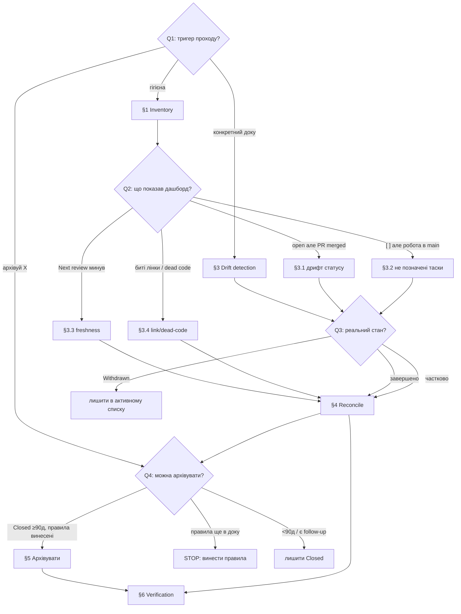

# Playbook: Звірка дрифту документації та архівація

> **Last validated:** 2026-06-08 by @claude. **Next review:** 2026-09-06.
> **Status:** Active

**Trigger:** «Актуалізуй документацію» / «Знайди дрифт і не позначені виконані таски» / «Заархівуй завершені плани/ініціативи/аудити» / періодична гігієна docs, щоб у кожному документі було видно стан і залишок роботи.

## Owner surface

- Primary surface: `docs/` (`initiatives/`, `planning/`, `audits/`, `launch/`, `security/hardening/`, `tech-debt/`, `superpowers/plans/`)
- Coupled surface: `docs/open-work.md`, `docs/pr-ledger/index.json`, `scripts/docs/`, будь-який код під `apps/`/`packages/`, на який посилаються застарілі docs
- Governing skill: `sergeant-tech-debt`

### Prerequisites

- Прочитай [`AGENTS.md`](../../../AGENTS.md) → Hard Rule #10 (lifecycle markers), #15 (governance + UA docs), #23 (archive-move depth), #26 (PR ledger).
- Зрозумій формат дашборду відкритої роботи: [`docs/open-work.md`](../../open-work.md) (source = `> **Status:**` хедер кожного документа).
- Процедура архівації ініціатив: [`docs/90-work/initiatives/archive/README.md`](../../90-work/initiatives/archive/README.md).
- Суміжні скіли: `audits-runner` (триаж відкритих аудитів), `initiative-task` (наступний невиконаний таск ініціативи).

---

## Decision Tree

> Йди від Q1 вниз. Кожен лист (→ **§N**) лінкує на детальні кроки нижче.

**Q1: Що тригернуло прохід?**

- «Просто актуалізуй / гігієна спринту» → [§1 Зібрати картину](#1-зібрати-картину-inventory) → Q2
- «Конкретний документ виглядає застарілим» → [§3 Звірити дрифт](#3-звірити-дрифт-drift-detection) для цього файла → Q3
- «Заархівуй завершене X» → одразу Q4

**Q2: Що показав дашборд після регенерації?**

- Документ зі статусом `Active/Draft/In progress`, але всі PR-згадки вже змерджені → дрифт статусу → [§3.1](#31-дрифт-статусу-done-але-позначено-open)
- `- [ ]` пункти, чия робота вже в `main` → не позначені виконані таски → [§3.2](#32-не-позначені-виконані-таски)
- `Next review` у минулому → freshness-дрифт → [§3.3](#33-freshness-дрифт)
- Биті посилання / згадки видаленого коду → [§3.4](#34-link--dead-code-дрифт)

**Q3: Після звірки — який реальний стан документа?**

- Робота повністю завершена, follow-up-ів нема → [§4 Актуалізувати](#4-актуалізувати-reconcile) (закрити) → Q4
- Частково зроблено → [§4](#4-актуалізувати-reconcile): познач виконане, онови «Залишилось», лиши `Active`
- Передумови зникли, не починали → постав `Withdrawn` у тілі, **не архівуй** (лишається в активному списку для аудит-сліду)

**Q4: Чи можна фізично архівувати?**

- Статус `Closed/Done/Implemented` **і** ≥ 90 днів без регресій/нових follow-up-ів → [§5 Архівувати](#5-архівувати-завершене)
- Канонічні правила (Hard Rule / lint / ADR), породжені документом, ще **не** винесені в `AGENTS.md`/`docs/governance/` → **STOP**: спочатку винеси їх, потім архівуй
- < 90 днів або є відкриті follow-up-и → лиши на місці зі статусом `Closed`, заархівуєш у наступний прохід



---

## Background (Steps)

### 1. Зібрати картину (inventory)

Спершу перегенеруй усі дашборди — вони читають `> **Status:**` хедери і чекбокси, тому показують поточний (не закешований) стан:

```bash
pnpm docs:gen-open-work          # docs/open-work.md — single-pane всієї НЕ-завершеної роботи по 7 трекерах
pnpm docs:gen-initiative-followups  # follow-ups.md — невиконані follow-up-и ініціатив
pnpm docs:freshness-dashboard    # docs/governance/freshness-dashboard.html — overdue Next review
pnpm docs:gen-today              # сьогоднішній зріз пріоритетів (опційно)
```

Відкрий [`docs/open-work.md`](../../open-work.md): колонка `Статус` = повний `Status:` хедер, `PR-згадки` = auto-extracted `#NNNN`. Це твій робочий список кандидатів на звірку. `❓` у статусі = зламаний header (Rule #10) — лагодь одразу.

### 2. Пріоритизувати

Йди в такому порядку (найбільший дрифт-ризик → найменший):

1. Документи зі статусом `In progress`/`Active`, де **всі** PR-згадки вже змерджені (найімовірніший «done але позначено open»).
2. Аудити з відкритими пунктами — прожени `audits-runner` (`args={mode:"triage"}`), щоб дістати пріоритезований план.
3. Ініціативи з `Closed`-датою > 90 днів тому (кандидати на архів).
4. Документи з overdue `Next review`.

### 3. Звірити дрифт (drift detection)

#### 3.1 Дрифт статусу (done але позначено open)

Для документа, де всі `#NNNN`-згадки виглядають завершеними — підтверди по ledger-у, а не на віру:

```bash
# Чи всі PR-згадки документа реально змерджені?
grep -oE '#[0-9]{3,}' docs/<tracker>/<file>.md | sort -u
# Звір кожен номер з ledger-ом merged-PR-ів:
grep -E '"<NNNN>"' docs/pr-ledger/index.json
```

Якщо acceptance criteria виконані й PR-и в `main` → це дрифт. Переходь у [§4](#4-актуалізувати-reconcile).

#### 3.2 Не позначені виконані таски

Знайди `- [ ]` пункти, чия робота вже в коді/`main`:

```bash
# Усі unchecked-чекбокси у трекерах
grep -rn '^\s*-\s*\[ \]' docs/90-work/initiatives docs/90-work/planning docs/01-product/launch docs/90-work/audits docs/security/hardening
```

Для підозрілого пункту звір реальність: `git log --oneline --all --grep="<ключове слово фічі>"` або grep символу/файла, який пункт обіцяв. Якщо робота є в `main` — пункт треба позначити `- [x]` у [§4](#4-актуалізувати-reconcile).

#### 3.3 Freshness-дрифт

```bash
pnpm docs:check-freshness-cadence      # overdue Next review
pnpm docs:check-freshness-coverage     # документи без freshness-хедера
pnpm docs:check-freshness-single-marker
```

Прострочений `Next review` сам по собі — не дрифт контенту; це сигнал «перевір і онови дату». Перевір контент, тоді став свіжу дату (pre-commit `bump-last-validated.mjs` підбʼє `Last validated` автоматично при коміті `.md`).

#### 3.4 Link- / dead-code-дрифт

```bash
pnpm docs:check-links            # биті внутрішні/зовнішні посилання (Rule #23 archive depth теж)
pnpm knip                        # невикористані експорти/файли
pnpm dead-code:files             # marker-aware wrapper (поважає @scaffolded — Rule #10)
```

Згадки видалених символів/файлів у docs — стале: онови або прибери. Видалення самого коду — окремий прохід за [`cleanup-dead-code.md`](./cleanup-dead-code.md), **окремим PR**.

### 4. Актуалізувати (reconcile)

Для кожного документа зроби так, щоб «зайшов і одразу видно стан»:

1. **Чекбокси:** познач реально виконані пункти `- [x]` (з §3.2). Не чіпай ті, де робота не в `main`.
2. **Status-хедер (Rule #10):** онови `> **Status:**` під реальний стан. Бакети дашборду:
   - відкриті: `Active` / `Draft` / `In progress` / `Scaffolded` / `Open` / `Planned` / `Phase *`
   - закриті (зникають з open-work): `Closed` / `Done` / `Implemented` / `Archived` / `Reference` / `Frozen`
3. **Залишок роботи:** додай/онови короткий блок «Залишилось» (1–3 рядки або tally `X/Y зроблено`) на початку документа — це те, що founder хоче бачити з першого екрана.
4. **Freshness:** онови `Next review`; `Last validated` підбʼє pre-commit hook при коміті.
5. **Ініціативи:** після зміни статусу прожени `pnpm lint:initiative-status-sync` — він звіряє статус у файлі ↔ рядок у `initiatives/README.md`.

### 5. Архівувати завершене

Архівація = **фізичний переніс** файла в `<tracker>/archive/` + 1-рядковий redirect-stub. Передумова: статус `Closed`/`Done`/`Implemented`, ≥ 90 днів без регресій, нема нових follow-up-ів, канонічні правила вже винесені (Q4).

**Ініціативи** (canonical процедура — [`initiatives/archive/README.md`](../../90-work/initiatives/archive/README.md)):

```bash
git mv docs/90-work/initiatives/<NNNN-slug>.md docs/90-work/initiatives/archive/<NNNN-slug>.md
```

У `docs/90-work/initiatives/README.md`: прибери рядок з § «Нещодавно завершені», додай stub у § «Архів»:

```
- [archive/<NNNN-slug>.md](./archive/<NNNN-slug>.md) — archived YYYY-MM-DD; superseded by <successor / canonical home>.
```

**Аудити / planning / design** — той самий патерн у відповідний `archive/`:

```bash
git mv docs/90-work/audits/<file>.md docs/90-work/audits/archive/<file>.md
git mv docs/90-work/planning/<file>.md docs/90-work/planning/archive/<file>.md
```

Додай рядок у таблицю/список архіву відповідного `archive/README.md` (Статус, Закрито YYYY-MM-DD, 1-рядковий підсумок + посилання на PR-и). Якщо в archive-папці ще нема `README.md` — створи його за зразком [`docs/05-design/design/archive/README.md`](../../05-design/design/archive/README.md) (freshness + Status + «Чому архів, а не видалення»).

> **Rule #23 (archive-move depth):** після `git mv` глибина вкладеності зростає на 1 — усі відносні посилання `../X` всередині перенесеного файла поламаються. Полагодь їх (зазвичай `../` → `../../`) і прожени `pnpm lint:archive-move-depth`.

### 6. Зафіксувати й верифікувати

Перегенеруй дашборди (тепер архівоване зникне з open-work) і прожени гейти — див. [§ Verification](#verification).

```bash
git checkout -b devin/$(date +%s)-docs-reconcile-drift
git commit -m "docs(docs): reconcile drift, mark done tasks, archive completed <tracker>"
```

---

## Verification

- [ ] `pnpm docs:gen-open-work` перегенеровано; заархівовані/закриті документи зникли з [`docs/open-work.md`](../../open-work.md), лічильники оновились
- [ ] `pnpm docs:check-open-work` — зелено (дашборд синхронний)
- [ ] `pnpm lint:initiative-status-sync` — зелено (статус у файлі ↔ рядок у README)
- [ ] `pnpm docs:check-links` — нема битих посилань (включно з archive-depth)
- [ ] `pnpm lint:archive-move-depth` — зелено для всіх `git mv` у `archive/`
- [ ] `pnpm docs:check-freshness-cadence` — нема нових overdue (де торкнувся — оновлено)
- [ ] Кожен заархівований файл має redirect-stub у відповідному `README.md § Архів`
- [ ] Канонічні правила (Hard Rules / lint / ADR) живі в `AGENTS.md`/`docs/governance/`, а не лише в архіві
- [ ] `pnpm lint` — зелено

## When NOT to use this playbook

- **Видалення коду** (не docs) — використовуй [`cleanup-dead-code.md`](./cleanup-dead-code.md) окремим PR.
- **Виконати наступний таск ініціативи** (а не звіряти статус) — скіл `initiative-task`.
- **Триаж/виконання відкритих аудитів** як основна ціль — скіл `audits-runner` (`mode:"triage"|"execute"`); цей playbook лише архівує аудити, що вже закриті.
- **Тільки prettier-форматування** `docs/**/*.md` — [`prettier-pass-on-docs.md`](./prettier-pass-on-docs.md).
- Документ зі статусом `Withdrawn` — **не архівуй**, він лишається в активному списку для аудит-сліду (див. `initiatives/archive/README.md § Чим це не є`).

## Notes

- Single source of truth відкритої роботи — `> **Status:**` хедер кожного документа (Rule #10). Дашборд лише агрегує; ніколи не редагуй `docs/open-work.md` руками (AUTO-GENERATED).
- Архівація — це історичний контекст, не живий контракт. Перед `git mv` переконайся, що все канонічне винесено в `AGENTS.md`/`docs/governance/` (Q4 / §5).
- Дрифт ≠ прострочений `Next review`. Перше — контент розійшовся з реальністю; друге — лише нагадування перечитати. Не став свіжу дату, не перевіривши контент.
- Веди звірку й архівацію **окремим PR** від feature-роботи (soft rule).

## See also

- [AGENTS.md](../../../AGENTS.md) — Hard Rules #10, #15, #23, #26
- [`docs/open-work.md`](../../open-work.md) — згенерований single-pane всієї відкритої роботи
- [`docs/90-work/initiatives/archive/README.md`](../../90-work/initiatives/archive/README.md) — canonical процедура архівації ініціатив
- [`cleanup-dead-code.md`](./cleanup-dead-code.md) — видалення мертвого коду (окремий PR)
- [`prettier-pass-on-docs.md`](./prettier-pass-on-docs.md) — форматування docs
- Скіли: `audits-runner` (триаж аудитів), `initiative-task` (наступний таск ініціативи), `sergeant-tech-debt` (governing)
