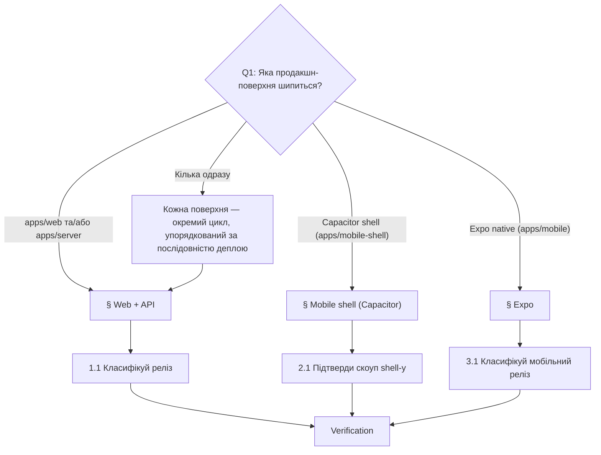

# Playbook: Реліз

> **Last touched:** 2026-06-26 by @dimastahov16012003. **Next review:** 2026-09-24.
> **Status:** Active

**Trigger:** «Виконати реліз» / реліз-несуча зміна на продакшні — `apps/web`, `apps/server`, `apps/mobile-shell` (Capacitor) або `apps/mobile` (Expo); EAS-апдейти, store-білди, скоординовані крос-поверхневі деплої.

## Owner surface

- Primary surface: production deploy pipeline через web/API, mobile shell і Expo
- Coupled surfaces: `apps/server`, `apps/web`, `apps/mobile-shell`, `apps/mobile`
- Governing skill: `sergeant-deploy-and-observability`

## Required context

- Стартуй з `sergeant-start-here`, тоді завантаж `sergeant-deploy-and-observability` (для web/API і Capacitor) або `sergeant-mobile-expo` (для Expo).
- Перечитай [release-policy.md](../../04-governance/governance/release-policy.md) — таксономію merge-only / coordinated / high-risk.
- Перечитай [service-catalog.md](../../02-engineering/architecture/service-catalog.md) — щоб знати rollback-шлях і tier поверхні, яку зачіпаєш.
- Перечитай [platforms.md](../../02-engineering/architecture/platforms.md), якщо зміна перетинає Capacitor або Expo.
- Якщо у релізі є міграція — додатково відкрий [add-sql-migration.md](./add-sql-migration.md).

## Дерево рішень — яку поверхню релізиш?

Якщо зміна — лише docs або внутрішня без рантайм-ефекту, цей playbook не застосовний — мерджи звичайним порядком.

## 1. Web + API

Для скоординованих деплоїв `apps/web` + `apps/server`.

### 1.1 Класифікуй реліз

- Визнач, що це: merge-only, coordinated чи high-risk — за [release-policy.md](../../04-governance/governance/release-policy.md).
- У PR явно назви зачеплені поверхні і деплой-таргети.
- Підтверди rollback-шлях **до** мерджу.

### 1.2 Зафіксуй порядок деплою

- Env-зміни — перед кодом, **тільки** якщо нові значення зворотно сумісні.
- Міграції — перед деплоєм застосунку, **тільки** коли зміна схеми адитивна і зворотно сумісна (див. Hard Rule #4 — двофазний DROP).
- Спершу API, тоді web — якщо UI залежить від нової контрактної поведінки.
- Спершу web, тоді API — лише коли API повністю зворотно сумісне, а UI — ризикова поверхня.

### 1.3 Перевір реліз-гейти

- CI на змінених поверхнях — зелений.
- Немає блокуючого інциденту чи червоного error-budget на тому ж dependency-ланцюжку (винятком є випадок, коли цей реліз — і є мітигація).
- Feature-флаги і kill-switch-і задокументовані.

### 1.4 Виконай деплой

- Мерджи свідомо.
- Деплой — у задокументованому порядку.
- Зафіксуй deployment ID або release-посилання, які використано.

### 1.5 Прожени post-release верифікацію

- Перевір `/health` і один user-critical flow end-to-end.
- Звір error rate, latency і шум у Sentry на змінених поверхнях.
- Підтверди, що стан feature-флагу збігається з планом rollout-у.

### 1.6 Онови «Що нового» — якщо реліз несе user-facing зміни

- Якщо реліз містить помітну для юзера зміну (нова фіча, видима поведінка, UX-поліпшення) — додай **один** запис у `whats-new` за процесом у [docs/01-product/whats-new/README.md](../../01-product/whats-new/README.md): markdown-файл + TS-запис у [`apps/web/src/core/whatsNew/releases.ts`](../../../apps/web/src/core/whatsNew/releases.ts), узгоджені (drift ловить `releases.test.ts`).
- **Консолідуй, не дроби.** Модал показує лише найсвіжіший запис, якого юзер ще не бачив (`pickRelease` → `RELEASES[0]`), а не накопичує пропущені. Тому один запис на реліз-хвилю з 3–6 user-facing пунктами, а не окремий запис на кожен PR — інакше рідкісні юзери пропустять проміжні.
- Копія — мовою користувача про результат, не інженерний changelog (`feat(...)`-subject у модал не йде). Тон — за [style-guide.uk.md](../../01-product/copy/style-guide.uk.md) (`ти`-звертання).
- Чисто внутрішні/інфраструктурні релізи (рефактор, deps, CI, docs) — **пропусти** цей крок.

## 2. Mobile shell (Capacitor)

Для білдів `apps/mobile-shell`, метаданих сторів або поведінки нативної обгортки.

### 2.1 Підтверди скоуп shell-у

- Відокремлюй shell-only зміни від змін у вбудованому web-артефакті.
- Якщо web-артефакт теж змінився — спершу виконай § Web + API, щоб шипнути базовий web-білд.
- Підтверди, що саме шипиться: iOS, Android чи обидва.

### 2.2 Підготуй release-нотатки і rollback

- Зафіксуй build numbers і bump версії.
- Задокументуй store-лейн, вибір staged-rollout і референс попереднього стабільного білду.
- Перевір, чи є feature-флаг або server-side kill switch, який може зменшити blast radius.

### 2.3 Збери і подай білд

- Зроби release-candidate білд.
- Прожени smoke на: інсталяцію, запуск, auth-bootstrap і один критичний deep-link або notification-flow.
- Подай у відповідний store-лейн або internal track.

### 2.4 Post-release верифікація

- Підтверди наявність у цільовому лейні.
- Перепрожени install/open smoke на опублікованому білді.
- Стеж за crash- і auth-сигналами після старту rollout-у.

## 3. Expo

Для білдів `apps/mobile`, EAS-апдейтів або змін release-channel-у.

### 3.1 Класифікуй мобільний реліз

- Визнач: це OTA/channel-апдейт, новий білд чи обидва.
- Підтверди, чи реліз залежить від нової поведінки API чи від feature-флагів.

### 3.2 Підготуй rollout

- Захопи build- або update-identifier-и.
- Зафіксуй цільовий канал, cohort і метод rollback-у.
- Переконайся, що auth-bootstrap і один mobile-only flow — у плані smoke-у.

### 3.3 Виконай реліз

- Шипни білд або апдейт у задуманий лейн.
- Перевір, що використано правильний config/env.
- Якщо реліз залежить від server-side змін — спершу прожени § Web + API для API-частини.

### 3.4 Верифікація і моніторинг

- Встанови або онови опублікований артефакт.
- Прожени auth, один основний screen-load і одну mobile-only взаємодію.
- Стеж за crash/error-сигналами і support-фідбеком під час rollout-у.

## Verification

- [ ] Основну поверхню названо у PR
- [ ] Порядок деплою задокументовано, якщо зачеплено більше однієї поверхні
- [ ] Rollback-шлях задокументовано (web/API: попередній Vercel/Railway деплой; shell: попередній store-білд; Expo: попередній channel-апдейт)
- [ ] Post-release smoke завершено для зачепленої поверхні (`/health` + критичний flow для web/API; install + auth для shell; auth + один mobile-only flow для Expo)
- [ ] Будь-яке упорядкування міграцій/env зафіксовано у PR або release-нотатці
- [ ] Build/version/channel identifier-и зафіксовано для мобільних релізів
- [ ] «Що нового» оновлено для user-facing змін (один консолідований запис; markdown + `releases.ts` узгоджені) — або свідомо пропущено для внутрішнього релізу

## Коли цей playbook **не** застосовний

- Зміна — лише docs або внутрішня без рантайм-ефекту.
- Продакшн-регресія, що вимагає негайного hotfix-у → [hotfix-prod-regression.md](./hotfix-prod-regression.md).
- Чисте retire feature-флагу без коду → [retire-feature-flag.md](./retire-feature-flag.md).

## Суміжні playbook'и і скіли

- [hotfix-prod-regression.md](./hotfix-prod-regression.md)
- [add-sql-migration.md](./add-sql-migration.md) — коли реліз шипить зміни схеми.
- [port-web-screen-to-mobile.md](./port-web-screen-to-mobile.md) — коли реліз піднімає web-flow в Expo.
- Skill: `sergeant-deploy-and-observability`
- Skill: `sergeant-server-api`
- Skill: `sergeant-web-ui`
- Skill: `sergeant-mobile-expo`
