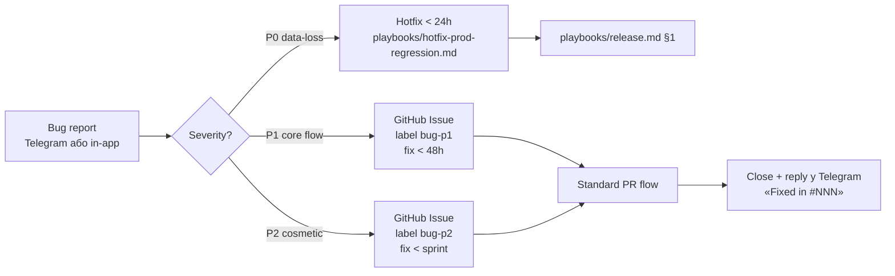

# Phase 1 — Web launch with users

> **Last touched:** 2026-08-31 by @Skords-01. **Next review:** 2026-12-04.
> **Status:** Active — roadmap for first user-facing launch фази.

> Цей документ описує **першу з трьох послідовних фаз запуску** Sergeant з реальними юзерами. Phase 1 покриває web-only (PWA на Vercel), 15 тижнів від `W-4` до `W10`. Phase 2 (Capacitor) і Phase 3 (Native RN) описані в окремих файлах цього піддерева.
>
> **Не дублює** бізнес-стратегію з `business/` і FTUX-delivery з `product-os/` — натомість зшиває їх у тижневий timeline та визначає acceptance gates між під-фазами.
>
> **Cross-refs (canonical sources, які цей doc послідовно посилається):**
>
> - [`business/02-go-to-market.md`](../business/02-go-to-market.md) — фази, growth, контент, виральність
> - [`business/04-launch-readiness.md`](../business/04-launch-readiness.md) — legal, monitoring, NSM, funnel метрики, runbook template
> - [`business/01-monetization-and-pricing.md`](../business/01-monetization-and-pricing.md) — тіри, activation baseline
> - [`business/03-services-and-toolstack.md`](../business/03-services-and-toolstack.md) — стек, бюджет, week-by-week tooling
> - [`product-os/ftux-master-tracker.md`](../product-os/ftux-master-tracker.md) — FTUX SSOT, sprint registry, SLO
> - [`product-os/paywall-implementation-plan.md`](../archive/product-os/paywall-implementation-plan.md) — PR-20 gate, three paths
> - [`architecture/platforms.md`](../../../02-engineering/architecture/platforms.md) — web ↔ shell ↔ RN feature-parity
> - [`playbooks/release.md`](../../../00-start/playbooks/release.md) — canonical release flow
> - [`governance/feature-flags.md`](../../../04-governance/governance/feature-flags.md) — flag conventions
> - [`observability/posthog-ftux-dashboards.md`](../../../03-operations/observability/posthog-ftux-dashboards.md) — funnel dashboards

---

## Зміст

1. [TL;DR + entry/exit criteria фази Web](#1-tldr--entryexit-criteria)
2. [Лендінг — стан і що лишилось](#2-лендінг--стан-і-що-лишилось)
3. [Тижневий план (W-4 … W10)](#3-тижневий-план)
4. [User testing strategy](#4-user-testing-strategy)
5. [Технічні передумови (audit-фідбек)](#5-технічні-передумови)
6. [Метрики успіху](#6-метрики-успіху)
7. [Ризики + mitigation](#7-ризики--mitigation)
8. [Рекомендований tooling](#8-рекомендований-tooling)
9. [Вихідні критерії на Phase 2 (Capacitor)](#9-вихідні-критерії-на-phase-2-capacitor)

---

## 1. TL;DR + entry/exit criteria

### 1.1 TL;DR

Phase 1 — це **15-тижнева кампанія від "web-PWA шипить тільки на staging" до "web-PWA стабільно тримає 500-2000 MAU"**. Розбита на 4 під-фази по логічних acceptance-gate-ах:

| Під-фаза        | Тижні     | Юзери (target)       | Ключова мета                                   | Готовність до payment?  |
| --------------- | --------- | -------------------- | ---------------------------------------------- | ----------------------- |
| **Pre-launch**  | W-4 → W-1 | 0 → 100-300 waitlist | інфра, лендінг, custdev-10, Telegram-вейтліст  | ❌ free-only            |
| **Closed beta** | W0 → W1   | 30 тестерів          | knowledge transfer, FTUX iter, top-10 bug list | ❌ free-only            |
| **Soft public** | W2 → W5   | 200 → 1500 signups   | sustain organic growth, NPS ≥ 30               | ❌ free-only (waitlist) |
| **Stable**      | W6 → W10  | 1500 → 2000 MAU      | retention discipline, exit-gate до Capacitor   | ⚠️ paywall-stub OK      |

> **Розмір і тривалість бети.** Closed beta — **30 тестерів, 2 тижні** (W0-W1). Раніше в цьому документі стояло 50 тестерів і 4 тижні; число зменшене свідомо: 30 — це стеля, яку solo-founder встигає особисто відпрацювати в Telegram-групі за 4-годинний SLA відповіді (§4.2), а 2 тижні — рівно один повний цикл «інвайт → фідбек → фікс → повторний прогін». Довша бета без росту когорти не додає сигналу, лише відтягує soft public.

> **Запуск як free.** Paywall PR-20 свідомо відкладений (див. [`paywall-implementation-plan.md` Path C](../archive/product-os/paywall-implementation-plan.md#23-path-c--defer-pr-20-impl-до-0010-phase-3-merge-рекомендована)). Web-launch — це **discovery + retention experiment**, не revenue experiment. Pricing-сторінка на `/pricing` (`apps/web/src/core/PricingPage.tsx`) залишається без активного checkout-у до Phase 2; email-форма вейтліста живе в `apps/web/src/core/pricing/WaitlistForm.tsx`.

### 1.2 Entry criteria — що мусить бути перед W-4

По суті — мінімальний readiness checklist щоб взагалі починати pre-launch:

- [x] **Web app деплоїться на Vercel** з `apps/web` → `apps/server/dist/` (unified-mode). Підтверджено в `apps/web/README.md` (production-ready stack).
- [x] **Backend стабільно тримає Coolify/Hetzner** + `pgvector/pgvector:pg18`, міграції gated через Coolify pre-deploy `node dist-server/migrate.js` (ADR-0074; Railway retired).
- [x] **Auth working end-to-end:** Better Auth cookie-сесії, sign-up, sign-in, password reset на `/reset-password` (`apps/web/src/core/auth/`).
- [x] **FTUX funnel працює:** 8 канонічних подій у PostHog (`onboarding_started → … → celebration_shown`); див. [`posthog-ftux-dashboards.md` §2](../../../03-operations/observability/posthog-ftux-dashboards.md).
- [x] **Sentry alerts активні** для error-rate, unhandled exceptions.
- [x] **Vercel preview-per-PR + production-on-merge-to-main** живий, CI зеленіє з `pnpm check` matrix.
- [x] **Marketing-лендінг існує** як окремий workspace `apps/landing` (Vite + React 18 + Tailwind 4) з hero, module-showcase, cross-module-секцією і Telegram-CTA. Див. [§2](#2-лендінг--стан-і-що-лишилось).
- [x] **Юридичний пак опубліковано** — `apps/web/src/core/legal/LegalPage.tsx` містить 4 документи (Privacy Policy, Terms, Cookie Policy, Публічна оферта), чинні з 12.07.2026. **Лишається:** підставити реквізити ФОП (зараз `CONTROLLER_PLACEHOLDER` + IBAN — плейсхолдери). Деталі — [`04-launch-readiness.md` §1.1](../business/04-launch-readiness.md#1-юридичне-та-compliance).
- [x] **Telegram-вейтліст живий** — бот `@serg_qa_bot`, webhook `POST /api/v1/telegram/webhook` (`apps/server/src/modules/telegram/waitlistBot.ts`), таблиця `telegram_waitlist` (міграція 089), ручна розсилка `scripts/telegram/broadcast-waitlist.mjs`.
- [ ] **Domain `sergeant.com.ua` зареєстрований** і вказує на Vercel apex (status TBD — open question).
- [ ] **Telegram-канал «Sergeant 🎖️»** створений (окремо від бота вейтліста).
- [ ] **Founder написав bullet-список того, які 10 фіч web-стеку він вважає shippable** (а не «майже готово»).

### 1.3 Exit criteria — що мусить бути перед переходом на Phase 2

Див. [§9 нижче](#9-вихідні-критерії-на-phase-2-capacitor) — 7 gates.

### 1.4 Як читати цей doc

- **§2 — лендінг decision:** одноразове рішення; впливає на W-4 / W-3.
- **§3 — тижневий план:** core timeline, переглядай щотижня, відмічай completed actions у gantt-стилі.
- **§4-§8:** довідкові розділи; читай при питанні «як саме рекрутувати», «які метрики», «який tool».
- **§9 — exit-gates:** **не міняй** під час фази; зміна = renegotiation з parent-планом (Phase 2 сесія).

---

## 2. Лендінг — стан і що лишилось

> **Рішення ухвалене й відвантажене.** Раніше цей розділ порівнював три опції (окремий Astro-сайт / monolith-route в `apps/web` / гібрид) і рекомендував гібрид на Astro. Порівняння знято: лендінг існує як окремий workspace, стек — **Vite + React 18 + Tailwind 4**, не Astro. Нижче — фактичний стан і залишковий backlog.

### 2.1 Що вже є

`apps/landing` — окремий пакет `@sergeant/landing` у pnpm-workspace, dev-порт 3100.

| Компонент                                   | Що робить                                                                        |
| ------------------------------------------- | -------------------------------------------------------------------------------- |
| `src/pages/HomePage.tsx`                    | Hero: «Бачить звʼязки між усім, що важливо» + Telegram-CTA                       |
| `src/components/DashboardPreview.tsx`       | Візуальний preview хабу з 4 модулями                                             |
| `src/components/HomeSections.tsx`           | `HowItWorks`, `ModulesSection`, `ConnectionsSection`, `HonestSection`, `BetaCta` |
| `src/components/TelegramCta.tsx`            | Головна кнопка → `t.me/<bot>?start=landing` / `?start=landing_footer`            |
| `src/lib/links.ts`                          | `telegramStartLink(payload)`; юзернейм — через `VITE_TELEGRAM_BOT`               |
| `src/lib/analytics.ts`                      | Cookieless PostHog; події `landing_viewed`, `landing_telegram_clicked`           |
| `scripts/generate-og.mjs` + `public/og.png` | OG-картка (згенерована, не ручна)                                                |
| `public/robots.txt`                         | robots                                                                           |
| `vercel.json`                               | Deploy-конфіг окремого Vercel-проєкту                                            |
| `src/pages/NotFoundPage.tsx`                | 404                                                                              |
| `tokens.drift.test.ts`                      | Гвардія проти дрейфу від `@sergeant/design-tokens`                               |

> **Єдина conversion action — Telegram.** Email-форми на standalone-лендінгу **немає**: `WaitlistForm` живе в `apps/web` (сторінка `/pricing`), і standalone-лендінг `waitlistApi` не викликає. Це свідоме звуження до одного CTA — не забутий елемент.

Аналітика — cookieless PostHog напряму в лендінгу. Операційна довідка — [`apps/landing/README.md`](../../../../apps/landing/README.md). Останній редизайн — «redesign landing around connected insights»; скріншот стану — `docs/90-work/audits/landing-redesign-2026-07-29.png`.

### 2.2 Чому не Astro (постфактум)

Стек розійшовся з початковою рекомендацією свідомо: лендінг ділить `@sergeant/design-tokens` і `@sergeant/shared` з рештою монорепо, тож React-сторінка успадковує токени й `ANALYTICS_EVENTS` без дублювання. Astro дав би трохи кращий perf-профіль, але вимагав би власної копії дизайн-системи — а `tokens.drift.test.ts` показує, що саме дрейф токенів був реальним ризиком, не кілобайти.

### 2.3 Що лишилось

- [ ] **Домен.** `sergeant.com.ua` не зареєстрований. Розділення apex (лендінг) ↔ `app.` (PWA) — досі цільова схема, але не діюча.
- [ ] **Прив'язати Vercel-проєкт.** `apps/landing/vercel.json` у репо є; лишається створити окремий Vercel-проєкт і навести на нього apex-домен.
- [ ] **PostHog production config.** Підтвердити `VITE_POSTHOG_KEY`/host і що події `landing_viewed` + `landing_telegram_clicked` доходять у вибраний проєкт.
- [ ] **Юзернейм бота.** `serg_qa_bot` читається як внутрішній тестовий. Перейменування вб'є вже роздані deep link-и — робити **до** першої публічної роздачі, не після ([`telegram-waitlist.md`](../../../90-work/planning/specs/archive/telegram-waitlist.md)).
- [ ] **Рядок про приватність біля CTA.** Окремої юридичної сторінки на лендінгу немає за рішенням власника 2026-07-26; замість неї — рядок у точці збору. Він має сказати, що при `/start` зберігається ID чату і що відписка — це `/stop`.
- [ ] **Блог** `sergeant.com.ua/blog` — не існує; SEO-контент з [`02-go-to-market.md §5.1`](../business/02-go-to-market.md#51-контент-маркетинг-seo) не має де жити.

> **`/welcome` — не лендінг.** `apps/web/src/core/app/WelcomeScreen.tsx` лишається FTUX-splash **всередині** PWA для вже зареєстрованого юзера. Кореневий `/` у `apps/web` — це `RootRoute` (хаб), а не маркетингова сторінка. Плутати ці дві поверхні не треба: холодний відвідувач приземляється на `apps/landing`, теплий — на хаб.

---

## 3. Тижневий план

Кожен тиждень має: **(a) що відбувається, (b) target user count, (c) acceptance gate перед переходом**. Не пропускай acceptance gate — якщо метрика не досягнута, **повторюй тиждень**, не йди далі.

### 3.1 Pre-launch (W-4 → W-1)

Готуємо все для closed beta. Бачимо waitlist 100-300 людей до Day 0.

#### W-4 — Домен + деплой лендінга

**Goals:** вивести наявний `apps/landing` на публічний домен, зареєструвати webhook бота, ввімкнути Telegram-канал.

> Лендінг і Telegram-вейтліст **уже написані** (§2.1). Цей тиждень — не будівництво, а доставка: домен, деплой, webhook, перший живий прогін.

**Concrete actions:**

- [ ] **Купити `sergeant.com.ua`** (~₴500/рік через Imena.ua або UA-DNS). Налаштувати DNS на Vercel.
- [ ] **Deploy `apps/landing` на Vercel:** окремий Vercel-проєкт (конфіг уже є — `apps/landing/vercel.json`); apex `sergeant.com.ua` → landing, subdomain `app.sergeant.com.ua` → existing `apps/web`. Тест: SSL працює, `public/og.png` рендериться в Telegram-preview.
- [ ] **Зареєструвати webhook бота:** `node scripts/telegram/setup-webhook.mjs` (після деплою серверного ендпоінта, не раніше — інакше Telegram піде в exponential backoff). Перевірка стану — `--check`.
- [ ] **BotFather-налаштування:** `/setprivacy → Enable` (обов'язково — інакше бот читає переписку бета-групи), `/setdescription`, `/setabout`, `/setuserpic`. Порожній опис на екрані «почати діалог» ріже конверсію рівно в тій точці, заради якої все робиться.
- [ ] **Рішення по юзернейму бота:** `serg_qa_bot` → продуктова назва, якщо перейменовуємо. **Тільки зараз** — після першої публічної роздачі deep link-и помруть.
- [ ] **PostHog production config:** підтвердити `VITE_POSTHOG_KEY`/host і що події `landing_viewed` + `landing_telegram_clicked` доходять; підключати до існуючого `Default project` (167740) для уніфікації funnel, окремий проєкт не заводити.
- [ ] **Telegram waitlist smoke:** CTA на лендінгу → `/start` production-бота → рядок у `telegram_waitlist` зі `start_payload='landing'` + текст відповіді бота.
- [ ] **Telegram-канал «Sergeant 🎖️»:** створити (це **окремий** канал, не бот вейтліста), pinned-message з посиланням на лендінг.

**Acceptance gate:**

- `sergeant.com.ua` live, повертає 200, OG-share у Telegram рендерить нормально.
- `getWebhookInfo` показує зареєстрований URL без `last_error_message`.
- `/start` з лендінг-кнопки створює рядок у `telegram_waitlist` зі `start_payload='landing'`.
- Email-форма в `apps/web` (`/pricing`) приймає сабміт, запис зʼявляється у `waitlist_entries` (на лендінгу форми немає — §2.1).
- Telegram-канал live, перший pinned-пост опубліковано.

**Target users:** 0 active (тільки founder + 1-2 близьких).

#### W-3 — Custdev + перші waitlist-сигнали

**Goals:** 10 custdev-інтервʼю + 50 waitlist-підписників.

**Concrete actions:**

- [ ] **Custdev recruitment:** 10 особистих контактів у Telegram-DM («можеш приділити 30 хв розмови про твою рутину фінанси/фітнес?»). Слот узгоджуємо в переписці — scheduling-інструмента в стеці немає (§8.1).
- [ ] **Custdev script:** 5 запитань, 25 хв розмови, 5 хв запис висновків. Шаблон скрипту — у [`02-go-to-market.md §2.4`](../business/02-go-to-market.md#24-збір-фідбеку).
- [ ] **Перший build-in-public пост:** Twitter/X (англ., якщо аудиторія dev) або Threads/Telegram (укр., якщо UA-аудиторія). Тема: «Запускаю Sergeant — 15-тижневий план. Прозоро. Підписуйся: sergeant.com.ua».
- [ ] **Опитування «Які модулі найважливіші?»:** нативний Telegram-полл у двох-трьох українських productivity/fitness чатах — без зовнішньої форми (§4.7.3).
- [ ] **Founder's story для DOU.ua:** drafting почати; публікація — W-2.
- [ ] **Запуск founder-pulse у PostHog:** [`docs/03-operations/observability/posthog-founder-pulse.md`](../../../03-operations/observability/posthog-founder-pulse.md) — щоденний digest «новий signup / нова сесія / новий error».

**Acceptance gate:**

- Custdev: 10 інтервʼю проведено, нотатки сирі є.
- Waitlist: ≥ 50 email-ів.
- Founder-pulse дашборд: «зеленіє щодня» (хоча б 1 unique visitor на лендінгу).

**Target users:** 0 active, 50 waitlist.

#### W-2 — Founder's story + перший зовнішній пуш

**Goals:** опублікувати DOU-стаття, отримати перший потік waitlist (target +100-200).

**Concrete actions:**

- [ ] **DOU.ua publication:** «Як я будую all-in-one life tracker — 15-тижневий timeline». Шаблон — у [`02-go-to-market.md §4.3`](../business/02-go-to-market.md#43-douua--ainua--founders-story-template).
- [ ] **Mirror на AIN.ua** (коротша версія, 600-800 слів) і Threads UA (короткий thread із 5 постів).
- [ ] **Атрибуція каналів через `start_payload`:** для кожного зовнішнього посту — свій deep link (`?start=dou`, `?start=ain`, `?start=threads`). Це безкоштовна атрибуція без трекера; ліміт Telegram — 64 символи, `A-Za-z0-9_-`.
- [ ] **Email-collection sanity:** перевірити dedupe у `waitlist_entries` (один email = один запис), підтвердити `WAITLIST_SUBMITTED` PostHog event (вже в `WaitlistForm.tsx`).
- [ ] **Custdev інтервʼю +5:** добивати total 15-20 інтервʼю до Day 0.
- [ ] **Зведення custdev нотаток у документ:** «10 patterns we heard» — це стане базою для FTUX iter у W0-W1.

**Acceptance gate:**

- DOU/AIN/Threads опубліковано, перший trafic-spike зафіксований у PostHog (≥ 500 unique visitors на лендінгу за 7 днів).
- Waitlist: ≥ 150 email-ів.
- Custdev: 15-20 інтервʼю, агрегований документ є.

**Target users:** 0 active, 150 waitlist.

#### W-1 — Підготовка хвилі інвайтів + dry-run

**Goals:** підготувати розсилку на 30 тестерів, провести full dry-run web-стеку.

> **Гейт — не інвайт-код.** Реєстрація в `apps/web` відкрита (Better Auth `emailAndPassword`); поля інвайту в коді немає. Доступ до бети регулюється тим, **кому надіслано інвайт-лінк у приватну Telegram-групу**, а не технічним замком на signup. Механіка — §4.2.

**Concrete actions:**

- [ ] **Відбір 30 тестерів:** вибірка з `telegram_waitlist` (`WHERE notified_at IS NULL AND opted_out_at IS NULL`, `ORDER BY created_at`). Критерії пріоритету: (a) UA-аудиторія, (b) `start_payload` з каналу, що дав якісний трафік, (c) активні в Telegram.
- [ ] **Текст розсилки:** редагується в `scripts/telegram/broadcast-waitlist.mjs`; інвайт у приватну групу підставляється з `TELEGRAM_BETA_INVITE_LINK`.
- [ ] **`--dry-run` прогін:** обов'язковий — друкує кількість і текст, нічого не шле. Перевірити, що вибірка = 30, а не весь список.
- [ ] **Тестова відправка на власний `chat_id`** перед реальною хвилею.
- [ ] **Telegram-група «Sergeant Beta»:** приватна, вступ лише за інвайт-лінком із розсилки. Mini-rule «один пост — один bug-report АБО одна ідея».
- [ ] **In-app feedback widget:** уже shipped — Settings → «Фідбек», події `feedback_widget_opened` / `feedback_submitted` у PostHog ([`feedback-loop.md`](../../../03-operations/observability/feedback-loop.md)). Перевірити, що працює, не будувати заново.
- [ ] **Bug-tracking templates:** GitHub Issue template `bug-from-beta.md` з полями: device, OS, browser, кроки, screenshot.
- [ ] **Dry-run launch day:** запустити демо-юзера-від-нуля у Chrome incognito + mobile-Chrome. Прогнати критичний flow: signup → Welcome → перший модуль → перший запис. Фіксувати кожен bug.
- [ ] **Реквізити ФОП у юридичний пак:** підставити ПІБ, РНОКПП, адресу та IBAN замість плейсхолдерів у `apps/web/src/core/legal/LegalPage.tsx`. Тексти вже чинні з 12.07.2026 — бракує лише реквізитів.
- [ ] **Сповістити founder-pulse Telegram alert channel:** додати alert на «signup spike > 10/hour» (закрита бета не повинна мати спайків — це signal помилкового сценарію).

**Acceptance gate:**

- `--dry-run` показує рівно 30 адресатів і фінальний текст.
- Dry-run продукту без P0/P1 bugs (P2 ОК).
- Юридичний пак доступний на `/legal/privacy`, `/legal/terms`, `/legal/cookies`, `/legal/offer` з реальними реквізитами.
- Telegram-група і bug-template готові.

**Target users:** 0 active, 200-300 у вейтлістах (email + Telegram), 30 відібраних на першу хвилю.

### 3.2 Closed beta (W0 → W3)

Moment of truth: реальні юзери торкаються продукту.

#### W0 — Розсилка + спостереження

**Goals:** відправити хвилю на 30 тестерів, побачити перші signups + activations.

**Concrete actions:**

- [ ] **Send-day:** `node scripts/telegram/broadcast-waitlist.mjs` у W0 day 1, 10:00 Київ. Тротлінг ~20 msg/sec; на `429` скрипт читає `retry_after`. `403 bot was blocked` → `opted_out_at`, без ретраю. `notified_at` стамповиться порядково — перерваний прогін просто перезапускається.
- [ ] **Observe PostHog FTUX funnel:** дашборд [`FTUX overview`](https://eu.posthog.com/project/167740/dashboard/660031) — стежимо за 8-step funnel. Target: ≥ 30% з signup → first_real_entry за 24 години.
- [ ] **Daily standup з самим собою:** 15 хв ранкова саморевʼю — «що зламалось вчора, що пофіксити сьогодні».
- [ ] **Bug triage cadence:** усі bug-reports з Telegram-групи перенесено у GitHub Issues протягом 4 годин. Severity-label: `bug-p0` (data loss, login broken), `bug-p1` (core flow broken), `bug-p2` (cosmetic).
- [ ] **Hotfix cadence:** P0 — fix у день, P1 — fix у 48 годин, P2 — у спрінт.
- [ ] **Метрика: «Wizard → first_real_entry conversion»** (FTUX SLO target ≥ 30%; див. [`ftux-master-tracker.md` §1](../product-os/ftux-master-tracker.md#1-tldr)).
- [ ] **Конверсія хвилі:** `COUNT(telegram_waitlist WHERE notified_at IS NOT NULL)` проти реальних signup-ів у PostHog.

**Acceptance gate:**

- ≥ 15 з 30 адресатів зробили signup.
- ≥ 8 з них досягли `first_real_entry` (заповнили один модуль реальними даними).
- Жоден P0-bug не відкритий > 24 годин.

**Target users:** 15-20 active.

#### W1 — Фідбек, фікси, decision week

**Goals:** зібрати фідбек, виправити top-3 friction, ухвалити «йдемо в soft public» чи «повторюємо бету».

> Це стиснутий тиждень: у 4-тижневій версії плану custdev, фікси й go/no-go були рознесені по W1-W3. На 30 тестерах вони вміщаються в один тиждень, бо когорта мала й фідбек приходить швидко.

**Concrete actions:**

- [ ] **5-7 custdev-розмов** з активними бетерами: «30 хв — поділись враженням». Слоти узгоджуються в Telegram-переписці, 50% no-show закладено.
- [ ] **Session recording через PostHog:** включити для бетерів (opt-in через consent). Дивитись 3-5 найактивніших сесій.
- [ ] **Top-5 friction list** → публікувати в Telegram-групу: «Ось 5 проблем, які ми побачили. Ось як фіксимо».
- [ ] **Top-3 fix-PRs:** шипимо через стандартний release-flow ([`playbooks/release.md` §1`](../../../00-start/playbooks/release.md#1-web--api)).
- [ ] **Feedback loop close:** «Ось що ми виправили — спробуй ще раз».
- [ ] **NPS pulse:** PostHog Surveys, тригер `nps_survey_eligible` за віком акаунта — уже shipped, розсилати вручну не треба ([`feedback-loop.md`](../../../03-operations/observability/feedback-loop.md)).
- [ ] **Sentry triage:** error-rate < 1% від total sessions.
- [ ] **Go/no-go decision** — записати постфактум у цей файл.

**Acceptance gate (для переходу на soft public):**

- D7 retention ≥ 20% (від W0-когорти).
- NPS ≥ 30 (10+ відповідей — на 30 тестерах це реалістична стеля).
- Activation rate ≥ 25%.
- 0 open P0-bugs.
- Sentry error-rate ≤ 1%.
- Top-3 friction fixed, валідовано в session recordings.
- Founder feels: «я можу спокійно лягти спати під час open signup».

**Якщо NO-GO:** написати «retro V1 — чому ми ще не готові», переробити FTUX, повторити W0-W1 із **новою** хвилею на 30 (не тими самими людьми — вони вже бачили перше враження).

**Target users:** 20-30 active.

### 3.3 Soft public launch (W2 → W5)

Відкриваємо signup. Очікуємо traffic-spike з public-каналів.

#### W2 — Публічний вхід + Product Hunt prep

**Goals:** перевести лендінг з «бета за інвайтом» на публічний вхід, почати готувати Product Hunt launch на W4.

> **Технічного «фліпа» немає.** Реєстрація в `apps/web` уже відкрита — прапорця `feature.invite_only_signup` у `apps/web/src/core/lib/featureFlags.ts` не існує і ніколи не існувало. Перехід у soft public — це **зміна копії й CTA на лендінгу** плюс припинення ручного гейту через Telegram-розсилку, а не код-зміна в auth.

**Concrete actions:**

- [ ] **Лендінг:** `TelegramCta` з «Приєднатися до бети» → «Спробувати безкоштовно» з посиланням на `app.sergeant.com.ua/sign-up`. Telegram-кнопка лишається другорядною — як канал спільноти, не як гейт.
- [ ] **Public Telegram-канал live:** publish 3 posts: (a) «Бета закрита, публічний вхід відкритий», (b) screenshots/demo з beta-користувачів, (c) AMA-thread.
- [ ] **Product Hunt assets prep:** demo-video 90-120 сек (OBS Studio), 5 screenshots, headline-формула з [`02-go-to-market.md §4.1`](../business/02-go-to-market.md#41-product-hunt-playbook).
- [ ] **Юридичний пак — фінальна перевірка:** тексти чинні з 12.07.2026; переконатися, що реквізити ФОП підставлені (закривалось у W-1) і що cookie-банер відповідає списку cookies у Політиці cookies.
- [ ] **Activation/retention dashboards:** перейти з "beta cohort" на "all-time cohort" у PostHog.

**Acceptance gate:**

- Публічний вхід live, перший public signup зафіксовано в PostHog.
- `/legal/*` — 4 документи з реальними реквізитами, без плейсхолдерів.
- Product Hunt draft з assets готовий (заплановано publish на W4).

**Target users:** 50-150 signups, 30-60 active.

#### W3 — DOU/Threads boost + community-led growth

**Goals:** опублікувати follow-up DOU-стаття «3 місяці тому я написав про Sergeant — ось що сталось», розгалуження UA-каналів.

**Concrete actions:**

- [ ] **DOU follow-up article:** «Що ми побачили у 30 бета-юзерів — 10 patterns для UA-life-tracking». Реальні цифри з PostHog.
- [ ] **Threads UA серія постів:** 5 постів по 1 patterns кожен.
- [ ] **UA-Telegram outreach:** написати у 5 каналах з [`02-go-to-market.md §4.2`](../business/02-go-to-market.md#42-українські-канали) (@startupukraine, @ain_ua, @productivity_ua, @digitalnomad_ua, @groshi_ua). Бартер: Pro-account за 1 пост.
- [ ] **Telegram-спільнота growth:** запустити перший weekly digest у канал «Sergeant Community».
- [ ] **Share cards generation:** активувати workout-complete + streak-share для виральних петель (див. [`02-go-to-market.md §5.4`](../business/02-go-to-market.md#54-вірусні-петлі-viral-loops)).

**Acceptance gate:**

- DOU follow-up опубліковано, > 1000 unique reads.
- ≥ 2 UA-Telegram канали публікують про Sergeant.
- Share cards live для 2+ модулів.
- WAU: 80-150.

**Target users:** 150-400 signups, 80-150 active.

#### W4 — Product Hunt launch

**Goals:** запустити на Product Hunt, отримати top-10 of the day.

**Concrete actions:**

- [ ] **PH launch day:** publish о 00:01 PST (10:01 Київ). Сценарій з [`02-go-to-market.md §4.1`](../business/02-go-to-market.md#41-product-hunt-playbook).
- [ ] **First maker comment:** template з §4.1 — «Привіт, Product Hunt! Я [Ім'я], засновник Sergeant…».
- [ ] **Outreach 20+ supporters:** написати DM на LinkedIn/Twitter за 3 дні до launch.
- [ ] **Monitor + respond:** перші 12 годин — відповідь на кожен коментар протягом 1 години.
- [ ] **Sentry / PostHog on alert:** очікуємо signup-spike 5-10x normal — backend і API мають витримати. Якщо saturation росте — scale/redeploy через Coolify. Запас потужності на Hetzner — це **не миттєва операція**, тож плануй ресурс заздалегідь у W3, а не в день запуску.
- [ ] **Status page update:** [Instatus](https://instatus.com/) показує "Operational" протягом всього launch day.

**Acceptance gate:**

- ≥ 50 upvotes (мінімум для top-10 у category).
- Sentry error-rate ≤ 2% протягом launch day.
- 0 P0-incidents.
- WAU after launch day: 150-300.

**Target users:** 400-800 signups, 150-300 active.

#### W5 — Post-PH stabilization + feedback wave

**Goals:** заспокоїти trafic-spike, проаналізувати retention, провести +5 custdev-розмов з public-юзерами.

**Concrete actions:**

- [ ] **Public retro у Telegram-канал:** «Що сталось після Product Hunt — цифри + висновки».
- [ ] **+5 custdev з public-юзерів:** написати 10 найактивнішим — 30 хв розмови. Цільові 5.
- [ ] **PostHog cohort analysis:** Compare PH-cohort vs Telegram-cohort vs Beta-cohort. Який канал дає кращий activation/retention?
- [ ] **Performance audit:** Lighthouse manual run, перевірити LCP/FCP. Якщо є regression — створити tech-debt PR.
- [ ] **NPS pulse #2:** виміряти серед PH-cohort.
- [ ] **Decision: чи готові до Stable phase?** (Acceptance gate нижче.)

**Acceptance gate (для переходу на Stable):**

- D7 retention ≥ 15% (public cohort).
- D30 retention ≥ 8%.
- NPS ≥ 25.
- Signup-rate stabilized (не падає різко після PH spike).
- WAU ≥ 200.
- Sentry error-rate ≤ 2% sustained over 7 days.

**Target users:** 800-1500 signups, 200-400 active.

### 3.4 Stable (W6 → W10)

Закріплюємо retention. Готуємо exit-gates для Phase 2 (Capacitor).

#### W6 — Retention focus

**Goals:** покращити D7/D30 retention на 5pp.

**Concrete actions:**

- [ ] **Push notification campaign:** «Ти не логував їжу 3 дні — додай швидко?». Один проактивний push на тиждень, не більше. Strategy doc → [`04-launch-readiness.md` §3.1](../business/04-launch-readiness.md#31-ops-checklist).
- [ ] **Email re-engagement:** розширити наявний FTUX-drip (`apps/server/src/email/ftuxDripMail.ts`, черга через BullMQ, копія в `ftuxDripCopy.ts`, відписка через `ftuxUnsubscribeToken.ts`) сценарієм для D7-dormant. Транспорт — Resend; окремої marketing-платформи в стеці немає. **Передумова:** верифікований домен у Resend, інакше розсилка не піде (див. §8.1).
- [ ] **Cohort analysis:** яка фіча best-correlated з D30 retention? (Найкраща fitness streak? Mono-sync? AI-чат?). Інвестуй у цю фічу.
- [ ] **Quick wins у FTUX:** взяти top-3 з friction list, шипити PR-и.

**Acceptance gate:** D7 retention ↑ ≥ 2pp.

**Target users:** 1000-1500 signups, 250-500 active.

#### W7-W8 — Виральні петлі live

**Goals:** активувати share cards для всіх 4 модулів, перший referral-flow ship.

**Concrete actions:**

- [ ] **Share cards для Routine/Fizruk:** «14-денний стрік», «Workout complete: 45 хв, 12 вправ».
- [ ] **Share cards для Finyk/Nutrition:** «Зекономив ₴2400 цього місяця» (анонімізовано), «7 днів < 2000 kcal».
- [ ] **Referral system v1:** мінімальний — unique code per user, +1 тиждень Pro у майбутньому за реферала. Спрощений варіант з [`02-go-to-market.md §5.2`](../business/02-go-to-market.md#52-реферальна-програма).
- [ ] **Viral coefficient measurement:** PostHog custom event `share_card_generated` + `share_card_clicked`.

**Acceptance gate:** viral coefficient ≥ 0.05 (тобто кожен 20-й юзер приводить нового).

**Target users:** 1500-1800 signups, 400-600 active.

#### W9-W10 — Exit-gates prep + Phase 2 planning

**Goals:** валідація exit-criteria для Phase 2 (Capacitor), бриф для Phase 2 сесії.

**Concrete actions:**

- [ ] **Exit-gates audit (див. §9):** проганяємо checkliste, фіксуємо що так/ні.
- [ ] **Phase 1 retrospective document:** агрегований doc «Що ми дізнались за 15 тижнів».
- [ ] **Phase 2 entry brief:** короткий brief (1-2 сторінки) для Capacitor-фази: що працює на web, що потрібно перенести, які трейдоффи.
- [ ] **Performance baseline:** Lighthouse + bundle size — фіксуємо для регрессій у Phase 2.
- [ ] **Paywall scaffolding (optional):** якщо 0010 phase 3 готова, шипимо PR-20a (FF + PostHog events scaffolding) — це підготовка, не paywall live.

**Acceptance gate:** усі 7 gates з §9 → ✅ або chcuмніше документувати, чому делеговано до Phase 2.

**Target users:** 1500-2000 signups, 500-800 active.

---

## 4. User testing strategy

### 4.1 Як рекрутувати тестерів

| Канал                                | Розмір вибірки | Як                                    | Cost | Якість фідбеку                |
| ------------------------------------ | -------------- | ------------------------------------- | ---- | ----------------------------- |
| **Особисті контакти**                | 10-20          | DM з deep link `?start=dm`            | ₴0   | ⭐⭐⭐⭐⭐ глибокий, але bias |
| **Telegram-канал «Sergeant»**        | 50-200         | Pinned post «Шукаю beta-тестерів»     | ₴0   | ⭐⭐⭐⭐ self-selected        |
| **Twitter/X build-in-public**        | 20-100         | Tweet з deep link `?start=twitter`    | ₴0   | ⭐⭐⭐ глобальний, не UA      |
| **DOU.ua коментарі**                 | 50-300         | CTA в статті з `?start=dou`           | ₴0   | ⭐⭐⭐⭐ tech-savvy           |
| **Indie Hackers / Reddit r/ukraine** | 20-100         | Build-in-public пост                  | ₴0   | ⭐⭐ noisy                    |
| **Friends-of-friends**               | 30-50          | Особисті повідомлення «Передай другу» | ₴0   | ⭐⭐⭐⭐⭐ trust-based        |

> **Кожен канал — свій `start_payload`.** Deep link виду `t.me/<bot>?start=dou` дає атрибуцію каналу безкоштовно, без жодного трекера: колонка `start_payload` у `telegram_waitlist` показує, звідки прийшла людина. Ліміт Telegram — 64 символи, `A-Za-z0-9_-`.

**Рекомендований mix для closed beta (W-1), 30 тестерів:**

- ~50% (15) з особистих контактів + friends-of-friends (trust-based, готові давати фідбек)
- ~30% (9) з Telegram-каналу (self-selected, активні)
- ~20% (6) з DOU/Twitter (tech-savvy, можуть дати глибокий технічний фідбек)

> Якщо особистого нетворку немає — mix зсувається у бік публічних каналів; готовий starter kit у [§4.7](#47-рекрутинг-тестерів-незнайомців--starter-kit-без-особистого-нетворку).

### 4.2 Closed beta process (W0-W1)

**Принципи:**

1. **Гейт — розсилка, не код.** Реєстрація відкрита; доступ до бети регулюється тим, кому надіслано інвайт у приватну Telegram-групу. Інвайт-кодів у продукті немає.
2. **Telegram-група закрита**, вступ лише за інвайт-лінком з розсилки (`TELEGRAM_BETA_INVITE_LINK`).
3. **"One bug = one report"** правило у групі — захищає від спаму.
4. **Founder в групі live**, відповідає на коментарі протягом 4 годин. Саме цей SLA обмежує когорту 30-ма людьми.
5. **Sessions recording opt-in** через PostHog consent banner.

**Як фізично відправляється хвиля:**

```bash
node scripts/telegram/broadcast-waitlist.mjs --dry-run
```

Вибірка — `WHERE notified_at IS NULL AND opted_out_at IS NULL`. Транспорт — наявний `createTelegramApiClient` (`apps/server/src/modules/alerts/telegramShipper.ts`), новий не пишемо. `--dry-run` друкує кількість і текст, нічого не шле — **обов'язковий** перед бойовим прогоном. Після успішної відправки порядково стамповиться `notified_at`, тож перерваний прогін безпечно перезапускається.

**Відписка** працює з першого дня і не потребує власної інфраструктури: `/stop` або блок бота → `403 bot was blocked by the user` → `opted_out_at`. Це нативний механізм Telegram — саме тому обіцянку про відписку можна давати чесно.

**Текст розсилки (Telegram, не email):**

Живе в `scripts/telegram/broadcast-waitlist.mjs`; інвайт-лінк підставляється з `TELEGRAM_BETA_INVITE_LINK`. Без імені — бот знає `first_name`, але персоналізація в масовій розсилці читається як шаблон, а не як лист від людини.

```
Привіт! Sergeant відкриває закриту бету — ти серед перших 30.

Що це: фінанси, тренування, звички й харчування в одному місці,
з AI, що бачить повну картину дня.

Заходь: https://app.sergeant.com.ua
Група для фідбеку: {TELEGRAM_BETA_INVITE_LINK}

Про що прошу:
1. Користуйся щодня хоча б одним модулем
2. Щось зламалось або дратує — пиши в групу
3. Відповідаю протягом 4 годин

Не на часі — просто надішли /stop, більше не потурбую.
```

> Окремої реєстрації за кодом немає — посилання веде на звичайний signup. Гейт — це список адресатів, а не замок на формі.

### 4.3 Public soft launch process (W2-W5)

**Принципи:**

1. **Open signup**, але `/welcome` flow agressive (FTUX wizard з 5 кроків, як було).
2. **Telegram-канал public**, beta-група залишається закритою для нових юзерів.
3. **In-app feedback widget** — кнопка «Знайшов баг? Ідея?» у footer чи settings.
4. **NPS-pulse на D7** — 1 запитання, не overwhelm.
5. **PostHog session recording** на ~5% sample rate (privacy + performance).

### 4.4 Feedback loops

| Loop                         | Періодичність                               | Канал (реальний)                           | Дія                                  | Стан         |
| ---------------------------- | ------------------------------------------- | ------------------------------------------ | ------------------------------------ | ------------ |
| **In-app feedback widget**   | Continuous                                  | Settings → «Фідбек» (`feedback_submitted`) | bug/idea → GitHub Issue              | ✅ shipped   |
| **Telegram-група**           | Continuous                                  | Telegram                                   | bug/idea → triage в групі            | ✅ живе      |
| **Custdev sessions**         | Weekly у beta, biweekly у soft public       | Домовленість у Telegram + Google Meet      | 30 хв, 5-7 patterns/тиждень          | ⚠️ вручну    |
| **NPS pulse**                | D7 від signup                               | PostHog Surveys (`nps_survey_eligible`)    | aggregated NPS-score                 | ✅ shipped   |
| **Weekly digest email**      | Weekly                                      | Resend (`ftuxDripMail.ts`, черга BullMQ)   | «Що ми зробили цього тижня»          | 🔴 блоковано |
| **Session recording review** | Weekly                                      | PostHog                                    | дивитись 3-5 sessions, log frictions | ✅ shipped   |
| **Bug triage cadence**       | Daily у beta, every-other-day у soft public | GitHub Issues                              | P0 < 24h, P1 < 48h, P2 < sprint      | ✅ живе      |

> **Ні Loops, ні Calendly в стеці немає** — раніше вони стояли в цій таблиці як діючі інструменти. Фактично:
>
> - **Email** — єдиний транспорт це **Resend** (`RESEND_API_KEY`, `RESEND_FROM`). Код розсилок: `apps/server/src/email/authTransactionalMail.ts` (транзакційні) і `ftuxDripMail.ts` + `ftuxDripCopy.ts` + `ftuxUnsubscribeToken.ts` (FTUX-drip через BullMQ). **Блокер:** домен у Resend не верифіковано, тому масова розсилка сьогодні не піде — це і є причина, чому Telegram став головним каналом ([`telegram-waitlist.md`](../../../90-work/planning/specs/archive/telegram-waitlist.md)).
> - **Scheduling** — інструмента немає. Слоти custdev узгоджуються в переписці. Заводити Calendly заради 5-7 дзвінків на тиждень не варто; якщо стане боляче — це рішення для Phase 2, не блокер Phase 1.
> - **NPS** — не Tally, а PostHog Surveys: клієнтський тригер за віком акаунта, разова настройка survey у дашборді ([`feedback-loop.md § 2`](../../../03-operations/observability/feedback-loop.md)).

### 4.5 Custdev session script (30 хв)

```
[0-3 хв]   Розрядка: «Привіт! Дякую за час. Як минув твій день?»
[3-10 хв]  Контекст: «Розкажи про свою рутину — як ти зараз треш(ш)
           витрати/тренування/звички/їжу?». Слухай. Не презентуй.
[10-22 хв] Sergeant: «Зайди у /sign-up. Думай вголос. Я не пояснюю».
           ПАУЗА. Дивись де щось не зрозуміло, де frustration.
[22-27 хв] Аutopsy: «Що було незрозуміло? Чого бракує? Що класно?»
[27-30 хв] CTA: «Чи можна мені ще раз через тиждень?» + Telegram-група.
```

Логуй nostalgia: емоції, не цифри. «Frustration на step 3», «excited на demo-mode».

### 4.6 Bug tracking flow



**GitHub Issue templates:**

- `bug-from-beta.md` — фіксовані поля (device, OS, browser, кроки, screenshot, severity).
- `idea-from-beta.md` — фіксовані поля (модуль, проблема, перевідказ, who-it-affects).

### 4.7 Рекрутинг тестерів-незнайомців — starter kit (без особистого нетворку)

> **Коли застосовувати:** якщо у founder-а немає 10-20 особистих контактів, готових тестувати
> (§4.1 закладає 50% recruitment-mix саме звідти) — recruitment-mix зсувається у бік публічних
> каналів: **0% особисті контакти, ~60% Telegram-канал/пости в UA-спільнотах, ~40% DOU/Twitter**.
> Механіка Closed beta (§4.2), bug-triage (§4.6) і метрики (§6) **не змінюються** — змінюється
> лише _звідки_ приходять перші 20-50 тестерів. Готовий до copy-paste контент нижче.

#### 4.7.1 Telegram-група — опис і налаштування

**Назва:** `Sergeant Beta 🎖️`
**Тип:** приватна група (не канал) — потрібен двосторонній діалог, а не мовлення в один бік.
**About/опис групи:**

```
Тестова група Sergeant — додатку, що об'єднує фінанси, тренування,
звички та харчування в одному місці з AI-асистентом.

Тут ти тестуєш веб-версію ДО публічного релізу. Твій фідбек напряму
впливає на те, що ми будуємо далі — не формальність, а реальний вплив.

Правила:
1. Один пост = один bug-report АБО одна ідея (без offtopic)
2. Скріншот/крок відтворення — вітається, але не обов'язково
3. Founder відповідає протягом 4 годин (робочі години Київ)

Тестування триває ~4 тижні. Наприкінці — коротке опитування (2 хв).
```

**Приєднання:** тільки по інвайт-лінку (`https://t.me/+xxxxx`), не публічний join — так само,
як приватна закрита бета в §4.2, просто без email-гейту (інвайт-лінк = гейт).

#### 4.7.2 Recruitment-пост для публічних каналів

Публікувати в UA Telegram-каналах зі списку
[`business/02-go-to-market.md` §4.2](../business/02-go-to-market.md#українські-канали)
(наприклад `@startupukraine`, `@productivity_ua`, `@digitalnomad_ua`, `@zozh_ukraine`)
і в коментарях під DOU/AIN-статтями (§3.1 W-3 custdev-крок готує ці статті заздалегідь):

```
Шукаю 20-30 людей потестувати веб-додаток, який я будую —
Sergeant: фінанси + тренування + звички + харчування в одному місці,
з AI, що бачить повну картину дня.

Що потрібно: 10-15 хв на реєстрацію + користуватись хоч би 1 модулем
кілька разів на тиждень протягом місяця. Натомість — довічний Pro
безкоштовно + прямий вплив на roadmap.

Хто в темі — пишіть "+" в коментарі або в ЛС, накину інвайт.
```

> **Чому короткий та без «складного» value-prop:** незнайомці не мають кредиту довіри
> як особисті контакти — заголовок мусить продати вигоду («довічний Pro», «10-15 хв»)
> за 3 секунди читання, а не за абзац.

#### 4.7.3 Опитувальники — 3-штучний пакет

| Опитувальник               | Коли                               | Довжина   | Де                | Питання (мінімум)                                                                                   |
| -------------------------- | ---------------------------------- | --------- | ----------------- | --------------------------------------------------------------------------------------------------- |
| **Onboarding**             | Одразу після вступу в групу        | 1-2 хв    | Telegram-полл     | «Які трекери вже використовуєш?» · «Що найбільше болить у фінансах/фітнесі/звичках/їжі зараз?»      |
| **NPS pulse (D7)**         | 7 днів після signup (вже є у §4.4) | 1 питання | PostHog Survey ✅ | «Наскільки ймовірно порекомендуєш Sergeant другу? (0-10)»                                           |
| **Exit / weekly короткий** | Раз на тиждень, весь цикл бети     | 2-3 хв    | Пост у групі      | «Що було незрозуміло цього тижня?» · «Чого бракує?» · «Що хочеш побачити далі?» (open text, 3 поля) |

> **Без окремого form-сервісу.** Раніше тут стояли три Tally-форми; Tally в стеці немає. NPS уже реалізований як PostHog Survey (тригер `nps_survey_eligible` за віком акаунта), а на когорті в 30 людей два інші опитування дешевше провести прямо в Telegram-групі: нативні полли дають вищий response rate, ніж клік у зовнішню форму, і не потребують зшивання даних. Закріпити (`pin`) weekly-пост у групі поруч із правилами.

#### 4.7.4 Bug-report — Telegram-friendly шаблон

Коротший за GitHub Issue form (§4.6) — для прямого посту в групу, founder сам переносить
у `bug-from-beta.md` при triage:

```
🐛 БАГ
Пристрій/браузер: [напр. iPhone 14, Safari]
Що зробив: [1-2 речення кроків]
Що очікував: [...]
Що сталось: [...]
Скріншот: [якщо є]
```

---

## 5. Технічні передумови

Цей розділ доповнює [`04-launch-readiness.md`](../business/04-launch-readiness.md) — там canonical checkliste. Тут — **що мусить бути готове перед закритою бетою** і **до публічного запуску**.

### 5.1 Перед closed beta (W-1 → W0)

Ядро — все, без чого юзер не зможе signup і first-action.

- [x] **Auth working end-to-end** (Better Auth, cookie sessions, password reset).
- [x] **PWA install prompt** (PR-07 у FTUX-tracker, landed).
- [x] **FTUX funnel events live у PostHog** (S0.4 closed, 8 канонічних подій).
- [x] **`/welcome` FTUX splash з populated-hub peek** (PR-02 + PR-05 landed).
- [x] **Demo mode як first-class CTA** (`/welcome?demo=1`, PR-05).
- [x] **Sentry alerts активні** (error-rate, unhandled exceptions).
- [x] **Vercel preview-per-PR + production deploy-on-merge** працює.
- [x] **Coolify/Hetzner backend + Postgres** з instant rollback опцією (ADR-0074).
- [x] **DB backup verification** — раз перевірити що backup відновлюється.
- [x] **Юридичний пак** — 4 документи в `apps/web/src/core/legal/LegalPage.tsx` (`/legal/privacy`, `/legal/terms`, `/legal/cookies`, `/legal/offer`), чинні з 12.07.2026.
- [x] **In-app feedback widget** — Settings → «Фідбек», події `feedback_widget_opened` / `feedback_submitted`.
- [x] **Telegram-вейтліст** — webhook, таблиця `telegram_waitlist`, broadcast-скрипт.
- [ ] **Реквізити ФОП у юридичному паку** — `CONTROLLER_PLACEHOLDER` та IBAN досі плейсхолдери.
- [ ] **Status page** на `sergeant.com.ua/status` (`apps/web/src/core/status/StatusPage.tsx` існує — переконатись що live).
- [ ] **Telegram alert channel** для on-call (founder отримує push при P0).
- [ ] **Bug-tracking templates** (GitHub Issue forms).

> **Прапорця `feature.invite_only_signup` не заводимо.** Раніше тут стояв пункт «додати FF, default `true`, flip у W4». Він не потрібен: гейт бети — це список адресатів розсилки, а не замок на формі реєстрації (§4.2). Зайвий FF довелося б потім знімати разом із мертвою гілкою в auth.

### 5.2 Перед public launch (W1 → W2)

Довкола core — все що приваблює і захищає публічного користувача.

- [x] **Privacy Policy + ToS + Cookie Policy + Публічна оферта** — повні тексти, не stub-и; health + financial data покриті, GDPR-розділи (права суб'єкта, SCC для US-субпроцесорів, retention, breach-повідомлення 72 год) на місці.
- [ ] **Реквізити ФОП** підставлені в оферту й Privacy Policy (єдине, що лишилось з юридичного блоку).
- [ ] **Cookie consent banner** — Better Auth використовує cookies; перевірити, що банер збігається зі списком у Політиці cookies (`sergeant.consent.v1`, `sergeant.analytics.opt-in`, `ph_<posthog>`).
- [ ] **All `4xx`/`5xx` error pages мають retry-CTA** — `apps/web/src/core/errors/NotFoundPage.tsx` базовий є; додати «Спробувати ще раз», «Повернутись на головну».
- [ ] **Performance budget зелений** — `pnpm --filter @sergeant/web size` + `lighthouse` локально passing.
- [x] **Lighthouse CI gate live** — `.github/workflows/lighthouse-ci.yml`, status check `Lighthouse CI` на кожен PR до `main`; LCP `error`-gated на 3000 ms.
- [ ] **A11y baseline** — Playwright + axe lane (`pnpm --filter @sergeant/web test:a11y`) зелений.
- [ ] **PostHog dashboards public** — public read-only mirror для transparency.
- [ ] **Email-домен верифіковано в Resend** — блокер для будь-якої розсилки, включно з «welcome» і weekly digest. Транзакційні шаблони вже в коді (`authTransactionalMail.ts`), окремої marketing-платформи не заводимо.
- [ ] **Monitoring alerts повний sets з [`04-launch-readiness.md` §3.2](../business/04-launch-readiness.md#32-monitoring-та-alerting-для-платного-продукту)** — payment_failed скіпаємо до paywall, але signup_rate_drop, api_error_rate, db_storage — мусять.

### 5.3 До paywall (post-Phase 2, для довідки)

Це **не блокери Phase 1**, але список «що ще треба» щоб не забути:

- Paywall PR-20 (див. [`paywall-implementation-plan.md`](../archive/product-os/paywall-implementation-plan.md))
- Stripe billing infra (initiative 0010 phase 3)
- `usePlan()` RQ hook + `billingKeys.plan()`
- Plan cache + grace period (з [`04-launch-readiness.md` §2.1](../business/04-launch-readiness.md))

---

## 6. Метрики успіху

Цей розділ доповнює [`04-launch-readiness.md` §4`](../business/04-launch-readiness.md#4-метрики-готовності) і [`01-monetization-and-pricing.md` §7`](../business/01-monetization-and-pricing.md#7-activation-метрики). Тут — **Phase 1-specific** виміри.

### 6.1 North Star Metric для Phase 1

**WAU (weekly active users), де "active" = ≥ 1 модуль used за тиждень.**

Чому WAU, а не MAU: Phase 1 — 15 тижнів, MAU дає 3 точки даних, WAU — 15. Швидше iteration loop.

| Тиждень                | WAU baseline | WAU target | WAU stretch |
| ---------------------- | ------------ | ---------- | ----------- |
| W0 (closed beta)       | 0            | 15         | 25          |
| W1 (end of beta)       | 15           | 25         | 30          |
| W2 (soft public start) | 25           | 50         | 100         |
| W5 (post-PH)           | 100          | 200        | 400         |
| W10 (stable)           | 300          | 500        | 800         |

> Стеля бети — 30, бо стільки людей у когорті. `WAU target 25` на W1 означає 83% утримання когорти всередині тижня, а не ріст.

### 6.2 Activation funnel

**Definition (з PostHog `posthog-ftux-dashboards.md`):**

```
signup → onboarding_started → step_completed × 4 → first_real_entry
```

**Target — % з signup до `first_real_entry` за 24h:**

- Закрита бета (W0-W1): ≥ 40% (можна тренувати на маленьких числах)
- Soft public (W2-W5): ≥ 30%
- Stable (W6-W10): ≥ 25%

**Acceptable mid-funnel drop-offs:**

- signup → onboarding_started: ≥ 95% (мусить бути майже 100%)
- onboarding_started → vibe_picked: ≥ 80%
- vibe_picked → first_action_picked: ≥ 70%
- first_action_picked → first_real_entry: ≥ 50%

If one stage drops below — focus iteration there. Дашборд: [PostHog FTUX overview](https://eu.posthog.com/project/167740/dashboard/660031).

### 6.3 Retention

| Метрика           | Closed beta | Soft public | Stable | Benchmark                     |
| ----------------- | ----------- | ----------- | ------ | ----------------------------- |
| **D1 retention**  | ≥ 50%       | ≥ 35%       | ≥ 30%  | Indie productivity: 35-60% D1 |
| **D7 retention**  | ≥ 30%       | ≥ 20%       | ≥ 15%  | Indie productivity: 15-30% D7 |
| **D30 retention** | ≥ 20%       | ≥ 12%       | ≥ 8%   | Indie productivity: 5-15% D30 |

### 6.4 Engagement

| Метрика                       | Definition                      | Target                    |
| ----------------------------- | ------------------------------- | ------------------------- |
| **Modules used per session**  | DISTINCT modules per session_id | ≥ 1.5 у W1, ≥ 2.0 у W10   |
| **Session duration**          | p50 (median)                    | ≥ 2 хв у W1, ≥ 3 хв у W10 |
| **Sessions per WAU per week** | sessions / WAU                  | ≥ 3 у W1, ≥ 4 у W10       |
| **AI chat engagement**        | % WAU which used /chat          | ≥ 20% у W10               |

### 6.5 NPS і churn

| Метрика                         | Phase 1                           | Benchmark                 |
| ------------------------------- | --------------------------------- | ------------------------- |
| **NPS**                         | ≥ 25 (soft public), ≥ 35 (stable) | SaaS B2C: 20-40           |
| **Weekly churn (для активних)** | ≤ 15% (early), ≤ 8% (stable)      | Indie SaaS: 5-15% monthly |
| **Reasons-for-churn**           | Captured у PostHog Survey         | top-3 — actionable list   |

### 6.6 Tech health

| Метрика                | Target                     | Де                                           |
| ---------------------- | -------------------------- | -------------------------------------------- |
| **Sentry error rate**  | ≤ 1% (beta), ≤ 2% (public) | Sentry dashboard                             |
| **Web Vitals LCP p75** | ≤ 2.5s                     | PostHog Web Vitals або Vercel Speed Insights |
| **API p95 latency**    | ≤ 500ms                    | Grafana / Prometheus                         |
| **Uptime**             | ≥ 99.5%                    | uptime monitoring (UptimeRobot або Instatus) |
| **Bundle size growth** | 0 regression у `pnpm size` | CI gate                                      |

### 6.7 Що НЕ міряти у Phase 1

Свідомо ігноруємо ці метрики до Phase 2-3, щоб не distract-итися:

- MRR / paid subscribers (не запускаємо paywall до post-Phase 2)
- LTV / CAC (потребує paid acquisition; ми organic-only у Phase 1)
- Mobile app store rating (Phase 2-3 territory)
- Viral coefficient > 0.3 (target тільки 0.05-0.1 у W10)

---

## 7. Ризики + mitigation

### 7.1 Risk register (Phase 1)

| #   | Risk                                                                                | Likelihood | Impact   | Mitigation                                                                                                                                                                                         |
| --- | ----------------------------------------------------------------------------------- | ---------- | -------- | -------------------------------------------------------------------------------------------------------------------------------------------------------------------------------------------------- |
| R-1 | **Solo founder вигоряння** — 15 тижнів без перерви, custdev + dev + ops + marketing | High       | Critical | Timeline має slack-тижні (W1, W5) — якщо exit-gate не пройшов, не push: повторюй під-фазу. Telegram alerts limited до P0/P1.                                                                       |
| R-2 | **FTUX wizard має поточну conversion < 30%** (W0-W1)                                | Medium     | High     | FTUX SLO живий у `ftux-slo.yml`; якщо < 30%, повтор W0-W1, не йди у W2. Iteration на hero copy + first action — швидкі PR-и.                                                                       |
| R-3 | **Product Hunt launch flop** — top-20 не досягнуто                                  | Medium     | Medium   | Self-launch ОК (per [`02-go-to-market.md §4.1`](../business/02-go-to-market.md#41-product-hunt-playbook)). Backup-канал — DOU/AIN/Threads UA уже працюють. Не залежимо на PH.                      |
| R-4 | **Реквізити ФОП не підставлені до public launch** — block W2                        | Medium     | Medium   | Тексти юридичного паку вже чинні (12.07.2026); лишились реквізити. Ризик знижений з High: це заповнення полів, не написання документів.                                                            |
| R-5 | **Backend не витримує PH-spike** (5-10x normal traffic у W4)                        | Medium     | Critical | Coolify/VPS scaling і rollback path мають бути перевірені заздалегідь — апгрейд інстанса **не миттєвий**. Preemptive load-test у W3 (artillery або k6 із 100 RPS). Якщо < 100 RPS — escalate.      |
| R-6 | **Beta-юзери відсутні / тихі** — нема фідбеку у W0-W1                               | Medium     | High     | На 30 тестерах і 2 тижнях цей ризик **вищий**, ніж був на 50/4 тижні: менше людей і менше часу на розгойдування. Recruit з 3 каналів одночасно; follow-up DM через 48h для тихих.                  |
| R-7 | **Activation rate < 20%** на когорті у W1                                           | Low-Medium | Critical | Це fatal — означає FTUX broken. Stop Phase 1, повтор Sprint 1-3 з FTUX-master-tracker. Engage parent session для re-planning.                                                                      |
| R-8 | **Mobile strategy змінилась після ADR-0010**                                        | Medium     | Medium   | ADR-0052 робить Capacitor primary; Phase 2 brief має перевірити актуальну parity-стратегію, а не старий T₀/T₁/T₂ sunset-графік.                                                                    |
| R-9 | **Email-канал мертвий** — домен у Resend не верифіковано                            | High       | Medium   | Уже реалізувалось: саме тому вейтліст переїхав у Telegram. Email лишається як портативний запасний канал — Telegram може заблокувати бота, і тоді список у `waitlist_entries` єдиний, що лишиться. |

### 7.2 Pre-mortem (W10)

«Чому Phase 1 провалився?» — гіпотетичні сценарії, які треба відстежувати:

1. **"Ми ніколи не вийшли з closed beta"** — D7 retention сидить на 15%, NPS на 20, бета-юзери тихі. Indication: FTUX wizard потребує переписати, не патчити. → Sprint 5 (goal-first wizard, поки optional).
2. **"Ми пройшли beta, але public signup провалився"** — 50 з PH, але D7 retention 5%. Indication: лендінг over-promises, продукт under-delivers. → Hero copy + value-prop revision, повтор W2.
3. **"Бета була закоротка"** — 30 людей за 2 тижні дали 3 репорти, з яких жоден не про FTUX. Indication: когорта не встигла дійти до другого тижня використання. → Не розтягуй ту саму хвилю; шли **другу** хвилю на 30 нових і дивись, чи повторюються patterns.
4. **"Технічно стабільно, але нікому байдуже"** — Sentry зелений, WAU 50. Indication: positioning / channel-fit problem. → Revisit GTM (`business/02-go-to-market.md §4.2`), спробувати інші Telegram-канали або pivot на B2B-niche.
5. **"Все працює, але я виснажений"** — founder burnout. Indication: не міняй продукт, міняй pace. Пауза 2 тижні, потім продовжуй.

---

## 8. Рекомендований tooling

Цей розділ доповнює [`03-services-and-toolstack.md`](../business/03-services-and-toolstack.md). Тут — **Phase 1-specific essentials**, без зайвого.

### 8.1 Already in stack (підтвердити що live)

| Tool                 | Purpose                                     | Plan                                       | Стан                               |
| -------------------- | ------------------------------------------- | ------------------------------------------ | ---------------------------------- |
| **Vercel**           | Web hosting (`apps/web` + `apps/landing`)   | Free / Pro $20/міс при traffic > free-tier | ✅ Live (лендінг — не задеплоєний) |
| **Hetzner/Coolify**  | Backend + Postgres 18 + Redis (ADR-0074)    | ~$7/міс fixed CX23                         | ✅ Live                            |
| **Coolify**          | Self-hosted PaaS: деплой, rollback, env     | Self-hosted, $0 ліцензії                   | ✅ Live                            |
| **GHCR**             | Docker-образи API (`deploy-api.yml`)        | Free для public repo                       | ✅ Live                            |
| **Sentry**           | Error monitoring + alerts                   | Free tier 5K events/міс                    | ✅ Live                            |
| **PostHog**          | Product analytics, FTUX dashboards, Surveys | Cloud EU, free до 1M events/міс            | ✅ Live                            |
| **Resend**           | Транзакційні email + FTUX-drip              | Free 100/day, $20/міс при scale            | ⚠️ код є, домен не верифіковано    |
| **Telegram Bot API** | Вейтліст (`@serg_qa_bot`) + ops-алерти      | Free                                       | ✅ Live                            |
| **GitHub**           | Issues + PRs + CI Actions                   | Free для public, $4/seat private           | ✅ Live                            |

> **Railway виведено з експлуатації.** Бекенд переїхав на Hetzner CX23 під Coolify — ADR-0074 (superseded ADR-0009 у частині бекенду). Деплой: GitHub Actions білдить образ → GHCR → Coolify тягне. Pre-deploy міграції: `node dist-server/migrate.js` через Coolify `pre_deployment_command`, потрібен `MIGRATE_DATABASE_URL`. Health: `/health`. Практичний наслідок для запуску: **instant rollback і миттєвий scale-up, які план приписував Railway, працюють інакше** — rollback є (previous image у Coolify + previous deployment у Vercel), а от зміна розміру інстанса в Hetzner потребує планування, не одного кліка.

### 8.2 Add у Phase 1

| Tool                             | Purpose                             | When | Plan                                           |
| -------------------------------- | ----------------------------------- | ---- | ---------------------------------------------- |
| **UptimeRobot** або **Instatus** | Status page + uptime                | W-1  | Free 50 monitors UptimeRobot; Instatus $20/міс |
| **Домен `sergeant.com.ua`**      | Apex для лендінга                   | W-4  | ~₴500/рік                                      |
| **PostHog session recording**    | Detect frictions у custdev sessions | W0   | Included у PostHog free до 5K recordings/міс   |

> **Чого свідомо не додаємо (і чому раніше стояло в цій таблиці):**
>
> - **Loops** — окрема marketing-email платформа не потрібна: транспорт уже є (Resend), drip-механіка вже написана (`ftuxDripMail.ts` + BullMQ + `ftuxUnsubscribeToken.ts`). Вузьке місце — верифікація домену, а не інструмент. Другий вендор її не обійде.
> - **Calendly** — 5-7 дзвінків на тиждень домовляються в переписці дешевше, ніж коштує ще один SaaS у стеці.
> - **Tally** — форми замінені PostHog Surveys: NPS уже shipped із тригером за віком акаунта, і дані одразу лежать поряд із рештою продуктової аналітики, без ручного зшивання.
> - **Astro** — лендінг написаний на Vite + React, щоб ділити `@sergeant/design-tokens` з рештою монорепо (§2.2).

### 8.3 Add у Phase 2 (для довідки)

- **Linear** — issue tracking, якщо GitHub Issues перерос (~$10/seat)
- **Stripe** — billing, для post-Phase 2 paywall
- **Postmark** або **SendGrid** — billing emails, якщо Resend не вистачить
- **Mixpanel** (alternative PostHog) — якщо PostHog event volumes ростуть

### 8.4 Не додавати у Phase 1

- ~~Intercom / Crisp chat~~ — overhead, founder в Telegram-групі
- ~~Help Scout / Zendesk~~ — занадто для < 1000 users
- ~~Customer.io / Loops~~ — Resend достатньо
- ~~Calendly~~ — домовляємось у переписці
- ~~Tally~~ — PostHog Surveys покривають
- ~~Mixpanel~~ — PostHog покриває все
- ~~Linear~~ — GitHub Issues + Project board достатньо
- ~~Активний checkout~~ — paywall відкладений до post-Phase 2

### 8.5 Tooling-cost projection Phase 1 (місячний)

```
Vercel:       $0 (free, ймовірно до W10)
Hetzner:      ~$7 (CX23 fixed; scale окремим рішенням)
Coolify:      $0 (self-hosted на тому ж інстансі)
Sentry:       $0 (free до 5K events)
PostHog:      $0 (free до 1M events)
Resend:       $0 (free 100/day — на 30 тестерах вистачає)
UptimeRobot:  $0
Domain:       ~₴500/рік (~$1.25/міс)
──────────────────────────────────────
Total:        ~$8/міс протягом Phase 1
```

Верхня межа впала проти попередньої оцінки ($6-70): зникли Loops ($39) і Calendly ($10), а Railway з usage-based хвостом замінив фіксований Hetzner-інстанс.

Reasonable budget. Lemma: «якщо $50/міс рятує мене 2 години роботи — payback позитивний».

---

## 9. Вихідні критерії на Phase 2 (Capacitor)

Щоб закрити Phase 1 і перейти на Phase 2 (Capacitor shell), мусимо пройти **7 gates**. Кожен gate — concrete, measurable.

### 9.1 Gate checklist

| #       | Gate                          | Threshold                                                                  | Source of truth                                                              |
| ------- | ----------------------------- | -------------------------------------------------------------------------- | ---------------------------------------------------------------------------- |
| **G-1** | **Web WAU stable**            | ≥ 300 WAU sustained 2+ тижні                                               | PostHog WAU cohort                                                           |
| **G-2** | **D7 retention discipline**   | ≥ 15% (cohort W4-W8 avg)                                                   | PostHog retention cohort                                                     |
| **G-3** | **Activation rate baseline**  | ≥ 25% signup → first_real_entry @ 24h                                      | PostHog funnel                                                               |
| **G-4** | **NPS validation**            | ≥ 25 (≥ 30 responses)                                                      | PostHog Survey                                                               |
| **G-5** | **Tech stability**            | Sentry error-rate ≤ 2% sustained 14 днів; LCP p75 ≤ 2.5s                   | Sentry + PostHog Web Vitals                                                  |
| **G-6** | **Legal compliance**          | 4 документи live **з реальними реквізитами ФОП**; data-portability working | `/legal/*` + `GET /api/me/export`                                            |
| **G-7** | **Capacitor readiness brief** | Phase 2 entry doc написаний; web↔shell parity-gap list documented          | `docs/01-product/launch/phases/02-capacitor-launch.md` (Phase 2 deliverable) |

### 9.2 Soft gates (бажано, але не блок)

- **viral coefficient ≥ 0.05** — означає, що growth-loop у мінімумі працює.
- **D30 retention ≥ 8%** — означає, що ми не лише acquire, але й retain.
- **AI chat engagement ≥ 20% WAU** — означає, що HubChat виправдовує себе у складі продукту.

### 9.3 Якщо gates не пройшли

- **G-1 / G-2 / G-3 (product-market-fit signals):** Stop. Не йди у Phase 2. Capacitor розширить distribution, але не виправить activation/retention. Повтор W2-W3 з FTUX-iter.
- **G-4 (NPS):** Можеш йти, але **обережно** — NPS 20-25 означає, що Capacitor може посилити негативний word-of-mouth. Engage parent session.
- **G-5 (tech stability):** Stop. Capacitor додає WebView/native layer — debugging стає важче. Не йди у Phase 2 з unstable web.
- **G-6 (legal):** Stop. Health + financial data, App Store / Google Play вимагають Privacy Policy.
- **G-7 (readiness brief):** Soft block — можна почати Phase 2 без brief, але впродовж 1-2 тижнів.

### 9.4 Передача в Phase 2

Коли всі hard gates пройшли — створи `docs/01-product/launch/phases/02-capacitor-launch.md` як Phase 2 entry document. Включи:

- Phase 1 retrospective (1 секція): «що ми дізнались про юзерів, фідбек patterns»
- Web parity baseline (feature matrix): що в web є, що в shell поки немає (див. [`platforms.md` §0`](../../../02-engineering/architecture/platforms.md#-0-feature-parity-матриця-web--shell--rn))
- Capacitor-specific risks (ADR-0052 keeps shell primary; old ADR-0010 T₀/T₁/T₂ dates are historical only)
- Initial Phase 2 timeline draft (≤ 8 тижнів типово)

---

## Закінчення

Цей doc — **гайд, не контракт**. Якщо тиждень не пройшов як заплановано, **повтори тиждень**, не йди далі. Acceptance gates існують саме для цього.

Ownership Phase 1 — `@Skords-01`. Cross-session handoff на Phase 2 — через `docs/01-product/launch/phases/02-capacitor-launch.md` (інша Devin-сесія).

> _Доповнення / зміни — через PR з conventional commit `docs(launch): …` і `Signed-off-by: <author>`. Не редагуй inline у production runs без owner-approval._
