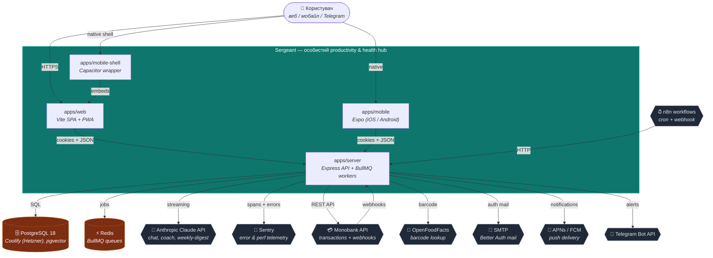

# C1 — System Context

> **Last touched:** 2026-07-21 by @Skords-01. **Next review:** 2026-10-19.
> **Status:** Active

Sergeant у контексті користувача та зовнішніх систем.

## Зауваження

- Хостинг: бекенд (API + Postgres + Redis) — Hetzner CX23 + Coolify (self-host PaaS, [ADR-0074](../../../04-governance/adr/0074-hosting-hetzner-coolify.md)); Vercel (web hosting + edge-proxy); Sentry SaaS, Anthropic SaaS, Monobank — банк-партнер.
- Sergeant як software system НЕ зберігає секрети у браузері; cookies сесії — `httpOnly` + `secure` (Better Auth standard).
- OpenClaw Gateway **повністю decommissioned** ([ADR-0075](../../../04-governance/adr/0075-openclaw-gateway-decommissioned.md), 2026-07-20) разом з Railway — код (`packages/openclaw-plugin`, `apps/server/src/modules/openclaw`) видалено, тому цей компонент більше не показаний на діаграмі. Telegram Bot API лишається як зовнішня система лише для one-way alert-delivery (`Server -->|alerts| Telegram`, alerts-shipper).
- `apps/mobile-shell` обгортає `apps/web` через Capacitor; це той самий фронтенд-bundle, тільки з нативними API (camera, push).

## Поверхні-каталог

Детальний runtime-каталог (deploy targets, env vars, healthcheck) живе в [`service-catalog.md`](../service-catalog.md).
