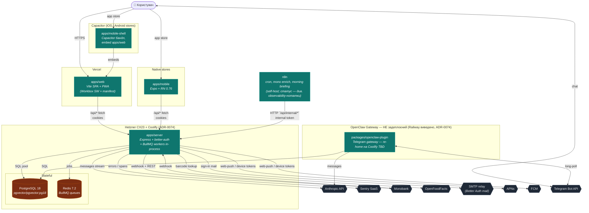

# C2 — Containers

> **Last touched:** 2026-07-20 by @cursoragent. **Next review:** 2026-10-18.
> **Status:** Active

Деплоймент-топологія Sergeant. Кожен контейнер — окремий процес або deploy target.

## BullMQ workers

Зараз `apps/server` стартує BullMQ Queue + Worker **у тому самому процесі**, що й Express:

| Queue              | Файл                                               | Що робить                                                                       |
| ------------------ | -------------------------------------------------- | ------------------------------------------------------------------------------- |
| `ai-memory-ingest` | `apps/server/src/modules/ai-memory/ingestQueue.ts` | Embeddings (Voyage AI) для memory-bank entries → Postgres pgvector.             |
| `auth-mail`        | `apps/server/src/lib/jobs/authMail.ts`             | Email magic-link / verification через Better Auth → SMTP (Resend).              |
| `mono-enrich`      | `apps/server/src/modules/mono/enrichmentWorker.ts` | AI-категоризація Monobank транзакцій (Anthropic tool-call per batch). DB-queue. |

> `mono-enrich` зараз — **DB-queue** (`apps/server/src/modules/mono/enrichmentWorker.ts`): polling Postgres замість Redis BullMQ (спрощення після аудиту). Не потребує Redis для роботи. `sampleEnrichmentQueueDepth()` репортить Prometheus gauge.

**Ризик** — крах в worker-loop може уронити API. Виокремлення у standalone worker process — у [`docs/90-work/audits/2026-05-03-web-deep-dive` §1.6](../../../90-work/audits/archive/2026-05-03-web-deep-dive/02-architecture-and-state.md). Поки workers in-process, моніторити Sentry на crashes у `bullmq.Worker.run`.

## Нові server modules (з 2026-04)

Усі розміщені у `apps/server/src/modules/`:

| Module          | Endpoint prefix                      | Опис                                                                                                                                     |
| --------------- | ------------------------------------ | ---------------------------------------------------------------------------------------------------------------------------------------- |
| `billing`       | `/api/billing/*`                     | UA checkout (LiqPay/Plata) + subscription state. `subscriptions` (056) — canonical; legacy `billing_subscriptions` (047) dropped in 083. |
| `transcribe`    | `/api/transcribe`                    | Whisper audio → text з USD-cap per user/day (bucket `transcribe:<model>`, fixed 049).                                                    |
| `waitlist`      | `/api/waitlist`                      | Waitlist sign-up і management.                                                                                                           |
| `openclaw`      | internal (console bot)               | GitHub App-flow авторизація (Hard Rule #20) + tools для co-founder bot.                                                                  |
| `topic-archive` | internal                             | `tg_topic_archive` — append-only history для Sergeant_ops supergroup topics (048).                                                       |
| `alerts`        | `/api/csp-report`, `/api/web-vitals` | CSP report endpoint + web-vitals ingestion.                                                                                              |
| `observability` | internal                             | Server-side observability helpers: prom-client metrics, store wrappers.                                                                  |

## Зовнішні залежності, з яких є SLA-ризик

- **Anthropic API** — chat/coach/digest повністю залежать. У разі 5xx — graceful fallback у `chatHandler` через retry-after.
- **Postgres** — vital. У разі недоступності api-сервер падає healthcheck.
- **Redis** — guards для BullMQ. Якщо Redis unavailable — auth-mail jobs не enqueue-ються, але login flow degrade-аеться gracefully (synchronous send).
- **Mono** — best-effort sync. Webhook-и з ретраями; manual reconciliation за необхідністю.

## Network boundaries

- `User → Web/Mobile/Shell`: HTTPS (Vercel cert / app store).
- `Web/Mobile → Server`: HTTPS через Vercel edge-proxy (env `BACKEND_URL`) → Coolify Traefik → app. CSP заблокує усе нелисловане (див. `helmet` setup). ⚠️ ланцюг `Vercel edge → Traefik → app` (кілька hop-ів) впливає на `TRUST_PROXY` — калібрування у ADR-0074 позначене TBD.
- `n8n → Server`: запит проходить публічний URL із **internal token** (`INTERNAL_API_KEY`).
- `Server → Postgres / Redis`: Coolify internal Docker network (той самий VPS).

## Деталі деплоя

Детальніше — у [`service-catalog.md`](../service-catalog.md), [`hosting-evolution.md`](../hosting-evolution.md), [`platforms.md`](../platforms.md).
