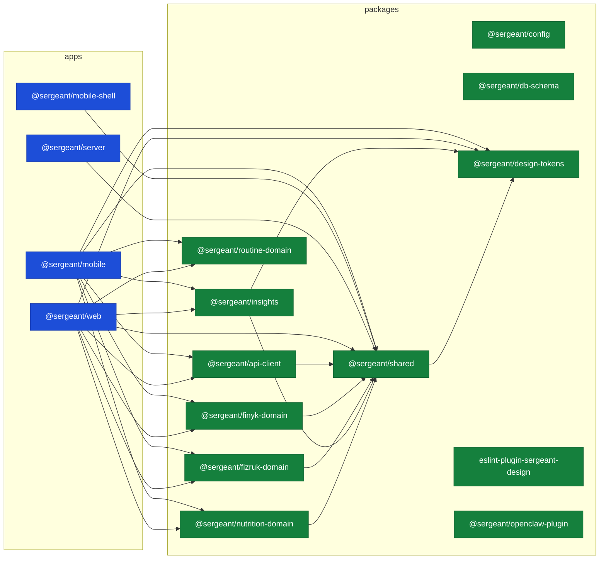

# C3 — Workspace dependency graph

> **Last validated:** 2026-06-25 by @Skords-01. **Next review:** 2026-09-23.
> **Status:** Active

<!-- AUTO-GENERATED FILE. Do not edit by hand. Regenerate via `pnpm docs:gen-architecture-diagrams`. -->

Workspace-level dependency view of `@sergeant/*` import edges. Derived from [`docs/04-governance/governance/symbol-index.json`](../../../04-governance/governance/symbol-index.json) (Phase 2 symbol catalog). Each edge `A → B` means workspace **A** imports at least one symbol from workspace **B** via static ESM `import` / `export from` statements.

**Limitations:** does not include dynamic `await import()`, runtime `require()`, or `peerDependencies` declared in `package.json`. For runtime deployment topology see [`c2-containers.md`](./c2-containers.md); for feature-level flows see `c3-cloudsync.md` / `c3-chat-tool-use.md`; for the rationale on what is and isn't auto-generated see [ADR-0060](../../../04-governance/adr/0060-architecture-diagrams-automation-scope.md).

## Graph



## Stats

- **16** workspaces total — 4 apps, 12 packages, 0 tools.
- **25** cross-workspace import edges.

## Top imported workspaces

The packages most other workspaces depend on. `Importers` = unique file count across all workspaces; `Exports` = symbols declared at the workspace entry.

| Rank | Workspace                    | Importers | Exports |
| ---- | ---------------------------- | --------- | ------- |
| 1    | `@sergeant/shared`           | 358       | 1       |
| 2    | `@sergeant/nutrition-domain` | 90        | 1       |
| 3    | `@sergeant/fizruk-domain`    | 82        | 1       |
| 4    | `@sergeant/routine-domain`   | 63        | 1       |
| 5    | `@sergeant/api-client`       | 39        | 200     |

## Drift detection

If a new workspace lands (or an existing one starts importing a new `@sergeant/*`) and this file is not regenerated, `pnpm docs:check-architecture-diagrams` fails in CI. To refresh:

```bash
pnpm docs:gen-symbols                  # refresh symbol-index.json (Phase 2)
pnpm docs:gen-architecture-diagrams    # regenerate this diagram
```

Both must succeed before commit.
