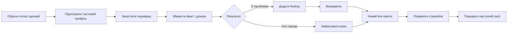
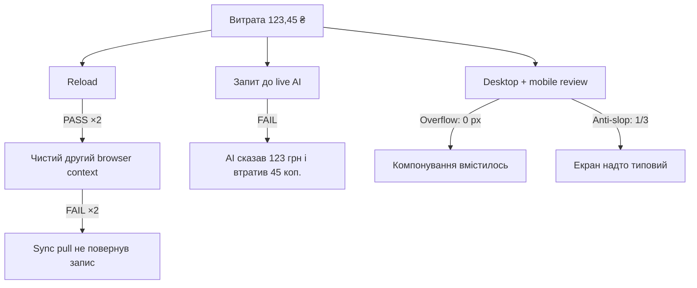

# Що ми побудували за сесію

> **Last touched:** 2026-09-05 by Codex. **Next review:** 2026-12-05.
> **Status:** Active

Раніше перевірки жили у великих разових аудитах. Після прогону було важко зрозуміти, що саме тестували, яким акаунтом, що вже виправили та чи стало краще наступного разу.

Тепер це постійний цикл:

## Із чого складається система

| Частина          | Простими словами                                                                                            |
| ---------------- | ----------------------------------------------------------------------------------------------------------- |
| 6 комплектів     | Окремі плани для маршрутів, логіки, AI, візуалу/a11y/anti-slop, даних/sync та технічної якості              |
| 19 сценаріїв     | Конкретні кроки: що підготувати, що натиснути, що очікувати, який доказ зберегти й як прибрати тестові дані |
| Профілі акаунтів | Порожній, наповнений, Pro, edge, disposable; окремо один user на двох devices і два users для isolation     |
| Журнал прогонів  | Кожна спроба має статус, фактичний результат, метрики, screenshots/traces і checksum                        |
| Реєстр знахідок  | Старі та нові проблеми мають один ID і історію; PR не оголошує проблему перевіреною без нового live pass    |
| Handoff          | Наступна сесія бачить стан акаунтів, блокери, невдалі підходи й точну наступну дію                          |

## Що реально запустили

Ми підняли окрему локальну PostgreSQL-базу, API і web, створили disposable акаунти та двічі повторили однаковий сценарій із витратою **123,45 ₴**.

| Перевірка                       | Перший прогін | Повтор  | Що це означає                                                  |
| ------------------------------- | ------------- | ------- | -------------------------------------------------------------- |
| Створення витрати + reload      | Pass          | Pass    | Основний запис працює стабільно                                |
| Незалежний перерахунок          | Blocked       | Blocked | Потрібен окремий DB/API oracle; UI не може перевіряти сам себе |
| Новий пристрій того самого user | Fail          | Fail    | Проблема відтворюється, заведено finding                       |
| Live AI про останню витрату     | Не дійшли     | Fail    | Опис правильний, сума втратила копійки                         |
| Mobile/desktop/anti-slop        | Не дійшли     | Fail    | Overflow не знайдено; два anti-slop тести провалені            |

Обидва прогони закриті як `incomplete`. Це правильний результат: система не дозволяє перетворити пропущений або заблокований крок на зелений статус.

## Як користуватися наступного разу

1. `pnpm verification list` — вибрати сценарії.
2. `pnpm verification init ...` — створити прогін зі snapshot сценаріїв і середовища.
3. `pnpm verification record ...` — записувати кожну спробу одразу з доказом.
4. `pnpm verification report ...` — отримати зрозумілий звіт.
5. `pnpm verification compare ...` — порівняти повтор із baseline.
6. `pnpm verification close ...` — закрити прогін без приховування fail/blocked/not-run.

Початкова точка: [бібліотека комплектів](../../../02-engineering/testing/verification/README.md). Результати: [перший прогін](./runs/pilot-2026-09-05-a/handoff.md) і [повтор](./runs/pilot-2026-09-05-b/handoff.md).
