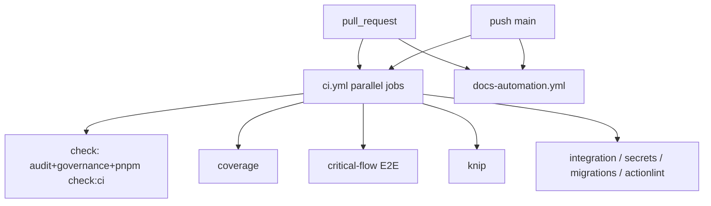

# CI на main → green (2026-07-21)

> **Last touched:** 2026-07-21 by @cursoragent. **Next review:** 2026-10-18.
> **Status:** Active

## Діагноз

`main` був червоним кластером фейлів після OpenClaw decommission (ADR-0075) і
дрейфу залежностей/UX. На HEAD `d5325db` падали:

| Workflow        | Job                                               | Причина                                                                       |
| --------------- | ------------------------------------------------- | ----------------------------------------------------------------------------- |
| CI              | `OpenClaw config schema`                          | `Dockerfile.openclaw-gateway` видалено → ENOENT                               |
| CI              | `check` (audit)                                   | critical `tar` + high `brace-expansion` / `js-yaml` / `shell-quote` / `axios` |
| CI              | `Dead Code (Knip)`                                | unused `pgsql-ast-parser` + stale `ignoreDependencies` hints                  |
| CI              | `Test coverage`                                   | pact/internal тести мокали `anthropic.js`, код уже йде через `invokeLLM`      |
| CI              | `Critical-flow E2E`                               | stale smoke assertions vs auto-skip meal sheet + intro chat message           |
| Docs automation | links / STATUS / playbook 3-way / retrieval index | криві `../` до ADR-0074, deprecated playbook у каталозі, stale generated docs |

## Архітектура CI (стисло)

**Документовані required checks:** `check`, `Test coverage (vitest)`, `Critical-flow E2E (Playwright)`.
Решта jobs у `ci.yml` + `docs-automation.yml` — de-facto blockers на статусі PR.

## План правок (виконано в цьому PR)

1. **Прибрати мертвий OpenClaw CI** — job + `scripts/validate-openclaw-config.mjs` (видалено).
2. **Audit overrides** — `tar>=7.5.19`, brace-expansion 1.1.16/2.1.2/5.0.7, `js-yaml@4.3.0`, `shell-quote>=1.9.0`, `axios>=1.18.0`.
3. **Knip** — drop unused dep; ignore Stryker vitest-runner by name; clean hints.
4. **Docs** — ADR link depth, catalog без deprecated OpenClaw playbook, regen STATUS + retrieval index + licenses; governance-sync exemptions для Superseded/Historical ADR.
5. **Tests** — mock `lib/llm/provider.js` замість `anthropic.js`.
6. **E2E** — smoke під поточний UX (auto-skip sheet, quick-action chips).

## Верифікація

Локально: audit prod/full, knip, playbook 3-way, STATUS --check, retrieval --check,
licenses:check, provider+internal vitest. Повний `pnpm check` / Playwright smoke —
на CI після push.
