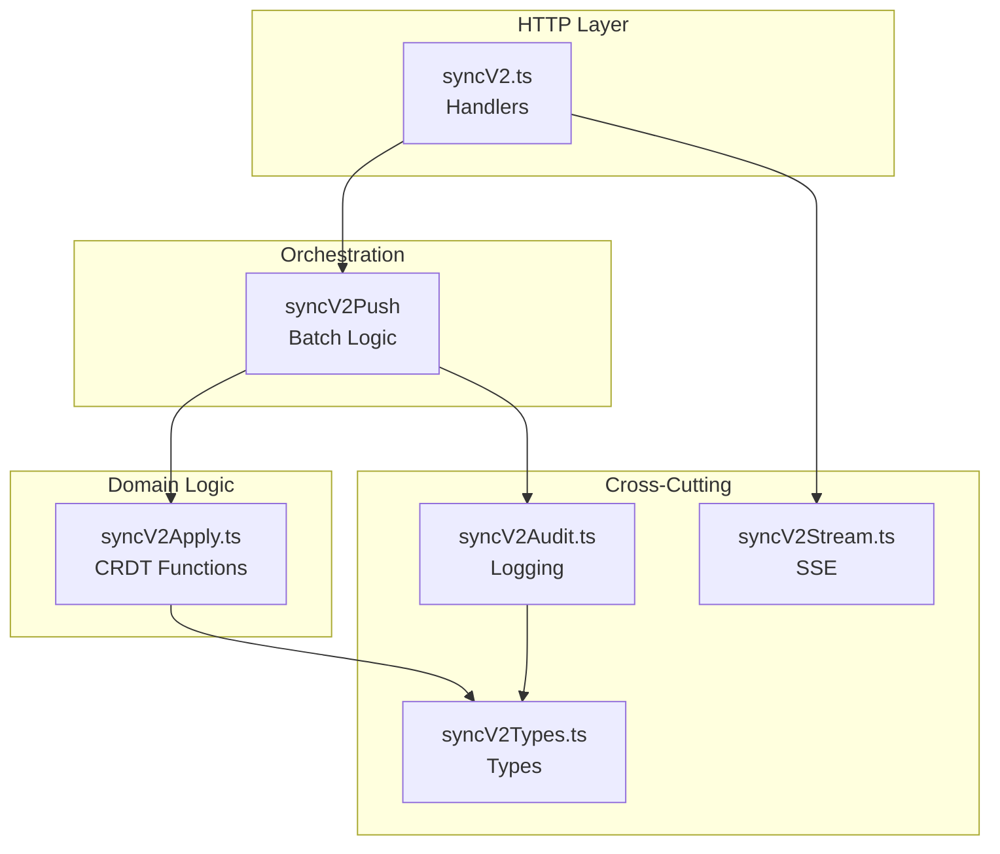

# ADR-0062: syncV2 Module Decomposition Strategy

- **Status:** Accepted
- **Date:** 2026-06-03
- **Last validated:** 2026-06-06 by @Skords-01. **Next review:** 2026-09-06.
- **Author:** @claude
- **Category:** Architecture Refactoring
- **Supersedes:** —
- **Hard Rule:** #18 (Module-size discipline — max-lines: 600)

## Контекст

Файл [`apps/server/src/modules/sync/syncV2.ts`](../apps/server/src/modules/sync/syncV2.ts:1) досяг **3100 LOC**, що порушує Hard Rule #18 (max-lines: 600). Це найбільший файл у `apps/server`, що робить його:

- Неможливим для нормального code review
- Складним для тестування (монолітний блок)
- Ризикованим для рефакторингу (висока зв'язність)

### Попередня декомпозиція

Частина декомпозиції вже виконана:
- [`syncV2Stream.ts`](../apps/server/src/modules/sync/syncV2Stream.ts:1) (405 LOC) — SSE stream логіка винесена окремо
- Існують тести: `syncV2.test.ts`, `syncV2.integration.test.ts`, `syncV2Stream.test.ts`

## Рішення

Декомпозувати `syncV2.ts` на **4 модулі** за функціональною відповідальністю:

### 1. `syncV2Types.ts` (~400 LOC)
**Відповідальність:** Всі типи, інтерфейси, константи

**Що виноситься:**
- `SyncV2OpKind` type
- `SyncV2Outcome` type union
- `APPLY_REJECT_REASONS` const array
- `ApplyRejectReason` type
- Всі допоміжні інтерфейси для operations

**Критерії:**
- Жодної runtime логіки (тільки types + constants)
- Експортується через `export type` для tree-shaking

### 2. `syncV2Apply.ts` (~800 LOC)
**Відповідальність:** Per-module apply-функції (CRDT логіка)

**Що виноситься:**
- `applyFizrukOp()` — фізичні вправи
- `applyFinykOp()` — фінанси
- `applyNutritionOp()` — харчування
- `applyRoutineOp()` — звички
- Допоміжні функції: `assertUserIdMatch()`, `coerceBigInt()`, `validateTimestamp()`

**Критерії:**
- Кожна apply-функція pure (без side effects окрім DB writes)
- Приймає `PoolClient` для transactional safety
- Повертає `ApplyResult` discriminated union

### 3. `syncV2Audit.ts` (~300 LOC)
**Відповідальність:** Audit logging та observability

**Що виноситься:**
- `logSyncOp()` — запис у `sync_audit_log`
- `recordSyncEvent()` — запис у `sync_events`
- `emitSyncMetrics()` — оновлення Prometheus counters
- `buildAuditContext()` — витяг device_id, user_agent, ip

**Критерії:**
- Всі функції async (DB writes)
- Інтеграція з `obs/metrics.ts`
- Idempotent (безпечний для retry)

### 4. `syncV2.ts` (залишок ~1200 LOC → подальша декомпозиція)
**Відповідальність:** Main HTTP handlers

**Що залишається:**
- `syncV2PushHandler()` — POST /api/v2/sync/push
- `syncV2PullHandler()` — GET /api/v2/sync/pull
- `syncV2Push()` — orchestration layer (batch processing)
- Transaction management (BEGIN/COMMIT/ROLLBACK)

**Подальша декомпозиція (Phase 2):**
- Винести `syncV2Push()` у `syncV2Push.ts` (~600 LOC)
- Залишити handlers у `syncV2.ts` (~600 LOC)

## Архітектурна діаграма

## Наслідки

### Позитивні
- ✅ Всі файли <600 LOC (Hard Rule #18)
- ✅ Легше тестувати (ізольовані модулі)
- ✅ Швидший code review (менший контекст)
- ✅ Краща tree-shaking (types окремо)

### Негативні
- ⚠️ Більше файлів для навігації
- ⚠️ Потрібні explicit imports (не implicit через same-file)

### Ризики
- **Circular dependencies:** Уникнути через `syncV2Types.ts` як shared leaf
- **Breaking changes:** Зберегти public API (export names)
- **Test coverage:** Створити тести для кожного модуля

## Міграційний план

### Phase 1 (цей ADR)
1. Створити `syncV2Types.ts` — винести всі типи
2. Створити `syncV2Apply.ts` — винести apply-функції
3. Створити `syncV2Audit.ts` — винести audit-логіку
4. Оновити імпорти в `syncV2.ts`
5. Створити тести для нових модулів
6. Валідація: `pnpm check`

### Phase 2 (наступний PR)
1. Винести `syncV2Push()` у `syncV2Push.ts`
2. Залишити handlers у `syncV2.ts`
3. Фінальний розмір: ~600 LOC кожен файл

## Критерії приймання

- [x] Всі нові файли <600 LOC
- [x] `pnpm check` проходить (typecheck + lint + test + build)
- [x] Всі існуючі тести проходять
- [x] Нові тести покривають винесені модулі
- [x] Немає circular dependencies
- [x] Public API збережено (export names)

## Пов'язані ADR

- [ADR-0004](./0004-cloudsync-lww-conflict-resolution.md) — CRDT логіка
- [ADR-0011](./0011-local-first-storage.md) — Local-first архітектура
- [ADR-0045](./0045-hard-rules-taxonomy.md) — Hard Rules категоризація

## Історія змін

| Дата | Автор | Зміна |
|------|-------|-------|
| 2026-06-03 | @claude | Початкова версія |
