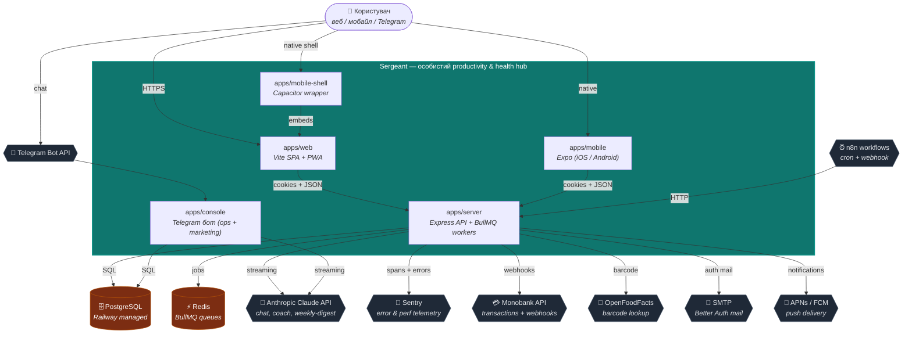

# C1 — System Context

> **Last validated:** 2026-05-04 by @Skords-01. **Next review:** 2026-08-01.
> **Status:** Active

Sergeant у контексті користувача та зовнішніх систем.

## Зауваження

- Всі external systems — managed: Railway (Postgres, Redis, n8n self-host), Vercel (web hosting), Sentry SaaS, Anthropic SaaS, Monobank — банк-партнер.
- Sergeant як software system НЕ зберігає секрети у браузері; cookies сесії — `httpOnly` + `secure` (Better Auth standard).
- `apps/console` — окремий surface для внутрішніх ops/marketing задач, не для kінцевого користувача.
- `apps/mobile-shell` обгортає `apps/web` через Capacitor; це той самий фронтенд-bundle, тільки з нативними API (camera, push).

## Поверхні-каталог

Детальний runtime-каталог (deploy targets, env vars, healthcheck) живе в [`service-catalog.md`](../service-catalog.md).
