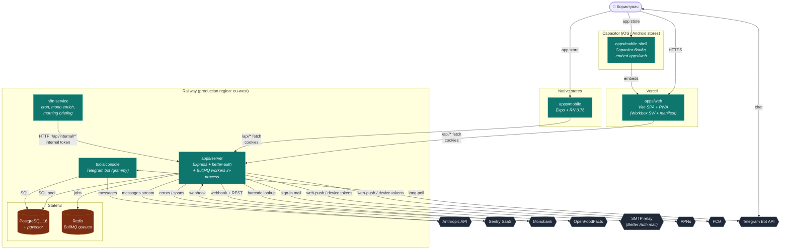

# C2 — Containers

> **Last validated:** 2026-05-05 by @Skords-01. **Next review:** 2026-08-03.
> **Status:** Active

Деплоймент-топологія Sergeant. Кожен контейнер — окремий процес або deploy target.

## BullMQ workers

Зараз `apps/server` стартує BullMQ Queue + Worker **у тому самому процесі**, що й Express:

| Queue              | Файл                                               | Що робить                                                        |
| ------------------ | -------------------------------------------------- | ---------------------------------------------------------------- |
| `ai-memory-ingest` | `apps/server/src/modules/ai-memory/ingestQueue.ts` | embeddings (Voyage) для memory-bank entries → Postgres pgvector. |
| `auth-mail`        | `apps/server/src/lib/jobs/authMail.ts`             | Email magic-link / verification через Better Auth → SMTP.        |

**Ризик** — крах в worker-loop може уронити API. Виокремлення у standalone worker process — у [`docs/audits/2026-05-03-web-deep-dive` §1.6](../../audits/2026-05-03-web-deep-dive/02-architecture-and-state.md). Поки workers in-process, моніторити Sentry на crashes у `bullmq.Worker.run`.

## Зовнішні залежності, з яких є SLA-ризик

- **Anthropic API** — chat/coach/digest повністю залежать. У разі 5xx — graceful fallback у `chatHandler` через retry-after.
- **Postgres** — vital. У разі недоступності api-сервер падає healthcheck.
- **Redis** — guards для BullMQ. Якщо Redis unavailable — auth-mail jobs не enqueue-ються, але login flow degrade-аеться gracefully (synchronous send).
- **Mono** — best-effort sync. Webhook-и з ретраями; manual reconciliation за необхідністю.

## Network boundaries

- `User → Web/Mobile/Shell`: HTTPS (Vercel cert / app store).
- `Web/Mobile → Server`: HTTPS through Vercel proxy → Railway internal HTTP. CSP заблокує усе нелисловане (див. `helmet` setup).
- `n8n → Server`: same Railway VPC, але запит проходить публічний URL із **internal token** (`SERGEANT_INTERNAL_TOKEN`).
- `Server → Postgres / Redis`: Railway internal network, `*.railway.internal` DNS.

## Деталі деплоя

Детальніше — у [`service-catalog.md`](../service-catalog.md), [`hosting-evolution.md`](../hosting-evolution.md), [`platforms.md`](../platforms.md).
