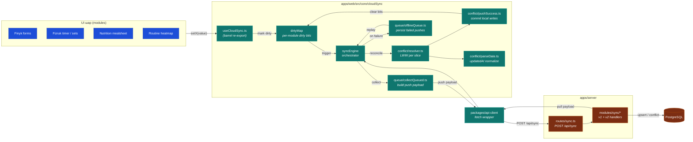

# C3 — CloudSync (web)

> **Last validated:** 2026-05-05 by @Skords-01. **Next review:** 2026-08-03.
> **Status:** Active

Внутрішня структура CloudSync у `apps/web`. Це **local-first sync v1** — UI пише в локальне сховище (localStorage), сервер обробляє push-блоби й pull-блоби з LWW-резолюцією.

## Ключові структури

| Файл / директорія                        | Відповідає за                                                                  |
| ---------------------------------------- | ------------------------------------------------------------------------------ |
| `core/cloudSync/queue/collectQueued.ts`  | Збирає dirty-зрізи в push payload (1 payload = 1 транзакція push).             |
| `core/cloudSync/queue/offlineQueue.ts`   | Persists невдалі push-и у localStorage; replays їх на наступному online-вікні. |
| `core/cloudSync/conflict/resolver.ts`    | LWW (last-write-wins) per data slice. Базується на `updatedAt`.                |
| `core/cloudSync/conflict/parseDate.ts`   | Нормалізує `updatedAt` → number (ms epoch) для порівняння.                     |
| `core/cloudSync/conflict/pushSuccess.ts` | Після успішного push-у: commit локальних writes, скидає dirty-bits.            |
| `core/useCloudSync.ts`                   | Barrel re-export для зручного import-у з UI.                                   |

## Ризики (з diagnostic §2.3)

- **Split-brain** — два пристрої одночасно edit-ять той самий зріз → LWW дає переможцю по часу, але є вікно «обидва виграли локально». Тестів на цей сценарій ще немає (item #9 у roadmap).
- **localStorage quota** на main thread → блокує UI під час великих pushes. Розмір нинішнього footprint-у відстежується через `pnpm lint:localstorage-allowlist` ([item #6 done](../../audits/2026-05-03-web-deep-dive/00-overview.md)).
- **v2 vs v1 sync coexistence** — v1 досі primary; v2 з operation-log частково розгорнуто. Cleanup у §2.3.

## Як змінити

1. Будь-яка зміна shape pushed payload → одразу update server route, snapshot, type у `api-client`.
2. Conflict resolver — purely deterministic; зміни тут вимагають property-based тестів на `resolver.test.ts`.
3. `dirtyMap` ключі ідуть через типізовані factories — НЕ stringify ad-hoc.
