# C3 — Sync Engine v2 (web)

> **Last validated:** 2026-05-13 by @Skords-01. **Next review:** 2026-08-11.
> **Status:** Active

Внутрішня структура sync engine v2 у `apps/web`. CloudSync v1 (dirtyMap / offlineQueue / LWW resolver) знятий (ADR-0047). Єдиний sync-шлях — **op-log outbox**: UI пише у локальний SQLite-WASM, `SyncEnginePushScheduler` батчить операції й пушить на сервер через `/api/v2/sync/push`.

```mermaid
flowchart LR
    subgraph UI["UI шар (modules)"]
        FinykUI["Finyk forms"]
        FizrukUI["Fizruk timer / sets"]
        NutritionUI["Nutrition mealsheet"]
        RoutineUI["Routine heatmap"]
    end

    subgraph SyncCore["apps/web/src/core/syncEngine"]
        direction TB
        Writer["singleton.ts<br/><i>SyncEngineWriterRuntime</i>"]
        Scheduler["SyncEnginePushScheduler<br/><i>@sergeant/api-client</i>"]
        FlushReconn["SyncEngineFlushOnReconnect<br/><i>replay on network restore</i>"]
        Status["useSyncStatus<br/><i>core/cloudSync/hook/</i>"]
    end

    subgraph SQLite["SQLite-WASM (OPFS / kvvfs)"]
        DomainTables["domain tables<br/><i>routine_entries,<br/>fizruk_workouts, ...</i>"]
        Outbox["sync_op_outbox<br/><i>pending, in_flight, dead_letter</i>"]
    end

    APIClient["packages/api-client<br/><i>fetch wrapper</i>"]

    subgraph Server["apps/server"]
        PushRoute["POST /api/v2/sync/push"]
        PullRoute["GET /api/v2/sync/pull"]
        SyncV2["modules/sync/syncV2.ts<br/><i>OP_LOG_TABLE_REGISTRY</i>"]
    end

    PG[("PostgreSQL<br/><i>sync_op_log + domain tables</i>")]

    UI -->|"domain write helper"| DomainTables
    DomainTables -->|"enqueue op"| Outbox
    Outbox -->|"notifyEnqueued()"| Writer
    Writer --> Scheduler
    Scheduler -->|"batch ops"| APIClient
    APIClient -->|"POST /api/v2/sync/push"| PushRoute
    PushRoute --> SyncV2
    SyncV2 -->|"apply per-row + LWW-guard"| PG
    SyncV2 -->|"{ applied, rejected, duplicate }"| APIClient
    APIClient -->|"mark applied / dead-letter"| Outbox
    FlushReconn -->|"flush on reconnect"| Scheduler

    Writer -->|"GET /api/v2/sync/pull?since=cursor"| PullRoute
    PullRoute --> SyncV2
    SyncV2 -->|"remote ops since cursor"| APIClient
    APIClient -->|"apply remote"| DomainTables

    Status -->|"getStatus()"| Writer

    classDef ui fill:#1d4ed8,stroke:#1e40af,color:#fff
    classDef core fill:#0f766e,stroke:#0d9488,color:#fff
    classDef server fill:#7c2d12,stroke:#b45309,color:#fff
    classDef store fill:#4b1d96,stroke:#7c3aed,color:#fff
    class FinykUI,FizrukUI,NutritionUI,RoutineUI ui
    class Writer,Scheduler,FlushReconn,Status,APIClient core
    class PushRoute,PullRoute,SyncV2 server
    class DomainTables,Outbox,PG store
```



## Ключові компоненти

| Файл / директорія                                     | Відповідає за                                                                                     |
| ----------------------------------------------------- | ------------------------------------------------------------------------------------------------- |
| `core/syncEngine/singleton.ts`                        | Lazy-init і lifecycle sync runtime (boot / stop / flushNow / getStatus).                          |
| `core/syncEngine/syncEngineWriter.ts`                 | Інтерфейс `SyncEngineWriterRuntime` + фабрика `createSyncEngineWriterRuntime`.                    |
| `@sergeant/api-client` → `SyncEnginePushScheduler`    | Debounce + retry push batches з `sync_op_outbox`.                                                 |
| `@sergeant/api-client` → `SyncEngineFlushOnReconnect` | Підписується на `online` event, негайно flush відкладеного.                                       |
| `core/cloudSync/hook/useSyncStatus.ts`                | React-hook: зчитує `SyncOpOutboxStatusCounts` для UI badge.                                       |
| `packages/db-schema/sqlite`                           | SQLite Drizzle-схема: `sync_op_outbox` + domain tables.                                           |
| `apps/server/modules/sync/syncV2.ts`                  | `OP_LOG_TABLE_REGISTRY` whitelist + per-table `applyFn`. Push handler, pull handler, dead-letter. |

## Статуси в outbox

```
pending  →  in_flight  →  applied   (normal path)
                       →  duplicate  (idempotency — op вже застосовано)
                       →  dead_letter (rejected after max retries)
```

`recoverAllDeadLetters()` переводить `dead_letter → pending` для ручного replay.

## Відмінності від v1

| Аспект             | v1 (знятий, ADR-0047)                              | v2 (поточний)                                       |
| ------------------ | -------------------------------------------------- | --------------------------------------------------- |
| Transport          | `POST /api/sync` (410 Gone)                        | `POST /api/v2/sync/push`, `GET /api/v2/sync/pull`   |
| Granularity        | Whole-module blob (LWW на весь module)             | Per-row operation (LWW + soft-delete per row)       |
| Conflict detection | На рівні blob timestamp                            | `(user_id, idempotency_key)` UNIQUE у `sync_op_log` |
| Offline queue      | `offlineQueue.ts` у localStorage                   | `sync_op_outbox` у SQLite-WASM (durable OPFS)       |
| Web local store    | `localStorage` (sync-patched)                      | SQLite-WASM (OPFS/kvvfs) — повний SQL, indexed      |
| Server store       | `module_data` JSONB blobs (дропнута міграцією 046) | Per-domain normalized tables + `sync_op_log` audit  |

## Тестування

- `apps/web/src/core/syncEngine/syncEngineWriter.test.ts` — unit tests для runtime lifecycle.
- `apps/web/src/core/syncEngine/singleton.test.ts` — singleton boot / idempotency.
- `apps/server/src/modules/sync/syncV2.test.ts` — server-side apply logic з Testcontainers Postgres.

## Зміна домена → що чіпати

1. Нова per-domain таблиця у `packages/db-schema/sqlite` (SQLite schema) + SQL migration у `apps/server/src/migrations/`.
2. Додай `applyFn` у `OP_LOG_TABLE_REGISTRY` (`apps/server/src/modules/sync/syncV2.ts`).
3. Domain write helpers мають писати через SQLite + enqueue op — НЕ raw `localStorage.setItem`.
