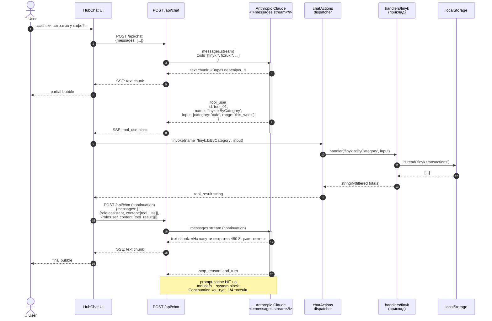

# Flow — HubChat tool-use cycle

> **Last validated:** 2026-05-04 by @Skords-01. **Next review:** 2026-08-01.
> **Status:** Active

Один цикл tool-use всередині chat-сесії. Користувач задає питання, що вимагає читання локальних даних (наприклад «скільки я витратив на кафе цього тижня?»), Claude емітує `tool_use`, клієнт виконує handler і повертає результат.

## Що робить dispatcher

`apps/web/src/core/lib/chatActions/index.ts` — тонкий router:

1. Бере `name` з `tool_use` блоку.
2. Шукає handler у `handlers/{finyk,fizruk,routine,nutrition,memory,utility,navigation}.ts`.
3. Викликає → отримує `string`.
4. Пакує у `tool_result` блок із тим самим `tool_use_id`.

Handler-и НЕ викликають мережу. Усі data reads — локальні (localStorage через `ls`/`lsSet` helpers, або через RQ cache snapshot, якщо вже завантажено).

## Хто пише handler

Модульний owner. При додаванні нового tool def на сервері (`modules/chat/toolDefs/<domain>.ts`):

1. Додай Zod-схему вхідних параметрів.
2. Додай handler у `apps/web/src/core/lib/chatActions/handlers/<domain>.ts` із тією ж назвою (`<domain>.<action>`).
3. Додай happy-path + error-path тест.
4. Якщо handler торкається cloud-sync slice — викликай `dirtyMap.mark()` після write.

## Помилки в циклі

| Сценарій                                               | Behavior                                                                                                                                                                       |
| ------------------------------------------------------ | ------------------------------------------------------------------------------------------------------------------------------------------------------------------------------ |
| Handler не знайдено                                    | dispatcher повертає `tool_result: { error: 'unknown_tool' }`. Claude graceful — пере-формулює без tool.                                                                        |
| Handler throw                                          | catch + повернути error як string у tool_result. Claude бачить помилку.                                                                                                        |
| `tool_use.input` не валідний (за серверною Zod-схемою) | сервер відкине ще ДО client invoke (rare).                                                                                                                                     |
| Stream обірвано                                        | `chatActions/dispatcher` чекає `stream.done` перед invoke handler. Якщо stream впав посеред tool_use — handler не запускається, користувач бачить «Зв'язок розірвано», ретрай. |

## Performance / cost

- Каждна tool-use ітерація = 1 додатковий round-trip + 1 Anthropic continuation запит.
- Median: 1-2 tool_use на запит. Tax ~2× латентність першого token, але cache HIT компенсує токен-вартість.
- Track у PostHog: `chat.tool_use_count` per session.
- Sentry: `chat.tool_use.handler_error` aggregated by handler name.
