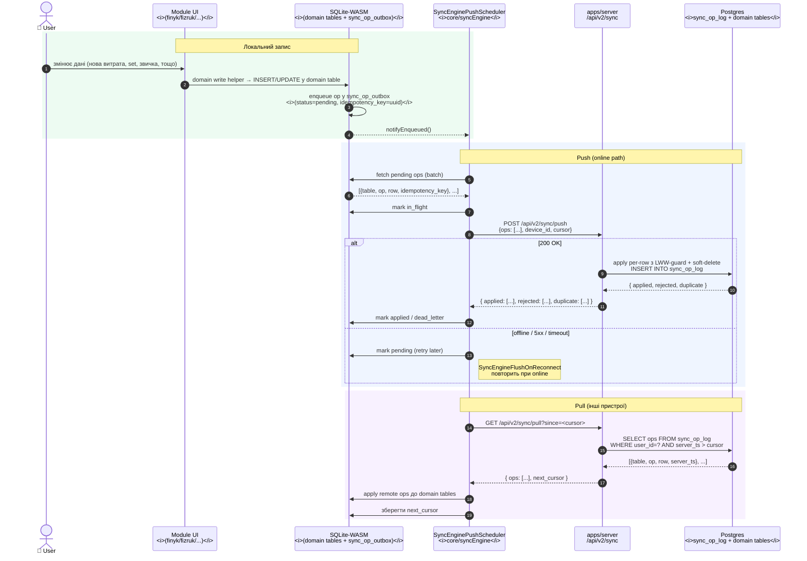

# Flow — Sync v2 push/pull

> **Last validated:** 2026-05-07 by @Skords-01. **Next review:** 2026-08-05.
> **Status:** Active

Sync v2: UI пише у локальний SQLite-WASM, `SyncEnginePushScheduler` батчить операції з `sync_op_outbox` та пушить на сервер; pull тягне зміни інших пристроїв. CloudSync v1 (`POST /api/sync`) знятий (ADR-0047) і повертає `410 Gone`.

## Тригери push

- `notifyEnqueued()` — кожен domain write автоматично повідомляє engine.
- Debounce (≈200 ms після останнього `notifyEnqueued()`) → один batch декількох ops.
- Manual: `SyncEngineWriterRuntime.flushNow()` — для тестів і ручного тригера (наприклад, перед logout).
- `SyncEngineFlushOnReconnect` — автоматичний flush при `window.addEventListener('online')`.

## Тригери pull

- Після успішного push (cursor update).
- На старті PWA (після session refresh у `AuthProvider`).
- Manual: `flushNow()` включає pull цикл.

## Idempotency та dead-letter

- `(user_id, idempotency_key)` UNIQUE у `sync_op_log` — повторний push однієї ops → `status: duplicate`, не double-apply.
- `status=dead_letter` — op rejected після max retries. Відновлюється через `recoverAllDeadLetters()` → `pending`.

## Конфлікти (per-row LWW)

- Server порівнює `client_ts` нової операції з `server_ts` останнього applied row.
- Якщо `client_ts < server_ts` останнього op — `status: rejected` (remote newer wins).
- UI бачить відхилення через `useSyncStatus()` — в майбутньому планується conflict UX.

## Порівняння з v1

| v1 (ADR-0047, знятий)                | v2 (поточний)                                            |
| ------------------------------------- | -------------------------------------------------------- |
| `POST /api/sync` → 410 Gone           | `POST /api/v2/sync/push`                                 |
| Whole-module blob                     | Per-row operation log                                    |
| LWW на blob timestamp                 | LWW per row з `idempotency_key`                          |
| offlineQueue у localStorage           | `sync_op_outbox` у SQLite-WASM (OPFS)                    |
| `module_data` JSONB (дропнута, 046)   | Normalized per-domain tables + `sync_op_log`             |

## Failure handling

| Failure          | Behaviour                                                        | Recovery                                  |
| ---------------- | ---------------------------------------------------------------- | ----------------------------------------- |
| Offline          | ops лишаються `pending` у outbox                                 | flush при `online` event                  |
| 5xx / timeout    | ops позначаються `pending` (retry з backoff)                     | exp.backoff у `SyncEnginePushScheduler`   |
| 401              | drop payload, force re-auth                                      | redirect до /login                        |
| `rejected`       | op позначається `dead_letter`                                    | `recoverAllDeadLetters()` / manual replay |
| `duplicate`      | no-op (idempotent), позначається `duplicate` у outbox            | —                                         |

## Спостережуваність

- `useSyncStatus()` — React hook, повертає `{ pending, in_flight, dead_letter }` counts.
- PostHog event `cloud_sync.push_v2` (`status`, `ops_count`, `latency_ms`).
- Sentry breadcrumb `cloud_sync.v2.failed` із deduped `requestId`.
