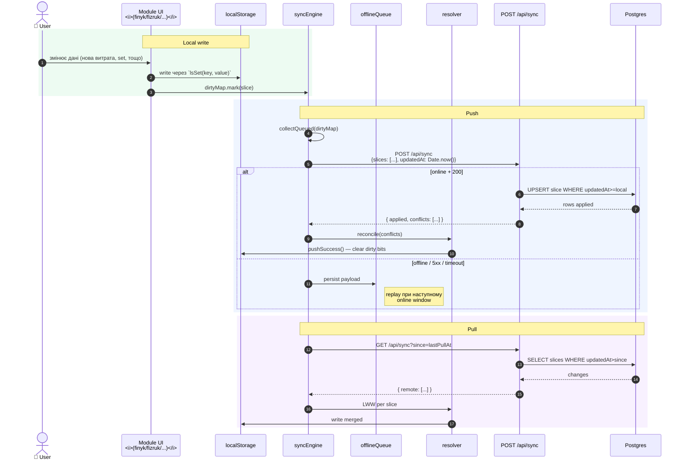

# Flow — CloudSync push/pull

> **Last validated:** 2026-05-04 by @Skords-01. **Next review:** 2026-08-01.
> **Status:** Active

Local-first sync v1: web client пише локально, у фоні push-ить блоб на сервер; на старті — pull для отримання змін з інших пристроїв.

## Тригери push

- Кожний UI write дзвонить `dirtyMap.mark(slice)`.
- Debounce **200 ms** після останнього mark → один push батчить кілька slice-ів.
- Manual: користувач натискає «синхронізувати» (rare).
- Background: при `visibilitychange → visible` після фокуса вкладки.

## Тригери pull

- На старті PWA (`AuthProvider` → after session refresh).
- Manual user-action (refresh кнопка).
- Background: `cloudSync` SW message при `sync` event (Workbox + Background Sync API).

## LWW resolution

- Per-slice (не per-record). Якщо local `updatedAt > remote.updatedAt` — local wins, інакше remote.
- `parseDate.ts` нормалізує всі формати (`number | string | Date | null`) у `number` epoch ms перед порівнянням.
- **Tie**: при `===` epoch ms — remote wins (server-side authoritative). У реальності ця колізія малоімовірна (резолюція до ms на одному пристрої майже неможлива одночасно з іншим).

## Обмеження v1 (з diagnostic §2.3)

- **Whole-slice replace**: push надсилає весь slice цілком. Великі slice-и (наприклад finyk transactions) — це bandwidth-витрата.
- **Conflict-blindness**: якщо два пристрої одночасно пишуть у різні ключі ВСЕРЕДИНІ slice — переможець тимчасово втрачає чужий запис. Pull-cycle потім підтягує remote зміни, але user-bait у вікні.
- **No event-log**: немає аудит-сліду «що звідки прийшло».

Roadmap: v2 із operation-log планується (часткова реалізація у `apps/server/src/modules/sync/v2`). Item #9 — split-brain integration tests; item #5 у diagnostic §5.0 — повний v2 cutover.

## Failure handling

| Failure          | Behaviour                   | Recovery                                |
| ---------------- | --------------------------- | --------------------------------------- |
| Offline          | offlineQueue.persist        | replay коли `navigator.onLine === true` |
| 5xx              | offlineQueue.persist        | exp.backoff replay                      |
| 401              | drop payload, force re-auth | redirect to /login                      |
| 4xx (validation) | log to Sentry, drop slice   | manual fix (rare)                       |

## Спостережуваність

- PostHog event `cloud_sync.push` (`status`, `slices`, `latency_ms`, `payload_kb`).
- Sentry breadcrumb `cloud_sync.failed` із deduped `requestId`.
- Локально: console.debug у dev (gated by `localStorage['DEBUG_CLOUD_SYNC']`).
