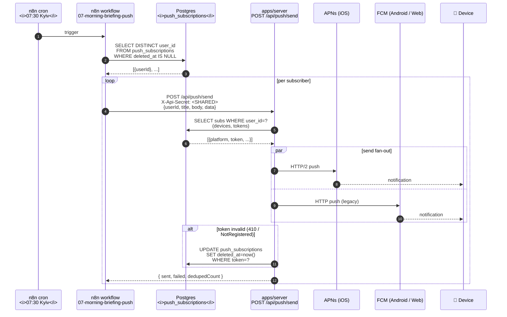

# Flow — Reminder fire (n8n morning briefing push)

> **Last validated:** 2026-05-13 by @Skords-01. **Next review:** 2026-08-11.
> **Status:** Active

n8n cron спрацьовує о 07:30 за Києвом, читає підписників з Postgres, дзвонить у server `/api/push/send`. Server відправляє push через APNs / FCM / Web Push на пристрій.

## Чому n8n, а не cron всередині сервера

- n8n дає **observability у GUI**: кожен виконаний run видно з логом, можна re-run руками.
- workflow можна редагувати без deploy сервера.
- Ту саму schedule-trigger інфраструктуру шарять інші flow-и (mono webhook enrich, weekly digest, sentry alert routing).
- Сервер залишається stateless щодо schedule-ів — це робить horizontal scaling тривіальним (1 replica зараз, але можна).

Trade-off — ще одна movable частина у production. Пом'якшено тим, що n8n self-hosted у тому ж Railway проєкті, той самий VPC.

## Контракт `/api/push/send`

| Поле                   | Тип                      | Опис                                                                  |
| ---------------------- | ------------------------ | --------------------------------------------------------------------- |
| `userId`               | `string`                 | Better Auth user id.                                                  |
| `title`                | `string`                 | Заголовок (1-50 chars).                                               |
| `body`                 | `string`                 | Тіло (до 200 chars).                                                  |
| `data`                 | `Record<string, string>` | deep-link payload. Наприклад `{ "module": "finyk", "tab": "today" }`. |
| `dedupeKey` (optional) | `string`                 | Якщо вже надсилали з тим же ключем за останні 30 хв — не повторюємо.  |

Auth: `X-Api-Secret` header проти `INTERNAL_PUSH_SHARED_SECRET` env. **НЕ** Better Auth cookie — це service-to-service.

## Платформи

- **iOS native (`apps/mobile`)** → APNs через `expo-notifications`.
- **Android native (`apps/mobile`)** → FCM через `expo-notifications`.
- **Web PWA (`apps/web`)** → Web Push (Workbox) через VAPID + push subscription. Fallback до in-page banner для desktop.
- **Capacitor shell (`apps/mobile-shell`)** → APNs/FCM через Capacitor Push plugin (тa ж семантика, що `apps/mobile`).

## Відмови та self-healing

| Помилка                               | Дія                                                                         |
| ------------------------------------- | --------------------------------------------------------------------------- |
| `410 Gone` від APNs/FCM               | mark subscription `deleted_at` → не пробуємо знов.                          |
| `429 Too Many Requests`               | exp.backoff retry усередині n8n (retry-on-fail node).                       |
| Server 5xx                            | n8n retry 3× з 60s паузою; якщо все падає — Sentry alert через workflow 03. |
| Postgres timeout у початковому SELECT | n8n alert; ручний rerun на наступний день.                                  |

## Тести / спостережуваність

- Server-side: `apps/server/src/push/send.test.ts` (mocking APNs/FCM clients), `pushTest.test.ts`.
- n8n run history → admin dashboard.
- PostHog event `push.sent` (`platform`, `delivered`, `latencyMs`).
- Sentry: server-side errors теги `push_dispatch`, n8n-side помилки → workflow 03 → Slack.

## Інші flow, що використовують ту саму схему

- `09-habit-streak-alert.json` — нагадування про streak (вечір).
- `10-debt-receivable-reminder.json` — нагадування про забутих боржників (тижневий cron).
- `02-failed-payment-recovery.json` — payment retry на Mono webhook fail.

Усі вони ходять через той самий `POST /api/push/send` контракт.
