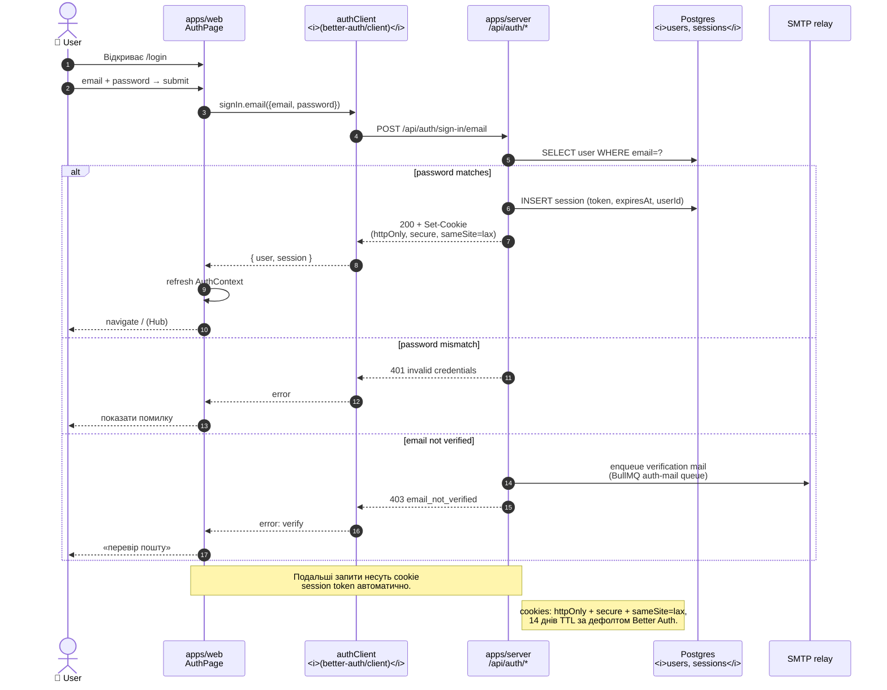

# Flow — Sign-in cookie flow (Better Auth)

> **Last validated:** 2026-05-13 by @andrijvigrav. **Next review:** 2026-08-11.
> **Status:** Active

Cookie-based session login через Better Auth. Email + password (magic-link / OAuth — варіації цього самого flow).

## Особливості реалізації

- **Cookie**, не token у `Authorization: Bearer ...` — Better Auth використовує cookie-based sessions для веб і мобайлу. Для мобайлу `@better-auth/expo` зберігає cookie у secure storage.
- **CSRF**: Better Auth автоматично ставить `sameSite=lax` cookie + перевіряє origin. CSRF token не потрібен для same-origin.
- **`/api/me`** після login — клієнт читає поточного user-а через цей endpoint (контракт-тести у [`apps/web/src/test/contract/me.contract.test.ts`](../../../apps/web/src/test/contract/me.contract.test.ts) і [`apps/server/src/routes/me.contract.test.ts`](../../../apps/server/src/routes/me.contract.test.ts)).
- **Sign-out**: `POST /api/auth/sign-out` → DELETE row у `sessions` + `Set-Cookie` із expired TTL.
- **Soft auth**: до моменту першого «real entry» (див. `core/auth/AuthContext.tsx`) ми НЕ просимо логін — це Sergeant конкретна політика, не Better Auth fea`ture.

## Помилки, які варто моніторити

| Симптом                        | Джерело                          | Дія                                                                            |
| ------------------------------ | -------------------------------- | ------------------------------------------------------------------------------ |
| 401 спайк після deploy         | rotated `BETTER_AUTH_SECRET`     | переконатись, що secret не змінювався без міграції; пере-логінити користувачів |
| 403 `email_not_verified` спайк | SMTP queue лагає або mail bounce | Sentry → BullMQ Auth Mail dashboard, перевірити SMTP relay                     |
| Cookie не виставляється        | proxy strips `Set-Cookie`        | перевірити Vercel rewrites + Railway proxy ланцюг                              |

## Тести

- `apps/web/src/core/auth/AuthContext.test.tsx` — Provider behaviour, Refresh, redirects.
- `apps/server/src/routes/auth.ts` живе у Better Auth handler — мокаємо upstream у server-side тестах через MSW.
