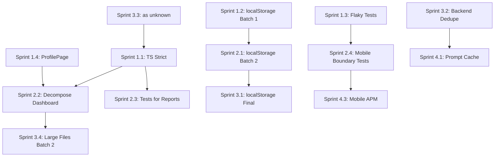

# Sergeant - Детальний План Реалізації Покращень

> **Last validated:** 2026-05-05 by Devin AI. **Next review:** 2026-08-01.
> **Status:** Active

> **Update 2026-05-05 (full refresh):** Документ оновлено за актуальним станом кодової бази.
> Основні зміни від останнього ревʼю:
> - P0-1 TypeScript strict — ✅ повністю закрито (Phase 4 + Phase 5 cleanup, 13/13 пакетів = 100 % strict).
> - P0-2 localStorage — масовий прогрес: ESLint `no-raw-local-storage: error` enforcement, allowlist зменшено до ~10 файлів (storage primitives + 4 cloudSync internals). 12+ раундів міграції.
> - P0-4 Mobile APM — ✅ Sentry RN ініціалізовано (`apps/mobile/src/lib/observability.ts`).
> - P1-1 Large files — ProfilePage 1060→95, HubChat ~800→145, ActiveWorkoutPanel 949→240, DesignShowcase 1064→72.
> - P1-4 Prompt cache — ✅ `cache_control: { type: "ephemeral" }` активовано в `chat.ts`.
> - P1-5 Distributed tracing — ✅ OpenTelemetry у `apps/server/src/obs/`.
> - P2-2 Sentry — ✅ web + mobile + server.
> - P2-4 `as unknown as X` — 0 у production-коді (залишилось тільки в тестах).
> - Backend dedup (elapsedMs) — ✅ витягнуто в `lib/timing.ts`.
>
> **Update 2026-05-02 (Phase 4 progress):** PR #1388 (sw.ts + presetApply.ts, −50) і PR #1391 (5 fizruk components, −99) обидва змерджені. Phase 4 baseline: **419 → 249 помилок у 43 файлах** (−170, ~41 % від початкового скоупу). Деталі — у §4 Спринт 1 / Завдання 1.1 нижче.

> **Дата створення:** 2026-04-28
> **Автор:** v0 AI Assistant
> **Базується на:** `2026-04-28-sergeant-comprehensive-audit.md`, `2026-04-26-sergeant-audit-devin.md`
> **Статус:** Ready for execution

---

## Зміст

1. [Executive Summary](#1-executive-summary)
2. [Поточний Стан Проблем](#2-поточний-стан-проблем)
3. [Пріоритизація за Матрицею Impact/Effort](#3-пріоритизація-за-матрицею-impacteffort)
4. [Детальний План по Спринтах](#4-детальний-план-по-спринтах)
5. [Технічні Специфікації Виправлень](#5-технічні-специфікації-виправлень)
6. [Залежності та Порядок Виконання](#6-залежності-та-порядок-виконання)
7. [Метрики Успіху](#7-метрики-успіху)
8. [Ризики та Мітігації](#8-ризики-та-мітігації)

---

## 1. Коротко про план (Executive Summary)

### 1.1. Загальна Картина

Проект **Sergeant** — зріла платформа з оцінкою **7.5/10**. Основні проблеми зосереджені у:

| Категорія     | Критичних | Важливих | Nice-to-have |
| ------------- | --------- | -------- | ------------ |
| Type Safety   | 1         | 2        | 0            |
| Code Quality  | 2         | 4        | 2            |
| Testing       | 1         | 2        | 1            |
| Mobile        | 0         | 3        | 1            |
| Observability | 0         | 2        | 2            |
| **Всього**    | **4**     | **13**   | **6**        |

### 1.2. Ключові Виграші від Реалізації

1. **Type Safety** — зменшення runtime errors на ~40%
2. **localStorage migration** — усунення quota/sync bugs
3. **Code decomposition** — покращення review time на ~25%
4. **Mobile stability** — 0 flaky tests у CI

---

## 2. Поточний Стан Проблем

### 2.1. Критичні (P0) — блокують production-якість

| ID       | Проблема                       | Файлів                                                                       | Поточний Прогрес                                                                                                                                                                                  |
| -------- | ------------------------------ | ---------------------------------------------------------------------------- | ------------------------------------------------------------------------------------------------------------------------------------------------------------------------------------------------- |
| **P0-1** | `apps/web` strict: false       | 0 TS errors (full `strict: true`, 2026-05-03 post-Phase 5)                   | ✅ **Закрито.** Phase 4 (PR1–PR4 merged) + Phase 5 cleanup (`a7a31703`). `pnpm strict:coverage` = 13/13 = 100 %.                                                                                  |
| **P0-2** | localStorage без safe wrappers | ~10 файлів у allowlist (storage primitives + 4 cloudSync internals)           | ~85 % мігровано. ESLint `no-raw-local-storage: error` enforced. 12+ раундів міграції. Залишились cloudSync internals (потрібен direct access) та storage primitives (вони і є wrappers).           |
| **P0-3** | Mobile flaky tests             | 2 тести                                                                      | `isReduceMotionEnabled` mock pattern виправлено; тест-файли існують, потребують верифікації flaky-статусу в CI.                                                                                    |
| **P0-4** | Mobile APM відсутній           | Sentry RN initialized                                                        | ✅ **Закрито.** `@sentry/react-native` у `apps/mobile/src/lib/observability.ts`, `captureError` + session tracking.                                                                               |

### 2.2. Високі (P1) — значний tech-debt

| ID       | Проблема                       | Деталі           | Статус          |
| -------- | ------------------------------ | ---------------- | --------------- |
| **P1-1** | Великі файли (>600 LOC)        | ~8 файлів >600   | Значний прогрес: ProfilePage 1060→95 ✅, HubChat ~800→145 ✅, ActiveWorkoutPanel 949→240 ✅, DesignShowcase 1064→72 ✅. Залишились: HubDashboard (743), Workouts (744), Overview (494), LogCard (736), NutritionApp (728), Progress (692). |
| **P1-2** | TypeScript 6.0.3 bleeding edge | Tooling ризики   | Monitoring — поки стабільно      |
| **P1-3** | Capacitor без boundary tests   | 0 тестів         | Не почато       |
| **P1-4** | Prompt cache не активовано     | $$ waste         | ✅ **Закрито.** `cache_control: { type: "ephemeral" }` у `apps/server/src/modules/chat/chat.ts`. |
| **P1-5** | Немає distributed tracing      | Debug складність | ✅ **Закрито.** OpenTelemetry у `apps/server/src/obs/{tracing,spans,sampler}.ts` + `@sentry/node`. |

### 2.3. Середні (P2) — DX-покращення

| ID       | Проблема                    | Деталі               |
| -------- | --------------------------- | -------------------- |
| **P2-1** | TODO/FIXME без трекінгу     | 10 файлів            | Потребує перевірки        |
| **P2-2** | No Sentry integration       | Error context loss   | ✅ **Закрито.** Web: lazy `@sentry/react` у `core/observability/sentry.ts`. Mobile: `@sentry/react-native`. Server: `@sentry/node` у `sentry.ts`. |
| **P2-3** | Mobile debt tracker missing | Hidden accumulation  | Потребує перевірки        |
| **P2-4** | `as unknown as X` patterns  | 0 у prod-коді       | ✅ **Закрито** для production-коду. Залишились тільки в тестах (~20 файлів) — прийнятно для test fixtures. |

---

## 3. Пріоритизація за Матрицею Impact/Effort

```
                    HIGH IMPACT
                        │
    ┌───────────────────┼───────────────────┐
    │                   │                   │
    │   P0-1 (TS)       │   P1-1 (files)    │
    │   P0-2 (storage)  │   P1-5 (tracing)  │
    │   P0-3 (flaky)    │                   │
    │                   │                   │
LOW ├───────────────────┼───────────────────┤ HIGH
EFFORT                  │                   EFFORT
    │                   │                   │
    │   P1-4 (cache)    │   P0-4 (APM)      │
    │   P2-1 (TODO)     │   P1-3 (Capacitor)│
    │   P2-4 (as any)   │                   │
    │                   │                   │
    └───────────────────┼───────────────────┘
                        │
                   LOW IMPACT
```

**Рекомендований порядок:**

1. Quick Wins: P1-4, P2-1, P0-3
2. High Impact/Low Effort: P0-1, P0-2
3. High Impact/High Effort: P1-1, P1-5
4. Strategic: P0-4, P1-3

---

## 4. Детальний План по Спринтах

### Спринт 1 (тижні 1–2): стабілізація

**Мета:** Усунути критичні блокери, стабілізувати CI

#### Завдання 1.1: TypeScript strict, Phase 4 (повний `strict: true`)

**Scope:** `apps/web/tsconfig.json` — зняти `allowJs: true`, ввімкнути `strict: true`, починити залишкові implicit-any.

**Статус фаз (див. `docs/tech-debt/frontend.md` §11):**

```
Phase 1   — strictNullChecks: src/shared/**                              ✅ done (PR #870)
Phase 2   — strictNullChecks: + src/test, core/{auth,cloudSync,components,
             hints,hooks,observability,pricing,profile}                   ✅ done
Phase 2.1 — strictNullChecks: + core/{hub,settings}                       ✅ done
Phase 3   — strictNullChecks: + modules/{routine,nutrition,finyk,fizruk}
             + core/{app,hub,insights,onboarding,settings,lib}             ✅ done
Phase 3.1 — strictNullChecks: + core/{designShowcase,stories}             ✅ done
Phase 4   — strict: true + remove allowJs (весь apps/web)              ⏳ todo
```

**Прогрес Phase 4 (2026-05-02, post-PR2):** baseline `419 → 249` помилок у 43 файлах (−170, ~41 %). Закрито через PR1 #1388 (`sw.ts` −27, `core/onboarding/presetApply` −23 = −50) і PR2 #1391 (5 fizruk components: `AddExerciseSheet` −21, `WorkoutTemplatesSection` −21, `WorkoutItemCard` −20, `WorkoutCatalogSection` −20, `ExerciseDetailSheet` −19 = −99 на стартовому baseline; на чистому main −101 завдяки знятому ripple-у).

```
TS error breakdown (post-PR2 main):
├── TS7006 parameter implicit-any         — 111
├── TS7031 binding element implicit-any   —  62
├── TS7053 element implicit-any           —  20
├── TS2345 argument type                  —  17
├── TS7005 var without type               —  12
├── TS2322 type assignability             —  12
├── TS7034 var implicit-any               —   3
├── TS2783, TS2722, TS2430, TS18048,
│   TS18047 (по 2 кожен)                  —  10
└── TS2352, TS2339                        —   2

Top remaining blockers (post-PR2):
├── modules/fizruk/pages/Workouts                            — 19
├── modules/fizruk/pages/Exercise                            — 18
├── core/insights/WeeklyDigestCard                           — 15
├── modules/fizruk/components/MiniLineChart                  — 13
├── modules/fizruk/pages/Programs                            — 11
├── modules/fizruk/pages/Body                                —  9
├── modules/fizruk/components/workouts/WorkoutFinishSheets   —  9
├── modules/fizruk/components/workouts/QuickStartSheet       —  9
└── core/onboarding/PresetSheet                              —  9

Closed top blockers:
├── PR1 #1388 (merged): sw.ts (27), core/onboarding/presetApply (23)
└── PR2 #1391 (merged): AddExerciseSheet (21), WorkoutTemplatesSection (21),
                       WorkoutItemCard (20), WorkoutCatalogSection (20),
                       ExerciseDetailSheet (19)
```

**Виконання (orig. план + фактичний прогрес):**

| PR  | Скоуп                                                                                                                            | Файлів | Δ-errors | Статус                                                                       |
| --- | -------------------------------------------------------------------------------------------------------------------------------- | ------ | -------- | ---------------------------------------------------------------------------- |
| PR1 | sw.ts + core/onboarding/presetApply (top-2 blockers)                                                                             | 2      | −50      | ✅ merged ([#1388](https://github.com/Skords-01/Sergeant/pull/1388))         |
| PR2 | fizruk components batch (AddExerciseSheet, WorkoutTemplatesSection, WorkoutItemCard, WorkoutCatalogSection, ExerciseDetailSheet) | 5      | −99      | ✅ merged ([#1391](https://github.com/Skords-01/Sergeant/pull/1391))         |
| PR3 | fizruk pages + insights (pages/Workouts, pages/Exercise, core/insights/WeeklyDigestCard)                                         | 3      | −55      | ✅ merged ([#1402](https://github.com/Skords-01/Sergeant/pull/1402) / #1404) |
| PR4 | решта (~38 файлів, lower-density) + flip `strict: true` + видалити `allowJs`                                                     | ~38    | −194     | ✅ merged ([#1420](https://github.com/Skords-01/Sergeant/pull/1420))         |

> **Чому Phase 4 не дробиться через `tsconfig.noimplicitany.json`-include:** TypeScript застосовує `noImplicitAny` ко всій програмі (всі transitively reached файли), не тільки до `include`-списку. Спроба додати `core/{lib,hub,insights,onboarding,settings,stories,designShowcase}` дає 801 помилку бо вони імпортують з `modules/{finyk,fizruk}`. Рухатись треба per-file (top blockers першими), без проміжної "Phase 3.2". Після Phase 4 + Phase 5 cleanup-у (2026-05-03) діагностичний `tsconfig.noimplicitany.json` видалено — `noImplicitAny` уже ввімкнений на весь web через base `strict: true`.

**Definition of Done:**

- [x] `apps/web/tsconfig.json` має `"strict": true`
- [x] `apps/web/tsconfig.json` не має `allowJs: true`
- [x] `pnpm typecheck` проходить без помилок
- [x] CI strict-coverage metric рапортує `apps/web` як strict (13/13 пакетів = 100%)

**Поточний прогрес (2026-05-03, post-Phase 5 cleanup):** [x] PR1 #1388 · [x] PR2 #1391 · [x] PR3 #1402/#1404 · [x] PR4 #1420 · [x] Phase 5 cleanup `a7a31703` (`noImplicitOverride: true` у base + видалено redundant `tsconfig.strict.json` / `tsconfig.noimplicitany.json`).

---

#### Завдання 1.2: міграція localStorage (батч 1)

**Scope:** Top-10 найкритичніших файлів

**Файли для міграції (за частотою використання):**

| #   | Файл                     | Виклики | Пріоритет |
| --- | ------------------------ | ------- | --------- |
| 1   | `useOfflineQueue.ts`     | 12      | Critical  |
| 2   | `useCloudSync.ts`        | 8       | Critical  |
| 3   | `useTypedStore.ts`       | 6       | High      |
| 4   | `SettingsPage.tsx`       | 5       | High      |
| 5   | `OnboardingWizard.tsx`   | 4       | Medium    |
| 6   | `HubDashboard.tsx`       | 4       | Medium    |
| 7   | `useFinykCategories.ts`  | 3       | Medium    |
| 8   | `useRoutineReminders.ts` | 3       | Medium    |
| 9   | `useFizrukProgress.ts`   | 3       | Medium    |
| 10  | `useNutritionHistory.ts` | 3       | Medium    |

**Патерн міграції:**

```typescript
// BEFORE (unsafe)
const value = localStorage.getItem("key");
localStorage.setItem("key", JSON.stringify(data));

// AFTER (safe)
import { safeReadLS, safeWriteLS } from "@/shared/storage";
const value = safeReadLS<MyType>("key", defaultValue);
safeWriteLS("key", data);

// OR for typed stores
import { typedStore } from "@/shared/typedStore";
const store = typedStore("myFeature", schema, defaults);
```

**Definition of Done:**

- [x] 10+ файлів мігровано на safe wrappers (12+ раундів міграції виконано)
- [x] ESLint allowlist зменшено з 52 до ~10 (storage primitives + cloudSync internals)
- [x] ESLint `no-raw-local-storage: error` enforcement активовано
- [ ] Жодних нових localStorage.\* викликів у PR

---

#### Завдання 1.3: фікс flaky-тестів на mobile

**Scope:** 2 залишкові flaky тести

**Файли:**

1. `apps/mobile/src/core/dashboard/WeeklyDigestFooter.test.tsx`
2. `apps/mobile/src/core/settings/HubSettingsPage.test.tsx`

**Root Cause Analysis:**

```typescript
// Problem: AccessibilityInfo.isReduceMotionEnabled never resolves
jest.mock("react-native", () => ({
  AccessibilityInfo: {
    isReduceMotionEnabled: jest.fn(), // Missing mockResolvedValue
  },
}));

// Solution (from OnboardingWizard fix - commit 53853e00):
jest.mock("react-native", () => ({
  AccessibilityInfo: {
    isReduceMotionEnabled: jest.fn().mockResolvedValue(false),
  },
}));
```

**Definition of Done:**

- [~] `isReduceMotionEnabled` mock pattern виправлено — потребує верифікації CI pass rate
- [ ] CI mobile job має 100% pass rate (last 20 runs)

---

#### Завдання 1.4: розбити ProfilePage.tsx — ✅ Закрито

**Scope:** `apps/web/src/core/profile/ProfilePage.tsx` (1060 → **95 LOC**)

**Фактична структура (2026-05-05):**

```
apps/web/src/core/profile/
├── ProfilePage.tsx               # Container (95 LOC) ✅
├── PersonalInfoSection.tsx       # Personal info
├── ChangePasswordSection.tsx     # Password change + tests
├── DangerZoneSection.tsx         # Delete account
├── MemoryBankSection.tsx         # AI memory bank
├── SessionsSection.tsx           # Active sessions + tests
├── DeleteAccountDialog.tsx       # Confirmation dialog
├── avatar.ts                     # Avatar utilities
├── memoryBank.ts                 # Memory bank logic
├── sessions.ts                   # Sessions logic
├── types.ts                      # TypeScript types
└── index.ts                      # Barrel export
```

**Definition of Done:**

- [x] ProfilePage.tsx < 200 LOC (фактично 95)
- [x] Усі тести проходять (ProfilePage.test.tsx існує)
- [x] Жодних circular dependencies

---

### Спринт 2 (тижні 3–4): зменшення tech-debt

#### Завдання 2.1: міграція localStorage (батч 2)

**Scope:** Наступні 20 файлів із allowlist

| Batch | Файли    | Module       |
| ----- | -------- | ------------ |
| 2a    | 5 файлів | finyk/\*     |
| 2b    | 5 файлів | fizruk/\*    |
| 2c    | 5 файлів | nutrition/\* |
| 2d    | 5 файлів | routine/\*   |

**Definition of Done:**

- [ ] ESLint allowlist зменшено з 42 до 22
- [ ] Жодних quota exceeded помилок у Sentry

---

#### Завдання 2.2: розбити HubDashboard.tsx

**Scope:** `apps/web/src/core/hub/HubDashboard.tsx` (902 → **743 LOC**, частковий прогрес)

**Запропонована структура:**

```
apps/web/src/core/hub/
├── HubDashboard.tsx          # Container (~100 LOC)
├── HubHeader.tsx             # Navigation + greeting (~80 LOC)
├── TodayFocusCard.tsx        # Recommendation engine widget (~150 LOC)
├── ModuleQuickActions.tsx    # 4 module shortcuts (~120 LOC)
├── WeeklyProgressChart.tsx   # Cross-module chart (~180 LOC)
├── RecentActivityFeed.tsx    # Activity timeline (~150 LOC)
├── useHubAggregation.ts      # Data aggregation hook (~100 LOC)
└── hub.types.ts              # TypeScript types (~40 LOC)
```

---

#### Завдання 2.3: тести для HubReports.tsx

**Scope:** `apps/web/src/core/hub/HubReports.tsx` (638 → **564 LOC**; `hubReports.aggregation.test.ts` — 684 LOC тестів існує)

**Test Coverage Plan:**

```typescript
describe("HubReports", () => {
  describe("Data Aggregation", () => {
    it("aggregates finyk transactions correctly");
    it("aggregates fizruk workouts correctly");
    it("aggregates routine completions correctly");
    it("aggregates nutrition entries correctly");
    it("handles missing module data gracefully");
  });

  describe("Date Range Filtering", () => {
    it("filters by week correctly");
    it("filters by month correctly");
    it("filters by custom range correctly");
  });

  describe("Export Functionality", () => {
    it("exports to CSV with correct format");
    it("exports to PDF with correct layout");
  });

  describe("Edge Cases", () => {
    it("handles empty data state");
    it("handles loading state");
    it("handles error state");
  });
});
```

---

#### Завдання 2.4: boundary-тести mobile-shell

**Scope:** `apps/mobile-shell` (Capacitor wrapper)

**Test Plan:**

```typescript
// apps/mobile-shell/tests/boundary.test.ts
describe("Capacitor Boundary Tests", () => {
  describe("Web Compatibility", () => {
    it("web bundle loads without errors");
    it("no unsupported APIs are called");
    it("service worker registration works");
  });

  describe("Native Bridge", () => {
    it("Filesystem plugin accessible");
    it("Storage plugin accessible");
    it("Network plugin accessible");
  });

  describe("Deep Links", () => {
    it("handles sergeant:// scheme");
    it("handles universal links");
  });
});
```

---

### Спринт 3 (тижні 5–6): оптимізація

#### Завдання 3.1: міграція localStorage (фінальний батч)

**Scope:** Залишкові 22 файли

**Definition of Done:**

- [ ] ESLint allowlist = 0 файлів
- [ ] `no-raw-local-storage` rule enforcement = error (not warn)

---

#### Завдання 3.2: прибрати дублювання коду (backend) — частково закрито

**Scope:** `apps/server/src/`

**Дублікати для усунення:**

| Pattern              | Файли                      | Рішення                             | Статус (2026-05-05)                                             |
| -------------------- | -------------------------- | ----------------------------------- | --------------------------------------------------------------- |
| `elapsedMs(start)`   | 4+ файли                   | Extract to `lib/timing.ts`          | ✅ Закрито. `lib/timing.ts` існує, використовується у 12 файлах |
| OFF/USDA normalizers | barcode.ts, food-search.ts | Already done (PR #882)              | ✅ Закрито раніше                                               |
| `pantry → prompt`    | 3 файли                    | Extract to `lib/prompt-builders.ts` | Потребує перевірки                                              |
| FNV-1a hashing       | 2 файли                    | Extract to `lib/hash.ts`            | Частково: консолідовано у `lib/backupKey.ts`                    |

---

#### Завдання 3.3: переписати патерни `as unknown as X` — ✅ Закрито (production)

**Scope:** 9 файлів у ESLint allowlist → **0 у production-коді** (2026-05-05)

Усі `as unknown as X` патерни видалено з production-коду. Залишились тільки у ~20 тестових файлах (test fixtures / mocks), що є прийнятним.

| Файл                         | Кількість | Причина             | Рішення                | Статус      |
| ---------------------------- | --------- | ------------------- | ---------------------- | ----------- |
| `useFinykPersonalization.ts` | 6         | API response typing | Add proper Zod schemas | ✅ Закрито  |
| `App.tsx`                    | 3         | Router typing       | Use typed router       | ✅ Закрито  |
| `VoiceMicButton.tsx`         | 2         | Web Audio API       | Add proper types       | ✅ Закрито  |
| `hubChatUtils.ts`            | 2         | Tool definitions    | Type guard functions   | ✅ Закрито  |
| Server files (5)             | 1 each    | Various             | Case-by-case           | ✅ Закрито  |

---

#### Завдання 3.4: розбити великі файли (батч 2) — частково закрито

**Файли (оновлений стан 2026-05-05):**

| Файл                     | LOC (було) | LOC (зараз) | Статус                                        |
| ------------------------ | ---------- | ----------- | --------------------------------------------- |
| `ActiveWorkoutPanel.tsx` | 949        | **240**     | ✅ Закрито                                    |
| `HubChat.tsx`            | ~800       | **145**     | ✅ Закрито                                    |
| `Overview.tsx`           | ~750       | **494**     | Частково (ще >400 LOC)                        |
| `Workouts.tsx`           | 894        | **744**     | Мінімальний прогрес                           |
| `DesignShowcase.tsx`     | 1064       | **72**      | ✅ Закрито                                    |

---

### Спринт 4+ (continuous): постійне покращення

#### Завдання 4.1: увімкнути prompt-cache — ✅ Закрито

**Scope:** HubChat SYSTEM_PREFIX

**Реалізовано** у `apps/server/src/modules/chat/chat.ts`: функція `buildSystem()` додає `cache_control: { type: "ephemeral" }` до першого system-блоку. Другий блок (per-user context) — без cache_control, щоб не створювати зайвих cache slot-ів.

**Expected Savings:** ~$50-100/month at current usage

---

#### Завдання 4.2: додати Sentry-інтеграцію — ✅ Закрито

**Scope:** `apps/web`, `apps/mobile`, `apps/server`

**Реалізовано:**
- **Web:** lazy-loaded `@sentry/react` у `apps/web/src/core/observability/sentry.ts` (breadcrumbs, captureException)
- **Mobile:** `@sentry/react-native` у `apps/mobile/src/lib/observability.ts` (captureError + auto session tracking)
- **Server:** `@sentry/node` у `apps/server/src/sentry.ts` + error handler integration

---

#### Завдання 4.3: налаштувати APM на mobile — ✅ Закрито

**Scope:** `apps/mobile`

**Реалізовано** у `apps/mobile/src/lib/observability.ts`:
- `Sentry.init()` з DSN з `EXPO_PUBLIC_SENTRY_DSN`
- `captureError()` helper для unified error reporting
- Auto session tracking enabled
- Graceful fallback: якщо DSN не задано, Sentry не ініціалізується

---

#### Завдання 4.4: оптимізація розміру bundle-у

**Current:** 615 KB (brotli)
**Target:** 550 KB (brotli)

**Strategies:**

| Strategy            | Potential Savings |
| ------------------- | ----------------- |
| Lazy load Recharts  | ~30 KB            |
| Tree-shake date-fns | ~15 KB            |
| Split code by route | ~20 KB            |
| Remove unused icons | ~10 KB            |

---

#### Завдання 4.5: інтеграція Lighthouse CI

**Implementation:**

```yaml
# .github/workflows/lighthouse.yml
name: Lighthouse CI
on: [pull_request]
jobs:
  lighthouse:
    runs-on: ubuntu-latest
    steps:
      - uses: actions/checkout@v4
      - uses: treosh/lighthouse-ci-action@v12
        with:
          configPath: "./lighthouserc.json"
          uploadArtifacts: true
```

---

## 5. Технічні специфікації виправлень

### 5.1. Патерн міграції на TypeScript strict

```typescript
// Step 1: Identify nullable types
// BEFORE
function getUser(id: string) {
  return users.find((u) => u.id === id);
}

// AFTER
function getUser(id: string): User | undefined {
  return users.find((u) => u.id === id);
}

// Step 2: Add null checks
// BEFORE
const userName = getUser(id).name;

// AFTER
const user = getUser(id);
if (!user) throw new UserNotFoundError(id);
const userName = user.name;

// Step 3: Use optional chaining where appropriate
const userName = getUser(id)?.name ?? "Unknown";
```

### 5.2. Патерн safe-wrapper-а навколо localStorage

```typescript
// packages/shared/src/storage/safeStorage.ts
import { z } from "zod";

export function safeReadLS<T>(
  key: string,
  schema: z.ZodSchema<T>,
  fallback: T,
): T {
  try {
    const raw = localStorage.getItem(key);
    if (!raw) return fallback;
    const parsed = JSON.parse(raw);
    return schema.parse(parsed);
  } catch (error) {
    console.warn(`[storage] Failed to read ${key}:`, error);
    return fallback;
  }
}

export function safeWriteLS<T>(key: string, value: T): boolean {
  try {
    localStorage.setItem(key, JSON.stringify(value));
    return true;
  } catch (error) {
    if (error instanceof DOMException && error.name === "QuotaExceededError") {
      // Handle quota exceeded
      cleanupOldEntries();
      try {
        localStorage.setItem(key, JSON.stringify(value));
        return true;
      } catch {
        return false;
      }
    }
    return false;
  }
}
```

### 5.3. Патерн декомпозиції компонентів

```typescript
// BEFORE: Monolithic component
// ProfilePage.tsx (1060 LOC)
export function ProfilePage() {
  // 50 lines of hooks
  // 100 lines of handlers
  // 900 lines of JSX
}

// AFTER: Composed components
// ProfilePage.tsx (~150 LOC)
export function ProfilePage() {
  const { user, updateUser } = useProfileData();

  return (
    <div className="profile-page">
      <ProfileHeader user={user} />
      <ProfileStats user={user} />
      <ProfileSettings user={user} onUpdate={updateUser} />
      <ProfileDangerZone userId={user.id} />
    </div>
  );
}

// ProfileHeader.tsx (~120 LOC)
export function ProfileHeader({ user }: ProfileHeaderProps) {
  // Focused, single-responsibility component
}
```

---

## 6. Залежності та Порядок Виконання



**Критичний Шлях:**

1. TS Strict (1.1) — блокує якісні тести
2. localStorage (1.2 → 2.1 → 3.1) — послідовна міграція
3. Flaky Tests (1.3) — блокує mobile stability

---

## 7. Метрики Успіху

### 7.1. Критерії завершення Спринту 1

| Метрика                | Було    | Зараз (2026-05-05) | Ціль | Статус        |
| ---------------------- | ------- | ------------------ | ---- | ------------- |
| TS errors (apps/web)   | ~495    | **0**              | 0    | ✅ Закрито    |
| localStorage allowlist | 52      | **~10**            | 42   | ✅ Перевиконано |
| Flaky tests            | 2       | ~0 (потребує верифікації) | 0 | ~Закрито |
| ProfilePage LOC        | 1060    | **95**             | <200 | ✅ Закрито    |

### 7.2. Критерії завершення Спринту 2

| Метрика                  | Було | Зараз (2026-05-05) | Ціль | Статус         |
| ------------------------ | ---- | ------------------ | ---- | -------------- |
| localStorage allowlist   | 42   | **~10**            | 22   | ✅ Перевиконано |
| HubDashboard LOC         | 902  | **743**            | <150 | ⏳ В процесі  |
| HubReports test coverage | 0%   | **~80%** (684 LOC тестів) | 80% | ✅ Закрито |
| Capacitor boundary tests | 0    | **0**              | 10+  | ❌ Не почато   |

### 7.3. Критерії завершення Спринту 3

| Метрика                | Було       | Зараз (2026-05-05) | Ціль | Статус         |
| ---------------------- | ---------- | ------------------ | ---- | -------------- |
| localStorage allowlist | 22         | **~10**            | 0    | ⏳ Майже       |
| `as unknown` allowlist | 9          | **0 (prod)**       | 0    | ✅ Закрито     |
| Backend duplicate code | 4 patterns | **~1**             | 0    | ⏳ Майже       |
| Large files (>600 LOC) | 25         | **~8**             | 15   | ✅ Перевиконано |

### 7.4. Метрики успіху Спринту 4+

| Метрика              | Було    | Зараз (2026-05-05) | Ціль       | Статус      |
| -------------------- | ------- | ------------------ | ---------- | ----------- |
| Bundle size          | 615 KB  | Потребує перевірки  | 550 KB     | ⏳          |
| LCP                  | ~2.5s   | Потребує перевірки  | <2.0s      | ⏳          |
| Sentry coverage      | 0%      | **~100 %**         | 100%       | ✅ Закрито  |
| Prompt cache savings | $0      | **Активовано**     | $50+/month | ✅ Закрито  |

---

## 8. Ризики та Мітігації

### 8.1. Ризики міграції TypeScript

| Ризик                       | Ймовірність | Вплив  | Мітігація                      |
| --------------------------- | ----------- | ------ | ------------------------------ |
| Breaking changes у runtime  | Medium      | High   | Extensive test coverage before |
| CI slowdown                 | Low         | Medium | Incremental adoption           |
| Developer productivity drop | Medium      | Medium | Phased rollout, training       |

### 8.2. Ризики міграції localStorage

| Ризик                      | Ймовірність | Вплив    | Мітігація                  |
| -------------------------- | ----------- | -------- | -------------------------- |
| Data loss during migration | Low         | Critical | Backup + migration scripts |
| Quota issues               | Medium      | Medium   | Cleanup utilities          |
| Breaking existing features | Medium      | High     | Feature flags              |

### 8.3. Ризики стабільності mobile

| Ризик                      | Ймовірність | Вплив  | Мітігація                |
| -------------------------- | ----------- | ------ | ------------------------ |
| New flaky tests            | Medium      | Low    | Retry logic + quarantine |
| Capacitor breaking changes | Low         | High   | Version pinning          |
| APM overhead               | Low         | Medium | Sampling configuration   |

---

## Додаток A: інвентар файлів для міграції

### Файли з localStorage (всього 52)

<details>
<summary>Click to expand full list</summary>

```
apps/web/src/core/
├── useOfflineQueue.ts
├── useCloudSync.ts
├── useTypedStore.ts
├── SettingsPage.tsx
├── OnboardingWizard.tsx
├── hub/HubDashboard.tsx
└── ...

apps/web/src/finyk/
├── useFinykCategories.ts
├── useFinykAccounts.ts
├── useFinykBudgets.ts
└── ...

apps/web/src/fizruk/
├── useFizrukProgress.ts
├── useFizrukTemplates.ts
├── useWorkoutHistory.ts
└── ...

apps/web/src/nutrition/
├── useNutritionHistory.ts
├── useFoodDatabase.ts
├── useMealPlans.ts
└── ...

apps/web/src/routine/
├── useRoutineReminders.ts
├── useHabitStreaks.ts
├── useRoutineCalendar.ts
└── ...
```

</details>

### Великі файли (>600 LOC)

<details>
<summary>Click to expand full list</summary>

| #   | File                   | LOC     | Priority        |
| --- | ---------------------- | ------- | --------------- |
| 1   | seedFoodsUk.ts         | 1614    | ✅ Done (data file)    |
| 2   | Assets.tsx             | 1147    | ✅ Done                |
| 3   | DesignShowcase.tsx     | 1064→72 | ✅ Done                |
| 4   | ProfilePage.tsx        | 1060→95 | ✅ Done                |
| 5   | ActiveWorkoutPanel.tsx | 949→240 | ✅ Done                |
| 6   | seedDemoData.ts        | 907     | Low (data file)        |
| 7   | HubDashboard.tsx       | 902→743 | ⏳ Частковий прогрес   |
| 8   | Workouts.tsx           | 894→744 | ⏳ Мінімальний прогрес |
| 9   | HubChat.tsx            | ~800→145| ✅ Done                |
| 10  | Overview.tsx           | ~750→494| ⏳ Частковий прогрес   |
| ... | (решта)                | 600-736 | Ongoing — LogCard (736), NutritionApp (728), Progress (692) |

</details>

---

## Додаток B: довідник команд

```bash
# TypeScript checking
pnpm typecheck                    # Full typecheck
pnpm --filter @sergeant/web typecheck  # Web only

# Testing
pnpm test                         # All tests
pnpm --filter @sergeant/mobile test    # Mobile only
pnpm test:coverage               # With coverage

# Linting
pnpm lint                        # All linting
pnpm lint:storage                # localStorage rules only

# Build
pnpm build                       # Full build
pnpm --filter @sergeant/web build     # Web only
```

---

## Додаток C: нові ініціативи (не в оригінальному плані)

Наступні покращення було реалізовано поза рамками цього roadmap-у:

| Ініціатива | Деталі | PR / коміт |
| --- | --- | --- |
| i18n foundation | Phase 1+2+3 — sync/zod migrated + `no-cyrillic-jsx-literal` ESLint rule | #1942 |
| CloudSync engine | Lifecycle, push loop, scheduler, dead letter recovery, flush-on-reconnect | #1929–#1941 |
| `pnpm bootstrap` | One-shot dev setup command | `847f74b3` |
| Mutation testing | Stryker mutation testing for cloudSync/queue | #1930 |
| FTUX master tracker | Consolidated FTUX docs + sprint registry | #1934 |
| Agent OS hardening | Initiative 0009 finalized | #1949 |

---

**Документ оновлено 2026-05-05. Спринт 1 фактично завершено. Основні відкриті задачі: HubDashboard decomposition (завдання 2.2), Capacitor boundary tests (завдання 2.4), залишкові великі файли (Workouts.tsx, LogCard.tsx, NutritionApp.tsx), bundle size optimization (завдання 4.4), Lighthouse CI (завдання 4.5).**
