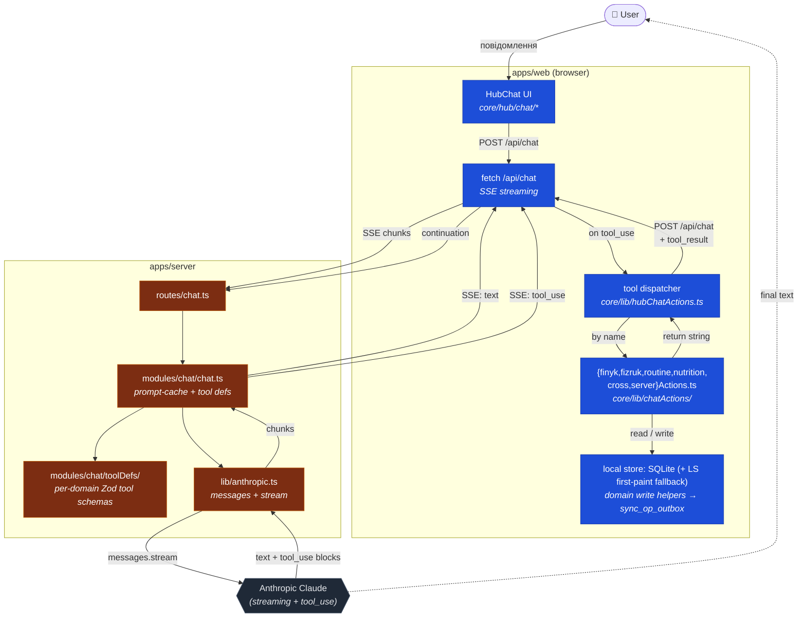

# C3 — HubChat tool-use loop

> **Last touched:** 2026-09-17 by @claude (localStorage → SQLite + `sync_op_outbox`, CloudSync v1 → Sync v2). **Next review:** 2026-12-16.
> **Status:** Active

Як працює tool-use цикл всередині однієї chat-сесії. HubChat — це AI-помічник, що бачить локальні дані користувача через tool-handlers на клієнті.

> **Зріз сховища оновлено 2026-09-17.** До 2026-07-10 handler-и писали в `localStorage` через `ls`/`lsSet`; відтоді доменні дані живуть у локальному SQLite (web — sqlite-wasm/OPFS), а handler-и пишуть через domain write helper-и (для finyk — `chatActions/finykActions/dualWriteBridge.ts`), які дзеркалять дельту в SQLite і кладуть op у `sync_op_outbox` для `syncEngine`. LS лишається лише first-paint fallback-ом. Вузол `LS` на діаграмі нижче читай як «локальне сховище (SQLite, LS — fallback)».

## Контракт `tool_use` ↔ `tool_result`

1. Сервер віддає `tool_use` блоки в SSE stream. Кожен блок має `id`, `name`, `input`.
2. Клієнт у `core/lib/hubChatActions.ts` дивиться `name` → знаходить handler у `core/lib/chatActions/{finyk,fizruk,routine,nutrition,cross,server}Actions.ts`.
3. Handler виконується синхронно над локальним сховищем: доменні записи йдуть через domain write helper (SQLite + op у `sync_op_outbox`), first-paint-fallback у LS — лише через `ls`/`lsSet` helpers, НЕ raw `localStorage.setItem`. Повертає `string`.
4. Клієнт відправляє новий `POST /api/chat` із `tool_result` блоком (referencing `tool_use.id`). Сервер продовжує stream (наступний прохід Anthropic тепер бачить результат).
5. Цикл повторюється до моменту, коли Anthropic повертає `stop_reason: end_turn` (тільки text).

## Чому handler-и на клієнті, а не на сервері

- Sergeant — **local-first**. Більшість даних (finyk transactions, fizruk sets, routine streaks) живуть у локальному SQLite веб-клієнта.
- Server отримує лише те, що доїхало через Sync v2 op-log (`sync_op_outbox` → `/api/v2/sync/push`); CloudSync v1 знято ([ADR-0047](../../../governance/adr/0047-cloudsync-v1-410-gone.md)). Між пушами сервер не бачить локального стану.
- Перенесення handler-ів на сервер вимагало б реплікації всіх локальних state-ів → суперечить local-first архітектурі.

Як побічний ефект: сервер не виконує жодних мутацій від імені користувача → принципово ускладнює supply-chain атаки на tool-handlers.

## Prompt-каше breakpoints

`apps/server/src/modules/chat/chat.ts` ставить **дві каже-точки** у Anthropic prompt:

1. Перша — на блоці tool definitions (`toolDefs/`) — стабільні, рідко змінюються → max cache hit rate.
2. Друга — на `system` блоці з контекстом користувача (профіль + memory entries).

Кожна зміна формату tool def або system prompt → інвалідує cache → коштує токенів. Перевір cache HIT % через PostHog event `chat.cache_hit_rate`.

## Тестування

- `apps/server/src/modules/chat/chat.test.ts` + `chat.stream.test.ts` — server-side stream parsing, tool_use detection.
- `apps/web/src/core/lib/chatActions/{finyk,fizruk,routine,nutrition,cross}Actions.test.ts` — happy path + error path кожного handler-а.
- Property-based: handler не повинен писати у localStorage поза `ls`/`lsSet` helpers (eslint-rule `no-raw-local-storage`); доменні записи — лише через domain write helper-и (SQLite + outbox).

## Дані-залежності

- Server: tools-defs у `modules/chat/toolDefs/` (per-domain). Будь-яка зміна Zod-схеми тут — це **public API change** з точки зору AI.
- Client: handler-и у `core/lib/chatActions/` (`{finyk,fizruk,routine,nutrition,cross,server}Actions.ts`). Назви функцій матчаться по `tool.name` із def-ів — змінюй обидві сторони в одному PR.
