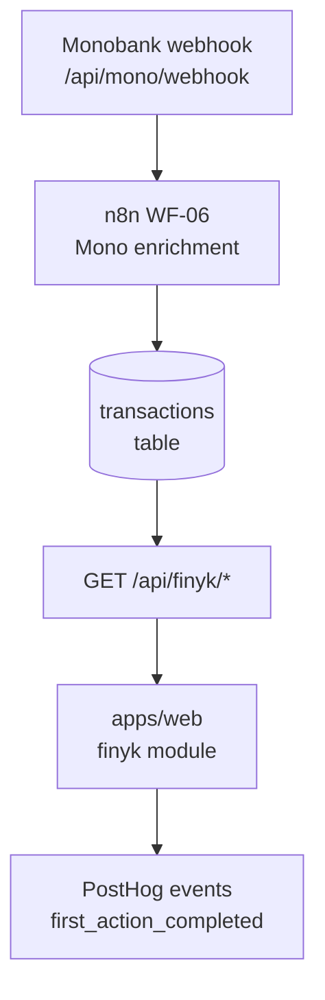

# Walkthrough: `finyk` module

> **Last touched:** 2026-09-17 by @claude (Status → Reference; врізка про застарілість зрізу). **Next review:** 2026-12-16.
> **Status:** Reference
> **Purpose:** Bus-factor knowledge-transfer (stack-pulse PR-04). One-hour guide for an engineer new to this module.

> **Історичний зріз травня 2026 — не інструкція.** Шляхи файлів нижче (`*Router.ts`, `*Service.ts`, `photoAnalyze.ts`, `usdaClient.ts`, `reminderScheduler.ts`, `chatRouter.ts`, `syncRouter.ts`/`syncService.ts` тощо) у дереві не існують — сервер на Express, роути в `apps/server/src/routes/*`, логіка в `apps/server/src/modules/*`. Механізми теж змінились: n8n виведено ([ADR-0090](../../../governance/adr/0090-n8n-decommissioned.md)), CloudSync v1 знято, v1-роути дають `404` ([ADR-0047](../../../governance/adr/0047-cloudsync-v1-410-gone.md)), межа особистої доби — годинник пристрою, не Kyiv ([ADR-0078](../../../governance/adr/0078-day-boundary-device-local.md)). Тіло навмисно не переписувалось (2026-09-17); чинну мапу файлів бери з module-owner скіла `.agents/skills/sergeant-module-<m>/SKILL.md`.

## Architecture diagram

## Top-5 файлів та їх роль

| Файл                                            | Роль                                                           |
| ----------------------------------------------- | -------------------------------------------------------------- |
| `apps/server/src/modules/finyk/finykRouter.ts`  | Hono router — всі `/api/finyk/*` endpoints                     |
| `apps/server/src/modules/finyk/finykService.ts` | Бізнес-логіка: категоризація, агрегація, фільтрація транзакцій |
| `apps/web/src/modules/finyk/`                   | React Query хуки + UI компоненти; ключі в `finykKeys`          |
| `packages/finyk-domain/src/`                    | Shared domain types і чиста логіка (kcal/budget math)          |
| `apps/server/src/modules/finyk/monoWebhook*.ts` | Webhook receiver — парсинг Monobank StatementItem → DB insert  |

## Top-3 gotcha

1. **MCC code → category mapping** — категоризація живе у `finykService.ts`. При додаванні нової категорії треба оновити і mapping table, і Drizzle enum (інакше unknown MCC падають у "other").
2. **`transactions` таблиця має `bigint` id** — при серіалізації завжди `Number(row.id)` (Hard Rule #1). Пропустив — клієнт отримує string, і `===` порівняння ламається.
3. **Моно webhook duplicate-захист** — webhook може прийти двічі (Monobank retry). INSERT використовує `ON CONFLICT (mono_id) DO NOTHING`. Не видаляй цей constraint без тесту.

## Escalation

- Питання по Monobank API: [developers.monobank.ua](https://api.monobank.ua/docs/)
- Runtime issues: `@SkOrDs-02` (поки TBD secondary)
- n8n WF-06 flow: `ops/n8n-workflows/WF-06-*.json`
