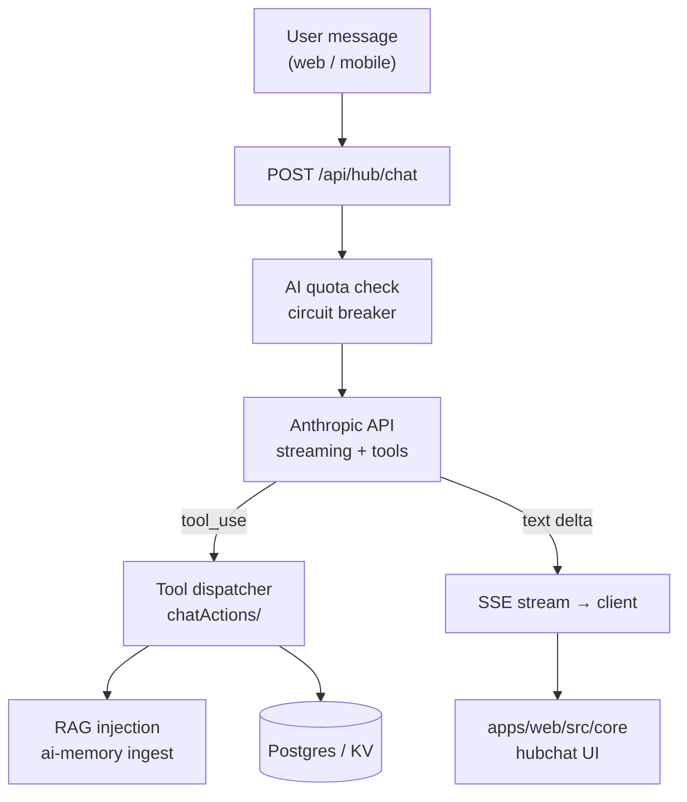

# Walkthrough: `hubchat` module

> **Last touched:** 2026-09-17 by @claude (Status → Reference; врізка про застарілість зрізу). **Next review:** 2026-12-16.
> **Status:** Reference
> **Purpose:** Bus-factor knowledge-transfer (stack-pulse PR-04). One-hour guide for an engineer new to this module.

> **Історичний зріз травня 2026 — не інструкція.** Шляхи файлів нижче (`*Router.ts`, `*Service.ts`, `photoAnalyze.ts`, `usdaClient.ts`, `reminderScheduler.ts`, `chatRouter.ts`, `syncRouter.ts`/`syncService.ts` тощо) у дереві не існують — сервер на Express, роути в `apps/server/src/routes/*`, логіка в `apps/server/src/modules/*`. Механізми теж змінились: n8n виведено ([ADR-0090](../../../governance/adr/0090-n8n-decommissioned.md)), CloudSync v1 знято, v1-роути дають `404` ([ADR-0047](../../../governance/adr/0047-cloudsync-v1-410-gone.md)), межа особистої доби — годинник пристрою, не Kyiv ([ADR-0078](../../../governance/adr/0078-day-boundary-device-local.md)). Тіло навмисно не переписувалось (2026-09-17); чинну мапу файлів бери з module-owner скіла `.agents/skills/sergeant-module-<m>/SKILL.md`.

## Architecture diagram

## Top-5 файлів та їх роль

| Файл                                            | Роль                                                     |
| ----------------------------------------------- | -------------------------------------------------------- |
| `apps/server/src/modules/chat/chatRouter.ts`    | SSE streaming endpoint, quota enforcement                |
| `apps/server/src/modules/chat/toolDefs/`        | Anthropic tool definitions, split per domain             |
| `apps/web/src/core/lib/chatActions/`            | Client-side tool result handlers (повертають `string`)   |
| `apps/server/src/modules/chat/aiQuota.ts`       | Quota ledger + circuit breaker (`aiQuotaCircuitBreaker`) |
| `apps/server/src/modules/chat/aiQuotaHealth.ts` | DB health probe + sliding-window error counter           |

## Top-3 gotcha

1. **Prompt cache policy** — Anthropic дає discount на cached tokens. Структура повідомлень (system block перший, потім user history) чітко задана в `docs/governance/adr/0039-anthropic-prompt-cache-policy.md`. Не переставляй блоки без розуміння кешування.
2. **Circuit breaker fail-closed** — якщо DB quota-table недоступна, `aiQuota` повертає `null` (не пускає запит). Це свідоме рішення (ADR). Не змінюй на fail-open без review.
3. **Tool result — тільки `string`** — Anthropic очікує `tool_result.content: string`. Клієнтські handlers у `chatActions/` МУСЯТЬ повертати string (JSON.stringify якщо потрібно). Тест: happy path + error path для кожного handler.

## Escalation

- Quota + circuit breaker: `apps/server/src/modules/chat/aiQuotaCircuitBreaker.ts`
- Prompt cache: `docs/governance/adr/0039-anthropic-prompt-cache-policy.md`
- Runtime issues: `@SkOrDs-02` (поки TBD secondary)
