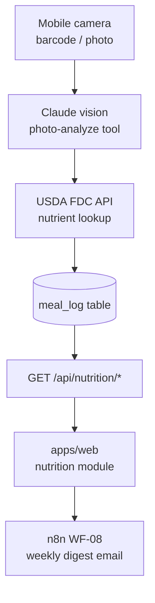

# Walkthrough: `nutrition` module

> **Last touched:** 2026-09-17 by @claude (Status → Reference; врізка про застарілість зрізу). **Next review:** 2026-12-16.
> **Status:** Reference
> **Purpose:** Bus-factor knowledge-transfer (stack-pulse PR-04). One-hour guide for an engineer new to this module.

> **Історичний зріз травня 2026 — не інструкція.** Шляхи файлів нижче (`*Router.ts`, `*Service.ts`, `photoAnalyze.ts`, `usdaClient.ts`, `reminderScheduler.ts`, `chatRouter.ts`, `syncRouter.ts`/`syncService.ts` тощо) у дереві не існують — сервер на Express, роути в `apps/server/src/routes/*`, логіка в `apps/server/src/modules/*`. Механізми теж змінились: n8n виведено ([ADR-0090](../../../governance/adr/0090-n8n-decommissioned.md)), CloudSync v1 знято, v1-роути дають `404` ([ADR-0047](../../../governance/adr/0047-cloudsync-v1-410-gone.md)), межа особистої доби — годинник пристрою, не Kyiv ([ADR-0078](../../../governance/adr/0078-day-boundary-device-local.md)). Тіло навмисно не переписувалось (2026-09-17); чинну мапу файлів бери з module-owner скіла `.agents/skills/sergeant-module-<m>/SKILL.md`.

## Architecture diagram

## Top-5 файлів та їх роль

| Файл                                                   | Роль                                                                 |
| ------------------------------------------------------ | -------------------------------------------------------------------- |
| `apps/server/src/modules/nutrition/nutritionRouter.ts` | Всі `/api/nutrition/*` endpoints                                     |
| `apps/server/src/modules/nutrition/photoAnalyze.ts`    | Claude vision integration: base64 image → structured macros          |
| `apps/server/src/modules/nutrition/usdaClient.ts`      | USDA FDC API клієнт (lookup + cache)                                 |
| `apps/web/src/modules/nutrition/`                      | Web UI: meal logging, barcode scan, nutrient charts; `nutritionKeys` |
| `packages/nutrition-domain/src/`                       | Shared: kcal math, macro targets, `MealEntry` type                   |

## Top-3 gotcha

1. **Barcode scan share cache key з meal-sheet** — `nutritionKeys.barcode(code)` і `nutritionKeys.mealSheet(date)` навмисно розділені. При рефакторингу ключів перевір, що не об'єднав їх — це зламає invalidation.
2. **USDA FDC rate-limit** — API має limit ~1000 req/day на API key. `usdaClient.ts` кешує результати в Postgres. Не обходь кеш у тестах без mock.
3. **Photo-analyze — дорогий Claude call** — `photoAnalyze` відправляє base64 image у Anthropic. Є quota guard. Не викликай в tight loops без перевірки quota.

## Escalation

- USDA FDC docs: [fdc.nal.usda.gov/api-guide](https://fdc.nal.usda.gov/api-guide.html)
- Claude vision: `docs/governance/adr/0039-anthropic-prompt-cache-policy.md`
- Runtime issues: `@SkOrDs-02` (поки TBD secondary)
