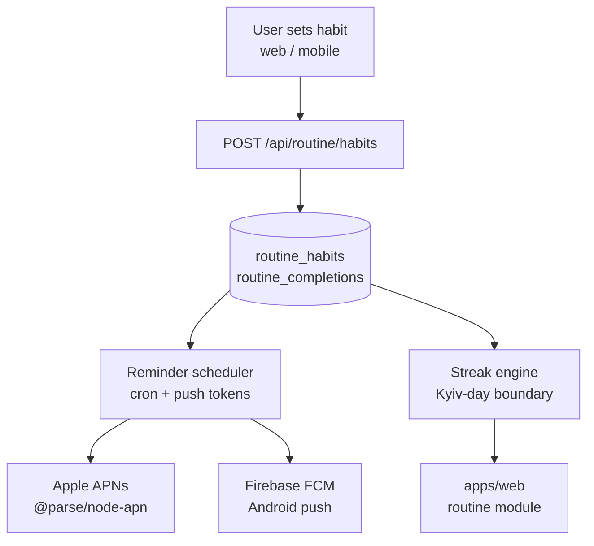

# Walkthrough: `routine` module

> **Last touched:** 2026-09-17 by @claude (Status → Reference; врізка про застарілість зрізу). **Next review:** 2026-12-16.
> **Status:** Reference
> **Purpose:** Bus-factor knowledge-transfer (stack-pulse PR-04). One-hour guide for an engineer new to this module.

> **Історичний зріз травня 2026 — не інструкція.** Шляхи файлів нижче (`*Router.ts`, `*Service.ts`, `photoAnalyze.ts`, `usdaClient.ts`, `reminderScheduler.ts`, `chatRouter.ts`, `syncRouter.ts`/`syncService.ts` тощо) у дереві не існують — сервер на Express, роути в `apps/server/src/routes/*`, логіка в `apps/server/src/modules/*`. Механізми теж змінились: n8n виведено ([ADR-0090](../../../governance/adr/0090-n8n-decommissioned.md)), CloudSync v1 знято, v1-роути дають `404` ([ADR-0047](../../../governance/adr/0047-cloudsync-v1-410-gone.md)), межа особистої доби — годинник пристрою, не Kyiv ([ADR-0078](../../../governance/adr/0078-day-boundary-device-local.md)). Тіло навмисно не переписувалось (2026-09-17); чинну мапу файлів бери з module-owner скіла `.agents/skills/sergeant-module-<m>/SKILL.md`.

## Architecture diagram

## Top-5 файлів та їх роль

| Файл                                                   | Роль                                                   |
| ------------------------------------------------------ | ------------------------------------------------------ |
| `apps/server/src/modules/routine/routineRouter.ts`     | Всі `/api/routine/*` endpoints                         |
| `apps/server/src/modules/routine/reminderScheduler.ts` | Cron job: розраховує які нотифікації треба відіслати   |
| `apps/server/src/push/apnsClient.ts`                   | APNs wrapper (`@parse/node-apn`); JWT-based token auth |
| `apps/web/src/modules/routine/`                        | Habit tracking UI, streak display, local-first state   |
| `packages/routine-domain/src/`                         | Streak math, `HabitEntry` type, day-boundary logic     |

## Top-3 gotcha

1. **Kyiv-day boundary** — streak engine рахує дні у часовому поясі `Europe/Kyiv`. `new Date()` у UTC дасть неправильні результати. Завжди використовуй `toZonedTime(date, 'Europe/Kyiv')` з `date-fns-tz`.
2. **Push token lifecycle** — APNs токени стають invalid при перевстановленні. `apnsClient` обробляє `BadDeviceToken` і видаляє їх з `push_subscriptions`. Не ігноруй цю помилку.
3. **Reminder dedup** — scheduler перевіряє `last_notified_at` перед відправкою. Якщо змінюєш час відправки, переконайся що dedup window оновлено (інакше юзер отримає двічі).

## Escalation

- APNs library decision: `docs/governance/adr/0048-apns-provider-library.md`
- Push notifications architecture: `docs/governance/adr/0019-push-notifications.md`
- Runtime issues: `@SkOrDs-02` (поки TBD secondary)
