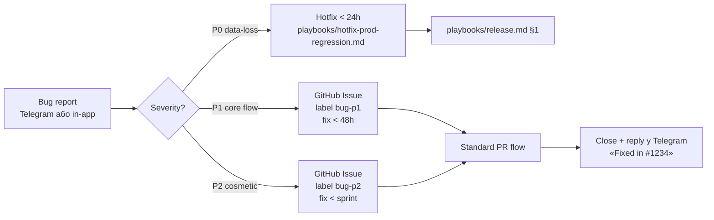

# Phase 1 — Web launch with users

> **Last validated:** 2026-05-13 by Devin (child session, Phase 1 roadmap planning).
> **Next review:** 2026-08-11.
> **Status:** Active — draft roadmap for first user-facing launch фази.

> Цей документ описує **першу з трьох послідовних фаз запуску** Sergeant з реальними юзерами. Phase 1 покриває web-only (PWA на Vercel), 16 тижнів від `W-4` до `W+12`. Phase 2 (Capacitor) і Phase 3 (Native RN) описані в окремих файлах цього піддерева.
>
> **Не дублює** бізнес-стратегію з `business/` і FTUX-delivery з `product-os/` — натомість зшиває їх у тижневий timeline та визначає acceptance gates між під-фазами.
>
> **Cross-refs (canonical sources, які цей doc послідовно посилається):**
>
> - [`business/02-go-to-market.md`](../business/02-go-to-market.md) — фази, growth, контент, виральність
> - [`business/04-launch-readiness.md`](../business/04-launch-readiness.md) — legal, monitoring, NSM, funnel метрики, runbook template
> - [`business/01-monetization-and-pricing.md`](../business/01-monetization-and-pricing.md) — тіри, activation baseline
> - [`business/03-services-and-toolstack.md`](../business/03-services-and-toolstack.md) — стек, бюджет, week-by-week tooling
> - [`product-os/ftux-master-tracker.md`](../product-os/ftux-master-tracker.md) — FTUX SSOT, sprint registry, SLO
> - [`product-os/paywall-implementation-plan.md`](../product-os/paywall-implementation-plan.md) — PR-20 gate, three paths
> - [`architecture/platforms.md`](../../architecture/platforms.md) — web ↔ shell ↔ RN feature-parity
> - [`playbooks/release.md`](../../playbooks/release.md) — canonical release flow
> - [`governance/feature-flags.md`](../../governance/feature-flags.md) — flag conventions
> - [`observability/posthog-ftux-dashboards.md`](../../observability/posthog-ftux-dashboards.md) — funnel dashboards

---

## Зміст

1. [TL;DR + entry/exit criteria фази Web](#1-tldr--entryexit-criteria)
2. [Лендінг decision — 3 опції + рекомендація](#2-лендінг-decision)
3. [Тижневий план (W-4 … W+12)](#3-тижневий-план)
4. [User testing strategy](#4-user-testing-strategy)
5. [Технічні передумови (audit-фідбек)](#5-технічні-передумови)
6. [Метрики успіху](#6-метрики-успіху)
7. [Ризики + mitigation](#7-ризики--mitigation)
8. [Рекомендований tooling](#8-рекомендований-tooling)
9. [Вихідні критерії на Phase 2 (Capacitor)](#9-вихідні-критерії-на-phase-2-capacitor)

---

## 1. TL;DR + entry/exit criteria

### 1.1 TL;DR

Phase 1 — це **16-тижнева кампанія від "web-PWA шипить тільки на staging" до "web-PWA стабільно тримає 500-2000 MAU"**. Розбита на 4 під-фази по логічних acceptance-gate-ах:

| Під-фаза        | Тижні     | Юзери (target)       | Ключова мета                                   | Готовність до payment?  |
| --------------- | --------- | -------------------- | ---------------------------------------------- | ----------------------- |
| **Pre-launch**  | W-4 → W-1 | 0 → 100-300 waitlist | інфра, лендінг, custdev-10, інвайт-лист        | ❌ free-only            |
| **Closed beta** | W0 → W3   | 20 → 50 active       | knowledge transfer, FTUX iter, top-10 bug list | ❌ free-only            |
| **Soft public** | W4 → W7   | 200 → 1500 signups   | sustain organic growth, NPS ≥ 30               | ❌ free-only (waitlist) |
| **Stable**      | W8 → W12  | 1500 → 2000 MAU      | retention discipline, exit-gate до Capacitor   | ⚠️ paywall-stub OK      |

> **Запуск як free.** Paywall PR-20 свідомо відкладений (див. [`paywall-implementation-plan.md` Path C](../product-os/paywall-implementation-plan.md#23-path-c--defer-pr-20-impl-до-0010-phase-3-merge-рекомендована)). Web-launch — це **discovery + retention experiment**, не revenue experiment. Pricing-сторінка на `/pricing` залишається waitlist-формою (`apps/web/src/core/pricing/WaitlistForm.tsx`) до Phase 2.

### 1.2 Entry criteria — що мусить бути перед W-4

По суті — мінімальний readiness checklist щоб взагалі починати pre-launch:

- [x] **Web app деплоїться на Vercel** з `apps/web` → `apps/server/dist/` (unified-mode). Підтверджено в `apps/web/README.md` (production-ready stack).
- [x] **Backend стабільно тримає Railway** + Postgres 16, міграції gated через `pnpm db:migrate`.
- [x] **Auth working end-to-end:** Better Auth cookie-сесії, sign-up, sign-in, password reset на `/reset-password` (`apps/web/src/core/auth/`).
- [x] **FTUX funnel працює:** 8 канонічних подій у PostHog (`onboarding_started → … → celebration_shown`); див. [`posthog-ftux-dashboards.md` §2](../../observability/posthog-ftux-dashboards.md).
- [x] **Sentry alerts активні** для error-rate, unhandled exceptions.
- [x] **Vercel preview-per-PR + production-on-merge-to-main** живий, CI зеленіє з `pnpm check` matrix.
- [ ] **Domain `sergeant.com.ua` зареєстрований** і вказує на Vercel apex (status TBD — open question).
- [ ] **Privacy Policy + ToS stub-и** є у `/legal` (можна Termly draft); blockers до public launch — див. [`04-launch-readiness.md` §1.1](../business/04-launch-readiness.md#1-юридичне-та-compliance).
- [ ] **Telegram-канал «Sergeant 🎖️»** створений; bot для підписки.
- [ ] **Founder написав bullet-список того, які 10 фіч web-стеку він вважає shippable** (а не «майже готово»).

### 1.3 Exit criteria — що мусить бути перед переходом на Phase 2

Див. [§9 нижче](#9-вихідні-критерії-на-phase-2-capacitor) — 7 gates.

### 1.4 Як читати цей doc

- **§2 — лендінг decision:** одноразове рішення; впливає на W-4 / W-3.
- **§3 — тижневий план:** core timeline, переглядай щотижня, відмічай completed actions у gantt-стилі.
- **§4-§8:** довідкові розділи; читай при питанні «як саме рекрутувати», «які метрики», «який tool».
- **§9 — exit-gates:** **не міняй** під час фази; зміна = renegotiation з parent-планом (Phase 2 сесія).

---

## 2. Лендінг decision

### 2.1 Контекст

План з [`02-go-to-market.md §2.2`](../business/02-go-to-market.md#22-landing-page) вже пропонує:

```
sergeant.com.ua                → Landing page (маркетинг)
app.sergeant.com.ua            → PWA-додаток
sergeant.com.ua/blog           → SEO-блог (Astro SSG)
```

Але web-app **уже** має `/welcome` route (`apps/web/src/core/app/WelcomeScreen.tsx` + `appPaths.ts` `WELCOME_PATH = "/welcome"`) з populated-hub peek і splash-карткою — це ефективно "м'який лендінг" всередині PWA. Питання: **чи варто витрачати тиждень на окремий лендінг прямо зараз, чи відкласти до Soft public?**

### 2.2 Три опції

#### Опція A — окремий sergeant.com.ua (Astro / Framer)

Повноцінний static site на окремому домені, поруч `app.sergeant.com.ua` для PWA.

|                           | A                                                                                         |
| ------------------------- | ----------------------------------------------------------------------------------------- |
| **Час до live**           | 7-10 днів (Astro template + контент + Vercel + DNS)                                       |
| **Кошти**                 | Vercel free + домен ~$15/рік                                                              |
| **SEO**                   | ⭐⭐⭐⭐⭐ static HTML, OG cards, blog-ready                                              |
| **Performance**           | ⭐⭐⭐⭐⭐ < 1s LCP, ~30 kB total                                                         |
| **Marketing flexibility** | ⭐⭐⭐⭐⭐ pricing-table, testimonials, video, FAQ — все без re-build PWA                 |
| **Maintenance overhead**  | ⭐⭐ окремий repo або окрема workspace, окремі deploy, окремий PostHog project            |
| **DNS / cookies**         | складніше: `sergeant.com.ua` для cookies signup-flow, `app.sergeant.com.ua` — auth domain |

#### Опція B — monolith: public landing route на тому ж домені

Залишити все в `apps/web`, додати окремий public route (e.g. `/`) який рендерить marketing-сторінку до signup. Чим хоч `/welcome` поточний є саме цим.

|                           | B                                                                                                            |
| ------------------------- | ------------------------------------------------------------------------------------------------------------ |
| **Час до live**           | 3-5 днів (один PR-серія, копірайт + img-assets)                                                              |
| **Кошти**                 | $0 (вже Vercel)                                                                                              |
| **SEO**                   | ⭐⭐⭐ SPA з SSR-pre-render через Vite SSG плагін — недосконало для SEO                                      |
| **Performance**           | ⭐⭐ підтягуємо React-bundle для landing-сторінки (~365 kB eager, див. `apps/web/AGENTS.md` § Bundle budget) |
| **Marketing flexibility** | ⭐⭐ кожне оновлення pricing = web PR + deploy + bump bundle size                                            |
| **Maintenance overhead**  | ⭐⭐⭐⭐ один codebase, один deploy, один PostHog project                                                    |
| **DNS / cookies**         | просто: `sergeant.com.ua` = app                                                                              |

#### Опція C — гібрид: швидкий MVP-лендінг зараз, повноцінний сайт пізніше

Запустити **одно-сторінкову Astro-сторінку** на `sergeant.com.ua` (3 секції: hero, value-prop, waitlist), а `app.sergeant.com.ua` залишити PWA з поточним `/welcome` як FTUX. Через 3-4 місяці (Phase 2) — розширити одно-сторінку в повноцінний marketing site з blog/pricing/customer-stories.

|                           | C                                                                                         |
| ------------------------- | ----------------------------------------------------------------------------------------- |
| **Час до live**           | 2-3 дні (Astro starter, hero + waitlist form + 2-3 секції)                                |
| **Кошти**                 | ~$15/рік (домен) + Vercel free                                                            |
| **SEO**                   | ⭐⭐⭐⭐ static HTML, але початково один URL — повний SEO потенціал розкриється у Phase 2 |
| **Performance**           | ⭐⭐⭐⭐⭐ Astro = майже HTML-only                                                        |
| **Marketing flexibility** | ⭐⭐⭐⭐ можна шипити marketing-копі без torchування PWA                                  |
| **Maintenance overhead**  | ⭐⭐⭐ окремий micro-repo або subfolder `apps/landing/` під turborepo                     |
| **DNS / cookies**         | clean separation: marketing на apex, app — на subdomain                                   |

### 2.3 Рекомендація — Опція C

**Чому C, а не A:**

1. **Solo founder.** A вимагає 7-10 днів повноцінного marketing-сайту — це тиждень коли не пишеш FTUX-фікси, не робиш custdev. C вимагає 2-3 дні і покриває те ж 80% потреби (hero + value-prop + email-capture).
2. **Waitlist уже працює.** `apps/web/src/core/pricing/WaitlistForm.tsx` + `waitlistApi` готові, тільки треба показати їх з marketing-обгорткою. Це не нова інфра — це shim.
3. **SEO у W-4..W0 — пустий.** Перший трафік піде з Telegram/Twitter/DOU.ua — там перший клік приземляє на pre-rendered HTML з OG-card, повноцінний blog/landing-keyword-стек не критичний до W+8.
4. **Domain separation дешево купити зараз, дорого змінити пізніше.** `sergeant.com.ua` (marketing) + `app.sergeant.com.ua` (PWA) — стандартний pattern, відмова від нього у W-4 змусить migration у W+12.

**Чому C, а не B:**

1. **Performance regression.** Поточний eager bundle web-app ~365 kB (див. `apps/web/AGENTS.md` § Bundle budget). Додавання marketing-копі + img-assets піднімає LCP на static landing-сторінку на 200-400 ms — це гірший first-impression для холодного відвідувача.
2. **Маркетинг ≠ продукт.** Marketing-копі змінюється щотижня (A/B-тести headline, social proof, ціни). У `apps/web` це означає PR + CI + size-limit gate + Lighthouse — повільно. На Astro — push → live за 30 секунд.
3. **OG cards.** `@vercel/og` (Satori) інтегрується тривіально на Astro, у поточному `apps/web` потребує окремого edge handler.

### 2.4 Мінімальний MVP-варіант Опції C (W-4 / W-3)

Структура `sergeant.com.ua` — **одна сторінка**, 5 секцій. Реалізація — Astro starter + 1 author-component, deploy на Vercel:

```
┌─ Hero (h1, sub-headline, CTA → email capture) ─┐
│  «Гроші, тіло, звички, їжа — в одному додатку. │
│   Local-first. Приватно.»                       │
│   [Email] → [Залишити заявку]                    │
│   [Спробувати демо →] (link to app.../welcome?demo=1)│
└────────────────────────────────────────────────┘

┌─ Value-prop (4 модулі grid) ──────────────────┐
│  💰 Фінік │ 🏋️ Фізрук │ ✅ Рутина │ 🍽 Харчування │
│  + AI-коуч що бачить весь твій день.           │
└─────────────────────────────────────────────────┘

┌─ How it works (3 кроки) ──────────────────────┐
│  1. Підключи Mono → авто-категорізація          │
│  2. Логуй тренування + їжу одним натиском       │
│  3. AI пише: "Сержанте, що мені порадиш?"       │
└────────────────────────────────────────────────┘

┌─ Trust signals ───────────────────────────────┐
│  🇺🇦 Зроблений в Україні                        │
│  🔒 Дані — на твоєму пристрої                   │
│  📴 Працює офлайн                               │
└────────────────────────────────────────────────┘

┌─ Final CTA ───────────────────────────────────┐
│  [Email] → [Залишити заявку → побачиш першим]    │
│  Уже маєш інвайт? [Увійти →] (link to app.../sign-in)│
└────────────────────────────────────────────────┘
```

**Stack:**

- Astro 4.x (mid-2025 stable), `astro-tailwind`, Vercel adapter.
- Email-capture POST → existing `apps/server` `POST /api/waitlist` (вже існує per `waitlistApi`).
- PostHog `$autocapture` для click-funnel-метрик.
- OG cards: один статичний `og.png` (1200×630), згенерований у Figma/Canva.

**Action items на W-4 / W-3** — список конкретних tasks включений у §3 нижче.

---

## 3. Тижневий план

Кожен тиждень має: **(a) що відбувається, (b) target user count, (c) acceptance gate перед переходом**. Не пропускай acceptance gate — якщо метрика не досягнута, **повторюй тиждень**, не йди далі.

### 3.1 Pre-launch (W-4 → W-1)

Готуємо все для closed beta. Бачимо waitlist 100-300 людей до Day 0.

#### W-4 — Інфра + лендінг foundation

**Goals:** запустити marketing-landing live, отримати domain, ввімкнути Telegram-канал.

**Concrete actions:**

- [ ] **Купити `sergeant.com.ua`** (~₴500/рік через Imena.ua або UA-DNS). Налаштувати DNS на Vercel.
- [ ] **Створити Astro starter:** `pnpm create astro@latest apps/landing` у monorepo (або окремий repo). Заходимо на 5 секцій з §2.4.
- [ ] **Deploy на Vercel:** apex `sergeant.com.ua` → landing; subdomain `app.sergeant.com.ua` → existing apps/web. Тест: SSL працює, OG cards рендеряться.
- [ ] **PostHog проект для landing:** окремий project (`landing prod`) або підключити до існуючого `Default project` (167740) — обираємо існуючий для уніфікації funnel.
- [ ] **`waitlistApi` connection test:** POST з лендінгу → запис у БД. Через 5 тестових сабмітів — переконатися, що email приходить у admin-вьюху.
- [ ] **Telegram-канал «Sergeant 🎖️»:** створити, налаштувати pinned-message про waitlist, додати join-link на лендінг.
- [ ] **Telegram-бот для subscribe:** не критично у W-4, можна перенести на W-3.

**Acceptance gate:**

- `sergeant.com.ua` live, повертає 200, OG-share у Telegram рендерить нормально.
- Waitlist form приймає сабміт, запис зявляється у БД, founder отримує admin-email-нотифікацію.
- Telegram-канал live, перший pinned-пост опубліковано.

**Target users:** 0 active (тільки founder + 1-2 близьких).

#### W-3 — Custdev + перші waitlist-сигнали

**Goals:** 10 custdev-інтервʼю + 50 waitlist-підписників.

**Concrete actions:**

- [ ] **Custdev recruitment:** 10 особистих контактів у Telegram-DM («можеш приділити 30 хв розмови про твою рутину фінанси/фітнес?»). Calendly slot 30 min.
- [ ] **Custdev script:** 5 запитань, 25 хв розмови, 5 хв запис висновків. Шаблон скрипту — у [`02-go-to-market.md §2.4`](../business/02-go-to-market.md#24-збір-фідбеку).
- [ ] **Перший build-in-public пост:** Twitter/X (англ., якщо аудиторія dev) або Threads/Telegram (укр., якщо UA-аудиторія). Тема: «Запускаю Sergeant — 16-тижневий план. Прозоро. Підписуйся: sergeant.com.ua».
- [ ] **Опитування «Які модулі найважливіші?»:** Tally form, шеру у двох-трьох українських productivity/fitness Telegram-чатах.
- [ ] **Founder's story для DOU.ua:** drafting почати; публікація — W-2.
- [ ] **Запуск founder-pulse у PostHog:** [`docs/observability/posthog-founder-pulse.md`](../../observability/posthog-founder-pulse.md) — щоденний digest «новий signup / нова сесія / новий error».

**Acceptance gate:**

- Custdev: 10 інтервʼю проведено, нотатки сирі є.
- Waitlist: ≥ 50 email-ів.
- Founder-pulse дашборд: «зеленіє щодня» (хоча б 1 unique visitor на лендінгу).

**Target users:** 0 active, 50 waitlist.

#### W-2 — Founder's story + перший зовнішній пуш

**Goals:** опублікувати DOU-стаття, отримати перший потік waitlist (target +100-200).

**Concrete actions:**

- [ ] **DOU.ua publication:** «Як я будую all-in-one life tracker — 16-тижневий timeline». Шаблон — у [`02-go-to-market.md §4.3`](../business/02-go-to-market.md#43-douua--ainua--founders-story-template).
- [ ] **Mirror на AIN.ua** (коротша версія, 600-800 слів) і Threads UA (короткий thread із 5 постів).
- [ ] **Email-collection sanity:** очистити dedupe-логіку у waitlist (один email = один запис), додати `WAITLIST_SUBMITTED` PostHog event tracking (вже в `WaitlistForm.tsx`).
- [ ] **Custdev інтервʼю +5:** добивати total 15-20 інтервʼю до Day 0.
- [ ] **Зведення custdev нотаток у документ:** «10 patterns we heard» — це стане базою для FTUX iter у W0-W3.

**Acceptance gate:**

- DOU/AIN/Threads опубліковано, перший trafic-spike зафіксований у PostHog (≥ 500 unique visitors на лендінгу за 7 днів).
- Waitlist: ≥ 150 email-ів.
- Custdev: 15-20 інтервʼю, агрегований документ є.

**Target users:** 0 active, 150 waitlist.

#### W-1 — Інвайт-лист + dry-run

**Goals:** зібрати 20-50 перших інвайт-кандидатів, провести full dry-run web-стеку.

**Concrete actions:**

- [ ] **Інвайт-лист:** з 150+ waitlist обираємо 20-50 за критеріями: (a) UA-аудиторія, (b) відповіли в опитуванні «активно використовую 2+ tracker-додатки», (c) готові спілкуватись у Telegram-групі.
- [ ] **Email-template «Ласкаво просимо у Sergeant Beta»:** Loops або Resend. Включає invite-link з `?ref=beta_w0` для PostHog source tracking.
- [ ] **Telegram-група «Sergeant Beta»:** приватна, інвайти лише з email-листа. Mini-rule «один пост — один bug-report АБО одна ідея».
- [ ] **In-app feedback widget:** мінімум — посилання "Знайшов баг? Ідея?" → Telegram-bot. Більш повний варіант — Sentry user-feedback widget (вже в стеці).
- [ ] **Bug-tracking templates:** GitHub Issue template `bug-from-beta.md` з полями: device, OS, browser, кроки, screenshot.
- [ ] **Dry-run launch day:** запустити демо-юзера-від-нуля у Chrome incognito + mobile-Chrome. Прогнати критичний flow: signup → Welcome → перший модуль → перший запис. Фіксувати кожен bug.
- [ ] **Privacy Policy stub:** Termly draft, опублікувати на `sergeant.com.ua/privacy` (не commit-блокер, але mando до closed beta — health data).
- [ ] **Сповістити founder-pulse Telegram alert channel:** додати alert на «signup spike > 10/hour» (закрита бета не повинна мати спайків — це signal помилкового сценарію).

**Acceptance gate:**

- 20-50 інвайтів готові до відправки.
- Dry-run без P0/P1 bugs (P2 ОК).
- Privacy Policy stub live на `sergeant.com.ua/privacy`.
- Telegram-група і bug-template готові.

**Target users:** 0 active, 200-300 waitlist, 20-50 у інвайт-листі.

### 3.2 Closed beta (W0 → W3)

Moment of truth: реальні юзери торкаються продукту.

#### W0 — Send invites + observe

**Goals:** відіслати 20-50 інвайтів, побачити перші 5-10 signups + activations.

**Concrete actions:**

- [ ] **Send-day:** 20-50 інвайт-листів через Loops/Resend у W0 day 1, hour 10:00 Київ (working hours).
- [ ] **Telegram welcome message:** при першому signup юзер отримує DM у Telegram (через bot) — «Вітаю! Дякую за бету. Чекаю на твій перший фідбек у групі».
- [ ] **Observe PostHog FTUX funnel:** дашборд [`FTUX overview`](https://eu.posthog.com/project/167740/dashboard/660031) — стежимо за 8-step funnel. Target: ≥ 30% з signup → first_real_entry за 24 години.
- [ ] **Daily standup з самим собою:** 15 хв ранкова саморевʼю — «що зламалось вчора, що пофіксити сьогодні».
- [ ] **Bug triage cadence:** усі bug-reports з Telegram-групи перенесено у GitHub Issues протягом 4 годин. Severity-label: `bug-p0` (data loss, login broken), `bug-p1` (core flow broken), `bug-p2` (cosmetic).
- [ ] **Hotfix cadence:** P0 — fix у день, P1 — fix у 48 годин, P2 — у спрінт.
- [ ] **Метрика: «Wizard → first_real_entry conversion»** (FTUX SLO target ≥ 30%; див. [`ftux-master-tracker.md` §1](../product-os/ftux-master-tracker.md#1-tldr)).

**Acceptance gate:**

- ≥ 10 з 20-50 інвайт-кандидатів зробили signup.
- ≥ 5 з signupers досягли `first_real_entry` (заповнили один модуль реальними даними).
- Жоден P0-bug не відкритий > 24 годин.

**Target users:** 10-20 active.

#### W1 — Custdev-у-зворотньому-напрямку (post-use)

**Goals:** провести 5-7 custdev-розмов з юзерами, які вже скористались, агрегувати top-5 friction points.

**Concrete actions:**

- [ ] **Calendly invite до 10 з активних бетерів:** «30 хв розмови — поділись враженням». 50% no-show OK, цільові 5-7 розмов.
- [ ] **Session recording через PostHog:** включити для всіх бетерів (вже opt-in через consent). Дивитись recording найактивніших sesions ~10 хв сесій.
- [ ] **Top-5 friction list:** після W1 day 5 — публікувати у Telegram-групу «Ось 5 проблем, які ми побачили. Дякуємо. Ось як ми це фіксимо».
- [ ] **First weekly digest email:** «Що ми зробили цього тижня за вашим фідбеком».
- [ ] **NPS pulse:** після D7 — відправити NPS-форму (Tally), мінімум 1 запитання «Чи рекомендуєш Sergeant другу? 0-10».

**Acceptance gate:**

- 5-7 custdev-розмов з бетерами проведені, top-5 friction list публічно в Telegram-групі.
- Перший weekly digest email відправлено.
- D7 retention (від W0 cohort) ≥ 20% (поріг go/no-go з [`04-launch-readiness.md` §4.2](../business/04-launch-readiness.md#42-funnel-метрики)).

**Target users:** 15-30 active.

#### W2 — Fix top-5 + invite +10

**Goals:** виправити top-3 з friction list, додати ще 10 інвайтів.

**Concrete actions:**

- [ ] **Top-3 fix-PRs:** беремо 3 найбільш гострі friction points з W1, шипимо PR-и через стандартний release-flow ([`playbooks/release.md` §1`](../../playbooks/release.md#1-web--api)).
- [ ] **Invite wave +10:** взяти наступних 10 з waitlist (тих, хто не отримав інвайт у W-1).
- [ ] **Feedback loop close:** у Telegram-групі «Ось що ми виправили — спробуй ще раз». Це створює exclusivity + word-of-mouth.
- [ ] **First PostHog cohort analysis:** який модуль найчастіше — first_real_entry? Чи є кореляція з retention?
- [ ] **Sentry triage:** перевірити що error-rate < 1% від total sessions.

**Acceptance gate:**

- Top-3 friction fixed, валідовано у session recordings.
- +10 нових signups з друкої хвилі.
- Sentry error-rate ≤ 1%.
- WAU (від W0 cohort + W2 wave): 20-30.

**Target users:** 25-40 active.

#### W3 — Decision week: scale або iterate

**Goals:** прийняти рішення «йдемо у W4 soft public» чи «повторюємо closed beta ще 2 тижні».

**Concrete actions:**

- [ ] **Beta retrospective:** довідка по 4 тижням — що працює, що не працює, NPS, D7 retention, top-5 фідбек-tем.
- [ ] **Activation rate calc:** users-who-did-2plus-modules-in-3d / signups. Target ≥ 40% (з [`04-launch-readiness.md` §4.2`](../business/04-launch-readiness.md#42-funnel-метрики)).
- [ ] **Go/no-go decision:** записати у `docs/launch/phases/01-web-launch-with-users.md` §3.2 (постфактум).
- [ ] **Якщо GO:** підготувати open-signup wave (W4 plan, див. §3.3).
- [ ] **Якщо NO-GO:** написати «retro V1 — чому ми ще не готові», переробити FTUX, повторити W2-W3.

**Acceptance gate (для переходу на soft public):**

- D7 retention ≥ 20% (від bottom 50% of beta cohort).
- NPS ≥ 30 (10+ відповідей).
- Activation rate ≥ 25%.
- 0 open P0-bugs.
- Sentry error-rate ≤ 1%.
- WAU ≥ 30.
- Founder feels: «я можу спокійно лягти спати під час open signup».

**Target users:** 30-50 active.

### 3.3 Soft public launch (W4 → W7)

Відкриваємо signup. Очікуємо traffic-spike з public-каналів.

#### W4 — Open signup + Product Hunt prep

**Goals:** дозволити open signup на `app.sergeant.com.ua/sign-up`, почати готувати Product Hunt launch на W6.

**Concrete actions:**

- [ ] **Flip feature flag:** `feature.invite_only_signup` → off. Open signup live.
- [ ] **Push update на лендінг:** замінити «Залишити заявку» на «Спробувати безкоштовно зараз». Email-collection лишається як fallback.
- [ ] **Public Telegram-канал live:** publish 3 posts: (a) «Beta closed, public live», (b) screenshots/demo з beta-користувачів, (c) AMA-thread.
- [ ] **Product Hunt assets prep:** demo-video 90-120 сек (OBS Studio), 5 screenshots, headline-формула з [`02-go-to-market.md §4.1`](../business/02-go-to-market.md#41-product-hunt-playbook).
- [ ] **Privacy Policy + ToS full versions:** перевести stub-и у production-ready (потребує юриста або Termly Pro ~$10/міс).
- [ ] **Activation/retention dashboards:** перейти з "beta cohort" на "all-time cohort" у PostHog.

**Acceptance gate:**

- Open signup live, перший public signup зафіксовано в PostHog.
- Privacy Policy + ToS опубліковані на `sergeant.com.ua/privacy` і `sergeant.com.ua/terms`.
- Product Hunt draft з assets готовий (заплановано publish на W6).

**Target users:** 50-150 signups, 30-60 active.

#### W5 — DOU/Threads boost + community-led growth

**Goals:** опублікувати follow-up DOU-стаття «3 місяці тому я написав про Sergeant — ось що сталось», розгалуження UA-каналів.

**Concrete actions:**

- [ ] **DOU follow-up article:** «Що ми побачили у 50 бета-юзерів — 10 patterns для UA-life-tracking». Реальні цифри з PostHog.
- [ ] **Threads UA серія постів:** 5 постів по 1 patterns кожен.
- [ ] **UA-Telegram outreach:** написати у 5 каналах з [`02-go-to-market.md §4.2`](../business/02-go-to-market.md#42-українські-канали) (@startupukraine, @ain_ua, @productivity_ua, @digitalnomad_ua, @groshi_ua). Бартер: Pro-account за 1 пост.
- [ ] **Telegram-спільнота growth:** запустити перший weekly digest у канал «Sergeant Community».
- [ ] **Share cards generation:** активувати workout-complete + streak-share для виральних петель (див. [`02-go-to-market.md §5.4`](../business/02-go-to-market.md#54-вірусні-петлі-viral-loops)).

**Acceptance gate:**

- DOU follow-up опубліковано, > 1000 unique reads.
- ≥ 2 UA-Telegram канали публікують про Sergeant.
- Share cards live для 2+ модулів.
- WAU: 80-150.

**Target users:** 150-400 signups, 80-150 active.

#### W6 — Product Hunt launch

**Goals:** запустити на Product Hunt, отримати top-10 of the day.

**Concrete actions:**

- [ ] **PH launch day:** publish о 00:01 PST (10:01 Київ). Сценарій з [`02-go-to-market.md §4.1`](../business/02-go-to-market.md#41-product-hunt-playbook).
- [ ] **First maker comment:** template з §4.1 — «Привіт, Product Hunt! Я [Ім'я], засновник Sergeant…».
- [ ] **Outreach 20+ supporters:** написати DM на LinkedIn/Twitter за 3 дні до launch.
- [ ] **Monitor + respond:** перші 12 годин — відповідь на кожен коментар протягом 1 години.
- [ ] **Sentry / PostHog on alert:** ozhydaemo signup-spike 5-10x normal — backend і API мають витримати. Якщо traffic перевищує Railway free-tier — instant upgrade.
- [ ] **Status page update:** [Instatus](https://instatus.com/) показує "Operational" протягом всього launch day.

**Acceptance gate:**

- ≥ 50 upvotes (мінімум для top-10 у category).
- Sentry error-rate ≤ 2% протягом launch day.
- 0 P0-incidents.
- WAU after launch day: 150-300.

**Target users:** 400-800 signups, 150-300 active.

#### W7 — Post-PH stabilization + feedback wave

**Goals:** заспокоїти trafic-spike, проаналізувати retention, провести +5 custdev-розмов з public-юзерами.

**Concrete actions:**

- [ ] **Public retro у Telegram-канал:** «Що сталось після Product Hunt — цифри + висновки».
- [ ] **+5 custdev з public-юзерів:** Calendly invite до 10 найактивніших — 30 хв розмови. Цільові 5.
- [ ] **PostHog cohort analysis:** Compare PH-cohort vs Telegram-cohort vs Beta-cohort. Який канал дає кращий activation/retention?
- [ ] **Performance audit:** Lighthouse manual run, перевірити LCP/FCP. Якщо є regression — створити tech-debt PR.
- [ ] **NPS pulse #2:** виміряти серед PH-cohort.
- [ ] **Decision: чи готові до Stable phase?** (Acceptance gate нижче.)

**Acceptance gate (для переходу на Stable):**

- D7 retention ≥ 15% (public cohort).
- D30 retention ≥ 8%.
- NPS ≥ 25.
- Signup-rate stabilized (не падає різко після PH spike).
- WAU ≥ 200.
- Sentry error-rate ≤ 2% sustained over 7 days.

**Target users:** 800-1500 signups, 200-400 active.

### 3.4 Stable (W8 → W12)

Закріплюємо retention. Готуємо exit-gates для Phase 2 (Capacitor).

#### W8 — Retention focus

**Goals:** покращити D7/D30 retention на 5pp.

**Concrete actions:**

- [ ] **Push notification campaign:** «Ти не логував їжу 3 дні — додай швидко?». Один проактивний push на тиждень, не більше. Strategy doc → [`04-launch-readiness.md` §3.1](../business/04-launch-readiness.md#31-ops-checklist).
- [ ] **Email re-engagement:** Loops automation — D7 dormant юзери отримують email «Що ти зробив за тиждень».
- [ ] **Cohort analysis:** яка фіча best-correlated з D30 retention? (Найкраща fitness streak? Mono-sync? AI-чат?). Інвестуй у цю фічу.
- [ ] **Quick wins у FTUX:** взяти top-3 з friction list, шипити PR-и.

**Acceptance gate:** D7 retention ↑ ≥ 2pp.

**Target users:** 1000-1500 signups, 250-500 active.

#### W9-W10 — Виральні петлі live

**Goals:** активувати share cards для всіх 4 модулів, перший referral-flow ship.

**Concrete actions:**

- [ ] **Share cards для Routine/Fizruk:** «14-денний стрік», «Workout complete: 45 хв, 12 вправ».
- [ ] **Share cards для Finyk/Nutrition:** «Зекономив ₴2400 цього місяця» (анонімізовано), «7 днів < 2000 kcal».
- [ ] **Referral system v1:** мінімальний — unique code per user, +1 тиждень Pro у майбутньому за реферала. Спрощений варіант з [`02-go-to-market.md §5.2`](../business/02-go-to-market.md#52-реферальна-програма).
- [ ] **Viral coefficient measurement:** PostHog custom event `share_card_generated` + `share_card_clicked`.

**Acceptance gate:** viral coefficient ≥ 0.05 (тобто кожен 20-й юзер приводить нового).

**Target users:** 1500-1800 signups, 400-600 active.

#### W11-W12 — Exit-gates prep + Phase 2 planning

**Goals:** валідація exit-criteria для Phase 2 (Capacitor), бриф для Phase 2 сесії.

**Concrete actions:**

- [ ] **Exit-gates audit (див. §9):** проганяємо checkliste, фіксуємо що так/ні.
- [ ] **Phase 1 retrospective document:** агрегований doc «Що ми дізнались за 12 тижнів».
- [ ] **Phase 2 entry brief:** короткий brief (1-2 сторінки) для Capacitor-фази: що працює на web, що потрібно перенести, які трейдоффи.
- [ ] **Performance baseline:** Lighthouse + bundle size — фіксуємо для регрессій у Phase 2.
- [ ] **Paywall scaffolding (optional):** якщо 0010 phase 3 готова, шипимо PR-20a (FF + PostHog events scaffolding) — це підготовка, не paywall live.

**Acceptance gate:** усі 7 gates з §9 → ✅ або chcuмніше документувати, чому делеговано до Phase 2.

**Target users:** 1500-2000 signups, 500-800 active.

---

## 4. User testing strategy

### 4.1 Як рекрутувати тестерів

| Канал                                | Розмір вибірки | Як                                    | Cost | Якість фідбеку                |
| ------------------------------------ | -------------- | ------------------------------------- | ---- | ----------------------------- |
| **Особисті контакти**                | 10-20          | DM, Calendly link                     | ₴0   | ⭐⭐⭐⭐⭐ глибокий, але bias |
| **Telegram-канал «Sergeant»**        | 50-200         | Pinned post «Шукаю beta-тестерів»     | ₴0   | ⭐⭐⭐⭐ self-selected        |
| **Twitter/X build-in-public**        | 20-100         | Tweet з invite-form                   | ₴0   | ⭐⭐⭐ глобальний, не UA      |
| **DOU.ua коментарі**                 | 50-300         | CTA в статті «Хочеш бету? Email тут»  | ₴0   | ⭐⭐⭐⭐ tech-savvy           |
| **Indie Hackers / Reddit r/ukraine** | 20-100         | Build-in-public пост                  | ₴0   | ⭐⭐ noisy                    |
| **Friends-of-friends**               | 30-50          | Особисті повідомлення «Передай другу» | ₴0   | ⭐⭐⭐⭐⭐ trust-based        |

**Рекомендований mix для closed beta (W-1):**

- 50% з особистих контактів + friends-of-friends (трасть-based, готові давати фідбек)
- 30% з Telegram-каналу (self-selected, активні)
- 20% з DOU/Twitter (tech-savvy, можуть дати глибокий технічний фідбек)

### 4.2 Closed beta process (W0-W3)

**Принципи:**

1. **Інвайт-only**, інвайт-код видається через email-template.
2. **Telegram-група закрита**, додавання тільки після першого signup.
3. **"One bug = one report"** правило у групі — захищає від спаму.
4. **Founder в групі live**, відповідає на коментарі протягом 4 годин.
5. **Sessions recording opt-in** через PostHog consent banner.

**Інвайт-template (email):**

```
Тема: Ласкаво просимо у Sergeant Beta 🎖️

Привіт, [Ім'я]!

Ти у перших 50, які бачать Sergeant до публічного запуску.
Дякую, що погодився протестувати.

Лінк: https://app.sergeant.com.ua/sign-up?invite=BETA_W0_XXX
Код: BETA_W0_XXX (autoматично прикладеться)
Telegram-група: https://t.me/sergeant_beta (приватна, інвайт по email)

Правила:
1. Користуйся щодня хоча б 1 модулем
2. Якщо щось зламано — пиши в групу
3. Якщо щось дратує — пиши в групу
4. Я відповідаю протягом 4 годин

Questions? Reply сюди.
— [Ім'я founder-а]
```

### 4.3 Public soft launch process (W4-W7)

**Принципи:**

1. **Open signup**, але `/welcome` flow agressive (FTUX wizard з 5 кроків, як було).
2. **Telegram-канал public**, beta-група залишається закритою для нових юзерів.
3. **In-app feedback widget** — кнопка «Знайшов баг? Ідея?» у footer чи settings.
4. **NPS-pulse на D7** — 1 запитання, не overwhelm.
5. **PostHog session recording** на ~5% sample rate (privacy + performance).

### 4.4 Feedback loops

| Loop                         | Періодичність                               | Канал                           | Дія                                  |
| ---------------------------- | ------------------------------------------- | ------------------------------- | ------------------------------------ |
| **In-app feedback widget**   | Continuous                                  | Sentry user-feedback або custom | bug/idea → GitHub Issue              |
| **Telegram-група**           | Continuous                                  | Telegram                        | bug/idea → triage в групі            |
| **Custdev sessions**         | Weekly у beta, biweekly у soft public       | Calendly + Google Meet          | 30 хв, 5-7 patterns/тиждень          |
| **NPS pulse**                | D7 від signup                               | Tally form                      | aggregated NPS-score                 |
| **Weekly digest email**      | Weekly                                      | Loops                           | «Що ми зробили цього тижня»          |
| **Session recording review** | Weekly                                      | PostHog                         | дивитись 3-5 sessions, log frictions |
| **Bug triage cadence**       | Daily у beta, every-other-day у soft public | GitHub Issues                   | P0 < 24h, P1 < 48h, P2 < sprint      |

### 4.5 Custdev session script (30 хв)

```
[0-3 хв]   Розрядка: «Привіт! Дякую за час. Як минув твій день?»
[3-10 хв]  Контекст: «Розкажи про свою рутину — як ти зараз треш(ш)
           витрати/тренування/звички/їжу?». Слухай. Не презентуй.
[10-22 хв] Sergeant: «Зайди у /sign-up. Думай вголос. Я не пояснюю».
           ПАУЗА. Дивись де щось не зрозуміло, де frustration.
[22-27 хв] Аutopsy: «Що було незрозуміло? Чого бракує? Що класно?»
[27-30 хв] CTA: «Чи можна мені ще раз через тиждень?» + Telegram-група.
```

Логуй nostalgia: емоції, не цифри. «Frustration на step 3», «excited на demo-mode».

### 4.6 Bug tracking flow



**GitHub Issue templates:**

- `bug-from-beta.md` — фіксовані поля (device, OS, browser, кроки, screenshot, severity).
- `idea-from-beta.md` — фіксовані поля (модуль, проблема, перевідказ, who-it-affects).

---

## 5. Технічні передумови

Цей розділ доповнює [`04-launch-readiness.md`](../business/04-launch-readiness.md) — там canonical checkliste. Тут — **що мусить бути готове перед закритою бетою** і **до публічного запуску**.

### 5.1 Перед closed beta (W-1 → W0)

Ядро — все, без чого юзер не зможе signup і first-action.

- [x] **Auth working end-to-end** (Better Auth, cookie sessions, password reset).
- [x] **PWA install prompt** (PR-07 у FTUX-tracker, landed).
- [x] **FTUX funnel events live у PostHog** (S0.4 closed, 8 канонічних подій).
- [x] **`/welcome` FTUX splash з populated-hub peek** (PR-02 + PR-05 landed).
- [x] **Demo mode як first-class CTA** (`/welcome?demo=1`, PR-05).
- [x] **Sentry alerts активні** (error-rate, unhandled exceptions).
- [x] **Vercel preview-per-PR + production deploy-on-merge** працює.
- [x] **Railway backend + Postgres** з instant rollback опцією.
- [x] **DB backup verification** — раз перевірити що backup відновлюється.
- [ ] **Status page** на `sergeant.com.ua/status` (вже є `/status` route у webapp — переконатись що live).
- [ ] **In-app feedback widget** (мінімум Sentry user-feedback або link на Telegram-bot).
- [ ] **Privacy Policy stub** на `sergeant.com.ua/privacy`.
- [ ] **Telegram alert channel** для on-call (founder отримує push при P0).
- [ ] **Feature flag `feature.invite_only_signup`** додати у `apps/web/src/core/lib/featureFlags.ts` (default `true`, flip у W4).
- [ ] **Bug-tracking templates** (GitHub Issue forms).

### 5.2 Перед public launch (W3 → W4)

Довкола core — все що приваблює і захищає публічного користувача.

- [ ] **Privacy Policy + ToS full** (не stub) — health + financial data вимагає GDPR-compliant version. Termly Pro або юрист.
- [ ] **Cookie Policy** — Better Auth використовує cookies; EU-юзери потребують banner.
- [ ] **Публічна оферта** — для UA-ринку, ФОП-формат. Шаблон з Дія.Бізнес.
- [ ] **All `4xx`/`5xx` error pages мають retry-CTA** — `apps/web/src/core/errors/NotFoundPage.tsx` базовий є; додати «Спробувати ще раз», «Повернутись на головну».
- [ ] **Performance budget зелений** — `pnpm --filter @sergeant/web size` + `lighthouse` локально passing.
- [ ] **Lighthouse CI gate live** — T5 з [`sprint-roadmap-q2q3-2026.md`](../../planning/sprint-roadmap-q2q3-2026.md) — якщо ще ні, manual run щотижня.
- [ ] **A11y baseline** — Playwright + axe lane (`pnpm --filter @sergeant/web test:a11y`) зелений.
- [ ] **PostHog dashboards public** — public read-only mirror для transparency.
- [ ] **Billing email templates** (Resend) — навіть для free-only launch; «welcome», «password reset». Loops для marketing emails.
- [ ] **Monitoring alerts повний sets з [`04-launch-readiness.md` §3.2](../business/04-launch-readiness.md#32-monitoring-та-alerting-для-платного-продукту)** — payment_failed скіпаємо до paywall, але signup_rate_drop, api_error_rate, db_storage — мусять.

### 5.3 До paywall (post-Phase 2, для довідки)

Це **не блокери Phase 1**, але список «що ще треба» щоб не забути:

- Paywall PR-20 (див. [`paywall-implementation-plan.md`](../product-os/paywall-implementation-plan.md))
- Stripe billing infra (initiative 0010 phase 3)
- `usePlan()` RQ hook + `billingKeys.plan()`
- Plan cache + grace period (з [`04-launch-readiness.md` §2.1](../business/04-launch-readiness.md))

---

## 6. Метрики успіху

Цей розділ доповнює [`04-launch-readiness.md` §4`](../business/04-launch-readiness.md#4-метрики-готовності) і [`01-monetization-and-pricing.md` §7`](../business/01-monetization-and-pricing.md#7-activation-метрики). Тут — **Phase 1-specific** виміри.

### 6.1 North Star Metric для Phase 1

**WAU (weekly active users), де "active" = ≥ 1 модуль used за тиждень.**

Чому WAU, а не MAU: Phase 1 — 12 тижнів, MAU дає 3 точки даних, WAU — 12. Швидше iteration loop.

| Тиждень                | WAU baseline | WAU target | WAU stretch |
| ---------------------- | ------------ | ---------- | ----------- |
| W0 (closed beta)       | 0            | 10         | 20          |
| W3 (end of beta)       | 10           | 30         | 50          |
| W4 (soft public start) | 30           | 50         | 100         |
| W7 (post-PH)           | 100          | 200        | 400         |
| W12 (stable)           | 300          | 500        | 800         |

### 6.2 Activation funnel

**Definition (з PostHog `posthog-ftux-dashboards.md`):**

```
signup → onboarding_started → step_completed × 4 → first_real_entry
```

**Target — % з signup до `first_real_entry` за 24h:**

- Закрита бета (W0-W3): ≥ 40% (можна тренувати на маленьких числах)
- Soft public (W4-W7): ≥ 30%
- Stable (W8-W12): ≥ 25%

**Acceptable mid-funnel drop-offs:**

- signup → onboarding_started: ≥ 95% (мусить бути майже 100%)
- onboarding_started → vibe_picked: ≥ 80%
- vibe_picked → first_action_picked: ≥ 70%
- first_action_picked → first_real_entry: ≥ 50%

If one stage drops below — focus iteration there. Дашборд: [PostHog FTUX overview](https://eu.posthog.com/project/167740/dashboard/660031).

### 6.3 Retention

| Метрика           | Closed beta | Soft public | Stable | Benchmark                     |
| ----------------- | ----------- | ----------- | ------ | ----------------------------- |
| **D1 retention**  | ≥ 50%       | ≥ 35%       | ≥ 30%  | Indie productivity: 35-60% D1 |
| **D7 retention**  | ≥ 30%       | ≥ 20%       | ≥ 15%  | Indie productivity: 15-30% D7 |
| **D30 retention** | ≥ 20%       | ≥ 12%       | ≥ 8%   | Indie productivity: 5-15% D30 |

### 6.4 Engagement

| Метрика                       | Definition                      | Target                    |
| ----------------------------- | ------------------------------- | ------------------------- |
| **Modules used per session**  | DISTINCT modules per session_id | ≥ 1.5 у W3, ≥ 2.0 у W12   |
| **Session duration**          | p50 (median)                    | ≥ 2 хв у W3, ≥ 3 хв у W12 |
| **Sessions per WAU per week** | sessions / WAU                  | ≥ 3 у W3, ≥ 4 у W12       |
| **AI chat engagement**        | % WAU which used /chat          | ≥ 20% у W12               |

### 6.5 NPS і churn

| Метрика                         | Phase 1                           | Benchmark                 |
| ------------------------------- | --------------------------------- | ------------------------- |
| **NPS**                         | ≥ 25 (soft public), ≥ 35 (stable) | SaaS B2C: 20-40           |
| **Weekly churn (для активних)** | ≤ 15% (early), ≤ 8% (stable)      | Indie SaaS: 5-15% monthly |
| **Reasons-for-churn**           | Captured у Tally exit-survey      | top-3 — actionable list   |

### 6.6 Tech health

| Метрика                | Target                     | Де                                           |
| ---------------------- | -------------------------- | -------------------------------------------- |
| **Sentry error rate**  | ≤ 1% (beta), ≤ 2% (public) | Sentry dashboard                             |
| **Web Vitals LCP p75** | ≤ 2.5s                     | PostHog Web Vitals або Vercel Speed Insights |
| **API p95 latency**    | ≤ 500ms                    | Grafana / Prometheus                         |
| **Uptime**             | ≥ 99.5%                    | uptime monitoring (UptimeRobot або Instatus) |
| **Bundle size growth** | 0 regression у `pnpm size` | CI gate                                      |

### 6.7 Що НЕ міряти у Phase 1

Свідомо ігноруємо ці метрики до Phase 2-3, щоб не distract-итися:

- MRR / paid subscribers (не запускаємо paywall до post-Phase 2)
- LTV / CAC (потребує paid acquisition; ми organic-only у Phase 1)
- Mobile app store rating (Phase 2-3 territory)
- Viral coefficient > 0.3 (target тільки 0.05-0.1 у W12)

---

## 7. Ризики + mitigation

### 7.1 Risk register (Phase 1)

| #   | Risk                                                                                | Likelihood | Impact   | Mitigation                                                                                                                                                                    |
| --- | ----------------------------------------------------------------------------------- | ---------- | -------- | ----------------------------------------------------------------------------------------------------------------------------------------------------------------------------- |
| R-1 | **Solo founder вигоряння** — 16 тижнів без перерви, custdev + dev + ops + marketing | High       | Critical | Phase 1 timeline має 2 "slack tooth" тижні (W3, W7) — якщо exit-gate не пройшов, не push: повторюй під-фазу. Telegram alerts limited до P0/P1.                                |
| R-2 | **FTUX wizard має поточну conversion < 30%** (W0-W3)                                | Medium     | High     | FTUX SLO живий у `ftux-slo.yml`; якщо < 30%, повтор W2-W3, не йди у W4. Iteration на hero copy + first action — швидкі PR-и.                                                  |
| R-3 | **Product Hunt launch flop** — top-20 не досягнуто                                  | Medium     | Medium   | Self-launch ОК (per [`02-go-to-market.md §4.1`](../business/02-go-to-market.md#41-product-hunt-playbook)). Backup-канал — DOU/AIN/Threads UA уже працюють. Не залежимо на PH. |
| R-4 | **Privacy Policy не готова до public launch** — block W4                            | Medium     | High     | Termly Pro stub-у W-1; повний review до W3. Якщо юрист не встигає — затримати W4 на 1 тиждень.                                                                                |
| R-5 | **Backend не витримує PH-spike** (5-10x normal traffic у W6)                        | Medium     | Critical | Railway upgrade option known; preemptive load-test у W5 (artillery або k6 із 100 RPS). Якщо < 100 RPS — escalate.                                                             |
| R-6 | **Beta-юзери відсутні / тихі** — нема фідбеку у W0-W2                               | Medium     | High     | Recruit з 3 каналів одночасно (особисті + Telegram + DOU); follow-up DM через 48h для тихих. Telegram-група має «one post per day» правило.                                   |
| R-7 | **Activation rate < 20%** на стабільному cohort у W3                                | Low-Medium | Critical | Це fatal — означає FTUX broken. Stop Phase 1, повтор Sprint 1-3 з FTUX-master-tracker. Engage parent session для re-planning.                                                 |
| R-8 | **Capacitor sunset T₀ (2026-09-01) перекривається з Phase 1 end (W12)**             | High       | Medium   | Phase 2 plan повинен врахувати sunset; Phase 1 exit-gate робить це явним (див. §9 gate 7).                                                                                    |

### 7.2 Pre-mortem (W12)

«Чому Phase 1 провалився?» — гіпотетичні сценарії, які треба відстежувати:

1. **"Ми ніколи не вийшли з closed beta"** — D7 retention сидить на 15%, NPS на 20, бета-юзери тихі. Indication: FTUX wizard потребує переписати, не патчити. → Sprint 5 (goal-first wizard, поки optional).
2. **"Ми пройшли beta, але public signup провалився"** — 50 з PH, але D7 retention 5%. Indication: лендінг over-promises, продукт under-delivers. → Hero copy + value-prop revision, повтор W4.
3. **"Технічно стабільно, але нікому байдуже"** — Sentry зелений, WAU 50. Indication: positioning / channel-fit problem. → Revisit GTM (`business/02-go-to-market.md §4.2`), спробувати інші Telegram-канали або pivot на B2B-niche.
4. **"Все працює, але я виснажений"** — founder burnout. Indication: не міняй продукт, міняй pace. Пауза 2 тижні, потім продовжуй.

---

## 8. Рекомендований tooling

Цей розділ доповнює [`03-services-and-toolstack.md`](../business/03-services-and-toolstack.md). Тут — **Phase 1-specific essentials**, без зайвого.

### 8.1 Already in stack (підтвердити що live)

| Tool              | Purpose                               | Plan                                       | Stato   |
| ----------------- | ------------------------------------- | ------------------------------------------ | ------- |
| **Vercel**        | Web hosting (apps/web + apps/landing) | Free / Pro $20/міс при traffic > free-tier | ✅ Live |
| **Railway**       | Backend + Postgres 16                 | $5/міс starter, $20+/міс при scale         | ✅ Live |
| **Sentry**        | Error monitoring + alerts             | Free tier 5K events/міс                    | ✅ Live |
| **PostHog**       | Product analytics + FTUX dashboards   | Cloud EU, free до 1M events/міс            | ✅ Live |
| **GitHub**        | Issues + PRs + CI Actions             | Free для public, $4/seat private           | ✅ Live |
| **GitHub Issues** | Bug-tracking                          | Free                                       | ✅ Live |

### 8.2 Add у Phase 1

| Tool                             | Purpose                                                                   | When | Plan                                           |
| -------------------------------- | ------------------------------------------------------------------------- | ---- | ---------------------------------------------- |
| **Loops**                        | Transactional + marketing emails (welcome, password reset, weekly digest) | W-1  | Free до 1K contacts, $39/міс при growth        |
| **Resend** (alt.)                | Transactional emails                                                      | W-1  | Free 100/day, $20/міс при scale                |
| **Tally**                        | Forms (NPS, custdev recruitment, exit-survey)                             | W-3  | Free unlimited forms                           |
| **Calendly**                     | Custdev scheduling                                                        | W-3  | Free tier 1 event type, $10/міс basic          |
| **UptimeRobot** або **Instatus** | Status page + uptime                                                      | W-1  | Free 50 monitors UptimeRobot; Instatus $20/міс |
| **Astro**                        | Landing на `sergeant.com.ua`                                              | W-4  | Open-source, $0 + Vercel free                  |
| **PostHog session recording**    | Detect frictions у custdev sessions                                       | W0   | Included у PostHog free до 5K recordings/міс   |

### 8.3 Add у Phase 2 (для довідки)

- **Linear** — issue tracking, якщо GitHub Issues перерос (~$10/seat)
- **Stripe** — billing, для post-Phase 2 paywall
- **Postmark** або **SendGrid** — billing emails, якщо Resend не вистачить
- **Mixpanel** (alternative PostHog) — якщо PostHog event volumes ростуть

### 8.4 Не додавати у Phase 1

- ~~Intercom / Crisp chat~~ — overhead, founder в Telegram-групі
- ~~Help Scout / Zendesk~~ — занадто для < 1000 users
- ~~Customer.io~~ — Loops/Resend достатньо
- ~~Mixpanel~~ — PostHog покриває все
- ~~Linear~~ — GitHub Issues + Project board достатньо
- ~~Stripe~~ — paywall відкладений

### 8.5 Tooling-cost projection Phase 1 (місячний)

```
Vercel:       $0 (free, ймовірно до W12)
Railway:      $5-20 (starter, при traffic росте)
Sentry:       $0 (free до 5K events)
PostHog:      $0 (free до 1M events)
Loops:        $0-39 (free до 1K contacts)
Tally:        $0
Calendly:     $0-10 (free достатньо)
UptimeRobot:  $0
Domain:       ~₴500/рік (~$1.25/міс)
──────────────────────────────────────
Total:        $6-70/міс протягом Phase 1
```

Reasonable budget. Lemma: «якщо $50/міс рятує мене 2 години роботи — payback позитивний».

---

## 9. Вихідні критерії на Phase 2 (Capacitor)

Щоб закрити Phase 1 і перейти на Phase 2 (Capacitor shell), мусимо пройти **7 gates**. Кожен gate — concrete, measurable.

### 9.1 Gate checklist

| #       | Gate                          | Threshold                                                           | Source of truth                                                   |
| ------- | ----------------------------- | ------------------------------------------------------------------- | ----------------------------------------------------------------- |
| **G-1** | **Web WAU stable**            | ≥ 300 WAU sustained 2+ тижні                                        | PostHog WAU cohort                                                |
| **G-2** | **D7 retention discipline**   | ≥ 15% (cohort W6-W10 avg)                                           | PostHog retention cohort                                          |
| **G-3** | **Activation rate baseline**  | ≥ 25% signup → first_real_entry @ 24h                               | PostHog funnel                                                    |
| **G-4** | **NPS validation**            | ≥ 25 (≥ 30 responses)                                               | Tally NPS form                                                    |
| **G-5** | **Tech stability**            | Sentry error-rate ≤ 2% sustained 14 днів; LCP p75 ≤ 2.5s            | Sentry + PostHog Web Vitals                                       |
| **G-6** | **Legal compliance**          | Privacy Policy + ToS + Cookie Policy live; data-portability working | `sergeant.com.ua/privacy` + GDPR export feature                   |
| **G-7** | **Capacitor readiness brief** | Phase 2 entry doc написаний; web↔shell parity-gap list documented   | `docs/launch/phases/02-capacitor-launch.md` (Phase 2 deliverable) |

### 9.2 Soft gates (бажано, але не блок)

- **viral coefficient ≥ 0.05** — означає, що growth-loop у мінімумі працює.
- **D30 retention ≥ 8%** — означає, що ми не лише acquire, але й retain.
- **AI chat engagement ≥ 20% WAU** — означає, що HubChat виправдовує себе у складі продукту.

### 9.3 Якщо gates не пройшли

- **G-1 / G-2 / G-3 (product-market-fit signals):** Stop. Не йди у Phase 2. Capacitor розширить distribution, але не виправить activation/retention. Повтор W2-W3 з FTUX-iter.
- **G-4 (NPS):** Можеш йти, але **обережно** — NPS 20-25 означає, що Capacitor може посилити негативний word-of-mouth. Engage parent session.
- **G-5 (tech stability):** Stop. Capacitor додає WebView/native layer — debugging стає важче. Не йди у Phase 2 з unstable web.
- **G-6 (legal):** Stop. Health + financial data, App Store / Google Play вимагають Privacy Policy.
- **G-7 (readiness brief):** Soft block — можна почати Phase 2 без brief, але впродовж 1-2 тижнів.

### 9.4 Передача в Phase 2

Коли всі hard gates пройшли — створи `docs/launch/phases/02-capacitor-launch.md` як Phase 2 entry document. Включи:

- Phase 1 retrospective (1 секція): «що ми дізнались про юзерів, фідбек patterns»
- Web parity baseline (feature matrix): що в web є, що в shell поки немає (див. [`platforms.md` §0`](../../architecture/platforms.md#-0-feature-parity-матриця-web--shell--rn))
- Capacitor-specific risks (sunset T₀ 2026-09-01 — час до Phase 3 RN короткий)
- Initial Phase 2 timeline draft (≤ 8 тижнів типово)

---

## Закінчення

Цей doc — **гайд, не контракт**. Якщо тиждень не пройшов як заплановано, **повтори тиждень**, не йди далі. Acceptance gates існують саме для цього.

Ownership Phase 1 — `@Skords-01`. Cross-session handoff на Phase 2 — через `docs/launch/phases/02-capacitor-launch.md` (інша Devin-сесія).

> _Доповнення / зміни — через PR з conventional commit `docs(launch): …` і `Signed-off-by: <author>`. Не редагуй inline у production runs без owner-approval._
