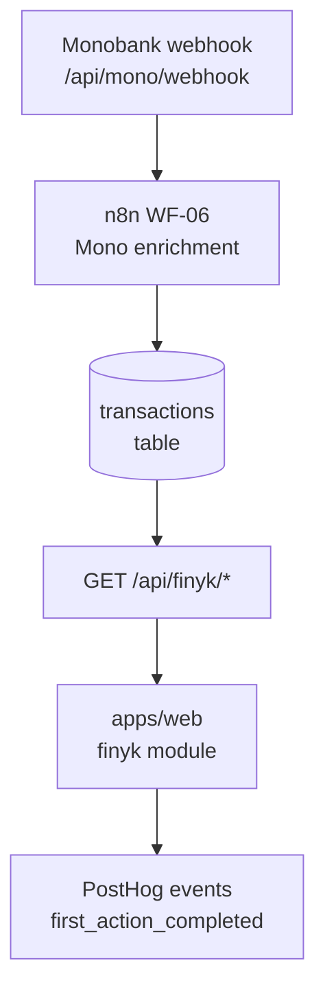

# Walkthrough: `finyk` module

> **Last validated:** 2026-05-13 by @andrijvigrav. **Next review:** 2026-08-11.
> **Status:** Draft
> **Purpose:** Bus-factor knowledge-transfer (stack-pulse PR-04). One-hour guide for an engineer new to this module.

## Architecture diagram

## Top-5 файлів та їх роль

| Файл                                            | Роль                                                           |
| ----------------------------------------------- | -------------------------------------------------------------- |
| `apps/server/src/modules/finyk/finykRouter.ts`  | Hono router — всі `/api/finyk/*` endpoints                     |
| `apps/server/src/modules/finyk/finykService.ts` | Бізнес-логіка: категоризація, агрегація, фільтрація транзакцій |
| `apps/web/src/modules/finyk/`                   | React Query хуки + UI компоненти; ключі в `finykKeys`          |
| `packages/finyk-domain/src/`                    | Shared domain types і чиста логіка (kcal/budget math)          |
| `apps/server/src/modules/finyk/monoWebhook*.ts` | Webhook receiver — парсинг Monobank StatementItem → DB insert  |

## Top-3 gotcha

1. **MCC code → category mapping** — категоризація живе у `finykService.ts`. При додаванні нової категорії треба оновити і mapping table, і Drizzle enum (інакше unknown MCC падають у "other").
2. **`transactions` таблиця має `bigint` id** — при серіалізації завжди `Number(row.id)` (Hard Rule #1). Пропустив — клієнт отримує string, і `===` порівняння ламається.
3. **Моно webhook duplicate-захист** — webhook може прийти двічі (Monobank retry). INSERT використовує `ON CONFLICT (mono_id) DO NOTHING`. Не видаляй цей constraint без тесту.

## Escalation

- Питання по Monobank API: [developers.monobank.ua](https://api.monobank.ua/docs/)
- Runtime issues: `@Skords-01` (поки TBD secondary)
- n8n WF-06 flow: `ops/n8n-workflows/WF-06-*.json`
