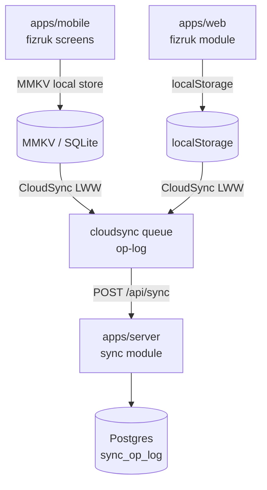

# Walkthrough: `fizruk` module

> **Last validated:** 2026-05-13 by @Skords-01. **Next review:** 2026-08-11.
> **Status:** Draft
> **Purpose:** Bus-factor knowledge-transfer (stack-pulse PR-04). One-hour guide for an engineer new to this module.

## Architecture diagram

## Top-5 файлів та їх роль

| Файл                                     | Роль                                                                        |
| ---------------------------------------- | --------------------------------------------------------------------------- |
| `apps/web/src/modules/fizruk/`           | Web UI: workout logging, sets/reps, history charts via ChartKit             |
| `apps/mobile/src/core/fizruk/`           | Mobile UI: RNGH gestures (swipe to delete), MMKV local-first state          |
| `packages/fizruk-domain/src/`            | Shared types: `Exercise`, `WorkoutSet`, `WorkoutSession`; pure computations |
| `apps/server/src/modules/sync/`          | CloudSync server-side: op-log replay, LWW conflict resolution               |
| `packages/db-schema/src/pg/syncOpLog.ts` | Drizzle schema для `sync_op_log` — основна persistence таблиця              |

## Top-3 gotcha

1. **Local-first, без RQ-ключів** — fizruk не використовує React Query keys factory на web. Стан живе в localStorage через `cloudsync`-дзеркало. Не додавай `finykKeys`-style fetching — це змінить архітектурний контракт.
2. **LWW timestamp resolution** — при merge конфліктів завжди перемагає запис з більшим `clientTs`. Якщо змінюєш порядок полів у `sync_op_log`, переконайся що `clientTs` порівнюється як число (BigInt → Number).
3. **ChartKit + RNGH** — web і mobile мають різні chart libraries. `fizruk-domain` — спільний denominator, але rendering — своє у кожному app. Зміни в domain types потребують перевірки обох.

## Escalation

- CloudSync architecture: `docs/adr/0043-cloudsync-v1-sunset.md`, `docs/adr/0047-cloudsync-v1-410-gone.md`
- Runtime issues: `@Skords-01` (поки TBD secondary)
