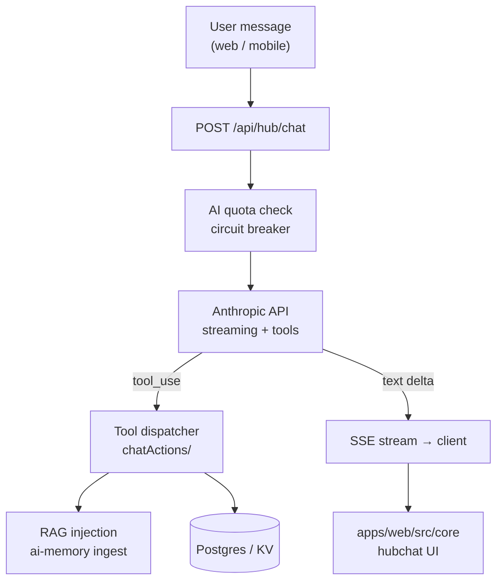

# Walkthrough: `hubchat` module

> **Last validated:** 2026-05-13 by @Skords-01. **Next review:** 2026-08-11.
> **Status:** Draft
> **Purpose:** Bus-factor knowledge-transfer (stack-pulse PR-04). One-hour guide for an engineer new to this module.

## Architecture diagram

## Top-5 файлів та їх роль

| Файл                                            | Роль                                                     |
| ----------------------------------------------- | -------------------------------------------------------- |
| `apps/server/src/modules/chat/chatRouter.ts`    | SSE streaming endpoint, quota enforcement                |
| `apps/server/src/modules/chat/toolDefs/`        | Anthropic tool definitions, split per domain             |
| `apps/web/src/core/lib/chatActions/`            | Client-side tool result handlers (повертають `string`)   |
| `apps/server/src/modules/chat/aiQuota.ts`       | Quota ledger + circuit breaker (`aiQuotaCircuitBreaker`) |
| `apps/server/src/modules/chat/aiQuotaHealth.ts` | DB health probe + sliding-window error counter           |

## Top-3 gotcha

1. **Prompt cache policy** — Anthropic дає discount на cached tokens. Структура повідомлень (system block перший, потім user history) чітко задана в `docs/adr/0039-anthropic-prompt-cache-policy.md`. Не переставляй блоки без розуміння кешування.
2. **Circuit breaker fail-closed** — якщо DB quota-table недоступна, `aiQuota` повертає `null` (не пускає запит). Це свідоме рішення (ADR). Не змінюй на fail-open без review.
3. **Tool result — тільки `string`** — Anthropic очікує `tool_result.content: string`. Клієнтські handlers у `chatActions/` МУСЯТЬ повертати string (JSON.stringify якщо потрібно). Тест: happy path + error path для кожного handler.

## Escalation

- Quota + circuit breaker: `apps/server/src/modules/chat/aiQuotaCircuitBreaker.ts`
- Prompt cache: `docs/adr/0039-anthropic-prompt-cache-policy.md`
- Runtime issues: `@Skords-01` (поки TBD secondary)
