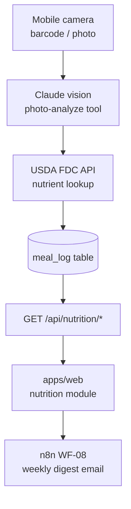

# Walkthrough: `nutrition` module

> **Last validated:** 2026-05-06 by @Skords-01. **Next review:** 2026-11-06.
> **Purpose:** Bus-factor knowledge-transfer (stack-pulse PR-04). One-hour guide for an engineer new to this module.

## Architecture diagram

## Top-5 файлів та їх роль

| Файл | Роль |
|------|------|
| `apps/server/src/modules/nutrition/nutritionRouter.ts` | Всі `/api/nutrition/*` endpoints |
| `apps/server/src/modules/nutrition/photoAnalyze.ts` | Claude vision integration: base64 image → structured macros |
| `apps/server/src/modules/nutrition/usdaClient.ts` | USDA FDC API клієнт (lookup + cache) |
| `apps/web/src/modules/nutrition/` | Web UI: meal logging, barcode scan, nutrient charts; `nutritionKeys` |
| `packages/nutrition-domain/src/` | Shared: kcal math, macro targets, `MealEntry` type |

## Top-3 gotcha

1. **Barcode scan share cache key з meal-sheet** — `nutritionKeys.barcode(code)` і `nutritionKeys.mealSheet(date)` навмисно розділені. При рефакторингу ключів перевір, що не об'єднав їх — це зламає invalidation.
2. **USDA FDC rate-limit** — API має limit ~1000 req/day на API key. `usdaClient.ts` кешує результати в Postgres. Не обходь кеш у тестах без mock.
3. **Photo-analyze — дорогий Claude call** — `photoAnalyze` відправляє base64 image у Anthropic. Є quota guard. Не викликай в tight loops без перевірки quota.

## Escalation

- USDA FDC docs: [fdc.nal.usda.gov/api-guide](https://fdc.nal.usda.gov/api-guide.html)
- Claude vision: `docs/adr/0039-anthropic-prompt-cache-policy.md`
- Runtime issues: `@Skords-01` (поки TBD secondary)
