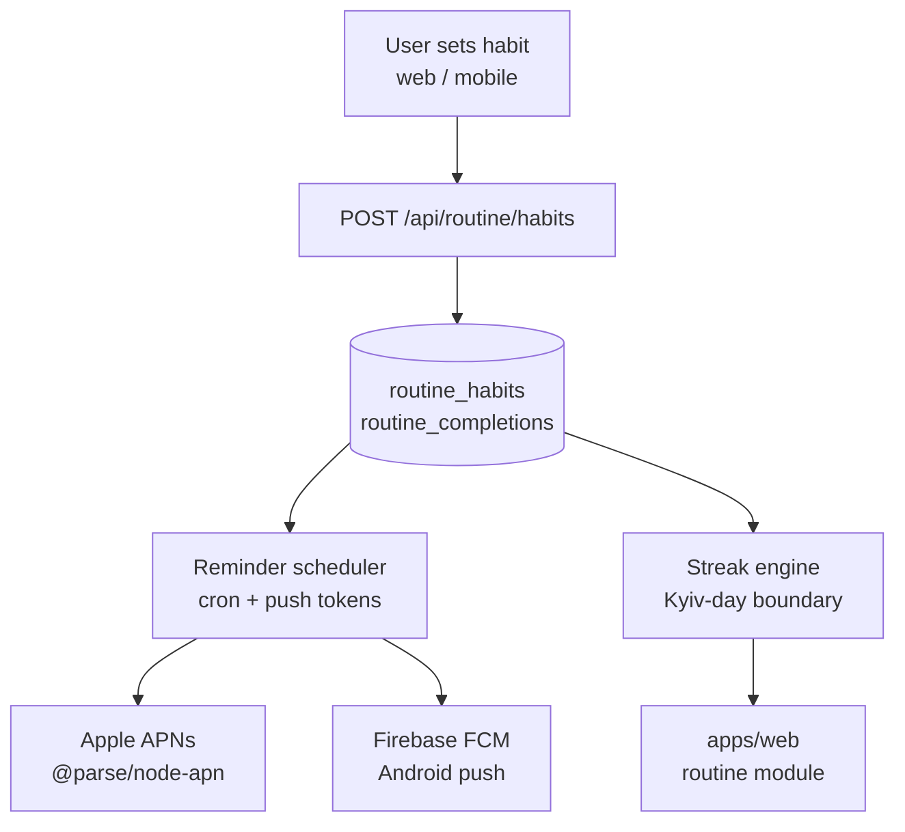

# Walkthrough: `routine` module

> **Last validated:** 2026-05-13 by @andrijvigrav. **Next review:** 2026-08-11.
> **Status:** Draft
> **Purpose:** Bus-factor knowledge-transfer (stack-pulse PR-04). One-hour guide for an engineer new to this module.

## Architecture diagram

## Top-5 файлів та їх роль

| Файл                                                   | Роль                                                   |
| ------------------------------------------------------ | ------------------------------------------------------ |
| `apps/server/src/modules/routine/routineRouter.ts`     | Всі `/api/routine/*` endpoints                         |
| `apps/server/src/modules/routine/reminderScheduler.ts` | Cron job: розраховує які нотифікації треба відіслати   |
| `apps/server/src/push/apnsClient.ts`                   | APNs wrapper (`@parse/node-apn`); JWT-based token auth |
| `apps/web/src/modules/routine/`                        | Habit tracking UI, streak display, local-first state   |
| `packages/routine-domain/src/`                         | Streak math, `HabitEntry` type, day-boundary logic     |

## Top-3 gotcha

1. **Kyiv-day boundary** — streak engine рахує дні у часовому поясі `Europe/Kyiv`. `new Date()` у UTC дасть неправильні результати. Завжди використовуй `toZonedTime(date, 'Europe/Kyiv')` з `date-fns-tz`.
2. **Push token lifecycle** — APNs токени стають invalid при перевстановленні. `apnsClient` обробляє `BadDeviceToken` і видаляє їх з `push_subscriptions`. Не ігноруй цю помилку.
3. **Reminder dedup** — scheduler перевіряє `last_notified_at` перед відправкою. Якщо змінюєш час відправки, переконайся що dedup window оновлено (інакше юзер отримає двічі).

## Escalation

- APNs library decision: `docs/adr/0048-apns-provider-library.md`
- Push notifications architecture: `docs/adr/0019-push-notifications.md`
- Runtime issues: `@Skords-01` (поки TBD secondary)
