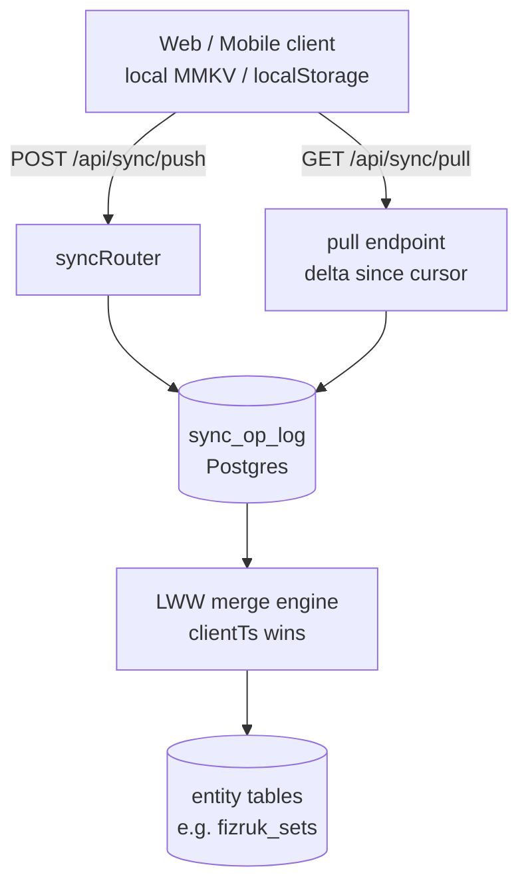

# Walkthrough: `sync` module (CloudSync)

> **Last validated:** 2026-05-13 by @andrijvigrav. **Next review:** 2026-08-11.
> **Status:** Draft
> **Purpose:** Bus-factor knowledge-transfer (stack-pulse PR-04). One-hour guide for an engineer new to this module.

## Architecture diagram

## Top-5 файлів та їх роль

| Файл                                          | Роль                                                                         |
| --------------------------------------------- | ---------------------------------------------------------------------------- |
| `apps/server/src/modules/sync/syncRouter.ts`  | `/api/sync/push` і `/api/sync/pull` endpoints                                |
| `apps/server/src/modules/sync/syncService.ts` | LWW merge logic, op-log replay, conflict resolution                          |
| `packages/db-schema/src/pg/syncOpLog.ts`      | Drizzle schema: `sync_op_log` таблиця з `clientTs`, `serverId`, `entityType` |
| `apps/server/src/migrations/`                 | SQL files що створили `sync_op_log` і related tables                         |
| `docs/adr/0043-cloudsync-v1-sunset.md`        | Рішення про sunset CloudSync v1; поточний стан — v2                          |

## Top-3 gotcha

1. **LWW: clientTs comparison must be numeric** — `clientTs` зберігається як `bigint` в Postgres. При порівнянні у JS завжди `Number(row.clientTs)`. String comparison дасть неправильний winner при rollover за 2^53.
2. **Op-replay determinism** — replay повинен бути детермінованим: той самий список ops → той самий фінальний стан. Якщо додаєш side-effect у merge handler, переконайся що він idempotent.
3. **CloudSync v1 sunset (ADR-0047)** — v1 endpoints повертають `410 Gone`. Якщо бачиш старі клієнти що 410-ять — це очікувано, не баг. Не відновлюй v1 без перегляду ADR.

## Escalation

- CloudSync v1 sunset: `docs/adr/0047-cloudsync-v1-410-gone.md`
- v2 architecture: `docs/adr/0043-cloudsync-v1-sunset.md`
- Runtime issues: `@Skords-01` (поки TBD secondary)
