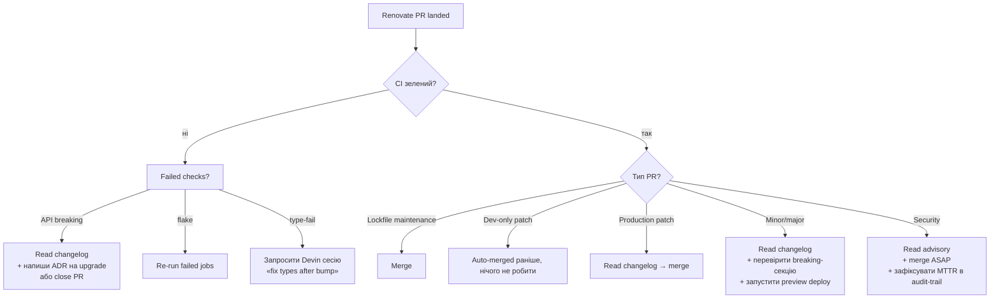

# Renovate maintainer runbook

> **Last validated:** 2026-05-04 by @Skords-01. **Next review:** 2026-08-02.
> **Status:** Active

Operational runbook для maintainer-а Sergeant. Описує **щотижневу рутину**, **триаж duplicate-PR-ів** з Dependabot (per [ADR-0044](../adr/0044-renovate-vs-dependabot.md)), **escalation-шлях** на випадок Mend Renovate downtime, і **monthly hygiene**. Контриб'юторам потрібна дочірня дока [`docs/integrations/renovate-usage.md`](../integrations/renovate-usage.md) — вона про «що приходитиме і як я review-ю». Ця — про «коли і чому щось не приходить».

## Розподіл ролей з Dependabot

Відповідно до [ADR-0044](../adr/0044-renovate-vs-dependabot.md):

| Інструмент | Роль                                                       | Trigger                                  | Конфіг                                                   |
| ---------- | ---------------------------------------------------------- | ---------------------------------------- | -------------------------------------------------------- |
| Renovate   | **Primary** — regular bumps                                | `before 6am on monday Europe/Kyiv` (npm) | [`renovate.json`](../../renovate.json)                   |
| Dependabot | **Security-only fallback**                                 | `daily 06:00 Europe/Kyiv` (npm)          | [`.github/dependabot.yml`](../../.github/dependabot.yml) |
| Dependabot | github-actions / docker (overlap із Renovate `pinDigests`) | `weekly monday 06:00 Europe/Kyiv`        | [`.github/dependabot.yml`](../../.github/dependabot.yml) |

Якщо одночасно бачиш PR від `renovate[bot]` і `dependabot[bot]` на той самий npm-пакет → це **bug у налаштуванні** (Dependabot мав опустити non-security update з npm-scope), закривай Dependabot-PR з коментарем `duplicate of Renovate group: <groupName>` і відкривай issue зі snapshot-конфігом.

## Понеділкова рутина (8:00–8:30 Europe/Kyiv)

1. Відкрий **Pull Requests** → filter `author:app/renovate`. Має бути 5–15 PR-ів.
2. Швидко скрол по титулах — звертай увагу на:
   - `chore(deps): refresh pnpm-lock.yaml` — lockfile maintenance, мерджиться сам після CI;
   - `chore(deps): update <group> to <version>` — групові bumps, читаєш changelog;
   - `chore(deps): update <single-pkg>` — non-grouped, переважно major.
3. Перевір що CI зелений (Vercel Preview Comments + `check` + `Test coverage` + `Critical-flow E2E`). Якщо CI ще йде — повертайся через 30 хв.
4. Auto-merge dev-only patches проходить сам — нічого робити не треба, якщо `Allow auto-merge` ввімкнено в `Settings → General → Pull Requests`.
5. **Production-deps + minors + majors** — review вручну (див. cheatsheet в `renovate-usage.md` § Як ревʼюїти).
6. Якщо PR-ів немає взагалі (понеділок, після 7:00) → див. § Mend Renovate downtime.

## Monthly hygiene (1-й понеділок місяця)

1. **Dependency Dashboard** (GitHub Issue з тайтлом `Dependency Dashboard`):
   - Прочитати секцію **Errors** — будь-які unresolved configuration errors → fix або відкрий ADR-zmena.
   - Прочитати секцію **Ignored or Blocked** — переконатись, що allow-list ще релевантний (наприклад, якщо Expo SDK вже оновили вручну, прибрати `pin` з пакету).
   - Очистити `Awaiting Schedule` checkbox-и для пакетів, які не релізилися більше 6 місяців і явно мертві (рідкість, але буває).
2. **`renovate.json` `packageRules`:**
   - Знайти rule з `description:` без посилання на ADR/incident → додати посилання або видалити, якщо причина забута;
   - Перевірити, що `groupName` все ще збігається з фактичним списком пакетів (наприклад, якщо `@anthropic-ai/sdk` був перейменований у `@anthropic-ai/sdk-v2`, оновити pattern).
3. **Dependabot security-only:**
   - У GitHub → Settings → Code security → Dependabot alerts → перевірити, що `Allow auto-merge` все ще дозволено для repo;
   - Подивитися Dependabot dashboard (Insights → Dependency graph → Dependabot) → `Last updated` ≤ 24h на npm scope (security-feed жвавий).

## Triage decision tree для Renovate-PR



## Mend Renovate downtime

**Симптоми:** понеділок ранок, 8:00 Europe/Kyiv, нових PR-ів від `renovate[bot]` немає більше 24h після останнього успішного скану.

1. Перевір <https://status.mend.io/> — якщо incident, чекай.
2. Якщо status зелений — перевір **Mend dashboard** (<https://developer.mend.io/>):
   - Sergeant репо у `Installed Repositories`?
   - **Default Engine Settings → Dependency Updates** = `Auto` (не `Silent`)?
   - Останній `Run Log` — є помилки?
3. Якщо все OK у Mend, але PR-ів немає → подивись **Dependency Dashboard** GitHub Issue, секція `Errors`. Часто там вже є помилка типу «branch protection blocked merge» або «conflict resolved manually».
4. **Якщо Mend off-line > 24 годин:** Dependabot security-fallback все одно піднімає security-PR-и (per ADR-0044). Regular bumps — пауза до відновлення Mend. Це **OK** — якщо за тиждень Mend відсутній, все ще не аварія, бо security-feed працює.
5. **Якщо Mend off-line > 7 днів:** відкривай incident у `docs/postmortems/` (template є). Розгляд Option 1/2 з ADR-0044 — переключитися на Dependabot повністю або шукати альтернативу (Renovate Self-Hosted, GitHub Renovate Action).

## Як зробити dry-run без створення PR

```sh
LOG_LEVEL=debug npx --package=renovate renovate \
  --platform=local --dry-run=full
```

Покаже список PR-ів, які Renovate планує створити, без жодних реальних змін у GitHub.

Корисно перед merge-ом великих змін у `renovate.json` (наприклад, новий `packageRule` із `automerge: true`).

## Як заборонити апдейт пакета

`renovate.json` → `packageRules` → новий запис:

```jsonc
{
  "description": "Залишаємось на старій версії бо <причина + посилання на ADR/issue>",
  "matchPackageNames": ["package-name"],
  "enabled": false,
}
```

Або пін на конкретну major-версію:

```jsonc
{
  "matchPackageNames": ["package-name"],
  "allowedVersions": "<5.0.0",
}
```

Завжди додавай `description:` із посиланням на ADR або incident — інакше через 6 місяців ніхто не пам'ятатиме, чому правило існує (див. § Monthly hygiene).

## Як обробити security-PR від Dependabot

Per ADR-0044, Dependabot піднімає security-PR-и daily. Воркфлоу `dependabot-automerge.yml` auto-merge-ить тільки `version-update:semver-patch` для `direct:production`. Все інше — ручне review.

1. **Patch-only direct production** → нічого не робити, auto-merge впорається після зеленого CI;
2. **Minor/major security** → читай advisory (`Dependabot fetched: GHSA-...` лінк у тілі PR), оцінюй breaking-ризик, якщо OK — merge;
3. **Indirect production** (наприклад, transitive `@types/node`) → переконайся, що pin у `package.json` overrides (якщо є) не блокує fix, merge або пін;
4. **MTTR target:** ≤ 24 години від `disclosed_at` advisory до merged-PR. Якщо більше — додай рядок у `docs/security/nightly-audit.md` з причиною затримки.

## Зв'язки

- [ADR-0044 — Renovate vs Dependabot](../adr/0044-renovate-vs-dependabot.md) — рішення про розподіл ролей.
- [`renovate.json`](../../renovate.json) — конфіг Renovate.
- [`.github/dependabot.yml`](../../.github/dependabot.yml) — конфіг Dependabot (security-only npm + github-actions/docker overlap).
- [`.github/workflows/dependabot-automerge.yml`](../../.github/workflows/dependabot-automerge.yml) — auto-merge patch-only npm + github-actions.
- [`docs/integrations/renovate-usage.md`](../integrations/renovate-usage.md) — гід контриб'ютора (review-cheatsheet, FAQ).
- [`docs/security/hardening/H2-dependabot.md`](../security/hardening/H2-dependabot.md) — Sprint 1 setup card (Dependabot scope-reduction).
- [`docs/security/nightly-audit.md`](../security/nightly-audit.md) — реактивна частина (`pnpm audit` + OSV-Scanner).
- [`docs/security/vulnerability-sla.md`](../security/vulnerability-sla.md) — SLA для security-bumps.
