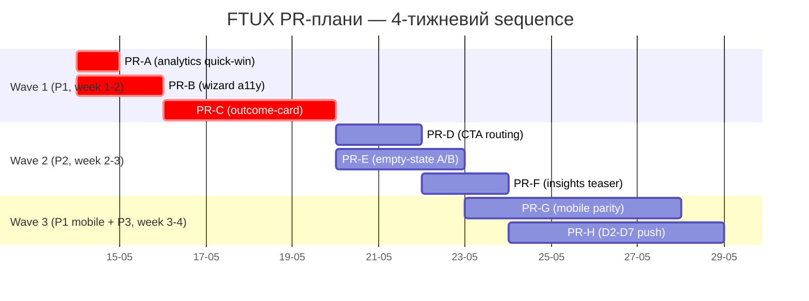

# FTUX / Onboarding PR-план (з прожарки 2026-05-13)

> **Last validated:** 2026-05-13 by Devin (child session, parent prompt 2026-05-13). **Next review:** 2026-08-11.
> **Status:** Active

> **Призначення.** Виконавчий план PR-ів за відкритими пунктами FTUX-прожарки [`docs/audits/2026-05-13-ftux-onboarding-roast.md`](../audits/2026-05-13-ftux-onboarding-roast.md). Дзеркалить open-items із цієї прожарки у конкретні PR-картки з acceptance, conversion-метриками, розміром (S/M/L), пріоритетом (P1/P2/P3), залежностями та owner-плейсхолдером. **Не** замінює SSOT — `docs/launch/product-os/ftux-master-tracker.md` (master tracker) лишається істиною про статуси; цей файл — execution playbook на наступні 2–4 тижні.
>
> **Що НЕ покрито тут.** Закриті у roast-PR пункти (B-11 `nextStepTip`, P2-15 `primaryCtaLabel`, M-10 `ftux-slo.yml`) — лишаються тільки як history-кросс-реф. PR-08 (cleanup .replit + archive stale audits, P1-4 у roast) — already landed [commit 92dd45b2](https://github.com/Skords-01/Sergeant/commit/92dd45b2). Paywall (PR-19/PR-20), What's new modal (PR-18), SQLite migration — окремі ініціативи, поза скоупом цієї прожарки (явно exclude-нуто у §«Що НЕ покрито цією прожаркою» roast-а).

## Cross-refs

**Audits / прожарки:**

- [`docs/audits/2026-05-13-ftux-onboarding-roast.md`](../audits/2026-05-13-ftux-onboarding-roast.md) — джерельна прожарка (5 болів полірування + 3 структурні борги).
- [`docs/audits/2026-05-06-ux-roast-pr-plan.md`](../audits/2026-05-06-ux-roast-pr-plan.md) — попередній виконавчий план UX-прожарки (41 PR у 3 спринтах). Цей план — **incremental delta** поверх нього; коли пункт уже закритий або обмежено-в-розробці, відсилка на conf-PR із master tracker-а.
- [`docs/audits/2026-05-06-ux-roast.md`](../audits/2026-05-06-ux-roast.md) — пост-onboarding UX-прожарка (Day 0-7).
- [`docs/audits/archive/2026-05-03-ftux-onboarding-roast.md`](../audits/archive/2026-05-03-ftux-onboarding-roast.md) — оригінальна FTUX-прожарка (frozen).

**Master tracker:** [`docs/launch/product-os/ftux-master-tracker.md`](../launch/product-os/ftux-master-tracker.md) — sprint registry, PR-09..PR-21, decisions log.

**Surfaces в `apps/web` (за user-journey):**

| Етап                  | Файл                                                                                                                                                                                                             | Роль у FTUX                                                                                   |
| --------------------- | ---------------------------------------------------------------------------------------------------------------------------------------------------------------------------------------------------------------- | --------------------------------------------------------------------------------------------- |
| Signup / login        | [`apps/web/src/core/auth/AuthPage.tsx`](../../apps/web/src/core/auth/AuthPage.tsx)                                                                                                                               | Pre-onboarding ingress: register / login / forgot-password.                                   |
| Signup form           | [`apps/web/src/core/auth/RegisterForm.tsx`](../../apps/web/src/core/auth/RegisterForm.tsx)                                                                                                                       | First credential entry; double-fire ризики тут менш-критичні, але logging-сумісність важлива. |
| Welcome splash        | [`apps/web/src/core/app/WelcomeScreen.tsx`](../../apps/web/src/core/app/WelcomeScreen.tsx)                                                                                                                       | `/welcome` peek-backdrop + entry до wizard / demo CTA.                                        |
| Onboarding gate       | [`apps/web/src/core/onboarding/onboardingGate.ts`](../../apps/web/src/core/onboarding/onboardingGate.ts)                                                                                                         | `shouldShowOnboarding()`, `markOnboardingDone()`, `isOnboardingCompletedFired()`.             |
| Wizard                | [`apps/web/src/core/onboarding/OnboardingWizard.tsx`](../../apps/web/src/core/onboarding/OnboardingWizard.tsx) + [`useOnboardingWizardState.ts`](../../apps/web/src/core/onboarding/useOnboardingWizardState.ts) | Vibe / goal / module picks; емітить `onboarding_*` PostHog events.                            |
| First-action sheet    | [`apps/web/src/core/onboarding/FirstActionSheet.tsx`](../../apps/web/src/core/onboarding/FirstActionSheet.tsx)                                                                                                   | Post-wizard primary affordance (goal-aware після PR-11).                                      |
| Hub bootstrap         | [`apps/web/src/core/app/HubHomeView.tsx`](../../apps/web/src/core/app/HubHomeView.tsx) + [`apps/web/src/core/hub/HubDashboard.tsx`](../../apps/web/src/core/hub/HubDashboard.tsx)                                | Cold-start dashboard; де рендеряться hero-block, modules grid, prompt-cards.                  |
| Hero block            | [`apps/web/src/core/hub/HubHeroBlock.tsx`](../../apps/web/src/core/hub/HubHeroBlock.tsx)                                                                                                                         | Раніше — `OnboardingProgress`; пост-PR-09 — `ValueProgressBar` / `outcome-card`.              |
| Progress bar (legacy) | [`apps/web/src/core/onboarding/OnboardingProgress.tsx`](../../apps/web/src/core/onboarding/OnboardingProgress.tsx)                                                                                               | «2/4 розділів» — value-misalignment для goal-less cohort, PR-C нижче його перекриває.         |
| Celebration           | [`apps/web/src/core/onboarding/CelebrationModal.tsx`](../../apps/web/src/core/onboarding/CelebrationModal.tsx) + [`useFirstEntryCelebration.ts`](../../apps/web/src/core/onboarding/useFirstEntryCelebration.ts) | Module-aware копія (B-11/P2-15 закрито). Routing CTA → add-sheet — PR-D.                      |
| Shared copy           | [`packages/shared/src/lib/onboardingCelebrations.ts`](../../packages/shared/src/lib/onboardingCelebrations.ts)                                                                                                   | `FIRST_ENTRY_CELEBRATIONS`: `nextStepTip` + `primaryCtaLabel` per-module.                     |

## User-journey map (cold-start, web)

```mermaid
flowchart TD
    Land[Vercel landing<br/>`/`] --> Auth{«Sergeant новий?»}
    Auth -- так --> Register[RegisterForm<br/>`/auth?mode=register`]
    Auth -- ні --> Login[LoginForm<br/>`/auth`]
    Register --> Welcome[WelcomeScreen<br/>`/welcome`<br/>peek-backdrop + splash]
    Login --> Welcome
    Welcome -->|«Налаштувати»| Wizard[OnboardingWizard<br/>vibe → goal → modules]
    Welcome -->|«Спробувати demo»| Demo[seedDemoData<br/>+ HubHomeView]
    Wizard --> FirstAction[FirstActionSheet<br/>goal-aware primary]
    FirstAction --> Hub[HubHomeView<br/>+ HubDashboard]
    Hub --> Hero[HubHeroBlock]
    Hero -->|cold goal-less| Progress[OnboardingProgress «2/4 розділів»<br/>⚠ value-misalignment — PR-C]
    Hero -->|cold з goals| ValueBar[ValueProgressBar<br/>(вже shipped)]
    Hub --> Module[Module surface<br/>finyk / fizruk / routine / nutrition]
    Module --> EmptyState[Module empty-state<br/>⚠ generic copy — PR-E A/B]
    Module --> AddSheet[Add-sheet first-real-entry]
    AddSheet --> Celebration[CelebrationModal<br/>module-aware tip + CTA]
    Celebration -->|«Записати ще витрату» etc.| Route[⚠ закриває modal, не відкриває sheet — PR-D]
    Hub --> D2D7[Day 2-7 retention<br/>⚠ email drip / push nudge gap — PR-H]
    Wizard --> A11y[⚠ a11y regression від PR #2599<br/>focus / Escape / double-submit — PR-B]
    Celebration --> Analytics[⚠ payload без tipVariant / ctaLabel<br/>silent-copy-regression risk — PR-A]
    Hub -. mobile parity .-> Mobile[apps/mobile HubDashboard<br/>⚠ B-11/P2-15 не reach-ить мобайл — PR-G]
```

**Pain-points (red ⚠ above), mapped → PR cards:**

| Pain                                                           | Audit ref        | PR card  |
| -------------------------------------------------------------- | ---------------- | -------- |
| `celebration_shown` payload не містить `tipVariant`/`ctaLabel` | §«Метрики...»    | **PR-A** |
| Wizard a11y regression від PR #2599 decompose                  | P1-3             | **PR-B** |
| `OnboardingProgress` для goal-less cohort                      | P1-1 + #9        | **PR-C** |
| `CelebrationModal` CTA не маршрутизує у add-sheet              | P2-1 + TL;DR #4  | **PR-D** |
| Generic per-module empty-states                                | P2-2             | **PR-E** |
| Insights teaser у CelebrationModal                             | P2-3 + S6.10     | **PR-F** |
| Mobile FTUX parity для B-11/P2-15                              | P1-2 + M-6       | **PR-G** |
| D2-D7 retention loop (нема drip / push)                        | TL;DR #8 / P3-16 | **PR-H** |

## PR-картки

> **Конвенції.**
>
> - **Розмір:** S = ≤ ½ дня (≤ 80 LOC), M = 1–2 дні (≤ 250 LOC), L = 3–5 днів (≤ 600 LOC); XS — окремий quick-win ≤ 40 LOC.
> - **Пріоритет:** P1 = next-sprint (Wave 1), P2 = post-launch polish (Wave 2), P3 = backlog / infra-blocked (Wave 3).
> - **Owner:** `@Skords-01` за замовчуванням (per `AGENTS.md § Module ownership map`); secondary — `TBD (<role>)` поки делегування у польоті.
> - **Гілка:** `devin/$(date +%s)-<short-name>` (за `AGENTS.md`).
> - **i18n:** будь-який UA-літерал — у `apps/web/src/shared/i18n/uk.ts` (Hard Rule #15).
> - **RQ-ключі:** factories із `apps/web/src/shared/lib/api/queryKeys.ts` (Hard Rule #2).
> - **Тести:** Vitest + RTL для UI; analytics — assertion проти `window.__hubAnalytics` ring-buffer; a11y — `axe` у `tests/smoke/`.
> - **Pre-commit:** Husky `pnpm exec lint-staged --concurrent false` (НЕ skip).

### PR-A — `feat(analytics): celebration_shown payload з tipVariant + ctaLabel` _(XS quick-win)_

- **Скоуп.** Розширити `celebration_shown` PostHog event payload фактично-render-нутими `nextStepTip` (→ `tipVariant`) і `primaryCtaLabel` (→ `ctaLabel`) — щоб dashboard ловив silent-copy-regression. Зараз payload містить тільки `ttvMs`, `source`, `moduleId`.
- **Файли (estimate ≤ 40 LOC).**
  - [`apps/web/src/core/onboarding/CelebrationModal.tsx`](../../apps/web/src/core/onboarding/CelebrationModal.tsx) — додати 2 ключі у `trackEvent('celebration_shown', …)` payload.
  - [`apps/web/src/core/observability/analytics.ts`](../../apps/web/src/core/observability/analytics.ts) — розширити TS-тип `CelebrationShownPayload` (back-compat — нові поля optional).
  - `apps/web/src/core/onboarding/CelebrationModal.test.tsx` — assertion проти ring-buffer-у.
- **Acceptance.**
  - Payload містить `tipVariant: string` та `ctaLabel: string` для всіх 4 модулів (finyk / fizruk / routine / nutrition).
  - PostHog dashboard `posthog-ftux-dashboards.md § celebration_shown` оновлено (новий filter facet `tipVariant`).
  - Vitest assertion: після close-cycle CelebrationModal в `__hubAnalytics` ring-buffer-і знайдеться `celebration_shown` із обома новими полями.
- **Conversion-метрика.** Не пряма (це instrumentation); enables `ftux_activation_conversion` cohort facet by variant. Cross-ref: `docs/observability/ftux-slo.yml § activation_conversion`.
- **Розмір / Пріоритет.** **XS / P1** (quick-win — окремий PR, як просив prompt).
- **Залежності.** Жодних. Можна ship-нути паралельно з PR-B.
- **Owner.** `@Skords-01`; secondary — `TBD (analytics-engineer)`.
- **Ризики.** Мінімальні. Зворотна сумісність — нові поля additive; стара dashboard-конфігурація не падає.

### PR-B — `fix(web): OnboardingWizard a11y + double-submit guard (P1-3)`

- **Скоуп.** Відновити 3 UX-гарантії, відкочені при decompose-i `OnboardingWizard.tsx` (PR #2599):
  1. **WCAG 2.4.3 focus management** — splash heading отримує фокус при mount (`useAutoFocus(headingRef)`).
  2. **Escape soft-pause** — `onDismiss` prop повертається; Escape closing-up-flow у real-mode + `tour_replay` у tour-mode.
  3. **Double-submit guard** — `submitted` ref + early-return у `useOnboardingWizardState.finish()`, щоб два кліки CTA не задвоїли `onboarding_completed`.
- **Файли (estimate < 60 LOC).**
  - [`apps/web/src/core/onboarding/OnboardingWizard.tsx`](../../apps/web/src/core/onboarding/OnboardingWizard.tsx) — `useAutoFocus(headingRef)` + `onDismiss` wiring.
  - [`apps/web/src/core/onboarding/useOnboardingWizardState.ts`](../../apps/web/src/core/onboarding/useOnboardingWizardState.ts) — `submitted` ref + early-return у `finish()`.
  - [`apps/web/src/core/onboarding/OnboardingWizard.ux.test.tsx`](../../apps/web/src/core/onboarding/OnboardingWizard.ux.test.tsx) — зняти `it.skip` маркери, додати focus-assertion (`document.activeElement === headingRef.current`).
- **Acceptance.**
  - Focus-test: при mount splash, `document.activeElement` === `<h2>` (не `<body>`).
  - Escape-test: у real-mode виклик `keydown[Escape]` дзвонить `onDismiss`; у tour-mode дзеркалить `tour_replay` intent.
  - Double-submit-test: два послідовні кліки CTA емітять рівно один `onboarding_completed` event.
  - Жодного `it.skip` у `OnboardingWizard.ux.test.tsx` після PR-а.
  - `pnpm --filter @sergeant/web test:a11y` зелений (axe не репортує regression-ів на splash-heading focus order).
- **Conversion-метрика.** D1 retention для `aria-screen-reader-users` cohort повертається до pre-PR-#2599 baseline-у (proxy: `onboarding_completed / onboarding_started` ≥ 95% — без двох-event-ного inflation-у).
- **Розмір / Пріоритет.** **M / P1.**
- **Залежності.** Жодних (працює поверх змерженого decompose-PR-у #2599).
- **Owner.** `@Skords-01`; secondary — `TBD (frontend-engineer)`. Ризик — medium (a11y + analytics double-fire blast radius).
- **Ризики / mitigations.** Якщо `useAutoFocus` конфліктує з peek-backdrop animation — fallback на `setTimeout(focus, 0)`. Якщо `onDismiss` rewires Escape у unintended flow — gate за `tourMode` prop, як було pre-decompose.

### PR-C — `feat(hub): cold-start outcome-card behind FF (PR-09 / P1-1)`

- **Скоуп.** На cold-start (немає `first_real_entry` у жодному модулі) показувати **outcome-card** замість `OnboardingProgress` «2/4 розділів активовано». Outcome-card сфокусована на user goal (proxy: vibe-pick), не на progress completion. Goal-less cohort (vibe + no goal-picks) бачить **canonical outcome-card** з 3 module-thumbnail-ами.
- **Файли (estimate ~ 280 LOC).**
  - Новий `apps/web/src/core/hub/OutcomeCard.tsx` (новий component).
  - [`apps/web/src/core/hub/HubHeroBlock.tsx`](../../apps/web/src/core/hub/HubHeroBlock.tsx) — гейтинг `outcome-card` vs `OnboardingProgress` за FF + `first_real_entry` присутністю.
  - [`apps/web/src/core/onboarding/OnboardingProgress.tsx`](../../apps/web/src/core/onboarding/OnboardingProgress.tsx) — `@deprecated` JSDoc + видалення після FF cleanup (наступний sprint).
  - PostHog FF `ftux_outcome_card_v1` (50/50 split, 14-day measurement window).
  - Тести: `OutcomeCard.test.tsx` + `HubHeroBlock.test.tsx` snapshot.
- **Acceptance.**
  - `OnboardingProgress` НЕ рендериться для cohort з `ftux_outcome_card_v1=true` і `first_real_entry == null`.
  - Outcome-card містить module-thumbnail-и з outcome-copy (з master tracker §5).
  - Per-module `first_real_entry` rate ↑ 10pp для on-cohort vs control (PR-09 master-tracker метрика).
  - A11y: outcome-card heading має `role="heading" aria-level={2}`, module-thumbnails — `aria-label` зі state.
- **Conversion-метрика.** `first_real_entry / wizard_completed` ≥ baseline + 10pp за 14 днів on-cohort vs off-cohort.
- **Розмір / Пріоритет.** **L / P1** (master tracker PR-09, Wave 2).
- **Залежності.** PR-06 (canonical Cyrillic naming) — landed. Soft-dep на PR-12 (orchestrator) — після його ship, hero gating уніфікується через `usePrimaryAffordance()`.
- **Owner.** `@Skords-01`; secondary — `TBD (frontend-engineer)`.
- **Ризики.** FF flip без monitoring → blast radius hero. Mitigation: rollout 10% → 50% → 100% за 7 днів, alert-rule у `ftux-slo.yml` (`celebration_visibility` SLO має лишатися ≥ baseline).

### PR-D — `feat(onboarding): CelebrationModal CTA → add-sheet routing (P2-1 / S6.3)`

- **Скоуп.** Після P0-2 закриття (`primaryCtaLabel` per-module: «Записати ще витрату», «Запланувати наступне», …) — клік primary CTA закриває modal **і** відкриває відповідний add-sheet модуля. Реалізація — `nextActionAfterCelebration` affordance, що `usePrimaryAffordance()` ranger підхоплює після close-у CelebrationModal-а.
- **Файли (estimate ~ 120 LOC).**
  - [`apps/web/src/core/onboarding/useOnboardingState.ts`](../../apps/web/src/core/onboarding/useOnboardingState.ts) — додати `nextActionAfterCelebration: ModuleId | null` state + setter.
  - [`apps/web/src/core/onboarding/CelebrationModal.tsx`](../../apps/web/src/core/onboarding/CelebrationModal.tsx) — `onPrimaryAction` → `setNextActionAfterCelebration(moduleId)` + `onClose()`.
  - [`apps/web/src/core/hub/HubDashboard.tsx`](../../apps/web/src/core/hub/HubDashboard.tsx) — слухати `nextActionAfterCelebration` → open module add-sheet через existing `usePrimaryAffordance()`.
  - Тести: `CelebrationModal.test.tsx` (assertion проти `nextActionAfterCelebration === 'finyk'` після клік-у).
- **Acceptance.**
  - Click «Записати ще витрату» закриває modal, відкриває finyk add-sheet ≤ 300ms (без full-route navigation).
  - Аналогічно для fizruk («Запланувати наступне» → workout-add), routine («Завтра я нагадаю» → no-op або scheduler), nutrition («Додати ще прийом» → meal-add).
  - `celebration_cta_clicked` PostHog event емітиться з `moduleId` і `nextAction: 'add_sheet' | 'noop'`.
  - Single-hero rule не порушено: prompt-cards дашборду не задвоюються після close-у modal-у.
- **Conversion-метрика.** `add_sheet_opened_after_celebration / celebration_cta_clicked` ≥ 70% (target — measure on-arm).
- **Розмір / Пріоритет.** **S / P2.**
- **Залежності.** **PR-12 (orchestrator)** [#2014](https://github.com/Skords-01/Sergeant/pull/2014) — потрібен `useOnboardingState` shared store як SSOT для `nextActionAfterCelebration`. Якщо PR-12 ще не landed на момент початку PR-D — temporary local hook у CelebrationModal з migrate-плейс-хол-дером.
- **Owner.** `@Skords-01`; secondary — `TBD (frontend-engineer)`.
- **Ризики.** Routine немає add-sheet у звичайному сенсі (це scheduler). Decision: routine CTA лишається informational close-only (sub-scope acceptance — інші 3 модулі є success target).

### PR-E — `feat(empty): per-module empty-state copy A/B (PR-10 / P2-2)`

- **Скоуп.** Кожен модуль (finyk / fizruk / routine / nutrition) має pre-first-entry empty-state. PR-10 у master tracker заплановано з **3 варіантами × 4 модулі = 12 копій** + analytics cohort. Behind PostHog FF `ftux_empty_v1` (рівномірний split 33/33/33, 14-day measurement).
- **Файли (estimate ~ 150 LOC).**
  - `packages/shared/src/lib/emptyStateCopy.ts` (новий) — `EMPTY_STATE_COPY: Record<ModuleId, Record<VariantId, EmptyStateCopy>>`.
  - `apps/web/src/modules/finyk/components/FinykEmptyState.tsx`, `…/fizruk/…`, `…/routine/…`, `…/nutrition/…` — підхопити variant через `useFeatureFlag('ftux_empty_v1')`.
  - Тести: `emptyStateCopy.test.ts` — non-empty + length-budget contract + distinct-variants assertion (12 копій без дублів).
- **Acceptance.**
  - 12 копій existing у `EMPTY_STATE_COPY`, всі ≤ 80 chars body, ≤ 24 chars headline.
  - Assertion-guard блокує regression до single-variant (CI fail якщо `Object.keys(EMPTY_STATE_COPY[mod]).length < 3`).
  - PostHog event `empty_state_viewed` емітиться з `moduleId` + `variantId`.
  - Single-hero rule: empty-state — окремий surface від prompt-card-ів, конфлікту бути не може.
- **Conversion-метрика.** 14-day winner за `first_real_entry / empty_state_viewed` cohort-conversion per module. Threshold для promote — ≥ +5pp vs control variant.
- **Розмір / Пріоритет.** **M / P2** (master tracker PR-10, Wave 2).
- **Залежності.** PR-06 (canonical Cyrillic) — landed. PR-09 (PR-C) — для on-cohort фрейму outcome-card-а.
- **Owner.** `@Skords-01`; secondary — `TBD (content-engineer)` (12 копій вимагають content-review-а).
- **Ризики.** Content-bloat у `shared` пакеті. Mitigation: copies — короткі, ≤ 80 chars body, без локалізаційних вкладень (UA-only до launch per Q4 master tracker).

### PR-F — `feat(onboarding): insights teaser у CelebrationModal (S6.10 / P2-3 / B-10)`

- **Скоуп.** Після первого real-entry показувати у CelebrationModal на 5 секунд cross-module USP-promise: «Завтра ти побачиш, як цей запис впливає на твій тиждень.» Виконує «aha»-функцію — натяк на cross-module insights (digest / weekly report).
- **Файли (estimate ~ 100 LOC).**
  - [`packages/shared/src/lib/onboardingCelebrations.ts`](../../packages/shared/src/lib/onboardingCelebrations.ts) — додати `insightsTeaser: string` (per-module або canonical).
  - [`apps/web/src/core/onboarding/CelebrationModal.tsx`](../../apps/web/src/core/onboarding/CelebrationModal.tsx) — секція teaser-а під `nextStepTip`, fade-in на 200ms, auto-hide на 5s або при scroll-у.
  - Тести: `onboardingCelebrations.test.ts` — length-budget contract + regression-guard на generic «дивись завтра».
- **Acceptance.**
  - Teaser рендериться лише на першому real-entry per module (gated `useFirstEntryCelebration` flag).
  - Не перевищує 5 секунд auto-display; manual dismiss закриває до auto-hide.
  - `insights_teaser_shown` PostHog event емітиться з `moduleId`.
  - A11y: teaser має `aria-live="polite"` (не переривати screen-reader announcement-ів).
- **Conversion-метрика.** D1 return rate cohort з teaser ↑ vs control ≥ +3pp (proxy: «aha»-moment retention).
- **Розмір / Пріоритет.** **S / P2** (Sprint 6 carryover S6.10, низький-medium ризик overtease).
- **Залежності.** Soft-dep на PR-A (analytics payload extension — для тегування `tipVariant` у cohort-filter-і).
- **Owner.** `@Skords-01`; secondary — `TBD (content-engineer)` (copy review через peek-backdrop pattern risk).
- **Ризики.** Overtease — teaser сприймається як additional TODO. Mitigation: copy-review checkpoint перед merge; A/B split на `insights_teaser_v1` (control vs treatment) на 7 днів.

### PR-G — `feat(mobile): FTUX parity для B-11 / P2-15 + outcome-card (M-6 / P1-2 / PR-21)`

- **Скоуп.** Mobile-side CelebrationModal rendering на first-real-entry, що піднімає `FIRST_ENTRY_CELEBRATIONS` (shared package, web↔mobile parity). Додатково — port outcome-card-а з PR-C у `apps/mobile/src/core/dashboard/HubDashboard.tsx`.
- **Файли (estimate ~ 400 LOC).**
  - `apps/mobile/src/core/dashboard/HubDashboard.tsx` — інтеграція `useFirstEntryCelebration` (shared hook) + render `@sergeant-mobile/components/ui/CelebrationModal` (вже існує як generic-celebration шар).
  - `apps/mobile/src/core/dashboard/MobileOutcomeCard.tsx` (новий, port з web).
  - `apps/mobile/src/core/onboarding/firstEntryCelebrationMobile.ts` — mobile wrapper над shared `useFirstEntryCelebration`.
  - Тести: Detox E2E на mobile celebration-flow (1 spec, gated `@critical-mobile`).
- **Acceptance.**
  - На first real-entry у mobile finyk/fizruk/routine/nutrition — рендериться CelebrationModal із module-aware `nextStepTip` + `primaryCtaLabel` (точно так як web).
  - `celebration_shown` event емітиться через `posthog-react-native` (gated на PR-15 EAS Secret).
  - Outcome-card відображається на mobile dashboard для cold-start cohort.
  - Detox-spec проходить на iOS / Android emulator.
- **Conversion-метрика.** Mobile `first_real_entry / mobile_session_started` ≥ web baseline − 5pp (parity contract).
- **Розмір / Пріоритет.** **L / P1** (master tracker PR-21, Wave 4).
- **Залежності.** **Hard-dep:** PR-15 (`posthog-react-native` parity — код ready, чекає EAS Secret). **Soft-dep:** PR-C (outcome-card web canonical) + PR-D (CTA routing).
- **Owner.** `@Skords-01`; secondary — `TBD (mobile-engineer)`.
- **Ризики.** EAS Secret blocker (PR-15) — якщо не отримано до старту, ship-нути CelebrationModal-port без telemetry (буде темним 1–2 тижні).

### PR-H — `feat(retention): D2-D7 push nudge sequence (P3-16)`

- **Скоуп.** Day-2 / Day-3 / Day-7 push nudge через PWA push permissions (gated на `pwa_installed=true`). Fallback на in-app banner для не-PWA cohort. **Не** email drip — email-infra поза скоупом repo (Resend / Mailgun integration — окрема ініціатива).
- **Файли (estimate ~ 350 LOC).**
  - `apps/server/src/jobs/sendD2D7PushNudge.ts` (новий) — cron job (n8n або native scheduler) шле push payload через VAPID.
  - `apps/web/src/core/sw.ts` — push event handler з `notificationclick` → deep-link у активний модуль.
  - `apps/web/src/core/app/D2D7NudgeBanner.tsx` (fallback для не-PWA) — banner у `HubHeroBlock` після D2.
  - `apps/server/src/db/migrations/NNNN_push_nudge_log.sql` — таблиця `push_nudge_log(user_id, day, sent_at, opened_at, deeplink)`.
  - Тести: server unit для cron-логіки + web Vitest для SW event handler.
- **Acceptance.**
  - Day-2 nudge: `push_sent` для всіх users з `first_real_entry IS NULL AND signed_up_at + interval '2 days' < now()`.
  - Day-3 / Day-7 — аналогічно, з різною copy.
  - `notificationclick → app_opened_via_push` PostHog event emit-иться з `nudgeDay` faceting.
  - Fallback banner рендериться у `HubHeroBlock` для non-PWA cohort на Day-2+.
  - Two-phase DROP не потрібен (additive migration).
- **Conversion-метрика.** D2 active rate (`hub_opened day=2 / signed_up`) ↑ vs current baseline ≥ +8pp.
- **Розмір / Пріоритет.** **L / P3** (P3-16 у roast, потребує VAPID-credentials + cron-infra).
- **Залежності.** **Hard-dep:** PR-07 (PWA install prompt) — landed [#2011](https://github.com/Skords-01/Sergeant/pull/2011). **Infra:** VAPID keys у Railway env. **Optional:** PR-14 (FTUX SLO dashboard) — додає `d2_retention` SLO insight.
- **Owner.** `@Skords-01`; secondary — `TBD (backend-engineer)`.
- **Ризики.** Push spam → uninstall churn. Mitigation: rate-limit 1 push / 24h; opt-out у settings; copy review за PR-04 disciplined tone.

## Sequencing



**Rationale:**

1. **PR-A (XS quick-win)** — ship-аємо **першим** і **окремо** (per parent prompt requirement). Не блокує жодного іншого PR-у; інкрементує analytics-payload, що використовуватимуть всі наступні cohort-analyses.
2. **PR-B (a11y fix)** — P1, blocking — поки a11y-regression живий, conversion-cohort screen-reader-users пошкоджений. Має ship-нутися раніше за PR-C (outcome-card), щоб новий heading у hero block одразу мав focus-management.
3. **PR-C (outcome-card)** — найбільший impact на cold-start conversion (master tracker target ↑ 10pp). Soft-blocks PR-D, PR-E (routing та empty-state будують поверх нової hero-структури).
4. **PR-D, PR-E, PR-F** — паралельні після PR-C; всі низько-medium ризику.
5. **PR-G (mobile parity)** — після web-side stable, інакше fix-ить mobile двічі.
6. **PR-H (retention loop)** — P3, blocked by VAPID-infra setup; може ship-нутися паралельно або після PR-G.

## Quick-wins (≤ ½ дня кожен)

> Перелічуються **окремо** від PR-карток вище — це candidate-PR-и для між-Wave-вих швидких win-ів, які не потрапили у формальний sprint.

| ID   | Назва                                                                                                                                                                                        | LOC  | Acceptance                                                                                                   | Audit ref                      |
| ---- | -------------------------------------------------------------------------------------------------------------------------------------------------------------------------------------------- | ---- | ------------------------------------------------------------------------------------------------------------ | ------------------------------ |
| QW-1 | **PR-A вище — analytics payload extension**                                                                                                                                                  | ≤ 40 | `celebration_shown` payload містить `tipVariant` + `ctaLabel`; CI guard test.                                | §«Метрики...»                  |
| QW-2 | Empty-state hint: «Або пропусти і повернись завтра — Sergeant нагадає.» (gentle nudge на 1 з 4 модулів)                                                                                      | ≤ 25 | Hint рендериться під empty-state на routine module pre-first-entry; не conflict-ить з PR-E variant-system.   | P2-2 (sub-scope)               |
| QW-3 | DemoModeBanner primary/secondary kbd-CTA: Demo як primary (filled), «Налаштувати» — secondary (outlined)                                                                                     | ≤ 30 | Visual hierarchy на `/welcome` чітко інвертована — Demo-CTA share-of-traffic ≥ 20% (vs PR-05 ≥ 15%).         | UX-roast §15 (PR-05 follow-up) |
| QW-4 | Copy fix у `CelebrationModal` для routine: замінити «Завтра я нагадаю про звичку — два дні підряд і мозок підхопить» на коротше: «Постав мені нагадати завтра — два дні і ритм утвердиться.» | ≤ 15 | Length ≤ 90 chars (down від 105); regex-guard у `onboardingCelebrations.test.ts` блокує old-copy regression. | B-11 §2.9 (polish iteration)   |

> **Note:** QW-1 — це **PR-A**, не дубль. QW-2–QW-4 — кандидати для micro-PR-ів якщо є вікно під час Wave 1/2. Власник: будь-який engineer з 30 хв на ship.

## Open dependencies (потрібні для розблокування)

- **VAPID keys** у Railway env-vars (PR-H). Owner: `@Skords-01` (infra).
- **EAS Secret для PostHog mobile** (PR-15 / blocking PR-G telemetry-side). Owner: `@Skords-01` (mobile-infra).
- **Content review** для PR-E (12 копій × 4 модулі) і PR-F (insights teaser copy). Owner: `TBD (content-engineer)`.
- **A11y manual audit** (PR-16 master tracker) — окрема ініціатива, не блокує цей план, але посилює PR-B сторону.

## Метрики моніторингу після ship-у плану

- `ftux_activation_conversion` (`docs/observability/ftux-slo.yml`) — target ≥ 30%, alert < 25% за 3 дні. Має бути green після PR-C + PR-D.
- `first_real_entry / wizard_completed` per module — target ↑ 10pp після PR-C (outcome-card).
- `celebration_cta_clicked → add_sheet_opened` — target ≥ 70% після PR-D.
- `d2_retention` (нова SLO — додасться у `ftux-slo.yml` разом із PR-H) — baseline ↑ 8pp.
- Mobile `first_real_entry / mobile_session_started` ≥ web − 5pp після PR-G.

## Що НЕ покрито цим планом

- **Paywall (PR-19/PR-20)** — окрема ініціатива у [`docs/launch/product-os/paywall-implementation-plan.md`](../launch/product-os/paywall-implementation-plan.md). PR-20 чекає Stripe scaffold (0010 phase 3 — `usePlan()` RQ-hook).
- **What's new modal (PR-18)** — in-flight, окремий surface.
- **SQLite migration (Stage 8/9)** — поза скоупом per parent prompt і audit `§ Що НЕ покрито`.
- **Goal-first wizard A/B (PR-13 / S5.1)** — у master tracker Wave 2, але прив'язано до результатів PR-11 cohort-analysis. Не дублюємо тут.
- **Email drip** (alternative до PR-H push) — потребує Resend / Mailgun integration, окрема infra-ініціатива.
- **A11y manual audit (PR-16)** — окрема ініціатива, не PR-карта тут.

## Висновок

Цей план перетворює 5 болів полірування + 3 структурні борги з 2026-05-13 FTUX-прожарки на **8 PR-карток (1 XS + 3 P1 + 4 P2/P3)** + **3 quick-win-и**. Кістка sequence-у — PR-A → PR-B → PR-C → паралельні Wave 2 → mobile + retention. Master tracker лишається SSOT для статусів; цей файл — execution playbook.

> **Наступний review:** після ship-у Wave 1 (PR-A + PR-B + PR-C) — status bump у master tracker §3.2 (PR-09 status), §8.4 (audit findings registry), і додати retro-note у §7 (decisions log).
