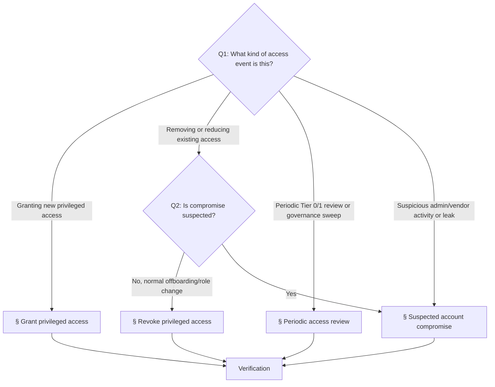

# Playbook: Access governance

> **Last validated:** 2026-05-04 by @Skords-01. **Next review:** 2026-08-02.
> **Status:** Active

**Trigger:** any privileged-access governance event in Sergeant — granting new privileged access, revoking it, running a periodic Tier 0/1 access review, or responding to a suspected account or credential compromise.

## Owner surface

- Primary surface: privileged access governance and security incident response
- Coupled surfaces: Tier 0/1 vendor consoles, machine credentials, secrets register
- Governing skill: `sergeant-review-and-merge`
- Secondary skill: `sergeant-deploy-and-observability` (for the compromise-response branch)

## Required context

- Start with `sergeant-start-here`, then load `sergeant-review-and-merge` (default) or `sergeant-deploy-and-observability` (when responding to a suspected compromise).
- Review [access-policy.md](../security/access-policy.md), [access-matrix.md](../security/access-matrix.md), and [secret-ownership-register.md](../security/secret-ownership-register.md).
- For compromise events, also review [security-incident-policy.md](../governance/security-incident-policy.md) and keep [rotate-secrets.md](./rotate-secrets.md) ready.

## Decision tree — which access event are you handling?

If the event is purely runtime degradation with no access angle, this playbook does not apply — use [investigate-alert.md](./investigate-alert.md) or [hotfix-prod-regression.md](./hotfix-prod-regression.md).

## 1. Grant privileged access

For granting new privileged access to a documented Sergeant surface.

### 1.1 Confirm the request is valid

- Name the exact surface.
- Name the requested access tier.
- Record the business reason.
- Confirm a lower tier cannot solve the need.

### 1.2 Confirm holder type and ownership

- Classify the holder: founder, core engineer, temporary contractor, or machine account.
- Confirm the surface owner approves the grant.
- If temporary, set explicit expiry before access is granted.

### 1.3 Grant the minimum viable access

- Use the vendor role or credential scope that matches the minimum tier.
- Avoid personal admin escalation when read-only or scoped project access is enough.
- Do not create undocumented shared accounts.

### 1.4 Record the grant

- Update the access note, ticket, or PR with: surface, holder, tier, owner, reason, expiry if temporary.

## 2. Revoke privileged access

For offboarding, role reduction, expired contractor access, or a decision that an actor no longer needs privileged access.

### 2.1 Identify all affected surfaces

- List every vendor, environment, and machine credential touched by the actor.
- Confirm whether any access was indirect through shared project membership or release tooling.

### 2.2 Revoke vendor access first

- Remove membership, role, or token access on the documented surfaces.
- Prefer immediate removal to "we will clean it later".

### 2.3 Rotate if needed

- If the actor had access to shared credentials, recovery mailboxes, or exportable secrets, rotate the impacted secret groups using [rotate-secrets.md](./rotate-secrets.md).

### 2.4 Verify recovery paths remain valid

- Confirm the documented owner still exists for each affected surface.
- Confirm at least one legitimate maintainer can still recover the system.

## 3. Periodic access review

For periodic access review of Tier 0 and Tier 1 systems, or a governance sweep after staffing, vendor, or infra changes.

### 3.1 Review Tier 0 surfaces

- Verify owner is still correct.
- Verify holder list is still justified.
- Remove any stale, redundant, or undocumented access.

### 3.2 Review Tier 1 surfaces

- Look for over-privileged roles where read-only would be enough.
- Look for stale contractors or machine credentials without a clear purpose.
- Confirm every surface still has one owner.

### 3.3 Record actions

- Open revoke follow-ups for stale access (use § Revoke privileged access).
- Open rotation follow-ups for ambiguous shared credentials.
- Update the matrix or ownership register if a new surface appeared.

## 4. Suspected account compromise

For suspicious admin login, leaked maintainer session, suspicious vendor-console activity, or any sign that a privileged account or machine credential may be compromised.

### 4.1 Classify and freeze

- Name the affected privileged surface.
- Estimate severity using [security-incident-policy.md](../governance/security-incident-policy.md).
- Disable or sign out the suspected account or token first if the platform allows it.

### 4.2 Inventory blast radius

- Identify what systems the account or credential could touch.
- Capture timestamps, vendor audit logs, and any suspicious actions.

### 4.3 Revoke and rotate

- Remove the compromised or suspicious access (see § Revoke privileged access for the mechanical steps).
- Rotate any secret or token that may have been exposed via [rotate-secrets.md](./rotate-secrets.md).
- If multiple surfaces are linked, coordinate the order explicitly.

### 4.4 Open the incident log

- Record severity, affected surfaces, mitigation path, and verification steps.
- If user, billing, or auth impact is plausible, note the notification decision.

### 4.5 Verify recovery

- Confirm least-privilege state is restored.
- Confirm service owners and recovery paths remain valid.
- Route to [write-postmortem.md](./write-postmortem.md) when required.

## Verification

- [ ] Affected surface(s) named explicitly
- [ ] Tier and owner approval recorded (grant) or all linked surfaces enumerated (revoke / compromise)
- [ ] Expiry recorded for any temporary access
- [ ] Vendor access removed where required (revoke / compromise)
- [ ] Secret rotation triggered for shared credentials touched by the change
- [ ] For compromise: incident log opened with severity and affected surfaces
- [ ] Recovery ownership still valid after the change

## When not to use this playbook

- The change is purely rotating a secret for an existing owner → [rotate-secrets.md](./rotate-secrets.md).
- The event is purely runtime degradation with no access-compromise angle → [investigate-alert.md](./investigate-alert.md).

## Related playbooks and skills

- [rotate-secrets.md](./rotate-secrets.md)
- [declare-incident.md](./declare-incident.md)
- [write-postmortem.md](./write-postmortem.md)
- [run-weekly-operator-digest.md](./run-weekly-operator-digest.md)
- Skill: `sergeant-review-and-merge`
- Skill: `sergeant-deploy-and-observability` (compromise branch)
