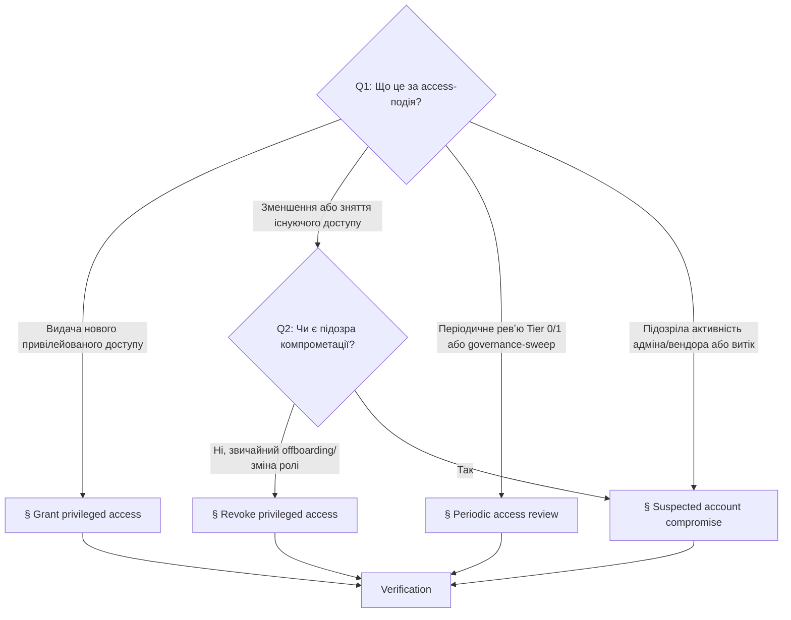

# Playbook: Управління привілейованим доступом (access governance)

> **Last validated:** 2026-05-13 by @andrijvigrav. **Next review:** 2026-08-11.
> **Status:** Active

**Trigger:** будь-яка подія governance привілейованого доступу в Sergeant — видача нового привілейованого доступу, його відкликання, проведення періодичного ревʼю Tier 0/1 доступів або реакція на підозру компрометації акаунта чи credential-у.

## Owner surface

- Primary surface: governance привілейованого доступу і реакція на security-інциденти
- Coupled surfaces: vendor-консолі Tier 0/1, machine credentials, secrets register
- Governing skill: `sergeant-review-and-merge`
- Secondary skill: `sergeant-deploy-and-observability` (для гілки реакції на компрометацію)

## Required context

- Почни з `sergeant-start-here`, потім завантаж `sergeant-review-and-merge` (за замовчуванням) або `sergeant-deploy-and-observability` (якщо реагуєш на підозру компрометації).
- Перевір [access-policy.md](../security/access-policy.md), [access-matrix.md](../security/access-matrix.md) і [secret-ownership-register.md](../security/secret-ownership-register.md).
- Для подій компрометації додатково перевір [security-incident-policy.md](../governance/security-incident-policy.md) і тримай напохваті [rotate-secrets.md](./rotate-secrets.md).

## Decision tree — яку access-подію ти обробляєш?

Якщо подія — це чисто runtime-деградація без access-кута, цей playbook не застосовується — використовуй [investigate-alert.md](./investigate-alert.md) або [hotfix-prod-regression.md](./hotfix-prod-regression.md).

## 1. Grant privileged access

Для видачі нового привілейованого доступу до задокументованої поверхні Sergeant.

### 1.1 Підтверди, що запит валідний

- Назви точну поверхню.
- Назви запитуваний tier доступу.
- Зафіксуй причину з боку бізнесу.
- Підтверди, що нижчий tier не покриває потребу.

### 1.2 Підтверди тип holder-а і ownership

- Класифікуй holder-а: founder, core-інженер, тимчасовий контрактор або machine account.
- Підтверди, що owner поверхні апрувить видачу.
- Якщо доступ тимчасовий — встанови явний термін дії ще до видачі.

### 1.3 Видавай мінімально потрібний доступ

- Використай vendor-роль або credential-scope, що відповідає мінімальному tier-у.
- Не ескалюй до особистого admin-у, якщо вистачає read-only або scoped project access.
- Не створюй незадокументованих shared-акаунтів.

### 1.4 Залогуй видачу

- Онови access-нотатку, тікет або PR з полями: поверхня, holder, tier, owner, причина, термін дії (якщо тимчасовий).

## 2. Revoke privileged access

Для offboarding-у, зменшення ролі, експірейтнутого контракторського доступу або рішення, що актор більше не потребує привілейованого доступу.

### 2.1 Ідентифікуй усі зачеплені поверхні

- Перелічи кожен vendor, середовище і machine credential, до яких актор мав доступ.
- Підтверди, чи не було непрямого доступу через shared-членство в проєкті або release-тулінг.

### 2.2 Спершу зніми vendor-доступ

- Видали membership, роль або token-доступ на задокументованих поверхнях.
- Краще негайне видалення, ніж «приберемо потім».

### 2.3 Ротуй секрети, якщо треба

- Якщо актор мав доступ до shared credentials, recovery-мейлбоксів або експортованих секретів — ротуй відповідні групи секретів через [rotate-secrets.md](./rotate-secrets.md).

### 2.4 Перевір валідність шляхів відновлення

- Підтверди, що задокументований owner усе ще існує для кожної зачепленої поверхні.
- Підтверди, що принаймні один легітимний maintainer усе ще може відновити систему.

## 3. Periodic access review

Для періодичного ревʼю доступів Tier 0 і Tier 1 систем, або governance-sweep-у після кадрових / vendor-их / інфраструктурних змін.

### 3.1 Ревʼю поверхонь Tier 0

- Перевір, що owner усе ще правильний.
- Перевір, що список holder-ів усе ще обґрунтований.
- Зніми будь-який застарілий, надлишковий або незадокументований доступ.

### 3.2 Ревʼю поверхонь Tier 1

- Шукай ролі з надлишковими правами, де достатньо було б read-only.
- Шукай застарілих контракторів або machine credentials без явної мети.
- Підтверди, що в кожної поверхні є один owner.

### 3.3 Залогуй дії

- Відкрий revoke follow-up-и для stale-доступів (використовуй § Revoke privileged access).
- Відкрий rotation follow-up-и для неоднозначних shared credentials.
- Онови матрицю або ownership-register, якщо зʼявилася нова поверхня.

## 4. Suspected account compromise

Для підозрілого admin-логіна, витоку maintainer-сесії, підозрілої активності у vendor-консолі або будь-якої ознаки, що привілейований акаунт чи machine credential можуть бути скомпрометовані.

### 4.1 Класифікуй і заморозь

- Назви зачеплену привілейовану поверхню.
- Оціни severity згідно з [security-incident-policy.md](../governance/security-incident-policy.md).
- Дисейбли або примусово виходь із підозрілого акаунта/токена першим, якщо платформа це дозволяє.

### 4.2 Інвентаризуй blast-radius

- Визнач, до яких систем акаунт або credential міг дотягнутися.
- Зафіксуй timestamps, audit-логи vendor-а і будь-які підозрілі дії.

### 4.3 Відкликай і ротуй

- Зніми скомпрометований або підозрілий доступ (механіку — у § Revoke privileged access).
- Ротуй будь-який секрет чи token, що міг бути виставлений, через [rotate-secrets.md](./rotate-secrets.md).
- Якщо зачеплено кілька поверхонь — координуй порядок ротацій явно.

### 4.4 Відкрий журнал інциденту

- Зафіксуй severity, зачеплені поверхні, шлях мітигації і кроки верифікації.
- Якщо ймовірний impact на користувачів, біллінг або auth — зафіксуй рішення про нотифікацію.

### 4.5 Перевір відновлення

- Підтверди, що стан least-privilege відновлений.
- Підтверди, що service-owner-и і recovery-шляхи лишаються валідними.
- За потреби — переходь у [write-postmortem.md](./write-postmortem.md).

## Verification

- [ ] Зачеплені поверхні явно названі
- [ ] Tier і owner-апрув залогований (grant) або всі повʼязані поверхні перелічені (revoke / compromise)
- [ ] Термін дії залогований для будь-якого тимчасового доступу
- [ ] Vendor-доступ знятий, де потрібно (revoke / compromise)
- [ ] Тригернута ротація секретів для shared credentials, що були зачеплені
- [ ] Для compromise: відкрито журнал інциденту з severity і зачепленими поверхнями
- [ ] Recovery ownership лишається валідним після змін

## Коли цей playbook НЕ використовувати

- Зміна — це чисто ротація секрета для існуючого owner-а → [rotate-secrets.md](./rotate-secrets.md).
- Подія — це чисто runtime-деградація без access-компроментаційного кута → [investigate-alert.md](./investigate-alert.md).

## Споріднені playbook-и та skills

- [rotate-secrets.md](./rotate-secrets.md)
- [declare-incident.md](./declare-incident.md)
- [write-postmortem.md](./write-postmortem.md)
- [run-weekly-operator-digest.md](./run-weekly-operator-digest.md)
- Skill: `sergeant-review-and-merge`
- Skill: `sergeant-deploy-and-observability` (compromise branch)
