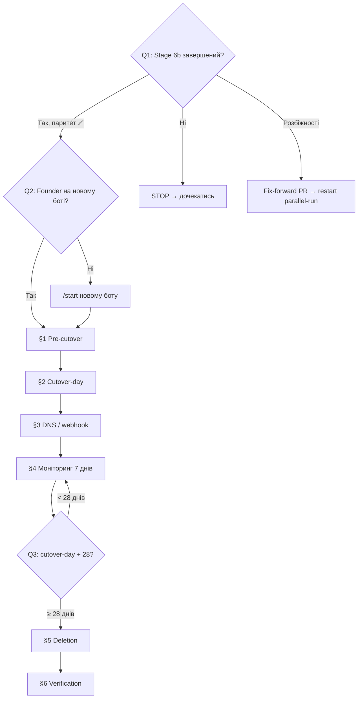

# Playbook: Cutover OpenClaw на зовнішній Gateway (Stage 7)

> **Last validated:** 2026-05-13 by @Skords-01. **Next review:** 2026-08-11.
> **Status:** Active

**Trigger:** Stage 6b parallel-run завершений, founder підтвердив паритет Gateway з grammy-ботом. Готовність до перемикання production-трафіку з `@OpenClaw_sergeant_bot` (grammy) на `@kOPENCLAW_GATEWAY_BOT` (OpenClaw Gateway).

## Owner surface

- Primary surface: `packages/openclaw-plugin/`, `ops/openclaw/`, Railway service `sergeant-openclaw-gateway`
- Coupled surface: `tools/console/src/openclaw/`, `tools/console/src/agents/{openclaw,personas,strategic-modes,dispatcher}.ts`, Railway service `Sergeant` (env-vars)
- Governing skill: `sergeant-deploy-and-observability`
- Governing ADR: [ADR-0055](../adr/0055-openclaw-external-gateway.md) § cutover
- Governing plan: [`openclaw-migration-plan.md`](../planning/openclaw-migration-plan.md) — Locked Decision #17

---

## Decision Tree

**Q1: Чи завершений Stage 6b parallel-run (≥1 тиждень)?**

- Так, founder підтвердив паритет → Q2
- Ні, parallel-run ще йде → **STOP** → дочекайся завершення, повторюй smoke-тести
- Parallel-run виявив розбіжності → **STOP** → відкрий fix-forward PR, перезапусти parallel-run

**Q2: Чи є active Telegram conversations з founder-ом на новому боті (`@kOPENCLAW_GATEWAY_BOT`)?**

- Так, founder вже спілкується через новий бот → [§1 Pre-cutover checklist](#1-pre-cutover-checklist)
- Ні, founder ще на старому боті → попроси founder надіслати `/start` новому боту, потім [§1](#1-pre-cutover-checklist)

**Q3: Скільки часу після cutover-day?**

- < 28 днів → [§4 Monitoring](#4-моніторинг-перших-7-днів) (grammy-fallback ще живий)
- ≥ 28 днів → [§5 Deletion](#5-видалення-grammy-коду-cutover-day--28-днів) (Locked Decision #17)



---

## Background (Original Steps)

### 1. Pre-cutover checklist

Перед cutover-day переконайся що **все** на місці:

- [ ] **Stage 6a parity-harness зелена у CI** — `pnpm --filter @sergeant/openclaw-plugin test` = 351/351 (або більше).
- [ ] **Stage 6b parallel-run ≥1 тиждень** — founder щоденно використовував `/plan`, `/analyze`, `/okr`, `/council`, `/metrics`, `/runway` на обох ботах, підтвердив паритет.
- [ ] **Gateway production smoke** — перевір що Gateway live:

```bash
# Health-check Gateway
curl -s https://sergeant-openclaw-gateway-production.up.railway.app/health

# Telegram bot identity
curl -s "https://api.telegram.org/bot${OPENCLAW_GATEWAY_BOT_TOKEN}/getMe"

# Webhook active
curl -s "https://api.telegram.org/bot${OPENCLAW_GATEWAY_BOT_TOKEN}/getWebhookInfo"
```

- [ ] **Railway env-vars повні** (для `sergeant-openclaw-gateway` service):

| Змінна                        | Очікуване                               |
| ----------------------------- | --------------------------------------- |
| `ANTHROPIC_API_KEY`           | `sk-ant-api03-…`                        |
| `INTERNAL_API_KEY`            | 64-char hex                             |
| `SERVER_INTERNAL_URL`         | `http://sergeant.railway.internal:8080` |
| `OPENCLAW_GATEWAY_AUTH_TOKEN` | 48-char hex                             |
| `OPENCLAW_GATEWAY_BOT_TOKEN`  | Telegram bot token                      |
| `OPENCLAW_FOUNDER_TG_USER_ID` | `319824665`                             |
| `OPENCLAW_FOUNDER_USER_ID`    | Better Auth opaque string               |
| `OPENCLAW_DAILY_USD_BUDGET`   | `5.0`                                   |
| `OPENCLAW_COUNCIL_USD_BUDGET` | `2.0`                                   |
| `OPENCLAW_MAX_ITERATIONS`     | `8`                                     |
| `OPENCLAW_USE_WEBHOOK`        | `true`                                  |
| `OPENCLAW_WEBHOOK_URL`        | `https://…/webhook/openclaw`            |
| `OPENCLAW_WEBHOOK_SECRET`     | ≥32 chars                               |
| `OPENCLAW_RATE_LIMIT_PER_MIN` | `10`                                    |

- [ ] **Persistent volume** mounted — `RAILWAY_VOLUME_MOUNT_PATH=/root/.openclaw`, 5 GB.
- [ ] **Morning-digest cron** working — `~/.openclaw/cron/jobs.json` має `digest-day` job, schedule `"0 9 * * *"` Europe/Kyiv.
- [ ] **GitHub App auth** — НЕ PAT. Main Sergeant service має `OPENCLAW_GITHUB_APP_ID` + `OPENCLAW_GITHUB_APP_PRIVATE_KEY` + `OPENCLAW_GITHUB_APP_INSTALLATION_ID` (Hard Rule #20).
- [ ] **Rollback plan** — founder знає: якщо Gateway падає, повертається у DM `@OpenClaw_sergeant_bot` (grammy ще живий).

### 2. Cutover-day

**Порядок операцій (zero-downtime для founder-а):**

**2.1. Переконайся що Gateway працює:**

```bash
# Надішли тестове повідомлення через Gateway бот
# Founder: /metrics → має повернути canned Markdown ≤2 сек
# Founder: /plan тест → має активувати strategic mode
```

**2.2. Вимкни grammy OpenClaw бот:**

Видали `OPENCLAW_BOT_TOKEN` з Railway env-vars main Sergeant service:

```bash
# Railway Dashboard → Project: Sergeant → Service: Sergeant → Variables
# Видали: OPENCLAW_BOT_TOKEN
# Redeploy service
```

Або через Railway API:

```bash
# Unset OPENCLAW_BOT_TOKEN on main Sergeant service
curl -s -H "Authorization: Bearer ${RAILWAY_TOKEN}" -H "Content-Type: application/json" \
  -X POST https://backboard.railway.app/graphql/v2 \
  -d '{
    "query": "mutation($input: VariableUpsertInput!) { variableUpsert(input: $input) }",
    "variables": {
      "input": {
        "projectId": "eaa696f9-e197-4b76-9645-0e62ce51bb18",
        "environmentId": "81b68dcb-0107-44ba-b719-df445ea71c71",
        "serviceId": "accea0e9-a138-45a3-bff1-58a9bae8ff6c",
        "name": "OPENCLAW_BOT_TOKEN",
        "value": ""
      }
    }
  }'
```

Після redeploy `tools/console` покаже warning:

```
OpenClaw not started: OPENCLAW_BOT_TOKEN is not set (Phase 1 fail-closed).
```

Це очікувана поведінка — grammy bot graceful-shutdown.

**2.3. Unregister grammy Telegram webhook:**

```bash
# Зніми webhook зі старого бот-токена (щоб Telegram не слав updates у порожнечу)
curl -s "https://api.telegram.org/bot${OLD_OPENCLAW_BOT_TOKEN}/deleteWebhook"
```

**2.4. Оголоси founder-у:**

> ✅ Cutover завершено. Від сьогодні DM тільки з `@kOPENCLAW_GATEWAY_BOT`. Старий `@OpenClaw_sergeant_bot` — read-only fallback ще 28 днів, потім видалю код.

**2.5. Зафіксуй cutover-day:**

Онови `docs/planning/openclaw-migration-plan.md`:

- Stage 7 row: `⬜` → `✅`
- Додай: `cutover-day: YYYY-MM-DD`

### 3. DNS / webhook верифікація

Після cutover:

```bash
# 1. Gateway webhook жива
curl -s "https://api.telegram.org/bot${OPENCLAW_GATEWAY_BOT_TOKEN}/getWebhookInfo" | python3 -m json.tool

# Очікуємо:
# "url": "https://sergeant-openclaw-gateway-production.up.railway.app/webhook/openclaw"
# "has_custom_certificate": false
# "pending_update_count": 0 (або мале число)

# 2. Старий бот без webhook
curl -s "https://api.telegram.org/bot${OLD_OPENCLAW_BOT_TOKEN}/getWebhookInfo" | python3 -m json.tool
# Очікуємо: "url": ""

# 3. Gateway health
curl -s https://sergeant-openclaw-gateway-production.up.railway.app/health

# 4. Live smoke — founder надсилає в DM @kOPENCLAW_GATEWAY_BOT:
#    /metrics   → canned Markdown, ≤2 сек, $0 LLM
#    /runway    → canned Markdown, ≤2 сек, $0 LLM
#    /plan тест → strategic mode activation
#    /council Яка наша стратегія? → 6-persona round-table ($2 cap)
#    Дай метрики → Layer 0 shortcut (UA)
#    Як справи?  → Layer 2 Sonnet agent
```

### 4. Моніторинг перших 7 днів

| День | Перевірка                                                        |
| ---- | ---------------------------------------------------------------- |
| D+0  | Усі 6 smoke-команд з §3 працюють                                 |
| D+1  | Morning-digest прийшов о 09:00 Kyiv                              |
| D+1  | Railway logs: 0 unhandled exceptions                             |
| D+3  | `/budget` — daily spend у нормі (< $5/day)                       |
| D+3  | `openclaw_invocations` table — рядки з'являються (audit working) |
| D+7  | Founder feedback: «все ок, паритет»                              |

**Якщо щось не так — rollback:**

1. Поверни `OPENCLAW_BOT_TOKEN` у main Sergeant service env-vars.
2. Redeploy Sergeant → grammy bot стартує.
3. Founder переходить у DM `@OpenClaw_sergeant_bot`.
4. Debug Gateway issue окремим PR.

### 5. Видалення grammy-коду (cutover-day + 28 днів)

> **Locked Decision #17:** видалення `tools/console/src/openclaw/` + `agents/{openclaw,personas,strategic-modes,dispatcher}.ts` через 28 днів після cutover-day.

**5.1. Файли до видалення:**

```
tools/console/src/openclaw/              # 27 файлів, ~4800 LOC
├── alerts-format.ts (+test)
├── approval-store.ts (+test)
├── audit-csv.ts (+test)
├── bootstrap.ts (+test)
├── commands.ts (+test)
├── duration.ts (+test)
├── handler.ts
├── handler-agent-turn.ts
├── handler-audit.ts
├── handler-commands.ts
├── handler-constants.ts
├── index.ts
├── parse-mode-guard.test.ts
├── policy.ts (+test)
├── security.ts (+test)
├── session.ts (+test)
└── webhook.ts (+test)

tools/console/src/agents/
├── openclaw.ts (+test)           # grammy OpenClaw agent loop
├── personas.ts (+test)           # grammy persona definitions
├── strategic-modes.ts            # legacy primers (drift-gate source)
├── dispatcher.ts (+test +contract-test)  # grammy dispatch router

packages/openclaw-plugin/src/legacy/     # 107 файлів, ~12600 LOC
└── (entire directory — pre-rewrite reference code)
```

**5.2. Залежності на видалені файли:**

```bash
# Перед видаленням — перевір що нічого не імпортує ці модулі ззовні
grep -rn "openclaw/approval-store\|openclaw/policy\|openclaw/bootstrap\|openclaw/webhook\|openclaw/commands\|openclaw/handler\|openclaw/session\|openclaw/security\|openclaw/duration\|openclaw/audit-csv\|openclaw/alerts-format" \
  --include="*.ts" --include="*.tsx" --include="*.mjs" . | grep -v node_modules | grep -v "tools/console/"
```

**5.3. Оновлення `tools/console/src/index.ts`:**

Видали:

- `import { attachOpenClawHandlers } from "./openclaw/index.js";`
- `import { registerOpenClawWebhook, shouldUseWebhook, unregisterOpenClawWebhook } from "./openclaw/bootstrap.js";`
- `import { registerOpenClawBotCommands } from "./openclaw/commands.js";`
- `import { createOpenClawWebhookServer } from "./openclaw/webhook.js";`
- Увесь блок `const openclawToken = process.env["OPENCLAW_BOT_TOKEN"]` → `openclawPromise`.

**5.4. Railway env-var cleanup (main Sergeant service):**

Видали (якщо ще лишилися):

- `OPENCLAW_BOT_TOKEN` (має бути вже пустий з §2.2)
- `OPENCLAW_FOUNDER_TG_USER_ID` — залиш, якщо server-side OpenClaw tools ще використовують
- `OPENCLAW_USE_WEBHOOK`, `OPENCLAW_WEBHOOK_URL`, `OPENCLAW_WEBHOOK_SECRET`, `OPENCLAW_WEBHOOK_PATH` — grammy-specific, Gateway має свої

**5.5. Drift-gate update:**

Після видалення `tools/console/src/agents/strategic-modes.ts` (drift-gate source), оновити drift-gate тести у `packages/openclaw-plugin/`:

- `src/strategic-modes/index.test.ts` — drift-gate тести що читають з `tools/console/src/agents/strategic-modes.ts`
- Зміни reference на canonical source в самому плагіні (primers стають standalone, не drift-locked)

**5.6. Commit і PR:**

```
feat(openclaw): видалення grammy fallback (Stage 7 cleanup)

Locked Decision #17: cutover-day + 28 днів.
Видалено:
- tools/console/src/openclaw/ (27 файлів, ~4800 LOC)
- tools/console/src/agents/{openclaw,personas,strategic-modes,dispatcher}.ts
- packages/openclaw-plugin/src/legacy/ (107 файлів, ~12600 LOC)
- grammy-specific env-vars з Railway main Sergeant service

BREAKING CHANGE: grammy OpenClaw bot більше не запускається.
Production traffic — виключно через sergeant-openclaw-gateway.
```

### 6. Post-deletion verification

```bash
# 1. CI зелений
pnpm check   # format:check + lint + typecheck + test + build

# 2. Sergeant service стартує без OpenClaw warnings
# Railway logs → "OpenClaw not started" warning має зникнути
# (бо import-и видалені, а не просто env пустий)

# 3. Gateway не зачеплений
pnpm --filter @sergeant/openclaw-plugin test   # має проходити без legacy/

# 4. Bundle size
pnpm --filter @sergeant/web exec size-limit    # ≤ 820 kB JS brotli

# 5. Knip — жодних dangling imports
pnpm dead-code:files
```

---

## Verification

- [ ] Gateway live smoke: `/metrics`, `/runway`, `/plan`, `/council`, UA `Дай метрики`, вільний текст → Layer 2
- [ ] Grammy bot зупинений: `OPENCLAW_BOT_TOKEN` пустий / відсутній на main Sergeant service
- [ ] Grammy Telegram webhook знятий: `getWebhookInfo` повертає `url: ""`
- [ ] Morning-digest cron працює через Gateway (09:00 Kyiv)
- [ ] `openclaw_invocations` table отримує нові рядки
- [ ] (D+28) Grammy-код видалений, CI зелений, drift-gates оновлені

## Notes

- **Hard Rule #20:** жодних `OPENCLAW_GITHUB_PAT` / `Git_PAT` у production. Gateway використовує server-side GitHub App flow.
- **Locked Decision #17:** grammy deletion = cutover-day + 28 днів. Раніше — тільки з explicit founder approval.
- **Rollback window:** 28 днів. Після deletion — rollback потребує revert-PR.
- **`privatik-openclaw` Railway project:** окремий project з `openclaw-gateway`, `Postgres`, `n8n`, `n8n-postgres`. Це НЕ production Gateway (production = `sergeant-openclaw-gateway` у Sergeant project). Не чіпай `privatik-openclaw` без окремого рішення.

## See also

- [AGENTS.md](../../AGENTS.md) — hard rules
- [ADR-0055](../adr/0055-openclaw-external-gateway.md) — Phase 0 infra + cutover architecture
- [`openclaw-migration-plan.md`](../planning/openclaw-migration-plan.md) — повний Stage tracker
- [`rotate-openclaw-credentials.md`](./rotate-openclaw-credentials.md) — ротація GitHub App credentials
- [`cleanup-dead-code.md`](./cleanup-dead-code.md) — generic dead-code removal process
- [`release-web-and-api.md`](./release-web-and-api.md) — deploy process for Sergeant main service
