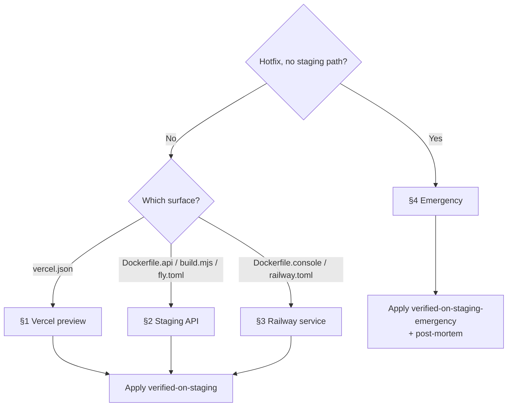

# Playbook: Deploy-config change (vercel / fly / railway / Dockerfile)

> **Last validated:** 2026-05-05 by @Skords-01. **Next review:** 2026-08-03.
> **Status:** Active

**Trigger:** PR has non-comment changes to deploy-config files (`vercel.json`, `fly.toml`, `railway.toml`, `Dockerfile*`, `Caddyfile`, `apps/server/build.mjs`) — `Deploy-config staging gate` CI fails without a verification label.

## Owner surface

- Primary surface: production deploy pipeline (Vercel / Railway / Fly / build-tooling)
- Governing skill: `sergeant-deploy-and-observability`

## Required context

- Start with `sergeant-start-here`, then open `sergeant-deploy-and-observability`.
- Review [vercel.md](../deploy/vercel.md), [service-catalog.md](../architecture/service-catalog.md), [release-policy.md](../governance/release-policy.md).
- Vercel SSOT note: `apps/web/vercel.json` is canonical. Vercel Project «Root Directory» = `apps/web`. Adding a second `vercel.json` (e.g. at the monorepo root) is forbidden — `pnpm lint` enforces this via `scripts/check-vercel-config.sh`.

## Why this playbook exists

PR #1595 → PR #1600 — «Vercel SSOT-flip». A deploy-config edit at the monorepo root passed all CI but broke production immediately because no human had verified the change against a real edge-cached Vercel deploy. CI cannot replace human verification of edge-served / edge-cached config — humans must.

This playbook defines what «verified on staging» means for each deploy-config surface and how to apply the verification label so [`deploy-config-staging-gate.yml`](../../.github/workflows/deploy-config-staging-gate.yml) passes.

## Decision Tree

**Q1: Is this a true production hotfix that cannot be exercised on staging?**

- No → continue to Q2 (normal flow).
- Yes → [§4 Emergency escape-hatch](#4-emergency-escape-hatch). Requires a post-mortem commitment in the PR body.

**Q2: Which surface does the change touch?**

- `apps/web/vercel.json` → [§1 Verify Vercel preview](#1-verify-vercel-preview).
- `Dockerfile.api`, `apps/server/build.mjs`, `fly.toml` (api) → [§2 Verify staging API deploy](#2-verify-staging-api-deploy).
- `Dockerfile.console`, `railway.toml` (console / alloy) → [§3 Verify Railway service](#3-verify-railway-service).
- Multiple — apply each relevant section before labelling.

---

## Steps

### 1. Verify Vercel preview

1. Wait for the Vercel preview deploy to publish on the PR (status check «Vercel» = success, link in PR comments).
2. Open the preview URL. Smoke-test the critical-flow page that depends on the changed config:
   - Headers (`Content-Security-Policy`, `Permissions-Policy`, `Strict-Transport-Security`) — use DevTools «Network» panel; compare against current production.
   - Rewrites / redirects you changed — manually navigate the affected paths.
   - Edge-cached pages — hard-reload (Cmd+Shift+R / Ctrl+Shift+R) and check `cache-control` header.
3. Verify the build artifacts on the preview don't contain unexpected files (`/api/*`, hidden dotfiles, etc.). Use the «Vercel Inspect» link or `curl -I`.
4. Watch Vercel logs (Project → Logs) for ~30 seconds: no 5xx spike, no edge-config errors.
5. If everything is green, apply label `verified-on-staging`.

### 2. Verify staging API deploy

1. Push the branch, wait for CI to pass.
2. Manually trigger a deploy to staging Fly app (`fly deploy --app sergeant-api-staging --config fly.staging.toml --image-label devin-test`) **or** ask a maintainer to deploy your branch to staging.
3. Smoke-test:
   - `/health` returns 200 with expected JSON shape.
   - `/health/liveness`, `/health/readiness`, `/health/startup` (if relevant) — see [add-sql-migration.md](./add-sql-migration.md) for migration-aware probes.
   - Run one auth flow end-to-end via the staging web client.
4. Watch staging Fly logs for ~5 minutes (or two deploy cycles, whichever is longer). No 5xx, no migration loop, no boot-loop.
5. If everything is green, apply label `verified-on-staging`.

### 3. Verify Railway service

1. Apply the change to a staging Railway project (or a temporary fork). Configuration changes in `railway.toml` (start commands, env, replica count) MUST be cycled through a real deploy.
2. Confirm the service starts cleanly (Railway → Service → Deployments → latest → no restart loop).
3. If the service is `tools/console` (Telegram bot), verify with a `/help` ping in the staging Telegram bot. If the service is `ops/grafana-alloy`, verify metrics ingestion in staging Grafana.
4. Apply label `verified-on-staging`.

### 4. Emergency escape-hatch

True production hotfixes that cannot be exercised on staging (e.g. CDN-edge config that only Vercel applies, kill-switch toggling) may use the `verified-on-staging-emergency` label. The label is **not** a free pass:

1. The PR body MUST include:
   - Why staging cannot be exercised (e.g. «only the production Vercel project has the edge-config binding»).
   - Mitigation plan if the change misbehaves (rollback commit SHA, kill-switch path, on-call rotation).
   - Commitment to a post-mortem within 7 calendar days, linked in `docs/incidents/`.
2. At least one second pair of eyes from `@Skords-01` (or designated reviewer) on the PR before merge.
3. Watch production logs / Sentry for the first 30 minutes after deploy.
4. File the post-mortem; reference this PR.

---

## Verification

- [ ] Surface identified (web / API / Railway service / multiple).
- [ ] Smoke test on the matching staging environment passed.
- [ ] Logs / Sentry watched for the relevant window without anomalies.
- [ ] Label applied: `verified-on-staging` OR `verified-on-staging-emergency` + post-mortem commitment.
- [ ] CI job `Deploy-config staging gate` passes.

## When not to use this playbook

- Change is docs-only / comment-only inside a deploy-config file — the gate auto-skips it (every changed line is a comment in the file's syntax).
- Change is purely in source code that happens to be _imported_ by `apps/server/build.mjs` (e.g. `apps/server/src/...`). Only `build.mjs` itself is gated.
- Adding a brand-new app's deploy-config (treat as an architecture change, write an ADR first).

## Related playbooks and skills

- [release-web-and-api.md](./release-web-and-api.md) — full release flow that includes deploy-config changes.
- [hotfix-prod-regression.md](./hotfix-prod-regression.md) — how to recover when the gate is bypassed and the change broke prod.
- [write-postmortem.md](./write-postmortem.md) — required after `verified-on-staging-emergency`.
- Skill: `sergeant-deploy-and-observability`

## Notes

- The CI job source: [`.github/workflows/deploy-config-staging-gate.yml`](../../.github/workflows/deploy-config-staging-gate.yml). Logic: [`scripts/ci/check-deploy-config-staging-gate.mjs`](../../scripts/ci/check-deploy-config-staging-gate.mjs).
- Initiative ref: [`docs/initiatives/0011-foundation-adoption-and-process-discipline.md`](../initiatives/0011-foundation-adoption-and-process-discipline.md) §Фаза 1 → PR 1.3.
- Closes type-incident PR #1595 → PR #1600.
