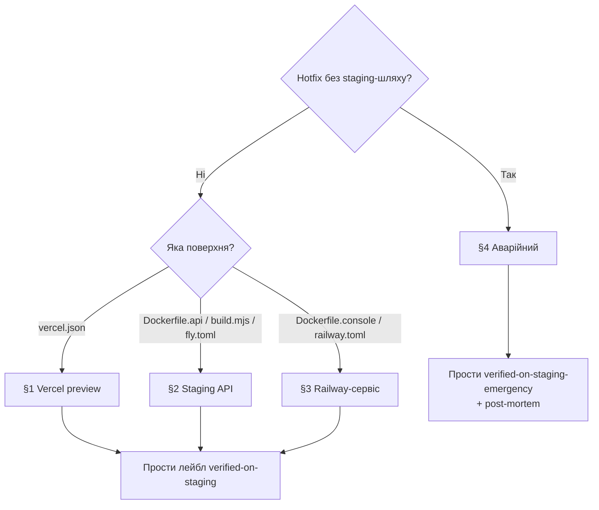

# Playbook: Зміна deploy-config (vercel / fly / railway / Dockerfile)

> **Last validated:** 2026-05-05 by @Skords-01. **Next review:** 2026-08-04.
> **Status:** Active

**Trigger:** PR має non-comment-зміни у файлах deploy-config (`vercel.json`, `fly.toml`, `railway.toml`, `Dockerfile*`, `Caddyfile`, `apps/server/build.mjs`) — CI-job `Deploy-config staging gate` фейлиться без verification-лейбла.

## Owner surface

- Primary surface: production deploy pipeline (Vercel / Railway / Fly / build-tooling)
- Governing skill: `sergeant-deploy-and-observability`

## Required context

- Почни з `sergeant-start-here`, потім відкрий `sergeant-deploy-and-observability`.
- Перевір [vercel.md](../deploy/vercel.md), [service-catalog.md](../architecture/service-catalog.md), [release-policy.md](../governance/release-policy.md).
- Vercel SSOT-нотатка: `apps/web/vercel.json` — канонічний. Vercel Project «Root Directory» = `apps/web`. Додавання другого `vercel.json` (наприклад, у корені monorepo) заборонено — `pnpm lint` ензорсить це через `scripts/check-vercel-config.sh`.

## Чому існує цей playbook

PR #1595 → PR #1600 — «Vercel SSOT-flip». Зміна deploy-config у корені monorepo пройшла весь CI, але одразу зламала прод, бо жоден людський читач не верифікував зміну на реальному edge-cached Vercel-деплої. CI не може замінити людську верифікацію edge-served / edge-cached config — це мають робити люди.

Цей playbook визначає, що означає «verified on staging» для кожної deploy-config-поверхні і як проставити verification-лейбл, щоб [`deploy-config-staging-gate.yml`](../../.github/workflows/deploy-config-staging-gate.yml) пройшов.

## Decision Tree

**Q1: Це справжній production-hotfix, який не можна прокатати на staging?**

- Ні → продовжуй до Q2 (нормальний flow).
- Так → [§4 Аварійний escape-hatch](#4-аварійний-escape-hatch). Вимагає commitment-у на post-mortem у тілі PR.

**Q2: Яку поверхню зачіпає зміна?**

- `apps/web/vercel.json` → [§1 Перевір Vercel preview](#1-перевір-vercel-preview).
- `Dockerfile.api`, `apps/server/build.mjs`, `fly.toml` (api) → [§2 Перевір staging API-деплой](#2-перевір-staging-api-деплой).
- `Dockerfile.console`, `railway.toml` (console / alloy) → [§3 Перевір Railway-сервіс](#3-перевір-railway-сервіс).
- Кілька — застосуй кожен релевантний розділ перед лейблуванням.

---

## Steps

### 1. Перевір Vercel preview

1. Дочекайся, поки Vercel preview-деплой опублікується на PR (status check «Vercel» = success, посилання у коментарях PR).
2. Відкрий preview-URL. Прогон smoke на critical-flow сторінку, що залежить від зміненого config:
   - Headers (`Content-Security-Policy`, `Permissions-Policy`, `Strict-Transport-Security`) — використай DevTools «Network» panel; порівняй з поточним продом.
   - Rewrites / redirects, що ти змінив — пройди вручну зачеплені шляхи.
   - Edge-cached сторінки — hard-reload (Cmd+Shift+R / Ctrl+Shift+R) і перевір `cache-control` header.
3. Перевір, що build-артефакти на preview не містять несподіваних файлів (`/api/*`, прихованих dotfile-ів тощо). Використай посилання «Vercel Inspect» або `curl -I`.
4. Стеж за Vercel-логами (Project → Logs) ~30 секунд: ні 5xx-сплеску, ні edge-config-помилок.
5. Якщо все зелене — простав лейбл `verified-on-staging`.

### 2. Перевір staging API-деплой

1. Запушай гілку, дочекайся, поки CI пройде.
2. Вручну тригерни деплой у staging Fly-app (`fly deploy --app sergeant-api-staging --config fly.staging.toml --image-label devin-test`) **або** попроси maintainer-а задеплоїти твою гілку на staging.
3. Прогон smoke:
   - `/health` повертає 200 з очікуваним JSON-шейпом.
   - `/health/liveness`, `/health/readiness`, `/health/startup` (якщо релевантно) — див. [add-sql-migration.md](./add-sql-migration.md) для migration-aware probes.
   - Прогон одного auth-flow end-to-end через staging web-client.
4. Стеж за staging Fly-логами ~5 хвилин (або два deploy-cycle-и, що довше). Ні 5xx, ні migration-loop, ні boot-loop.
5. Якщо все зелене — простав лейбл `verified-on-staging`.

### 3. Перевір Railway-сервіс

1. Застосуй зміну в staging Railway-проєкт (або тимчасовий fork). Конфіг-зміни у `railway.toml` (start commands, env, replica count) ОБОВʼЯЗКОВО треба прокатати через реальний деплой.
2. Підтверди, що сервіс стартує чисто (Railway → Service → Deployments → latest → без restart-loop).
3. Якщо сервіс — `tools/console` (Telegram-бот), верифікуй через `/help` пінг у staging-боті. Якщо сервіс — `ops/grafana-alloy`, верифікуй прийом метрик у staging Grafana.
4. Простав лейбл `verified-on-staging`.

### 4. Аварійний escape-hatch

Справжні production-hotfix-и, які не можна прокатати на staging (наприклад, CDN-edge config, що його застосовує тільки Vercel, або toggle kill-switch-у), можуть використовувати лейбл `verified-on-staging-emergency`. Цей лейбл — **не** free pass:

1. Тіло PR ОБОВʼЯЗКОВО має містити:
   - Чому staging не можна прокатати (наприклад, «лише production Vercel-проєкт має edge-config binding»).
   - План мітигації, якщо зміна повелася некоректно (rollback commit SHA, шлях до kill-switch, on-call ротація).
   - Commitment на post-mortem впродовж 7 календарних днів, з посиланням у `docs/incidents/`.
2. Принаймні одна second-pair-of-eyes ревʼю від `@Skords-01` (або призначеного reviewer-а) перед merge.
3. Стеж за production-логами / Sentry перші 30 хвилин після деплою.
4. Подавай post-mortem; постав референс на цей PR.

---

## Verification

- [ ] Поверхня ідентифікована (web / API / Railway-сервіс / кілька).
- [ ] Smoke-тест на відповідному staging-середовищі пройшов.
- [ ] Логи / Sentry відстежено в релевантному вікні — без аномалій.
- [ ] Лейбл проставлений: `verified-on-staging` АБО `verified-on-staging-emergency` + commitment на post-mortem.
- [ ] CI-job `Deploy-config staging gate` проходить.

## Коли цей playbook НЕ використовувати

- Зміна — docs-only / коментар-only всередині deploy-config-файлу — gate автоматично пропускає (кожен змінений рядок є коментарем у синтаксисі цього файлу).
- Зміна — у source-коді, що випадково _імпортується_ `apps/server/build.mjs` (наприклад, `apps/server/src/...`). Гейт стосується лише самого `build.mjs`.
- Додавання deploy-config для зовсім нового app-у (трактуй як архітектурну зміну, спершу напиши ADR).

## Споріднені playbook-и та skills

- [release.md § Web + API](./release.md#1-web--api) — повний release-flow, що включає deploy-config-зміни.
- [hotfix-prod-regression.md](./hotfix-prod-regression.md) — як відновлюватися, коли gate обійшли і зміна зламала прод.
- [write-postmortem.md](./write-postmortem.md) — обовʼязковий після `verified-on-staging-emergency`.
- Skill: `sergeant-deploy-and-observability`

## Notes

- CI-job source: [`.github/workflows/deploy-config-staging-gate.yml`](../../.github/workflows/deploy-config-staging-gate.yml). Logic: [`scripts/ci/check-deploy-config-staging-gate.mjs`](../../scripts/ci/check-deploy-config-staging-gate.mjs).
- Initiative ref: [`docs/initiatives/0011-foundation-adoption-and-process-discipline.md`](../initiatives/0011-foundation-adoption-and-process-discipline.md) §Фаза 1 → PR 1.3.
- Closes type-incident PR #1595 → PR #1600.
