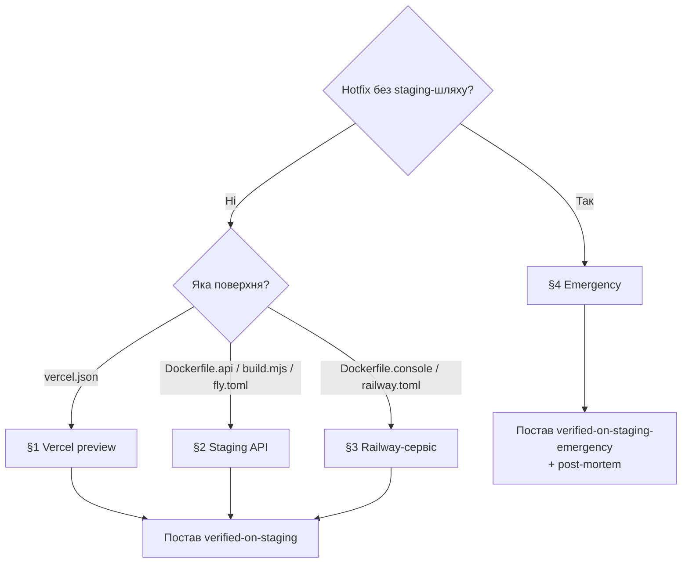

# Playbook: Зміна deploy-конфігу (vercel / fly / railway / Dockerfile)

> **Last validated:** 2026-05-05 by @Skords-01. **Next review:** 2026-08-03.
> **Status:** Active

**Trigger:** PR має non-comment зміни у deploy-config файлах (`vercel.json`, `fly.toml`, `railway.toml`, `Dockerfile*`, `Caddyfile`, `apps/server/build.mjs`) — CI-job `Deploy-config staging gate` падає без verification-лейбла.

## Owner surface

- Primary surface: production deploy pipeline (Vercel / Railway / Fly / build-tooling)
- Governing skill: `sergeant-deploy-and-observability`

## Required context

- Стартуй з `sergeant-start-here`, тоді відкрий `sergeant-deploy-and-observability`.
- Перечитай [vercel.md](../deploy/vercel.md), [service-catalog.md](../architecture/service-catalog.md), [release-policy.md](../governance/release-policy.md).
- Vercel SSOT-нотатка: `apps/web/vercel.json` — канонічний. У Vercel Project «Root Directory» = `apps/web`. Додавати другий `vercel.json` (наприклад, у корені monorepo) **заборонено** — `pnpm lint` енфорсить це через `scripts/check-vercel-config.sh`.

## Чому існує цей playbook

PR #1595 → PR #1600 — «Vercel SSOT-flip». Edit deploy-конфігу у корені monorepo пройшов увесь CI, але одразу зламав продакшн, бо жодна людина не верифікувала зміну на реальному edge-cached Vercel-деплої. CI **не може** замінити людську верифікацію edge-served / edge-cached конфігу — мусять люди.

Цей playbook визначає, що означає «verified on staging» для кожної deploy-config поверхні і як ставити verification-лейбл, щоб [`deploy-config-staging-gate.yml`](../../.github/workflows/deploy-config-staging-gate.yml) проходив.

## Дерево рішень

**Q1: Чи це справжній production hotfix, який неможливо прокатати на staging?**

- Ні → продовжуй до Q2 (нормальний flow).
- Так → [§4 Emergency escape-hatch](#4-emergency-escape-hatch). Потрібне зобовʼязання написати post-mortem у тілі PR.

**Q2: Яку поверхню зачіпає зміна?**

- `apps/web/vercel.json` → [§1 Перевір Vercel preview](#1-перевір-vercel-preview).
- `Dockerfile.api`, `apps/server/build.mjs`, `fly.toml` (api) → [§2 Перевір staging-деплой API](#2-перевір-staging-деплой-api).
- `Dockerfile.console`, `railway.toml` (console / alloy) → [§3 Перевір Railway-сервіс](#3-перевір-railway-сервіс).
- Кілька — застосуй кожну релевантну секцію перед тим, як ставити лейбл.

---

## Кроки

### 1. Перевір Vercel preview

1. Дочекайся, поки Vercel preview-деплой опублікується на PR (статус-чек «Vercel» = success, лінк у коментарях PR).
2. Відкрий preview URL. Прожени smoke на сторінку критичного flow, що залежить від зміненого конфігу:
   - Заголовки (`Content-Security-Policy`, `Permissions-Policy`, `Strict-Transport-Security`) — використай DevTools «Network» panel; порівняй з поточним продакшном.
   - Rewrites / redirects, які ти змінив — пройди вручну зачеплені шляхи.
   - Edge-cached сторінки — hard-reload (Cmd+Shift+R / Ctrl+Shift+R) і перевір `cache-control`.
3. Перевір build-артефакти на preview, щоб не було несподіваних файлів (`/api/*`, hidden dotfiles тощо). Використай «Vercel Inspect» або `curl -I`.
4. Подивись Vercel-логи (Project → Logs) ~30 секунд: жодного 5xx-сплеска, жодних edge-config помилок.
5. Якщо все зелене — постав лейбл `verified-on-staging`.

### 2. Перевір staging-деплой API

1. Запушай гілку, дочекайся проходження CI.
2. Вручну тригерни deploy на staging Fly-app (`fly deploy --app sergeant-api-staging --config fly.staging.toml --image-label devin-test`) **або** попроси maintainer-а задеплоїти твою гілку на staging.
3. Smoke:
   - `/health` повертає 200 з очікуваною формою JSON.
   - `/health/liveness`, `/health/readiness`, `/health/startup` (якщо релевантно) — див. [add-sql-migration.md](./add-sql-migration.md) для migration-aware probe-ів.
   - Прожени один auth-flow end-to-end через staging web-клієнт.
4. Подивись staging Fly-логи ~5 хвилин (або два deploy-цикли — що довше). Жодних 5xx, migration-loop або boot-loop.
5. Якщо все зелене — постав лейбл `verified-on-staging`.

### 3. Перевір Railway-сервіс

1. Застосуй зміну до staging Railway-проекту (або тимчасового форку). Зміни конфігу в `railway.toml` (start commands, env, replica count) **обовʼязково** мають пройти через реальний deploy.
2. Підтверди, що сервіс стартує чисто (Railway → Service → Deployments → latest → жодного restart-loop).
3. Якщо сервіс — `tools/console` (Telegram-бот), верифікуй `/help` ping-ом у staging Telegram-бот. Якщо `ops/grafana-alloy` — верифікуй ingestion метрик у staging Grafana.
4. Постав лейбл `verified-on-staging`.

### 4. Emergency escape-hatch

Справжні prod-хотфікси, які неможливо прокатати на staging (наприклад, CDN-edge конфіг, який лише Vercel застосовує; toggling kill-switch-у), можуть використати лейбл `verified-on-staging-emergency`. Цей лейбл — **не** free pass:

1. Тіло PR **обовʼязково** містить:
   - Чому staging неможливо задіяти (наприклад, «лише production Vercel-проєкт має edge-config binding»).
   - План мітигації, якщо зміна поведе себе погано (rollback commit SHA, шлях kill-switch, on-call rotation).
   - Зобовʼязання написати post-mortem протягом 7 календарних днів, з лінком у `docs/incidents/`.
2. Принаймні один додатковий reviewer від `@Skords-01` (або призначений reviewer) на PR перед merge.
3. Стеж за prod-логами / Sentry перші 30 хвилин після деплою.
4. Напиши post-mortem; полінкуй цей PR.

---

## Verification

- [ ] Поверхню ідентифіковано (web / API / Railway-сервіс / кілька).
- [ ] Smoke на відповідному staging-середовищі пройшов.
- [ ] Логи / Sentry перевірено за відповідне вікно без аномалій.
- [ ] Лейбл поставлено: `verified-on-staging` АБО `verified-on-staging-emergency` + зобовʼязання post-mortem.
- [ ] CI-job `Deploy-config staging gate` зеленіє.

## Коли цей playbook **не** застосовний

- Зміна — лише docs / коментарі всередині deploy-config файлу — гейт auto-skip-ить її (кожна змінена лінія — коментар у синтаксисі цього файлу).
- Зміна — суто у вихідному коді, який _імпортується_ з `apps/server/build.mjs` (наприклад, `apps/server/src/...`). Гейт стосується лише самого `build.mjs`.
- Додавання deploy-config для зовсім нового app — це архітектурна зміна, спершу пиши ADR.

## Суміжні playbook'и і скіли

- [release.md](./release.md) — повний release-flow, включно зі змінами deploy-config-у (§ Web + API).
- [hotfix-prod-regression.md](./hotfix-prod-regression.md) — як відновлюватися, коли гейт обійшли і зміна зламала prod.
- [write-postmortem.md](./write-postmortem.md) — обовʼязковий після `verified-on-staging-emergency`.
- Skill: `sergeant-deploy-and-observability`

## Нотатки

- Джерело CI-job: [`.github/workflows/deploy-config-staging-gate.yml`](../../.github/workflows/deploy-config-staging-gate.yml). Логіка: [`scripts/ci/check-deploy-config-staging-gate.mjs`](../../scripts/ci/check-deploy-config-staging-gate.mjs).
- Initiative ref: [`docs/initiatives/0011-foundation-adoption-and-process-discipline.md`](../initiatives/0011-foundation-adoption-and-process-discipline.md) §Фаза 1 → PR 1.3.
- Закриває type-incident PR #1595 → PR #1600.
