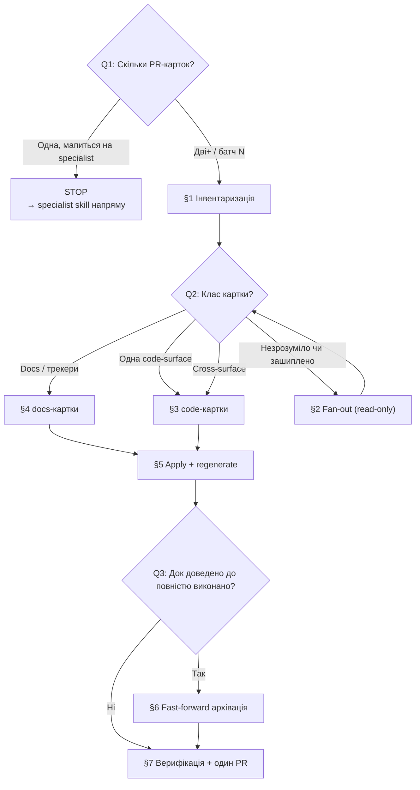

# Playbook: Виконання батчу planning-тасків (parallel fan-out)

> **Last validated:** 2026-06-02 by @claude. **Next review:** 2026-08-31.
> **Status:** Active

**Trigger:** «Прожени N тасків з планінгу» / «виконай батч PR-карток з `docs/planning/*`» / «закрий пачку planning-тасків і онови трекери» — коли робота охоплює кілька PR-карток одночасно й потребує паралельних агентів.

## Owner surface

- Primary surface: `docs/planning/`
- Coupled surface: `docs/open-work.md`, `docs/today.md` (генеровані трекери) + будь-яка code-surface, яку зачіпає конкретна картка
- Governing skill: `sergeant-planning-batch`

---

## Decision Tree

> Йди деревом згори вниз. Кожен листок (→ **ACTION**) веде на детальні кроки нижче.

**Q1: Скільки PR-карток у скоупі?**

- Одна ізольована картка, що мапиться на один specialist skill → **STOP** → не вантаж цей playbook; іди прямо в той skill.
- Дві+ картки або динамічний батч N → [§1 Інвентаризація](#1-інвентаризація-serial-once).

**Q2: Який клас у картки (після інвентаризації)?**

- Docs / трекери / статуси only → [§4 Виконання docs-карток](#4-виконання-docs-карток) (рецепт `reconcile-doc-drift.md`).
- Одна code-surface → специфічний specialist skill через [§3 Виконання code-карток](#3-виконання-code-карток).
- DB → server → api-client → web/mobile (cross-surface) → [§3](#3-виконання-code-карток) як sequential `sergeant-deliver-squad` chain.
- Незрозуміло, чи картка вже зашиплена → [§2 Fan-out](#2-fan-out-parallel) спочатку, потім повернись у Q2.

**Q3: Чи довела робота якийсь planning-док до повністю виконано?**

- Так (follow-up-и закриті, немає відкритих `- [ ]`) → [§6 Fast-forward архівація](#6-fast-forward-архівація-skip-90-day-gate).
- Ні → архівація — свідомий no-op; одразу [§7 Верифікація](#7-верифікація--один-pr).

---

## Background (детальні кроки)

### 1. Інвентаризація (serial, once)

Спершу перерахуй дашборди, щоб дрейф рахувався проти живого стану, а не кешу:

- `pnpm docs:gen-daily` (open-work + today + trust-badge), `pnpm docs:gen-initiative-followups`.
- Прочитай [`docs/open-work.md`](../open-work.md) як ground truth «що відкрито» і [`docs/pr-ledger/index.json`](../pr-ledger/index.json) як ground truth «чи `#NNNN` змерджено».

**Динамічний відбір батчу.** Пропусти кожну картку зі статусом `✅ Виконано` / `Closed`. Поважай `Dependencies` (не починай картку раніше її блокерів) і `Freeze-compatible` проти будь-якого активного freeze у `docs/governance/`. Бери спершу найнижчий `P-рівень` і найменший `Size`. Розмір N — динамічний: бери стільки, скільки просить запит, обмежене тим, що реально розблоковано залежностями.

### 2. Fan-out (parallel)

Розбий інвентар на **disjoint surfaces**, щоб паралельні агенти ніколи не редагували один файл. Один власник на planning-групу (наприклад: `pr-plan-*` perf/backend, `pr-plan-*` docs/security, roadmap-и, research-доки). **Ніколи** не давай агенту `AUTO-GENERATED` файл (`open-work.md`, `today.md`, `follow-ups.md`, `*.auto.json`).

Запусти один read-only analysis-агент на surface. Кожен агент: для кожної `Active`/`Draft` картки (a) перевіряє, чи всі `#NNNN` PR-mention-и змерджені (pr-ledger); (b) грепає `main` на докази, що `- [ ]` пункти реально зашиплені; (c) повертає **тільки точні, evidence-backed рекомендації** — які чекбокси перевести в `- [x]`, які `Status` закрити, які доки дійшли до повністю виконано. Консервативний bias: неоднозначні докази → лишай без змін, репортуй як "needs human".

### 3. Виконання code-карток

- **Cross-surface картка** (DB → server → api-client → web/mobile) — sequential `sergeant-deliver-squad` chain; кожен наступний агент отримує звіт попереднього. Не запускай наступний до звіту попереднього (крім паралельного web+mobile кроку).
- **Одна code-surface** — відповідний specialist skill.
- **Незалежні картки** між собою можна гнати як паралельні Agent Team teammates. Залежні — строго послідовно за `Dependencies`-графом.
- Після кожної surface — `pnpm typecheck`. Якщо migration додав `bigint` колонки — переконайся, що server їх coerce-ить через `Number()`.

### 4. Виконання docs-карток

Йди рецептом [`reconcile-doc-drift.md`](./reconcile-doc-drift.md): застосовуй тільки high-confidence, evidence-backed правки статусів/чекбоксів. Жодних feature-змін у docs-картці.

### 5. Apply + regenerate (serial)

Застосуй високовпевнені правки: переведи `- **Status:**` завершених карток у `✅ Виконано` з посиланням на PR/commit + однорядкова нотатка-доказ; перенеси відповідні `Last validated:` маркери (рівно один маркер на док). Потім перегенеруй дашборди (`pnpm docs:gen-daily`, `pnpm docs:gen-initiative-followups`), щоб закриті доки випали з `open-work.md`.

### 6. Fast-forward архівація (skip 90-day gate)

Архівуй planning-док **лише коли** робота довела його до повністю виконано: follow-up-и закриті, немає відкритих `- [ ]`, док став frozen-снапшотом. Тоді переноси у [`docs/planning/archive/`](../planning/archive/) **одразу — без 90-денного stabilization-вікна.** Founder має standing-дозвіл на fast-forward (прецедент: [`docs/initiatives/README.md`](../initiatives/README.md) — «90-day waiting period skipped за рішенням founder-а», батчі 2026-05-13 і 2026-06-01).

При переносі застав archive-frontmatter з [`docs/planning/README.md`](../planning/README.md) § Конвенція архівації (`Status: Archived (read-only)`, `Source:`, `Purpose:`) і онови inbound-лінки на `archive/`-шлях. Якщо жоден док не дотягнув до повністю виконано цього прогону — архівація це свідомий no-op; **ніколи не форсуй її** за віком чи «виглядає старим».

### 7. Верифікація + один PR

Прожени гейти (нижче) і здавай весь батч **одним PR** на гілці батчу — і workflow-артефакт, і виконані картки разом.

---

## Verification

- [ ] `pnpm docs:check-open-work` і `pnpm docs:check-today` зелені (трекери збігаються з джерелами).
- [ ] `pnpm docs:check-freshness-single-marker` + `pnpm docs:check-freshness-cadence` зелені.
- [ ] `pnpm docs:check-links` зелений (немає broken links після будь-якого archive-move).
- [ ] `pnpm lint:archive-move-depth` зелений, якщо док архівовано.
- [ ] Для code-карток — `pnpm typecheck` після кожної surface.
- [ ] Кожна закрита картка має `✅ Виконано` + PR/commit reference.
- [ ] Весь батч — один PR на гілці батчу.

## Notes

- Це planning-сиблінг до agent-workflows §11 (docs-sync sweep). Відмінність: §11 **не** несе код і **не** архівує (поважає 90-day gate); цей playbook несе реальний код і архівує fast-forward.
- Консервативний bias на доказах сильніший за бажання «закрити побільше»: неоднозначна картка лишається відкритою.
- Archive — не видалення: переносимо у `archive/` з frontmatter, оновлюємо inbound-лінки.

## See also

- [AGENTS.md](../../AGENTS.md) — hard rules.
- [`reconcile-doc-drift.md`](./reconcile-doc-drift.md) — коли картка суто docs/трекери.
- [`run-squad-deliver.md`](./run-squad-deliver.md) — коли картка cross-surface code.
- [`docs/agents/agent-workflows.md`](../agents/agent-workflows.md) §12 — parallel fan-out layer.
