# Playbook: Release

> **Last validated:** 2026-05-04 by @Skords-01. **Next review:** 2026-08-02.
> **Status:** Active

**Trigger:** ship a release-bearing change to any production surface — `apps/web`, `apps/server`, `apps/mobile-shell` (Capacitor), or `apps/mobile` (Expo). Includes EAS updates, store builds, and coordinated cross-surface deploys.

## Owner surface

- Primary surface: production deploy pipeline across web/API, mobile shell, and Expo
- Coupled surfaces: `apps/server`, `apps/web`, `apps/mobile-shell`, `apps/mobile`
- Governing skill: `sergeant-deploy-and-observability`

## Required context

- Start with `sergeant-start-here`, then load `sergeant-deploy-and-observability` (web/API and Capacitor) or `sergeant-mobile-expo` (Expo).
- Review [release-policy.md](../governance/release-policy.md) for the merge-only / coordinated / high-risk taxonomy.
- Review [service-catalog.md](../architecture/service-catalog.md) for the rollback path and tier of the touched surface.
- Review [platforms.md](../architecture/platforms.md) when the change crosses Capacitor or Expo.
- If a migration is involved, also open [add-sql-migration.md](./add-sql-migration.md).

## Decision tree — which surface are you releasing?

```mermaid
flowchart TD
    Q1{"Q1: Which production surface ships?"}
    Q1 -- "apps/web and/or apps/server" --> WEBAPI["§ Web + API"]
    Q1 -- "Capacitor shell (apps/mobile-shell)" --> SHELL["§ Mobile shell (Capacitor)"]
    Q1 -- "Expo native (apps/mobile)" --> EXPO["§ Expo"]
    Q1 -- "Multiple at once" --> MULTI["Treat each surface as its own loop, sequence by deploy order"]

    WEBAPI --> CLASSIFY1["1.1 Classify the release"]
    SHELL --> CLASSIFY2["2.1 Confirm shell scope"]
    EXPO --> CLASSIFY3["3.1 Classify the mobile release"]
    MULTI --> WEBAPI

    CLASSIFY1 --> VERIFY["Verification"]
    CLASSIFY2 --> VERIFY
    CLASSIFY3 --> VERIFY
```

If the change is docs-only or internal-only with no runtime effect, this playbook does not apply — proceed with a normal merge.

## 1. Web + API

For coordinated `apps/web` + `apps/server` deploys.

### 1.1 Classify the release

- Identify whether the change is merge-only, coordinated, or high-risk per [release-policy.md](../governance/release-policy.md).
- Name the touched surfaces and deploy targets in the PR.
- Confirm rollback path before merging.

### 1.2 Freeze the deploy order

- Apply env changes before code only if the new values are backward-compatible.
- Apply migrations before app deploy only when the schema change is additive and backward-compatible.
- Deploy API before web if the UI depends on new contract behavior.
- Deploy web before API only when the API is fully backward-compatible and the UI is the risky surface.

### 1.3 Verify release gates

- CI for the changed surfaces is green.
- No blocking incident or red error budget on the same dependency chain unless this release is the mitigation.
- Feature flags and kill switches are documented.

### 1.4 Execute deploy

- Merge intentionally.
- Deploy in the documented order.
- Keep a note of the deployment IDs or release references used.

### 1.5 Run post-release verification

- Check `/health` and one user-critical flow end-to-end.
- Verify error rates, latency, and Sentry noise on the changed surfaces.
- Confirm the feature flag state matches the rollout plan.

## 2. Mobile shell (Capacitor)

For `apps/mobile-shell` builds, store metadata, or native wrapper behavior.

### 2.1 Confirm shell scope

- Separate shell-only changes from embedded web changes.
- If web artifact changed too, run § Web + API first to ship the underlying web build.
- Confirm whether iOS, Android, or both need shipping.

### 2.2 Prepare release notes and rollback

- Record build numbers and version bump.
- Document store lane, staged rollout choice, and prior stable build reference.
- Verify whether any feature flag or server-side kill switch can reduce blast radius.

### 2.3 Build and submit

- Produce the release candidate build.
- Smoke test install, launch, auth bootstrap, and one critical deep-link or notification path.
- Submit to the intended store lane or internal track.

### 2.4 Post-release verification

- Confirm availability in the target lane.
- Re-run install/open smoke on the published build.
- Monitor crash and auth signals after rollout begins.

## 3. Expo

For `apps/mobile` builds, EAS updates, or release-channel changes.

### 3.1 Classify the mobile release

- Determine whether this is an OTA/channel update, a new build, or both.
- Confirm whether the release depends on new API behavior or feature flags.

### 3.2 Prepare rollout

- Capture build or update identifiers.
- Record target channel, cohort, and rollback method.
- Make sure auth bootstrap and one mobile-only flow are part of the smoke plan.

### 3.3 Execute release

- Ship the build or update to the intended lane.
- Verify that the correct config/env was used.
- If the release depends on server changes, run § Web + API for the API piece first.

### 3.4 Verify and monitor

- Install or update the published artifact.
- Run auth, one primary screen load, and one mobile-only interaction.
- Watch crash/error signals and support feedback during rollout.

## Verification

- [ ] Primary surface named in the PR
- [ ] Deploy order documented when more than one surface is involved
- [ ] Rollback path documented (web/API: previous Vercel/Railway deploy; shell: prior store build; Expo: prior channel update)
- [ ] Post-release smoke completed for the touched surface (`/health` + critical flow for web/API; install + auth for shell; auth + one mobile-only flow for Expo)
- [ ] Any migration/env ordering captured in the PR or release note
- [ ] Build/version/channel identifiers recorded for mobile releases

## When not to use this playbook

- Change is docs-only or internal-only with no runtime effect.
- Production regression that needs an immediate hotfix → [hotfix-prod-regression.md](./hotfix-prod-regression.md).
- Pure feature-flag retirement without code changes → [retire-feature-flag.md](./retire-feature-flag.md).

## Related playbooks and skills

- [hotfix-prod-regression.md](./hotfix-prod-regression.md)
- [add-sql-migration.md](./add-sql-migration.md) — when the release ships schema changes.
- [port-web-screen-to-mobile.md](./port-web-screen-to-mobile.md) — when the release lifts a web flow into Expo.
- Skill: `sergeant-deploy-and-observability`
- Skill: `sergeant-server-api`
- Skill: `sergeant-web-ui`
- Skill: `sergeant-mobile-expo`
