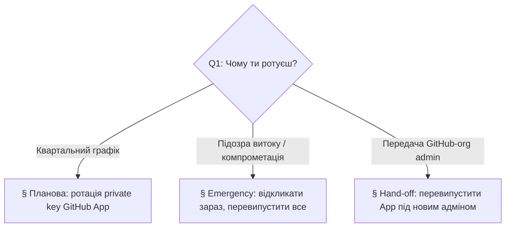

# Playbook: Ротація OpenClaw GitHub credentials

> **Last validated:** 2026-05-05 by @Skords-01. **Next review:** 2026-08-04.
> **Status:** Active

**Trigger:** ротація будь-якого OpenClaw GitHub credential —

- планова квартальна ротація private key GitHub App (`OPENCLAW_GITHUB_APP_PRIVATE_KEY`),
- emergency-ротація після підозри витоку (App private key, App ID, installation, або — поки не приземлиться Phase 2 — legacy `OPENCLAW_GITHUB_PAT` / `Git_PAT`),
- передача GitHub-org membership (founder hand-off), коли новий адмін має перевипустити App.

Цей runbook покриває **лише** OpenClaw → GitHub auth surface. Ширша privileged-access posture (які ще інтеграції Sergeant потребують ротації, хто за яку відповідає, як планується ревʼю) — у [`access-governance.md`](./access-governance.md).

## Owner surface

- Primary surface: OpenClaw → GitHub auth (App-flow + legacy PAT-flow на час migration window).
- Coupled surfaces: `apps/server` (Vercel/Railway env vars), `apps/server/src/modules/openclaw/github-auth.ts`, `apps/server/src/env.ts`, `docs/integrations/env-vars.md`.
- Governing skill: `sergeant-deploy-and-observability` (secrets + env-vars rollout).
- Governing ADR / план: [`docs/planning/stack-pulse-2026-05/pr-06-openclaw-github-app.md`](../planning/stack-pulse-2026-05/pr-06-openclaw-github-app.md).

## Required context

- Прочитай спершу [`access-governance.md`](./access-governance.md) — ротація credential-у це Tier 0/1 access event і має бути залогована саме там.
- Перевір [`docs/integrations/env-vars.md`](../integrations/env-vars.md) — канонічний список env-vars, що споживає OpenClaw.
- Відкрий налаштування GitHub App: <https://github.com/organizations/Skords-01/settings/apps> (доступ лише адмінам).

---

## Decision tree — який тип ротації?

---

## § Планова: ротація private key GitHub App (квартально)

**Каденс:** кожні 90 днів (співпадає з циклом `Last validated → Next review` цього файлу).

1. **Згенеруй новий private key.**
   - GitHub UI: `Settings → Developer settings → GitHub Apps → Sergeant OpenClaw → Generate a private key`. Завантажиться `.pem`.
   - **Не** відкликай старий ключ зараз — обидва ключі лишаються валідними, поки ти не видалиш один.
2. **Прокатати новий ключ спочатку в non-prod.**
   - Онови `OPENCLAW_GITHUB_APP_PRIVATE_KEY` у staging-середовищі (Vercel preview / Railway staging service).
   - Подивися логи: рядки `event: "openclaw_github_app_auth_failed"` мають бути відсутні, і протягом першої години має пройти нормальний цикл token-mint.
3. **Промоут у production.**
   - Онови `OPENCLAW_GITHUB_APP_PRIVATE_KEY` у production-середовищі.
   - Кешований installation-token у памʼяті — не старший за 55 хвилин (5 хвилин refresh headroom усередині `github-auth.ts`); наступний mint візьме новий ключ.
4. **Відклич старий ключ.**
   - У налаштуваннях App клацни корзинку біля старого `.pem`. З цього моменту працює лише новий ключ.
5. **Залогуй подію.** Додай рядок у access-governance log згідно з [`access-governance.md`](./access-governance.md) §"Routine review log". Включи: хто ротував, App ID, fingerprint ключа (останні 8 hex від SHA-256 PEM body), причину `routine`.
6. **Скинь next-review дату.** Відкрий цей файл, постав `Last validated:` сьогоднішню дату і `Next review:` сьогодні + 90 днів, закоміть через звичайний PR-flow.

### Rollback

Якщо новий ключ дає auth failures у production (наприклад PEM попсувся в secret-store), вклеюй назад старий ключ (він ще в App до кроку 4) у `OPENCLAW_GITHUB_APP_PRIVATE_KEY` і пропусти крок 4, поки новий ключ не буде виправлено окремим follow-up.

---

## § Emergency: підозра витоку / компрометація

**Мета:** мінімізувати вікно, протягом якого скомпрометований credential ще приймається GitHub-ом.

1. **Зупини кровотечу.**
   - **App private key витік:** GitHub UI → App → видали скомпрометований `.pem` негайно. GitHub перестане приймати JWT, підписані тим ключем, протягом секунд. Далі — крок 2.
   - **Installation token витік (рідко — вони живуть ≤1 години):** відклич через `DELETE /installation/token` ([API ref](https://docs.github.com/en/rest/apps/installations#revoke-an-installation-access-token)) свіжим App JWT.
   - **`OPENCLAW_GITHUB_PAT` / `Git_PAT` витік** (ще можливо у вікні Phase 1 migration):
     - GitHub UI → `Settings → Developer settings → Personal access tokens → Fine-grained tokens` → відклич конкретний PAT.
     - Також скинь Vercel / Railway env-vars (значення вже публічне — затри його у secret-менеджерах і CI-дашбордах).
2. **Згенеруй свіжі credentials.**
   - Для App-flow: процедура §1 з планової ротації (новий `.pem`; **не** видаляй скомпрометований до redeploy — GitHub його вже й так інвалідував).
   - Для PAT-flow: створи новий fine-grained PAT із мінімальними scopes (`contents: read`, `pull-requests: write`, `issues: write`); не перевикористовуй стару назву.
3. **Деплой одним пушем у всі середовища.** Пропусти staging-soak з planned-path — швидкість тут важливіша за обережність, бо стара credential уже відкликана.
4. **Аудит blast-radius.**
   - Подивись audit log GitHub App: `Settings → Audit log` → фільтр `actor:sergeant-openclaw[bot]` за останні 7 днів. Усе, що не співпадає з відомою OpenClaw-approved write-дією (Telegram approval message + Postgres-рядок `openclaw_invocations`), — підозріле.
   - Для PATs audit log GitHub-у скупіший; крос-перевір `git log --all --since=2.weeks` на несподівані коміти від автора-PAT-власника.
5. **Відкрий інцидент.** Слідуй [`declare-incident.md`](./declare-incident.md). Severity мінімум P2 (data exposure risk), P1 — якщо у скомпрометованої credentials був `contents:write` і в audit window є несподіваний push.
6. **Post-incident review.** Напиши короткий post-mortem у `docs/incidents/`. Включи root-cause (як саме секрет витік — файл у репо, лог, скрін?), detection-lag і конкретну превентивну дію (наприклад посилити secret-scanning, звузити scopes).

---

## § Hand-off: зміна GitHub-org admin

**Trigger:** GitHub-org owner передає org-у новому адміну, старого видаляють.

1. **Перевір, що App усе ще належить org-у**, а не персональному namespace-у адміна, що йде. (Якщо персональний — App йде разом з ним, дивись крок 2 у "Re-issue".)
2. **Додай нового адміна як App owner** у налаштуваннях App. Видаляй старого тільки після успіху кроку 4.
3. **Перевипусти, якщо потрібно.** Якщо адмін, що йде, був єдиним owner-ом App і видалив себе до transfer-у, App мертвий і треба:
   1. Створити свіжий App під акаунтом нового адміна з тими ж permissions (`contents:read`, `pull-requests:write`, `issues:write`, `actions:read`).
   2. Встановити його на `Skords-01/Sergeant`.
   3. Згенерувати новий private key і дістати новий App ID + installation ID.
   4. Оновити `OPENCLAW_GITHUB_APP_ID`, `OPENCLAW_GITHUB_APP_PRIVATE_KEY`, `OPENCLAW_GITHUB_APP_INSTALLATION_ID` у production.
4. **Smoke-test.** Запусти будь-який read-tool, що ходить у GitHub через OpenClaw — наприклад тригерни `read_github` для відомого PR — і підтверди відповідь `status: 200` без `openclaw_github_app_auth_failed` у логах.
5. **Відклич доступ старого адміна** (org membership, App ownership, будь-які залишкові PAT-и, які він володів).

---

## Де живе кожне значення

| Variable                              | Production secret store           | Staging secret store              | Notes                                                                               |
| ------------------------------------- | --------------------------------- | --------------------------------- | ----------------------------------------------------------------------------------- |
| `OPENCLAW_GITHUB_APP_ID`              | Vercel/Railway prod env           | Vercel preview env                | Числовий. Видно у налаштуваннях App — не зовсім секрет, але поводься як з секретом. |
| `OPENCLAW_GITHUB_APP_PRIVATE_KEY`     | Vercel/Railway prod env           | Vercel preview env                | PEM. Багаторядковий; екранізуй `\n`, якщо твій secret-store злипає переноси.        |
| `OPENCLAW_GITHUB_APP_INSTALLATION_ID` | Vercel/Railway prod env           | Vercel preview env                | Числовий. Пінь явно — щоб неправильно конфігурований App не розширив blast radius.  |
| `OPENCLAW_USE_GITHUB_APP`             | Vercel/Railway prod env           | Vercel preview env                | Feature-прапор, дефолт `false`. Phase 2 переключить дефолт на `true`.               |
| `OPENCLAW_GITHUB_PAT`                 | Vercel/Railway prod env (legacy)  | Vercel preview env (legacy)       | Поетапно прибираємо. Phase 2 видалить це і `Git_PAT` fallback.                      |
| `Git_PAT`                             | Devin VM org-secret only (legacy) | Devin VM org-secret only (legacy) | Конвенція з Devin; не виставляй у production. Phase 2 видалить fallback.            |

---

## Verification

Після будь-якої ротації прогони цей чекліст до закриття інциденту / changelog-запису:

- [ ] `curl https://api.sergeant.app/health` повертає 200 (App-flow-регресія його не зламає — виклик неавторизований — але це підтверджує, що деплой пройшов).
- [ ] У логах prod-додатку пошук `openclaw_github_app_auth_failed` за останню годину — має бути порожньо.
- [ ] Тригерни read-only tool через OpenClaw (наприклад у Telegram: «openclaw, покажи останні 3 PR») і підтверди, що GitHub-відповіді приходять.
- [ ] Тригерни write-tool з очевидно тривіальним side-effect — наприклад `create_github_issue` відкриває issue `chore: rotation smoke-test`, founder закриває її руками через 2 хвилини. Підтверди, що `actor` на issue — `sergeant-openclaw[bot]` (App-flow) або твій org-PAT user (legacy PAT-flow).
- [ ] Додай рядок «rotation completed» у [`access-governance.md`](./access-governance.md) §"Routine review log".

---

## Споріднені документи

- [`access-governance.md`](./access-governance.md) — парасоля для privileged-access ревʼю; ця ротація є її листком.
- [`declare-incident.md`](./declare-incident.md) — escalation для emergency-кейсу.
- [`docs/governance/security-incident-policy.md`](../governance/security-incident-policy.md) — що рахується security-інцидентом, а що — звичайною ротацією.
- ADR-0031 — оригінальна архітектура OpenClaw (PAT-епоха).
- [`docs/planning/stack-pulse-2026-05/pr-06-openclaw-github-app.md`](../planning/stack-pulse-2026-05/pr-06-openclaw-github-app.md) — migration-план, що ввів цей runbook.
