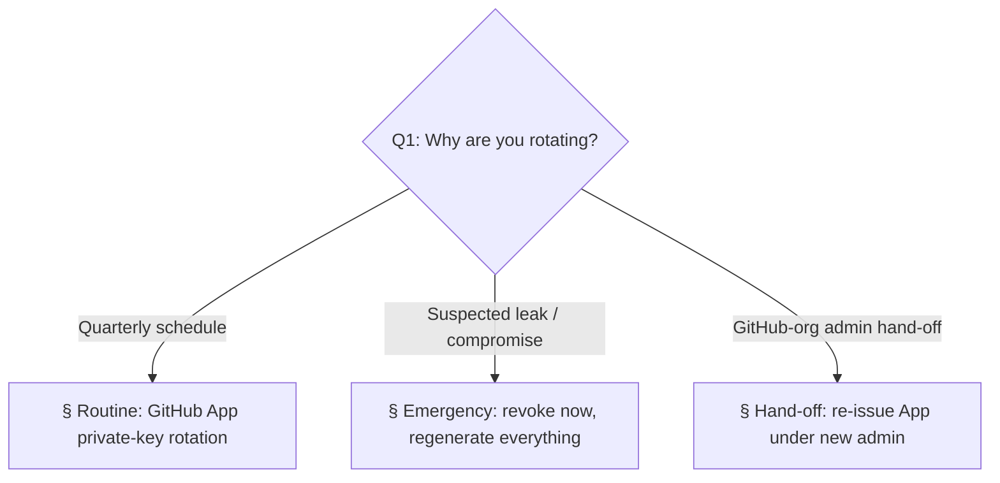

# Playbook: Rotate OpenClaw GitHub credentials

> **Last validated:** 2026-05-04 by Devin. **Next review:** 2026-08-04.
> **Status:** Active

**Trigger:** rotation of any OpenClaw GitHub credential —

- routine quarterly rotation of the GitHub App private key (`OPENCLAW_GITHUB_APP_PRIVATE_KEY`),
- emergency rotation after a suspected leak (App private key, App ID, installation, or — until Phase 2 lands — the legacy `OPENCLAW_GITHUB_PAT` / `Git_PAT`),
- founder hand-off of GitHub-org membership where a new admin must re-issue the App.

This runbook covers **only** the OpenClaw GitHub auth surface. For the broader privileged-access posture (which other Sergeant integrations need rotation, who owns each one, how reviews are scheduled) see [`access-governance.md`](./access-governance.md).

## Owner surface

- Primary surface: OpenClaw → GitHub auth (App-flow + legacy PAT-flow during the migration window).
- Coupled surfaces: `apps/server` (Vercel/Railway env vars), `apps/server/src/modules/openclaw/github-auth.ts`, `apps/server/src/env.ts`, `docs/integrations/env-vars.md`.
- Governing ADR / plan: [`docs/planning/stack-pulse-2026-05/pr-06-openclaw-github-app.md`](../planning/stack-pulse-2026-05/pr-06-openclaw-github-app.md).

## Required context

- Read [`access-governance.md`](./access-governance.md) first — credential rotation is a Tier 0/1 access event and must be logged there.
- Review [`docs/integrations/env-vars.md`](../integrations/env-vars.md) for the canonical list of env-vars OpenClaw consumes.
- Open the GitHub App settings: <https://github.com/organizations/Skords-01/settings/apps> (admin-only).

---

## Decision tree — what kind of rotation?

---

## § Routine: GitHub App private-key rotation (quarterly)

**Cadence:** every 90 days (matches `Last validated → Next review` cycle on this file).

1. **Generate a new private key.**
   - GitHub UI: `Settings → Developer settings → GitHub Apps → Sergeant OpenClaw → Generate a private key`. A `.pem` downloads.
   - Do **not** revoke the old key yet — both keys remain valid until you delete one.
2. **Stage the new key in non-prod first.**
   - Update `OPENCLAW_GITHUB_APP_PRIVATE_KEY` in the staging environment (Vercel preview / Railway staging service).
   - Tail logs: there should be `event: "openclaw_github_app_auth_failed"` lines absent and a normal token-mint cycle within the first hour.
3. **Promote to production.**
   - Update `OPENCLAW_GITHUB_APP_PRIVATE_KEY` in the production environment.
   - The cached installation-token in memory is at most 55 minutes old (5-minute refresh headroom inside `github-auth.ts`); the next mint will use the new key.
4. **Revoke the old key.**
   - In the App settings, click the trash-can next to the old `.pem`. From this moment, only the new key works.
5. **Record the event.** Append a row to the access-governance log per [`access-governance.md`](./access-governance.md) §"Routine review log". Include: who rotated, App ID, key fingerprint (last 8 hex of SHA-256 of the PEM body), rotation reason `routine`.
6. **Reset the next-review date.** Open this file, bump `Last validated:` to today and `Next review:` to today + 90 days, and commit through normal PR flow.

### Rollback

If the new key causes auth failures in production (e.g. PEM mangled by the secret-store), re-paste the old key (still in the App until step 4) into `OPENCLAW_GITHUB_APP_PRIVATE_KEY` and skip step 4 until the new key is fixed in a follow-up.

---

## § Emergency: suspected leak / compromise

**Goal:** minimize the window during which the leaked credential is honored by GitHub.

1. **Stop the bleeding.**
   - **App private key leaked:** GitHub UI → App → delete the leaked `.pem` immediately. GitHub stops accepting JWTs signed with that key within seconds. Then proceed to step 2.
   - **Installation token leaked (rare — they live ≤1h anyway):** revoke via `DELETE /installation/token` ([API ref](https://docs.github.com/en/rest/apps/installations#revoke-an-installation-access-token)) using a fresh App JWT.
   - **`OPENCLAW_GITHUB_PAT` / `Git_PAT` leaked** (still possible during the Phase 1 migration window):
     - GitHub UI → `Settings → Developer settings → Personal access tokens → Fine-grained tokens` → revoke the offending PAT.
     - Also reset Vercel/Railway env-vars (the value is now public, redact it from secret managers and CI dashboards).
2. **Generate fresh credentials.**
   - For App-flow: routine §1 procedure (generate new `.pem`, do **not** delete the leaked one before redeploy because GitHub already invalidated it).
   - For PAT-flow: create a brand-new fine-grained PAT with the minimum scopes (`contents: read`, `pull-requests: write`, `issues: write`); do not reuse the old name.
3. **Deploy in one push to all environments.** Skip the staging-soak step from the routine path — speed beats safety here because the old credential is already revoked.
4. **Audit blast-radius.**
   - Review the GitHub App's audit log: `Settings → Audit log` → filter `actor:sergeant-openclaw[bot]` for the last 7 days. Anything that doesn't match a known OpenClaw-approved write (Telegram approval message + Postgres `openclaw_invocations` row) is suspicious.
   - For PATs, GitHub's audit log is sparser; cross-reference `git log --all --since=2.weeks` for unexpected commits authored by the leaked PAT-owner.
5. **Open an incident.** Follow [`declare-incident.md`](./declare-incident.md). Severity is at least P2 (data exposure risk), P1 if the leaked credential had `contents:write` and any unexpected push exists in the audit window.
6. **Post-incident review.** Write a short post-mortem in `docs/incidents/`. Include root-cause (how did the secret leak — repo file, log, screenshot?), detection-lag, and a concrete preventative action (e.g. tighten secret-scanning, narrow scopes).

---

## § Hand-off: GitHub-org admin change

**Trigger:** the GitHub-org owner hands the org over to a new admin and the old admin is removed.

1. **Verify the App still belongs to the org**, not to the leaving admin's personal namespace. (If it's personal, the App goes with them — see step 2 of "Re-issue".)
2. **Add the new admin as App owner** in the App settings. Remove the old admin only after step 4 succeeds.
3. **Re-issue if needed.** If the leaving admin was the App's sole owner and removed themselves before transfer, the App is dead and you must:
   1. Create a fresh App under the new admin's account with the same permissions (`contents:read`, `pull-requests:write`, `issues:write`, `actions:read`).
   2. Install it on `Skords-01/Sergeant`.
   3. Generate a new private key and grab the new App ID + installation ID.
   4. Update `OPENCLAW_GITHUB_APP_ID`, `OPENCLAW_GITHUB_APP_PRIVATE_KEY`, `OPENCLAW_GITHUB_APP_INSTALLATION_ID` in production.
4. **Smoke-test.** Run any read-tool that hits GitHub through OpenClaw — e.g. trigger `read_github` for a known PR — and confirm response `status: 200` with no `openclaw_github_app_auth_failed` log.
5. **Revoke the old admin's access** (org membership, App ownership, any lingering PATs they owned).

---

## Where each value lives

| Variable                              | Production secret store           | Staging secret store              | Notes                                                                              |
| ------------------------------------- | --------------------------------- | --------------------------------- | ---------------------------------------------------------------------------------- |
| `OPENCLAW_GITHUB_APP_ID`              | Vercel/Railway prod env           | Vercel preview env                | Numeric. Visible in App settings — not strictly secret, but treat as one.          |
| `OPENCLAW_GITHUB_APP_PRIVATE_KEY`     | Vercel/Railway prod env           | Vercel preview env                | PEM. Multi-line; escape with `\n` if your secret store collapses newlines.         |
| `OPENCLAW_GITHUB_APP_INSTALLATION_ID` | Vercel/Railway prod env           | Vercel preview env                | Numeric. Pin explicitly so a misconfigured App can't widen blast radius.           |
| `OPENCLAW_USE_GITHUB_APP`             | Vercel/Railway prod env           | Vercel preview env                | Feature flag, defaults `false`. Phase 2 will flip the default to `true`.           |
| `OPENCLAW_GITHUB_PAT`                 | Vercel/Railway prod env (legacy)  | Vercel preview env (legacy)       | Phasing out. Phase 2 deletes this and the `Git_PAT` fallback.                      |
| `Git_PAT`                             | Devin VM org-secret only (legacy) | Devin VM org-secret only (legacy) | Convention from Devin; do not set in production. Phase 2 will delete the fallback. |

---

## Verification (post-rotation)

After any rotation, run this checklist before closing the incident / changelog entry:

1. `curl https://api.sergeant.app/health` returns 200 (App-flow regression would not break this — the call is unauthenticated — but it confirms a deploy completed).
2. In the prod app logs, search for `openclaw_github_app_auth_failed` over the past 1 hour — must be absent.
3. Trigger a read-only tool through OpenClaw (e.g. ask in Telegram: «openclaw, покажи останні 3 PR») and confirm GitHub responses come back.
4. Trigger a write-tool with an obviously-trivial side-effect — e.g. `create_github_issue` opens a `chore: rotation smoke-test` issue, founder closes it manually 2 minutes later. Confirm `actor` on the issue is `sergeant-openclaw[bot]` (App-flow) or your org-PAT user (legacy PAT-flow).
5. Append a "rotation completed" line to [`access-governance.md`](./access-governance.md) §"Routine review log".

---

## See also

- [`access-governance.md`](./access-governance.md) — the umbrella playbook for privileged-access reviews, of which this rotation is a leaf.
- [`declare-incident.md`](./declare-incident.md) — escalation path for the emergency case.
- [`docs/governance/security-incident-policy.md`](../governance/security-incident-policy.md) — what counts as a security incident vs a routine rotation.
- ADR-0031 — original OpenClaw architecture (PAT-era).
- [`docs/planning/stack-pulse-2026-05/pr-06-openclaw-github-app.md`](../planning/stack-pulse-2026-05/pr-06-openclaw-github-app.md) — migration plan that introduced this runbook.
